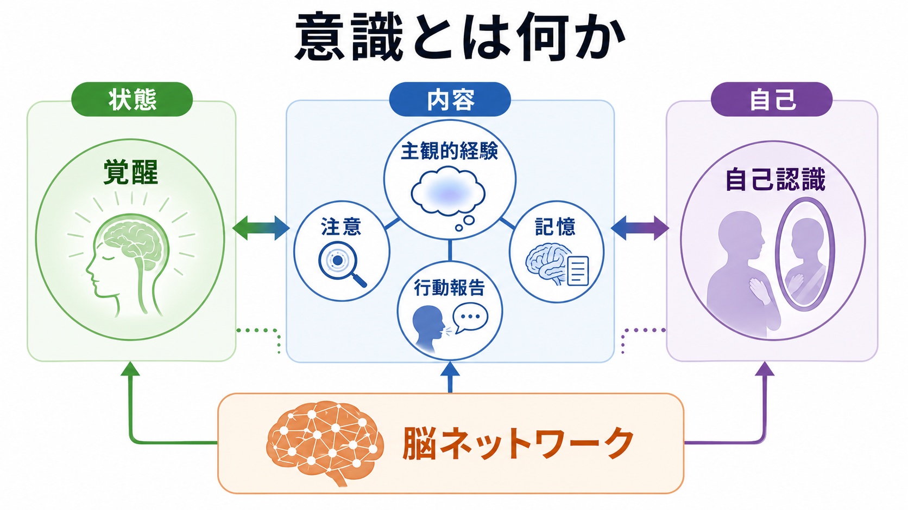
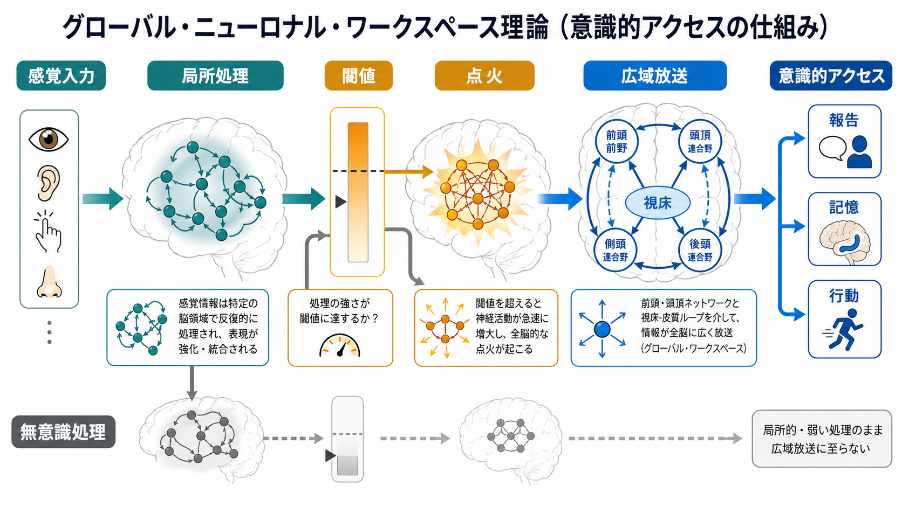

# 意識とは何か

## 要点

- 意識は一つの能力ではなく、覚醒しているという「状態」、何かが経験されているという「内容」、その経験を自分のものとして扱う「自己関連処理」が重なった概念である。
- 「覚醒していること」と「経験があること」は同じではない。夢、麻酔、昏睡、植物状態・最小意識状態の研究は、この区別を明確にした [2][6][7]。
- 認知科学では、意識は[[注意とは何か|注意]]、[[ワーキングメモリとは何か|ワーキングメモリ]]、[[知覚とは何か|知覚]]、[[エピソード記憶とは何か|エピソード記憶]]、報告、行動制御と結びついて研究される。
- 神経科学では、視床・脳幹の覚醒系、皮質間の再帰的処理、前頭頭頂ネットワーク、後部皮質ホットゾーン、情報の統合と分化が主要な論点になる [3][4][5]。
- 現時点で、意識の単一理論は確立していない。グローバル・ニューロナル・ワークスペース理論、統合情報理論、高次表象理論、再帰処理理論などが、異なる側面を説明している [1]。

## この記事で答える問い

1. 意識という語は、どのような意味で使い分けるべきか。
2. 覚醒、主観的経験、自己認識はどのように関係するのか。
3. 脳内では、意識的経験や意識的アクセスにどのような仕組みが関わるのか。
4. 臨床や研究では、意識をどのように測り、どのような限界があるのか。

## まず結論

意識とは、「脳が起きている」という単純な状態名ではない。より正確には、身体と脳が一定の覚醒状態を保ち、その中で感覚・記憶・感情・思考などが主観的経験として現れ、必要に応じて報告・記憶・行動・自己理解に利用できるようになる一連の状態と機能のまとまりである。

ただし、この定義には注意が必要である。意識には、経験があるという現象的側面と、経験内容を報告・推論・行動制御に利用できるというアクセス的側面がある。たとえば、痛みを「感じる」ことと、「痛い」と言語報告することは強く関係するが、同一ではない。意識研究が難しいのは、経験そのものは一人称的であり、科学的測定は行動、言語、脳活動という三人称的指標に依存するからである [1][5]。

## 背景

日常語の「意識」は幅広い。寝ていない、気づいている、集中している、自分を客観視している、道徳的に配慮している、といった意味が混ざる。認知科学と神経科学では、この混線を避けるため、少なくとも次の三つに分けて考える。

第一に、覚醒水準である。これは睡眠、麻酔、昏睡、てんかん発作後などで変化する、脳全体の活動状態を指す。脳幹、視床、視床下部、前脳基底部、広域皮質ネットワークが関わる。

第二に、意識内容である。赤い色を見る、音を聞く、痛みを感じる、過去を思い出す、未来を想像するといった「何が経験されているか」である。ここでは[[知覚とは何か|知覚]]、記憶、情動、身体感覚が問題になる。

第三に、自己意識または自己認識である。これは経験を「自分が経験している」と位置づける働きであり、身体所有感、行為主体感、内省、[[メタ認知とは何か|メタ認知]]を含む。自己認識は高度な意識の重要な形だが、すべての意識経験に明示的な自己反省が必要なわけではない。

## 基本概念

### 覚醒と気づき

臨床神経学では、意識をしばしば覚醒 wakefulness と気づき awareness の二軸で整理する。覚醒は目が開く、睡眠覚醒リズムがある、脳活動が維持されるといった状態に近い。一方、気づきは自分や環境に対する経験内容があることを指す [6][7]。

この区別は、意識障害の理解に不可欠である。昏睡では覚醒も気づきも大きく低下する。植物状態または unresponsive wakefulness syndrome では、睡眠覚醒リズムや開眼があっても、外部への一貫した反応が乏しい。最小意識状態では、再現性は弱くても、追視、指示への反応、目的的行動などが見られることがある [7]。

### 現象的意識とアクセス意識

現象的意識とは、「それを経験するとはどのような感じか」という主観的側面である。青を見る感じ、痛みの嫌さ、音楽の響き、ぼんやりした不安などがこれに当たる。

アクセス意識とは、ある情報が報告、推論、記憶、意思決定、行動制御に利用可能になることである。ある刺激を見たと報告できる、後で思い出せる、選択行動に使えるといった場合、その情報はアクセス可能になっている。

両者は通常重なるが、完全には一致しない可能性がある。意識研究では、報告可能性を意識そのものと同一視しすぎると、報告、注意、意思決定の神経活動を意識の神経相関と取り違える危険がある [5]。

### 意識水準は一次元ではない

「意識レベル」という語は便利だが、意識を一本の目盛りに還元しすぎる危険がある。Bayne らは、睡眠、鎮静、麻酔、意識障害などのグローバル状態は、単純な高低ではなく、覚醒、反応性、統合性、内容の豊かさ、行動可能性などが組み合わさった多次元状態として考えるべきだと論じた [2]。

したがって、「意識が 30% ある」という言い方は比喩としては使えても、科学的には粗い。ある人は開眼しているが報告できないかもしれない。別の人は動けないが、内的には指示を理解しているかもしれない。意識の評価では、行動だけでなく、脳活動、課題設計、時間変動を組み合わせる必要がある。

## 仕組み

### 覚醒を支える基盤

意識的経験が成立するには、まず脳が経験を支えられる状態にある必要がある。脳幹網様体、視床、視床下部、前脳基底部、ノルアドレナリン・アセチルコリン・セロトニン・ドーパミンなどの神経調節系は、皮質の興奮性、睡眠覚醒、注意の準備状態を調整する。

ただし、覚醒系だけで意識内容が決まるわけではない。覚醒は舞台の照明のような背景条件であり、そこで何が経験されるかは、感覚皮質、連合皮質、記憶系、身体状態、情動系の相互作用によって決まる。

### グローバル・ニューロナル・ワークスペース

グローバル・ニューロナル・ワークスペース理論では、意識的アクセスは、局所的に処理された情報が閾値を超えて広域ネットワークに「放送」される過程として説明される。感覚入力はまず局所回路で処理される。刺激が強い、注意が向く、課題上重要である、予測誤差が大きいなどの条件がそろうと、前頭頭頂ネットワークや視床皮質ループを含む広域活動が急に立ち上がり、情報が報告、記憶、意思決定に使えるようになる [3]。

この理論の強みは、意識的に見えた刺激と見えなかった刺激を、行動報告、脳波、fMRI、マスキング課題などで比較しやすい点にある。一方で、前頭前野活動が意識経験そのものを支えるのか、報告や課題遂行に伴う活動なのかは議論が続いている [5]。

### 統合情報と複雑性

統合情報理論は、意識を外部への報告ではなく、システムがそれ自体として持つ因果構造から説明しようとする。意識の量と質は、情報がどれだけ分化し、同時に統合されているかに関係するとされる [4]。

この発想は、臨床的な意識評価にも影響を与えた。たとえば perturbational complexity index, PCI は、TMS で皮質を刺激し、EEG 応答がどれだけ広がり、どれだけ情報豊かで圧縮しにくいかを測る。覚醒、睡眠、麻酔、意識障害患者を区別する指標として提案され、行動反応に依存しない意識評価の方向を示した [8]。

ただし、IIT は理論的野心が大きく、どの物理システムに意識を認めるか、計算可能性、予測の検証可能性などをめぐって議論がある。現段階では、意識を「統合された情報」と言い換えれば解決するわけではない。

### 意識の神経相関

意識の神経相関 NCC とは、特定の意識経験に最小限十分な神経メカニズムを指す。ここで重要なのは、単に意識と同時に活動する領域を探すだけでは不十分だという点である。刺激入力、注意、報告、運動準備、記憶、課題難易度などが混ざるため、意識経験そのものに近い成分を分離する必要がある [5]。

近年は、後部皮質ホットゾーン、視床皮質結合、皮質活動の分化と統合、局所再帰処理、前頭頭頂ネットワークの役割が比較されている。大まかに言えば、後部皮質は経験内容の質に、前頭頭頂系は報告、課題制御、アクセス、内省に強く関わる可能性がある。

## 図解

この記事の二つの図は、意識を二段階で読むための補助として使える。

| 図 | 読み方 | 対応する本文 |
|---|---|---|
| 概念地図 | 意識を「状態」「内容」「自己」に分け、覚醒・経験・自己認識の混同を避ける | 背景、基本概念 |
| GNW 図 | 局所処理が閾値を超え、広域放送されると報告・記憶・行動へ使えるという流れを見る | 仕組み |

## 臨床・研究との接続

意識の研究は、哲学的な問いだけでなく、臨床的にも重要である。重度脳損傷後の患者がどの程度気づきを保っているか、麻酔下で意識が残っていないか、睡眠中の夢経験はどのように生じるか、閉じ込め症候群と意識障害をどう区別するかは、実際の診療と倫理に関わる。

2018 年の意識障害診療ガイドラインは、標準化された神経行動評価、反復評価、家族からの情報、予後説明の慎重さを重視している [7]。ここで重要なのは、反応がないことをただちに経験がないことと同一視しないことである。運動出力が障害されている場合、意識があっても外から見えにくい。

研究では、主観報告、強制選択課題、眼球運動、脳波、fMRI、TMS-EEG、計算モデルが組み合わせられる。どの指標にも限界があるため、単一の検査で「意識の有無」を断定するのではなく、複数の証拠から推定する姿勢が必要である。

## よくある誤解

### 誤解1: 意識とは注意のことである

注意は意識内容を選択し、増幅し、行動に結びつけるが、意識そのものではない。注意されていない刺激が弱く経験される可能性もあり、逆に注意処理が強くても意識的経験が伴わない場合もある。詳しくは[[注意とは何か]]と接続して考えるとよい。

### 誤解2: 意識は前頭前野だけで生じる

前頭前野は報告、推論、課題制御、内省に重要だが、意識経験の内容そのものには後部皮質や感覚連合野が深く関わる。前頭前野活動をすべて意識の本体とみなすと、報告や意思決定の活動を混同する危険がある [5]。

### 誤解3: 意識は脳活動が多ければ多いほど強い

意識に重要なのは活動量だけではない。深い睡眠や発作では、活動が広がっていても単調で分化に乏しいことがある。意識的状態では、活動が統合されつつ、内容を区別できるだけの複雑性を保つ必要がある [4][8]。

### 誤解4: 自己認識がなければ意識はない

自己認識は意識の重要な形だが、すべての経験が明示的な自己反省を必要とするわけではない。痛み、音、色、眠気のような経験は、言語的な自己説明がなくても成立しうる。自己認識は、意識の上に重なる高次の組織化として扱う方が整理しやすい。

## 関連ノート

### 既存ノート

- [[注意とは何か]]
- [[知覚とは何か]]
- [[ワーキングメモリとは何か]]
- [[エピソード記憶とは何か]]
- [[メタ認知とは何か]]

### 今後の作成候補

- グローバル・ニューロナル・ワークスペース理論とは何か
- 統合情報理論とは何か
- 意識障害とは何か
- 自己意識とは何か
- 身体所有感とは何か
- 夢と意識はどう関係するのか

### MOC 更新候補

- `content/00_MOC/` 配下の認知科学・心理学系 MOC
- 意識・自己・身体性カテゴリの MOC を作る場合は、本記事を中心ノート候補にする

## 理解チェック

1. 覚醒と気づきはどのように違うか。
2. 現象的意識とアクセス意識を、具体例で区別できるか。
3. グローバル・ニューロナル・ワークスペース理論では、何が「点火」され、何が「放送」されるのか。
4. 意識の神経相関を探すとき、注意や報告を混同しないために何が必要か。
5. 意識障害の評価で、行動反応だけに依存することにはどのような限界があるか。

## 未解決問題

- 意識経験そのものと、報告・内省・記憶に必要な処理をどこまで分離できるのか。
- 後部皮質、前頭頭頂ネットワーク、視床皮質ループは、それぞれ意識のどの側面に必要なのか。
- IIT、GNW、高次表象理論、再帰処理理論は競合理論なのか、異なる階層を説明する相補的理論なのか。
- 人間以外の動物、人工システム、発達初期の乳児にどのような意識を認めるべきか。

## 参考文献

[1] Seth, A. K., & Bayne, T. (2022). Theories of consciousness. *Nature Reviews Neuroscience*, 23, 439-452. https://doi.org/10.1038/s41583-022-00587-4

[2] Bayne, T., Hohwy, J., & Owen, A. M. (2016). Are there levels of consciousness? *Trends in Cognitive Sciences*, 20(6), 405-413. https://doi.org/10.1016/j.tics.2016.03.009

[3] Mashour, G. A., Roelfsema, P., Changeux, J.-P., & Dehaene, S. (2020). Conscious processing and the global neuronal workspace hypothesis. *Neuron*, 105(5), 776-798. https://doi.org/10.1016/j.neuron.2020.01.026

[4] Tononi, G., Boly, M., Massimini, M., & Koch, C. (2016). Integrated information theory: from consciousness to its physical substrate. *Nature Reviews Neuroscience*, 17, 450-461. https://doi.org/10.1038/nrn.2016.44

[5] Koch, C., Massimini, M., Boly, M., & Tononi, G. (2016). Neural correlates of consciousness: progress and problems. *Nature Reviews Neuroscience*, 17, 307-321. https://doi.org/10.1038/nrn.2016.22

[6] Laureys, S., Owen, A. M., & Schiff, N. D. (2004). Brain function in coma, vegetative state, and related disorders. *The Lancet Neurology*, 3(9), 537-546. https://doi.org/10.1016/S1474-4422(04)00852-X

[7] Giacino, J. T., Katz, D. I., Schiff, N. D., et al. (2018). Practice guideline update recommendations summary: disorders of consciousness. *Neurology*, 91(10), 450-460. https://doi.org/10.1212/WNL.0000000000005926

[8] Casali, A. G., Gosseries, O., Rosanova, M., et al. (2013). A theoretically based index of consciousness independent of sensory processing and behavior. *Science Translational Medicine*, 5(198), 198ra105. https://doi.org/10.1126/scitranslmed.3006294
