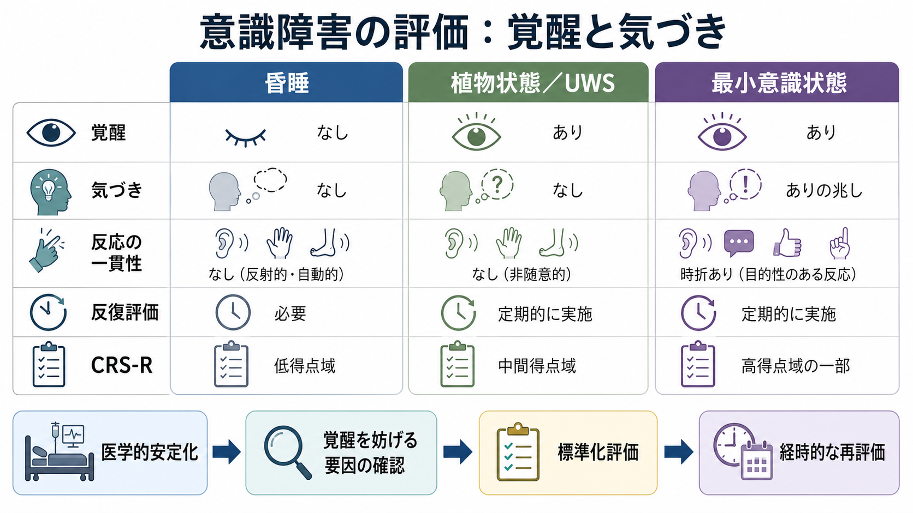
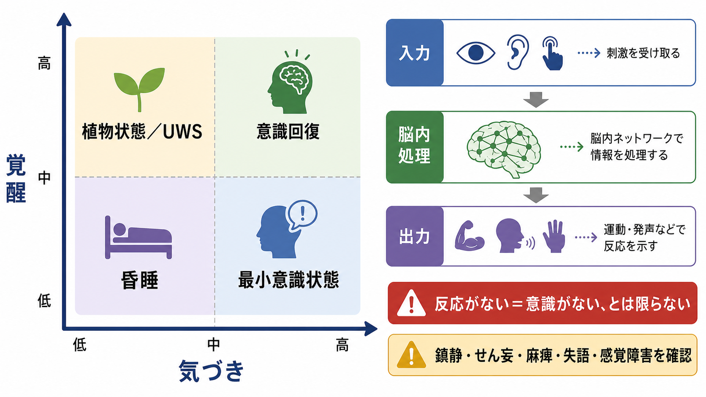
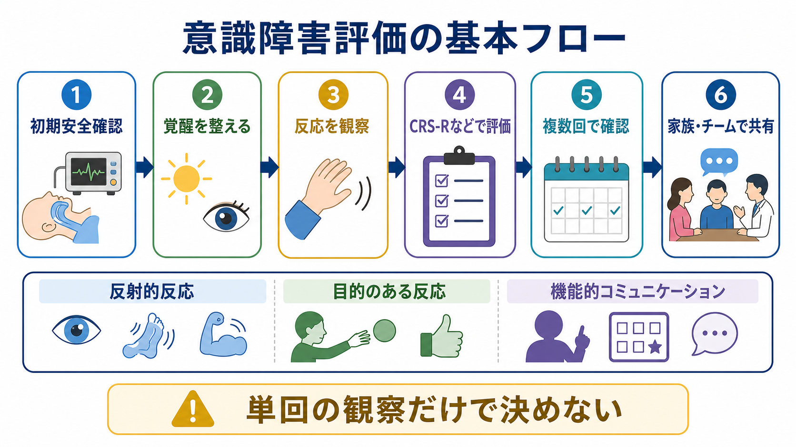

# 意識障害はどのように評価されるのか

## 要点

- 意識障害の評価では、まず「目が覚めているか」という覚醒と、「自分や周囲に意味のある反応を示すか」という気づきを分けて考える。
- 昏睡、植物状態／無反応覚醒症候群、最小意識状態は連続的に見えるが、診断上は行動所見の質が異なる。
- 単回の観察だけでは見逃しが起こりやすいため、標準化された行動評価、覚醒を妨げる要因の確認、時間をおいた反復評価が重要になる。
- fMRI、EEG、PETなどの補助検査は研究・専門施設で有用な場合があるが、通常の診断ではベッドサイドの構造化された行動評価を置き換えるものではない。
- この記事は教育・研究目的の整理であり、個別患者の診断や治療方針を示すものではない。

## この記事で答える問い

このノートでは、[[意識とは何か]]、[[覚醒と意識内容は何が違うのか]]という基本問題を、臨床評価の文脈に引き寄せて考える。中心の問いは次の3つである。

1. 昏睡、植物状態／無反応覚醒症候群、最小意識状態は何が違うのか。
2. 臨床では「意識がある／ない」をどのような行動から推定するのか。
3. なぜ標準化尺度と反復評価が必要なのか。

## まず結論

意識障害の評価は、「反応があるか」を見るだけでは足りない。評価者は、覚醒水準、感覚入力、運動出力、言語、視覚追跡、痛み刺激への反応、睡眠覚醒リズム、薬剤や代謝異常の影響を切り分けながら、観察された行動が反射的か、目的をもつか、再現性があるかを判断する。

特に重い脳損傷後の意識障害では、日内変動、疲労、鎮静薬、失語、麻痺、視聴覚障害、気管切開、せん妄などが行動反応を隠す。標準化された神経行動評価である Coma Recovery Scale-Revised（CRS-R）は、聴覚、視覚、運動、口腔運動／言語、コミュニケーション、覚醒の下位領域を系統的に観察し、植物状態／UWSと最小意識状態の鑑別を助ける尺度として広く使われる[1][2]。

## 背景

意識障害は、救急、集中治療、神経内科、脳神経外科、リハビリテーション、精神医学、倫理的意思決定が交差する領域である。急性期には生命維持と原因検索が優先されるが、脳損傷後に状態が長引くと、本人の苦痛、回復可能性、ケアの目標、家族への説明、法的・倫理的判断が問題になる[1][3]。

ここで難しいのは、意識は直接観察できず、外から見える行動によって推定するしかない点である。患者が指示に従わないとしても、それは「理解していない」ためかもしれないし、覚醒が低い、聞こえない、見えない、動かせない、発声できない、疲れている、薬剤で反応が抑えられているためかもしれない。つまり、[[注意と意識は同じものなのか]]、[[認知機能検査は何を測っているのか]]で扱う問題と同じく、観察された行動は複数の処理段階の結果である。

このため、意識障害の評価では「行動がない」ことを、そのまま「意識がない」と読まない。評価の基本は、入力、脳内処理、出力、覚醒水準、環境条件を丁寧に分けることである。

## 基本概念

### 覚醒と気づき

臨床的には、意識を大きく「覚醒」と「気づき」に分ける説明が使いやすい。覚醒は、目を開ける、睡眠覚醒リズムがある、刺激で目が覚めるといった水準であり、[[脳幹網様体は覚醒ネットワークで何をしているのか]]、視床、広範な皮質ネットワークに支えられる。気づきは、自分や周囲の刺激を意味あるものとして扱い、視線追跡、命令への反応、意図的な運動、機能的コミュニケーションとして現れる能力である。

この2軸で見ると、昏睡は覚醒が著しく低い状態、植物状態／無反応覚醒症候群は覚醒は戻っているが行動上の気づきが確認できない状態、最小意識状態は気づきの行動証拠が不安定ながら確認される状態として整理できる[4][5]。

### 昏睡

昏睡は、閉眼しており、通常の刺激では覚醒せず、睡眠覚醒リズムも確認しにくい重度の意識障害である。自発的な開眼がない点で、植物状態／UWSとは区別される。急性期には原因が多様で、外傷、脳血管障害、低酸素、代謝異常、中毒、感染、てんかん発作後、鎮静薬などを含む。

昏睡の評価は、意識分類だけでなく、生命維持、脳幹反射、呼吸、循環、画像検査、血液検査、薬剤影響、神経学的局在の評価を含む。ここでは長期の意識障害との比較のために扱うが、昏睡の急性期診療そのものは専門的な救急・集中治療の領域である。

### 植物状態／無反応覚醒症候群

植物状態は、開眼や睡眠覚醒リズムなど覚醒の兆候がある一方で、自分や環境への行動上の気づきが確認できない状態を指す。近年は、語感の問題と記述的な正確さを重視して、無反応覚醒症候群（unresponsive wakefulness syndrome, UWS）という名称も提案されている[5]。

重要なのは、UWSという名称が「意識が絶対にない」と断定するものではないことである。これはあくまで、臨床的に観察される「覚醒はあるが、命令追従や目的行動が確認できない」という症候群名である。反射的な把握、刺激への顔しかめ、音への驚愕反応、ランダムな眼球運動は、単独では気づきの証拠とはみなされにくい。

### 最小意識状態

最小意識状態（minimally conscious state, MCS）は、自己または環境への気づきを示す行動が、弱く、不安定で、時に再現性が低いながらも確認される状態である。診断基準では、命令への反応、はい／いいえ反応、理解可能な発語、目的のある行動、物体への到達、視覚追跡、情動的に適切な反応などが重視される[4]。

MCSからの脱却は、機能的コミュニケーションまたは機能的な物体使用が一貫して確認される状態として扱われる[4]。これは、単に目が合う、声が出る、手が動くということとは違う。評価者は、行動が刺激条件に対応しているか、偶然や反射では説明しにくいか、繰り返し確認できるかを見る。

## 仕組み

### 行動評価は「入力・処理・出力」の合成結果を見る

意識障害評価で最も誤解されやすいのは、「反応が見えないなら意識もない」と考えてしまう点である。しかし、ベッドサイドで見える反応は、少なくとも次の段階を通った結果である。

| 段階 | 評価で確認すること | 反応を隠す要因 |
|---|---|---|
| 入力 | 音声指示、視覚刺激、触覚刺激、痛み刺激が届くか | 難聴、視覚障害、閉眼、環境騒音、刺激の不適切さ |
| 脳内処理 | 刺激を区別し、意味づけ、保持できるか | 覚醒低下、せん妄、広範なネットワーク障害、てんかん性活動 |
| 出力 | 目、手、発声、表情で意図を示せるか | 麻痺、失語、失行、気管切開、疲労、疼痛、拘縮 |

この構造は、[[皮質視床ループは意識や注意にどう関わるのか]]、[[前頭頭頂ネットワークは認知制御をどう支えるのか]]、[[運動ネットワークは随意運動をどう生み出すのか]]と接続して理解できる。意識の有無を「内側の状態」として直接読めない以上、評価は常にこの合成結果を慎重に解釈する作業になる。

### CRS-Rは何を見るのか

CRS-Rは、重度脳損傷後の意識障害を評価するための標準化された神経行動評価尺度である。下位尺度は、聴覚、視覚、運動、口腔運動／言語、コミュニケーション、覚醒からなり、各領域で反射的反応から高次の目的的反応までを段階的に評価する[2]。

CRS-Rの利点は、ただ総点を出すことではない。どの行動がUWS、MCS、MCSからの脱却を示唆するのかが、項目レベルで操作的に定義されている点にある。たとえば、視覚追跡や物体定位、命令への一貫した反応、機能的コミュニケーションは、単純な反射反応とは異なる意味をもつ。

一方で、CRS-Rも万能ではない。評価者の訓練、患者の覚醒状態、評価時刻、環境、身体合併症に左右される。したがって、単回評価の点数だけで結論を急ぐのではなく、複数回の評価とチーム内共有が必要になる[1][3]。

### 誤診がなぜ起こるのか

植物状態／UWSとMCSの鑑別は難しい。標準化されたCRS-R評価と通常の臨床合意診断を比較した研究では、臨床的に植物状態とされた44例のうち18例、つまり41%がCRS-RではMCSと判定された[6]。この数字は、すべての施設や患者にそのまま当てはまる割合ではないが、非構造化された観察だけに依存すると、弱いが意味のある反応を見逃しうることを示す。

見逃しやすい反応には、視覚固定、視覚追跡、遅れて出る命令反応、疲労で消える反応、家族の声や意味のある刺激にだけ出る反応がある。逆に、反射的な把握、姿勢反射、驚愕反応、痛みへの屈曲を、意図的反応として過大評価する危険もある。評価の難しさは、過小評価と過大評価の両方にある。

## 図解

以下の図は、評価の流れを「安全確認」「覚醒条件の調整」「反応の観察」「標準化評価」「反復確認」「家族・チーム共有」としてまとめたものである。実際の医療では施設の手順、専門職種、法制度、急性期か慢性期かによって運用が異なるため、図は一般的な学習用の整理として読む。

### 行動所見の読み方

| 状態 | 覚醒 | 気づきの行動証拠 | 典型的に問題になる点 |
|---|---|---|---|
| 昏睡 | 低い。自発開眼がない | 確認できない | 急性原因、鎮静、代謝異常、脳幹機能 |
| 植物状態／UWS | 開眼や睡眠覚醒リズムがある | 確認できない | 反射反応と目的行動の区別 |
| 最小意識状態 | 変動しうる | 不安定だが確認できる | 弱い反応の再現性、疲労、評価時刻 |
| MCSからの脱却 | 比較的保たれることが多い | 機能的コミュニケーションまたは物体使用 | 日常機能への接続、リハビリ評価 |

## 臨床・研究との接続

### 標準化評価とチーム評価

2018年の米国神経学会などのガイドラインは、長期の意識障害では、自然回復の可能性、誤診リスク、家族への情報提供、専門的リハビリテーション、合併症管理を含む包括的な評価を重視している[1]。英国Royal College of Physiciansの2020年ガイドラインも、PDOCの定義、評価技法、ケア経路、倫理・法的意思決定、家族支援を含む多職種評価を強調している[3]。

臨床評価では、医師だけでなく、看護師、理学療法士、作業療法士、言語聴覚士、神経心理士、家族・介護者の観察が重要になる。家族が気づく反応は、患者にとって意味のある刺激に結びついていることがある一方、希望や不安によって解釈が揺れることもある。したがって、家族の観察を軽視せず、同時に標準化された条件で検証する姿勢が必要である。

### 補助検査は何を加えるのか

fMRIやEEGを用いた研究では、外見上は反応が乏しい患者の一部で、指示に応じた脳活動の変化が観察されることがある。たとえば、運動イメージや空間ナビゲーション課題を用いたfMRI研究は、ベッドサイド行動だけでは捉えられない残存認知機能を示す可能性を提示した[7]。これは、[[fMRIは神経活動を直接測っているのか]]、[[脳波EEGは何を測っているのか]]で扱う計測の限界ともつながる。

ただし、これらの方法は、患者の移送、課題理解、聴覚入力、覚醒維持、解析方法、偽陰性・偽陽性の問題を含む。研究的・専門的評価として価値はあるが、通常の臨床現場でCRS-Rなどの構造化行動評価を単純に置き換えるものではない[1][3][8]。

### 予後評価とは分けて考える

「現在どの状態にあるか」と「将来どこまで回復するか」は別の問いである。意識障害の診断は、現在の行動所見に基づく分類であり、予後判断には原因、発症からの時間、年齢、合併症、画像所見、電気生理、臨床経過などが関わる。特に急性期は状態が変動しやすく、診断名が時間とともに変わることがある[1]。

そのため、教育的には「診断」「重症度」「予後」「治療方針」「倫理的意思決定」を分けて整理するのがよい。これらを混同すると、ひとつの評価結果に過剰な意味を持たせてしまう。

## よくある誤解

### 誤解1：目を開けていれば意識がある

目を開けることは覚醒の指標にはなるが、気づきの十分な証拠ではない。UWSでは開眼や睡眠覚醒リズムがあっても、命令追従や目的行動が確認できない。

### 誤解2：反応がなければ意識はない

反応が見えない理由は複数ある。麻痺、失語、感覚障害、鎮静、疲労、覚醒変動、環境条件が反応を隠すことがある。したがって、反応の欠如は慎重に解釈する必要がある。

### 誤解3：一度の診察で状態は確定できる

意識障害では日内変動が大きい。弱い意図的反応は、ある時刻には出て、別の時刻には出ないことがある。反復評価は「念のため」ではなく、診断精度を上げるための中心的手続きである。

### 誤解4：脳画像を撮れば意識の有無がわかる

画像・脳波・代謝検査は重要な補助情報を与えるが、意識の有無を単純に読み取る検査ではない。研究では有望な方法があるものの、臨床判断では行動評価、病歴、神経学的診察、時間経過と統合して考える必要がある。

## 関連ノート

- [[意識とは何か]]
- [[覚醒と意識内容は何が違うのか]]
- [[注意と意識は同じものなのか]]
- [[脳幹網様体は覚醒ネットワークで何をしているのか]]
- [[皮質視床ループは意識や注意にどう関わるのか]]
- [[前頭頭頂ネットワークは認知制御をどう支えるのか]]
- [[運動ネットワークは随意運動をどう生み出すのか]]
- [[fMRIは神経活動を直接測っているのか]]
- [[脳波EEGは何を測っているのか]]
- [[認知機能検査は何を測っているのか]]

## MOC更新候補

- `content/00_MOC/MOC｜認知科学・心理学.md` に、意識・自己・身体性カテゴリの臨床接続ノートとして追加する。
- `content/00_MOC/MOC｜脳・神経科学.md` に、覚醒ネットワーク・神経行動評価に関連するノートとして追加する。
- `content/00_MOC/MOC｜臨床実践・治療.md` に、意識障害評価の教育ノートとして追加する。

## 理解チェック

1. 昏睡と植物状態／UWSを分ける最も基本的な行動所見は何か。
2. 最小意識状態では、どのような反応が「気づき」の証拠として扱われるか。
3. なぜ「反応がない＝意識がない」と即断できないのか。
4. CRS-Rの役割は、単に点数をつけることではなく何を構造化することか。
5. fMRIやEEGによる補助評価は、なぜ通常のベッドサイド評価を単純には置き換えないのか。

## 未解決問題

- 行動反応を示せない患者の残存意識を、どこまで信頼性高く検出できるか。
- fMRI、EEG、PETなどの補助検査を、どの患者・どの時期・どの施設で臨床的に使うべきか。
- 家族が観察する微細な反応を、標準化評価にどのように組み込むべきか。
- 診断の不確実性を、予後説明や倫理的意思決定の場でどのように共有すべきか。

## 参考文献

[1] Giacino, J. T., Katz, D. I., Schiff, N. D., et al. (2018). Practice guideline update recommendations summary: Disorders of consciousness. *Neurology, 91*(10), 450-460. https://doi.org/10.1212/WNL.0000000000005926

[2] Giacino, J. T., Kalmar, K., & Whyte, J. (2004). The JFK Coma Recovery Scale-Revised: Measurement characteristics and diagnostic utility. *Archives of Physical Medicine and Rehabilitation, 85*(12), 2020-2029. https://doi.org/10.1016/j.apmr.2004.02.033

[3] Royal College of Physicians. (2020). *Prolonged disorders of consciousness following sudden onset brain injury: National clinical guidelines*. https://www.rcplondon.ac.uk/improving-care/resources/prolonged-disorders-of-consciousness-following-sudden-onset-brain-injury-national-clinical-guidelines/

[4] Giacino, J. T., Ashwal, S., Childs, N., et al. (2002). The minimally conscious state: Definition and diagnostic criteria. *Neurology, 58*(3), 349-353. https://doi.org/10.1212/WNL.58.3.349

[5] Laureys, S., Celesia, G. G., Cohadon, F., et al. (2010). Unresponsive wakefulness syndrome: A new name for the vegetative state or apallic syndrome. *BMC Medicine, 8*, 68. https://doi.org/10.1186/1741-7015-8-68

[6] Schnakers, C., Vanhaudenhuyse, A., Giacino, J., et al. (2009). Diagnostic accuracy of the vegetative and minimally conscious state: Clinical consensus versus standardized neurobehavioral assessment. *BMC Neurology, 9*, 35. https://doi.org/10.1186/1471-2377-9-35

[7] Monti, M. M., Vanhaudenhuyse, A., Coleman, M. R., et al. (2010). Willful modulation of brain activity in disorders of consciousness. *New England Journal of Medicine, 362*(7), 579-589. https://doi.org/10.1056/NEJMoa0905370

[8] Giacino, J. T., Katz, D. I., Schiff, N. D., et al. (2018). Comprehensive systematic review update summary: Disorders of consciousness. *Neurology, 91*(10), 461-470. https://doi.org/10.1212/WNL.0000000000005928
