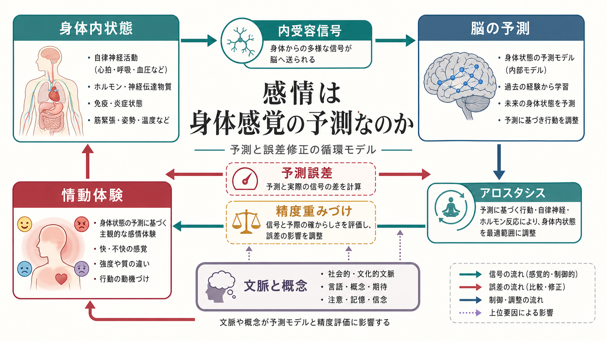
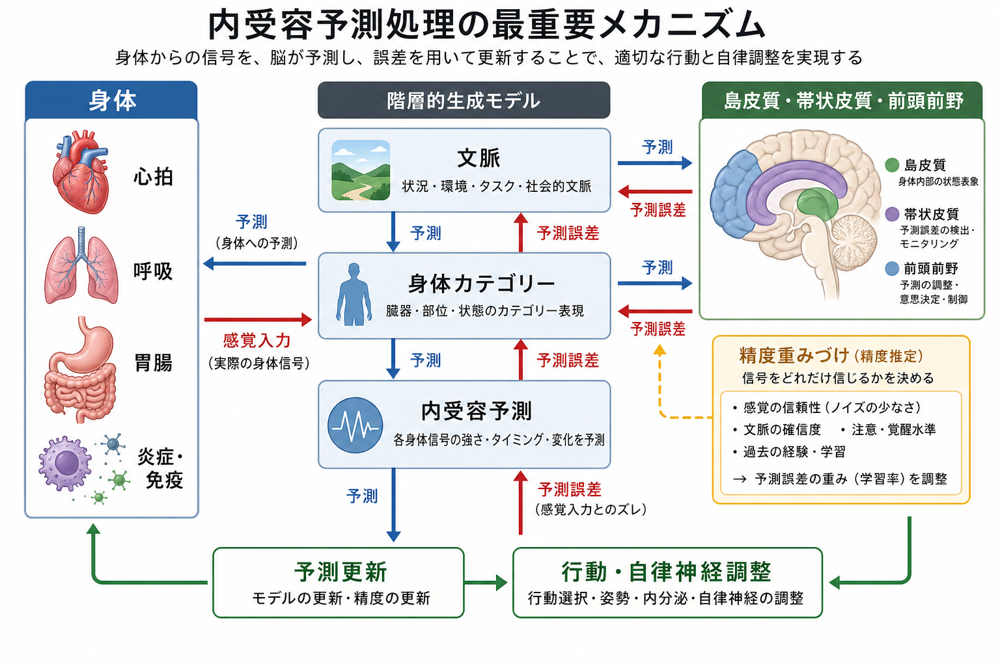
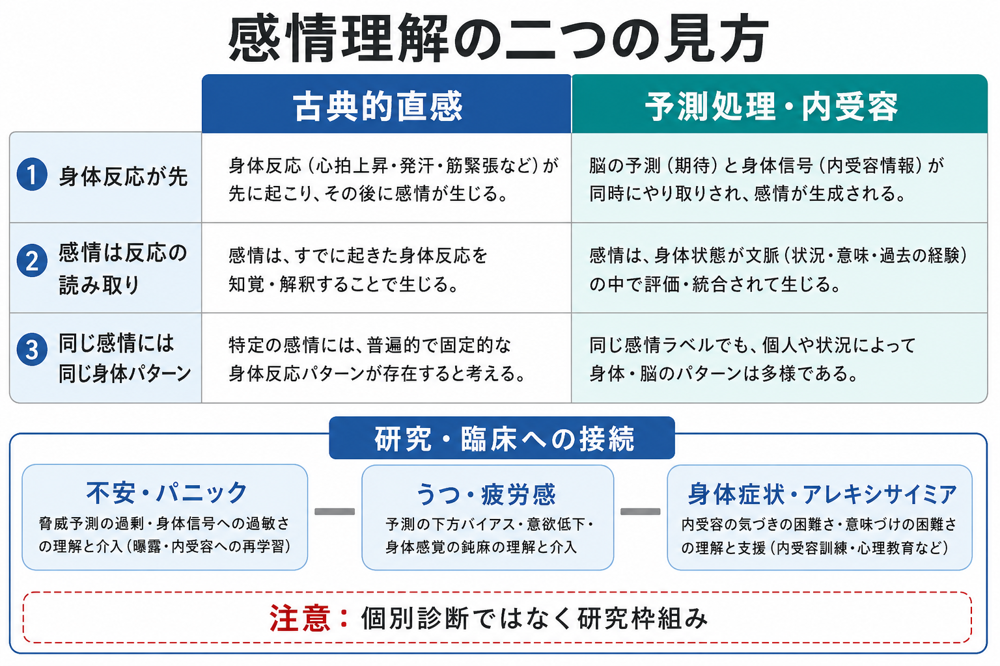

# 感情は身体感覚の予測なのか

## 要点

- 感情は、心拍や呼吸などの身体信号を受け取ってから単純に「読み取る」反応ではなく、脳が身体内状態を予測し、その予測と内受容信号を照合しながら作る経験として理解できる。
- この見方では、[[内受容感覚とは何か|内受容感覚]]、[[予測処理とは何か|予測処理]]、アロスタシス、文脈、概念、言語が感情経験を共同で形づくる。
- 「感情は身体感覚の予測である」という表現は有用だが、身体信号だけで感情が決まるという意味ではない。感情は、身体状態の予測に、状況理解、過去経験、行動可能性が重なった経験である。
- 臨床的には、不安、パニック、うつ、疲労感、身体症状、アレキシサイミアなどを理解する補助線になる。ただし、個別診断や治療方針をこの枠組みだけで決めることはできない。

## この記事で答える問い

この記事では、次の問いを整理する。

- 感情は、身体反応の結果なのか、それとも身体反応についての予測なのか。
- 内受容予測処理では、予測、予測誤差、精度重みづけはどう働くのか。
- 島皮質、帯状皮質、前頭前野などの脳領域は、感情経験にどう関わるのか。
- この枠組みは、不安、うつ、身体症状、アレキシサイミアの理解にどう接続するのか。

## まず結論

感情は「身体感覚そのもの」ではなく、「身体がいまどのような状態にあり、次に何が必要か」についての予測的な解釈だと考えると理解しやすい。脳は、身体から上がってくる内受容信号を待って受動的に読むだけではない。むしろ、心拍、呼吸、胃腸、筋緊張、炎症、疲労などの変化を、文脈や過去経験に基づいて先回りして予測し、その予測と入力のずれを使って経験と行動を更新する [1][2]。

このため、同じ心拍上昇でも、運動中なら「高揚」、発表前なら「緊張」、危険を感じる場面なら「恐怖」として経験されやすい。身体信号は重要な材料だが、感情名や感情の質は、身体だけから一対一に決まらない。状況、注意、概念、言語、記憶、社会的意味づけが、身体信号をどのような感情として経験するかを変える [3][4]。

## 背景

古典的には、感情は「身体反応が先に起こり、それを意識が感じ取ることで生じる」と説明されることが多かった。たとえば、怖いから心拍が上がるのではなく、心拍上昇や筋緊張を感じるから怖いのだ、という発想である。この直感は、感情経験に身体が深く関わることをよく捉えている。

しかし、現在の感情研究は、特定の感情カテゴリーが常に特定の身体反応や脳部位に固定的に対応する、という単純な見方には慎重である。神経画像研究のメタ分析では、恐怖、怒り、悲しみ、喜びといった離散的感情が、それぞれ専用の脳部位に一貫して局在するという証拠は限定的であり、むしろ複数の汎用的ネットワークが文脈に応じて組み合わさると考えられている [5]。

この流れの中で、内受容予測処理は「身体」と「意味づけ」を分けずに扱う枠組みを与える。脳は身体状態を調整するために、身体の現在状態だけでなく、近い将来に必要になるエネルギー、行動、注意配分を予測する。この予測的な身体調整はアロスタシスと呼ばれ、感情経験の背景にある重要な機能である [2][6]。

## 基本概念

### 内受容感覚

内受容感覚とは、心拍、呼吸、胃腸、体温、痛み、空腹、渇き、疲労、炎症関連の状態など、身体内部に由来する信号を神経系が感知し、統合し、解釈する過程である [7]。これは意識に上る感覚だけを指すのではない。自律神経、内分泌、免疫、代謝調整のように、意識されない身体調整も含む。

感情との関係では、内受容感覚は「身体的な材料」を提供する。胸が締めつけられる、胃が重い、息が浅い、身体が温かい、力が抜ける、といった感覚は、感情の主観的な質に深く関わる。ただし、内受容信号はそのまま感情名を決めるわけではない。

### 予測処理

[[予測処理とは何か|予測処理]]では、脳は感覚入力を受け取ってから解釈する装置ではなく、次にどのような入力が来るかを予測し、予測と入力の差である予測誤差を使ってモデルを更新する装置として捉えられる。自由エネルギー原理や能動的推論の枠組みでは、知覚と行動はいずれも予測誤差を減らす過程として説明される [1]。

身体に当てはめると、脳は「いま心拍はどの程度のはずか」「この場面で呼吸はどう変わるはずか」「身体は危険、努力、休息、親密さのどれに備えるべきか」を予測する。感情は、この身体予測が外界の文脈や自己理解と統合されたときに生じる経験として捉えられる [2][3]。

### 精度重みづけ

精度重みづけとは、予測誤差をどれだけ信頼するかの調整である。たとえば、心拍の変化がはっきりしていて状況も明確なら、身体信号の重みは高くなる。一方、信号が曖昧だったり、強い不安や過去経験によって「危険だ」という予測が優勢だったりすると、同じ身体信号でも別の意味づけが起こる。

この点は、感情を「身体を正確に感じる能力」だけで説明できない理由でもある。内受容研究では、実際の身体信号をどれだけ正確に検出できるか、主観的にどれだけ身体感覚に敏感だと感じるか、自分の判断がどれだけ正しいかを見積もれるかを区別する必要がある [8]。

## 仕組み

内受容予測処理では、感情経験はおおよそ次の循環として理解できる。

1. 脳が、文脈、記憶、概念、現在の課題に基づいて身体状態を予測する。
2. 身体から、心拍、呼吸、胃腸、筋緊張、痛み、疲労などの内受容信号が上がる。
3. 予測と実際の信号のずれが、予測誤差として評価される。
4. 精度重みづけにより、予測と信号のどちらをどれだけ信じるかが調整される。
5. 脳は、知覚、感情ラベル、注意、行動、自律神経調整を更新する。

この循環では、予測誤差を減らす方法は一つではない。身体信号の解釈を変えることもあれば、呼吸を整える、姿勢を変える、その場から離れる、助けを求めるといった行動で身体入力そのものを変えることもある。能動的推論の発想では、知覚と行動は分離した処理ではなく、身体と環境をより予測可能にするための連続した調整である [1][3]。

脳領域としては、島皮質、帯状皮質、前頭前野、皮質下領域、自律神経調整系が重要である。とくに前部島皮質は、内受容信号を主観的な「いまの感じ」として再表象する領域として議論されてきた [6]。ただし、特定の感情が特定の部位だけで作られるというより、身体調整、注意、概念化、行動準備を担う複数のネットワークが相互作用すると見る方が現在の証拠に合う [5]。

## 図解

感情をめぐる二つの見方を比べると、内受容予測処理の特徴が見えやすい。

| 見方 | 古典的直感 | 予測処理・内受容 |
|---|---|---|
| 身体反応との関係 | 身体反応が先に起こり、感情が後から生じる | 身体予測と身体信号が同時にやり取りされる |
| 感情の意味づけ | 身体反応を読み取ることで感情が生じる | 身体状態が文脈、概念、記憶の中で評価される |
| 感情カテゴリー | 同じ感情には同じ身体・脳パターンがあると考えやすい | 同じ感情ラベルでも、個人や状況により多様なパターンがありうる |
| 臨床との接続 | 身体反応の強さに注目しやすい | 予測、注意、精度重みづけ、行動調整に注目する |

## 臨床・研究との接続

内受容の変化は、不安障害、気分障害、摂食障害、依存、身体症状など、複数のメンタルヘルス領域で研究されている [7]。ここで重要なのは、「内受容が高いほど良い」あるいは「低いほど悪い」と単純化しないことである。身体信号への注意が強すぎること、身体信号を危険として解釈しやすいこと、身体信号に気づきにくいこと、気づいても言語化しにくいことは、それぞれ異なる問題になりうる。

不安やパニックでは、心拍、息苦しさ、めまい、発汗などが危険の証拠として予測されやすくなることがある。すると、身体感覚への注意が高まり、曖昧な信号にも大きな精度が与えられ、さらに不安が増す循環が起こりうる。これは個別症状の診断ではなく、不安反応を理解するための研究枠組みである。

うつや疲労感では、身体状態の予測が「動けない」「回復しない」「価値がない」といった自己評価や行動予測と結びつく可能性がある。感情は単なる気分ではなく、身体エネルギー、行動可能性、自己理解の予測と関係する。

身体症状やアレキシサイミアでは、身体信号の検出、意味づけ、言語化のどこに困難があるのかを分けて考えることが重要になる。[[身体症状症は脳の予測処理で説明できるのか|身体症状症と予測処理]]の議論と同じく、症状を「気のせい」とみなすのではなく、身体信号、予測、注意、行動、社会的文脈の相互作用として扱う必要がある。

## よくある誤解

### 誤解1: 感情は身体感覚だけで決まる

決まらない。身体信号は感情経験の重要な材料だが、感情は身体信号に、文脈、概念、言語、記憶、注意、行動準備が組み合わさって成立する。同じ身体反応でも、場面が変われば別の感情として経験される。

### 誤解2: 予測なら感情は作り話である

そうではない。予測とは、脳が身体と環境に適応するための生物学的な調整である。感情が予測的に構成されるとしても、その苦痛や喜びが実在しないという意味にはならない。

### 誤解3: 身体に注意を向ければ必ず良くなる

必ずしもそうではない。身体感覚への注意は、文脈によって役立つこともあれば、不安や身体症状への過集中を強めることもある。臨床では、注意、解釈、行動、環境調整を含めて扱う必要がある。

### 誤解4: 感情カテゴリーはすべて脳内に固定的にある

現在の証拠は、離散的感情ごとに専用の脳部位が一貫して存在するという見方より、複数の汎用的ネットワークが状況に応じて組み合わさる見方を支持しやすい [5]。これは、感情が曖昧だという意味ではなく、感情が文脈依存的で柔軟な経験であることを示す。

## 関連ノート

既存ノート:

- [[内受容感覚とは何か]]
- [[内受容感覚は感情にどう関わるのか]]
- [[予測処理とは何か]]
- [[情動と認知は分けられるのか]]
- [[身体化認知とは何か]]
- [[身体症状症は脳の予測処理で説明できるのか]]
- [[最小自己とは何か]]
- [[主観的経験は科学的に扱えるのか]]

今後の作成候補:

- 内受容推論とは何か
- アロスタシスとは何か
- 精度重みづけとは何か
- 島皮質は主観的感情にどう関わるのか
- アレキシサイミアは内受容の問題なのか

MOC更新候補:

- `content/00_MOC/` 配下の認知科学・心理学系 MOC
- `content/00_MOC/` 配下の脳・神経科学系 MOC
- `content/00_MOC/` 配下の計算論的精神医学系 MOC

## 理解チェック

1. 感情を「身体反応の読み取り」と見る説明と、「身体感覚の予測」と見る説明はどこが違うか。
2. 予測誤差と精度重みづけは、感情経験の強さや質にどう関わるか。
3. 同じ心拍上昇が、運動、発表前、危険場面で異なる感情として経験されるのはなぜか。
4. 内受容感覚を「正確に感じること」と「敏感だと感じること」はなぜ区別すべきか。
5. この枠組みを臨床に使うとき、なぜ個別診断や治療指示として断定してはいけないか。

## 参考文献

[1] Friston, K. (2010). The free-energy principle: A unified brain theory? *Nature Reviews Neuroscience*, 11, 127-138. https://doi.org/10.1038/nrn2787

[2] Barrett, L. F., & Simmons, W. K. (2015). Interoceptive predictions in the brain. *Nature Reviews Neuroscience*, 16, 419-429. https://doi.org/10.1038/nrn3950

[3] Seth, A. K. (2013). Interoceptive inference, emotion, and the embodied self. *Trends in Cognitive Sciences*, 17(11), 565-573. https://doi.org/10.1016/j.tics.2013.09.007

[4] Barrett, L. F. (2017). The theory of constructed emotion: An active inference account of interoception and categorization. *Social Cognitive and Affective Neuroscience*, 12(1), 1-23. https://doi.org/10.1093/scan/nsw154

[5] Lindquist, K. A., Wager, T. D., Kober, H., Bliss-Moreau, E., & Barrett, L. F. (2012). The brain basis of emotion: A meta-analytic review. *Behavioral and Brain Sciences*, 35(3), 121-143. https://doi.org/10.1017/S0140525X11000446

[6] Craig, A. D. (2009). How do you feel - now? The anterior insula and human awareness. *Nature Reviews Neuroscience*, 10, 59-70. https://doi.org/10.1038/nrn2555

[7] Khalsa, S. S., Adolphs, R., Cameron, O. G., Critchley, H. D., Davenport, P. W., Feinstein, J. S., et al. (2018). Interoception and mental health: A roadmap. *Biological Psychiatry: Cognitive Neuroscience and Neuroimaging*, 3(6), 501-513. https://doi.org/10.1016/j.bpsc.2017.12.004

[8] Garfinkel, S. N., Seth, A. K., Barrett, A. B., Suzuki, K., & Critchley, H. D. (2015). Knowing your own heart: Distinguishing interoceptive accuracy from interoceptive awareness. *Biological Psychology*, 104, 65-74. https://doi.org/10.1016/j.biopsycho.2014.11.004

## 未解決問題

- 内受容予測の異常が、精神症状の原因、結果、維持要因のどれとして働くのかは、症状や個人差によって異なる可能性がある。
- 心拍課題、呼吸課題、胃腸感覚、痛み、疲労、免疫関連信号を、同じ「内受容」としてどこまで統合的に扱えるかは未解決である。
- 感情ラベル、言語、文化、社会的文脈が、内受容予測の精度重みづけにどう影響するかは、さらに検証が必要である。
- 臨床介入では、身体感覚への注意を高めることが役立つ場合と、逆に過集中を強める場合をどう見分けるかが重要な課題である。
