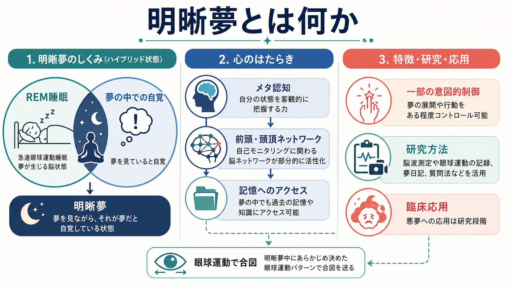
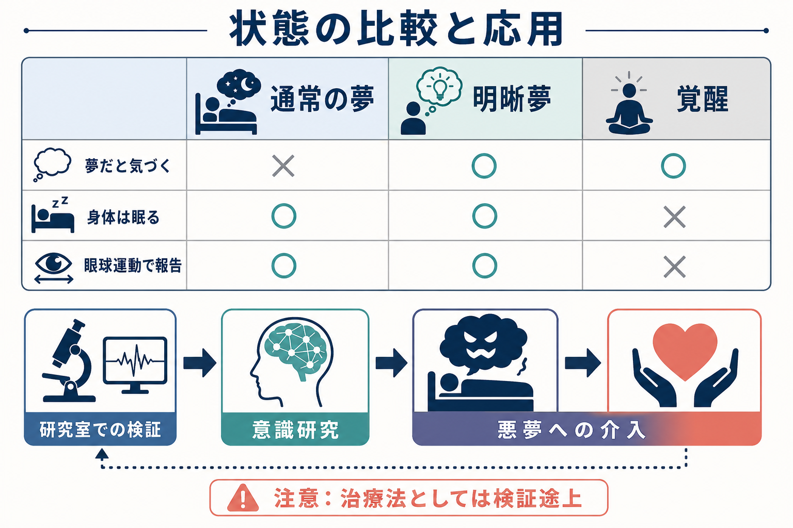

# 明晰夢とは何か

## 要点

- 明晰夢とは、眠って夢を見ている最中に「これは夢だ」と気づいている夢である。
- 重要なのは「夢を完全に操れること」ではなく、夢の中で自分の状態をモニタリングできる[[メタ認知とは何か|メタ認知]]が戻る点である。
- 多くはREM睡眠中に観察され、実験室ではあらかじめ決めた左右の眼球運動で、夢の中から外部の測定者へ合図できる[1]。
- 神経認知的には、通常のREM夢にある鮮明な感覚イメージに、前頭・頭頂系の自己反省、記憶アクセス、意図的制御が部分的に加わった「ハイブリッド状態」と考えられる[2][3]。
- 悪夢への介入や[[意識とは何か|意識]]研究への応用が期待されるが、誘導法や治療効果のエビデンスはまだ限定的である[3][6][8]。

## この記事で答える問い

1. 明晰夢は普通の夢や覚醒と何が違うのか。
2. 「夢だと気づく」ことは、脳と認知のどの機能に関係するのか。
3. 明晰夢は研究や臨床でどのように使えるのか。
4. 「夢を自由に操れる」「簡単に治療に使える」と考えてよいのか。

## まず結論

明晰夢は、[[覚醒と意識内容は何が違うのか|覚醒]]そのものではない。身体は眠ったままで、夢の視覚・情動・物語は続いている。しかし、その夢の内部で「いま自分は夢を見ている」と気づく。この気づきによって、通常の夢では弱くなりやすい自己モニタリング、現実記憶へのアクセス、選択的な注意、ある程度の意図的行為が再び働く。

したがって明晰夢は、睡眠と覚醒の単純な中間ではなく、REM睡眠中の夢経験に二次的な自己意識が重なった状態として理解しやすい[2][3]。この点で、[[変性意識状態とは何か|変性意識状態]]の一種でありながら、主観報告と生理測定を結びつけられる稀な研究対象でもある。

## 背景

通常の夢では、ありえない場面にいても、その場面を現実のように受け入れやすい。時間、場所、身体、他者、物語のつながりが不自然でも、夢の最中にはそれを疑わないことが多い。これは、夢の中で感覚イメージや情動は豊かに働く一方、現実検討、自己反省、矛盾の検出が弱まるためだと考えられる。

明晰夢はこの通常パターンの例外である。夢を見ている人は、夢の中の出来事を経験しながら、それが夢であると知っている。この「知っている」は、単なる後づけの夢報告ではない。古典的な実験では、参加者が夢の中で明晰になった瞬間に、事前に決めた左右の眼球運動を行い、睡眠ポリグラフ上でREM睡眠中の合図として確認された[1]。

この方法により、明晰夢は「目覚めかけの錯覚」や「起床後の解釈」だけでは説明しにくい現象になった。夢の最中に主観的な出来事が起こり、その時刻を生理信号で外部から同定できるからである。

## 基本概念

### 最小定義

明晰夢の最小定義は、「夢を見ている最中に、それが夢であると自覚している夢」である[3][6]。この定義では、夢の内容を自由に変えられることは必須ではない。夢だと気づいていても、場面をあまり操作できないこともある。

より広い意味では、明晰さには複数の成分がある。たとえば、夢だという洞察、自由に選べる感覚、覚醒時の記憶へのアクセス、夢の知覚の鮮明さ、夢の意味への理解、夢の後での想起などである。LuCiD scale のような尺度研究では、明晰夢を単一の有無ではなく、洞察、制御、記憶、解離、情動などの複数次元として測定しようとしている[4]。

### 普通の夢・明晰夢・覚醒

通常の夢では、夢の世界は体験されるが、「これは夢だ」というメタレベルの把握は弱い。明晰夢では、夢の世界は続くが、自己の状態への気づきが加わる。覚醒では、身体運動、外界入力、現実検討がより強く働く。

この比較は、[[注意と意識は同じものなのか|注意]]と意識の関係を考えるうえでも重要である。明晰夢では、外界への注意は閉じているが、夢内部の対象や自分の状態への注意は高まる。つまり、外界に開かれていることだけが意識の条件ではない。

## 仕組み

### REM睡眠の夢にメタ認知が重なる

明晰夢の多くはREM睡眠中に報告される。REM睡眠では、脳活動は比較的活発で、視覚的・情動的な夢が生じやすい。一方で、筋緊張は強く抑制され、外界への反応は低下する。この状態で夢だと気づくためには、夢の物語をそのまま受け入れるだけでなく、自分の経験を対象化する機能が必要になる。

この機能は[[メタ認知とは何か|メタ認知]]と近い。メタ認知とは、自分の知覚、記憶、判断、行為を一段上からモニタリングする働きである。明晰夢では、「夢の中の私」が行動しているだけでなく、「これは夢の中の出来事だ」と把握する自己モニタリングが成立する。

### 前頭・頭頂ネットワーク

神経科学的研究では、明晰夢に前頭前野、前頭極、頭頂葉、側頭頭頂接合部などの領域が関わる可能性が示されている。ただし、サンプルサイズが小さい研究が多く、結果はまだ決定的ではない[3]。現時点で言えるのは、明晰夢が通常のREM夢とまったく同じ神経状態ではなく、自己反省や認知制御に関わるネットワークが部分的に再関与しているらしい、という慎重な結論である。

2009年のEEG研究は、明晰夢を覚醒と非明晰REM夢の特徴を併せ持つハイブリッドな意識状態として報告し、特に前頭領域の活動差に注目した[2]。また、2014年の前頭・側頭部への経頭蓋交流刺激研究では、25Hzおよび40Hz帯の刺激が夢の中の自己反省的意識を高める可能性が報告された[5]。ただし、これは「電気刺激で誰でも夢を自在に操れる」という意味ではなく、効果の大きさ、再現性、安全性、一般化可能性には慎重な検証が必要である。

### 記憶・自己・制御

明晰夢では、夢を見ている本人が「私は眠っている」「この場面は現実ではない」と判断できる。そのため、[[自己とは何か|自己]]や[[自己意識はどのように発達するのか|自己意識]]の研究とも関係する。ここでの自己は、夢の中の登場人物としての自己だけではない。現在の経験状態を把握する観察者としての自己でもある。

また、明晰夢では[[ワーキングメモリとは何か|ワーキングメモリ]]や展望記憶も重要になる。たとえば「夢だと気づいたら左右に眼球運動で合図する」という実験課題では、眠る前の約束を夢の中で思い出し、実行する必要がある[1][3]。これは、夢の中でも一部の記憶アクセスと課題保持が働きうることを示す。

ただし、制御は段階的である。夢だと気づけても、場面を変えられないことがある。飛ぶ、話しかける、恐怖対象に向き合うなどの行為ができる場合もあるが、夢全体を完全に設計できるわけではない。したがって「明晰夢 = 夢の全能操作」と定義すると、現象を誤解しやすい。

## 図解

明晰夢を理解するには、次の3層に分けると整理しやすい。

| 層 | 通常の夢 | 明晰夢で加わるもの |
|---|---|---|
| 感覚・情動 | 視覚イメージ、恐怖、喜び、物語 | 夢の鮮明さは保たれることが多い |
| 自己モニタリング | 矛盾や非現実性に気づきにくい | 「これは夢だ」という洞察 |
| 行為・記憶 | 夢の流れに巻き込まれやすい | 約束の想起、眼球運動合図、限定的な制御 |

## 臨床・研究との接続

### 意識研究

明晰夢は、[[意識とは何か|意識]]研究にとって魅力的な対象である。理由は、外界から切り離された睡眠中の主観経験に、本人の内側から時刻マーカーを入れられるからである。左右の眼球運動合図を使えば、「夢の中で課題を開始した瞬間」や「夢だと気づいた瞬間」を生理データと対応づけられる[1][3]。

これは、[[皮質視床ループは意識や注意にどう関わるのか|脳内ネットワーク]]と主観経験の対応を調べるうえで重要である。覚醒中の意識研究では外界刺激を提示できるが、夢研究では主観報告の時刻が曖昧になりやすい。明晰夢はこの弱点を部分的に補う。

### 悪夢への応用

明晰夢療法は、反復性悪夢に対する介入として研究されてきた。発想は、夢の中で「これは夢だ」と気づければ、恐怖場面への関わり方を変えられる可能性がある、というものである。レビューでは、悪夢頻度や苦痛を減らす可能性が報告されているが、研究数は少なく、症例研究や小規模試験が多い[7][8]。

したがって、[[睡眠障害は脳機能にどのような影響を与えるのか|睡眠障害]]やPTSD関連悪夢への応用を語るときは、教育・研究目的の知見として扱う必要がある。個別の悪夢、トラウマ、睡眠障害に対して、明晰夢だけで治療できると断定してはならない。臨床的には、画像リハーサル療法、認知行動療法、睡眠衛生、薬物療法など既存の選択肢との比較と統合が必要である。

### 誘導法

明晰夢を誘導する方法には、現実検討、夢日記、MILD、WBTB、外部刺激、薬理学的介入、脳刺激などがある。系統的レビューでは、いくつかの方法は有望だが、確実に明晰夢を起こせる方法はまだ確立していないと評価されている[6]。国際的なオンライン研究でも、MILDやWBTBなどの組み合わせが検討されたが、自己選択サンプル、自己報告、実験室検証の不足といった限界がある[6]。

## よくある誤解

### 誤解1: 明晰夢は覚醒しているのと同じ

明晰夢では夢だと気づいているが、身体は基本的に睡眠状態にある。特にREM睡眠では筋緊張が抑制され、外界入力への応答も覚醒とは異なる。したがって、明晰夢は覚醒ではなく、睡眠中の意識内容が特殊に組織化された状態である。

### 誤解2: 明晰夢では何でも自由にできる

夢の制御は明晰夢の一部でありうるが、必須条件ではない。夢だと気づくこと、夢の展開を少し変えられること、すべてを自在に操作できることは別の段階である[4]。

### 誤解3: 明晰夢は簡単なセルフ治療法である

悪夢への応用は有望だが、現時点では検証途上である[8]。特に強い苦痛、PTSD、睡眠障害、解離症状などがある場合に、自己流で夢操作を試すことが常に安全とは限らない。この記事の内容は教育・研究目的であり、個別の診断や治療指示ではない。

### 誤解4: 脳刺激で明晰夢を確実に作れる

40Hz帯の前頭・側頭刺激研究は注目されたが、これは因果的手がかりを示す初期研究である[5]。日常的な装置利用や治療利用を正当化するには、再現性、効果量、盲検化、安全性を含む追加研究が必要である。

## 関連ノート

- [[意識とは何か]]
- [[覚醒と意識内容は何が違うのか]]
- [[変性意識状態とは何か]]
- [[メタ認知とは何か]]
- [[注意と意識は同じものなのか]]
- [[ワーキングメモリとは何か]]
- [[自己意識はどのように発達するのか]]
- [[睡眠障害は脳機能にどのような影響を与えるのか]]

## MOC更新候補

- `content/00_MOC/` 配下の認知科学・心理学系MOCがある場合、意識・自己・身体性、睡眠、メタ認知の交差領域として追加候補。
- 並列ジョブとの競合を避けるため、本ジョブではMOC本文は更新しない。

## 理解チェック

1. 明晰夢の最小定義は何か。
2. 明晰夢で「制御」よりも先に重要になる認知機能は何か。
3. 実験室で明晰夢の発生時刻を外部から確認する代表的な方法は何か。
4. 明晰夢療法を悪夢に応用するとき、どのような限界に注意すべきか。

## 未解決問題

- 明晰夢に関わる前頭・頭頂ネットワークの活動は、原因なのか、結果なのか、あるいは明晰さの一部の成分だけに関わるのか。
- 明晰夢の誘導法を、自己報告だけでなく睡眠ポリグラフと眼球運動合図で検証した大規模研究はまだ少ない。
- 悪夢への臨床応用では、明晰夢療法単独の効果、画像リハーサル療法などとの併用効果、長期安全性を分けて検討する必要がある。
- 明晰夢が[[自己とは何か|自己]]、身体感覚、現実感、解離体験とどのように関係するかは、精神病理学と意識研究の接点として未解決である。

## 参考文献

[1] LaBerge, S. P., Nagel, L. E., Dement, W. C., & Zarcone, V. P. (1981). Lucid dreaming verified by volitional communication during REM sleep. *Perceptual and Motor Skills*, 52(3), 727-732. https://doi.org/10.2466/pms.1981.52.3.727

[2] Voss, U., Holzmann, R., Tuin, I., & Hobson, J. A. (2009). Lucid dreaming: A state of consciousness with features of both waking and non-lucid dreaming. *Sleep*, 32(9), 1191-1200. https://doi.org/10.1093/sleep/32.9.1191

[3] Baird, B., Mota-Rolim, S. A., & Dresler, M. (2019). The cognitive neuroscience of lucid dreaming. *Neuroscience & Biobehavioral Reviews*, 100, 305-323. https://doi.org/10.1016/j.neubiorev.2019.03.008

[4] Voss, U., Schermelleh-Engel, K., Windt, J., Frenzel, C., & Hobson, A. (2013). Measuring consciousness in dreams: The lucidity and consciousness in dreams scale. *Consciousness and Cognition*, 22(1), 8-21. https://doi.org/10.1016/j.concog.2012.11.001

[5] Voss, U., Holzmann, R., Hobson, A., Paulus, W., Koppehele-Gossel, J., Klimke, A., & Nitsche, M. A. (2014). Induction of self awareness in dreams through frontal low current stimulation of gamma activity. *Nature Neuroscience*, 17, 810-812. https://doi.org/10.1038/nn.3719

[6] Stumbrys, T., Erlacher, D., Schädlich, M., & Schredl, M. (2012). Induction of lucid dreams: A systematic review of evidence. *Consciousness and Cognition*, 21(3), 1456-1475. https://doi.org/10.1016/j.concog.2012.07.003

[7] de Macêdo, T. C. F., Ferreira, G. H., de Almondes, K. M., Kirov, R., & Mota-Rolim, S. A. (2019). My dream, my rules: Can lucid dreaming treat nightmares? *Frontiers in Psychology*, 10, 2618. https://doi.org/10.3389/fpsyg.2019.02618

[8] Ouchene, R., El Habchi, N., Demina, A., Petit, B., & Trojak, B. (2023). The effectiveness of lucid dreaming therapy in patients with nightmares: A systematic review. *L'Encéphale*, 49(5), 525-531. https://doi.org/10.1016/j.encep.2023.01.008
