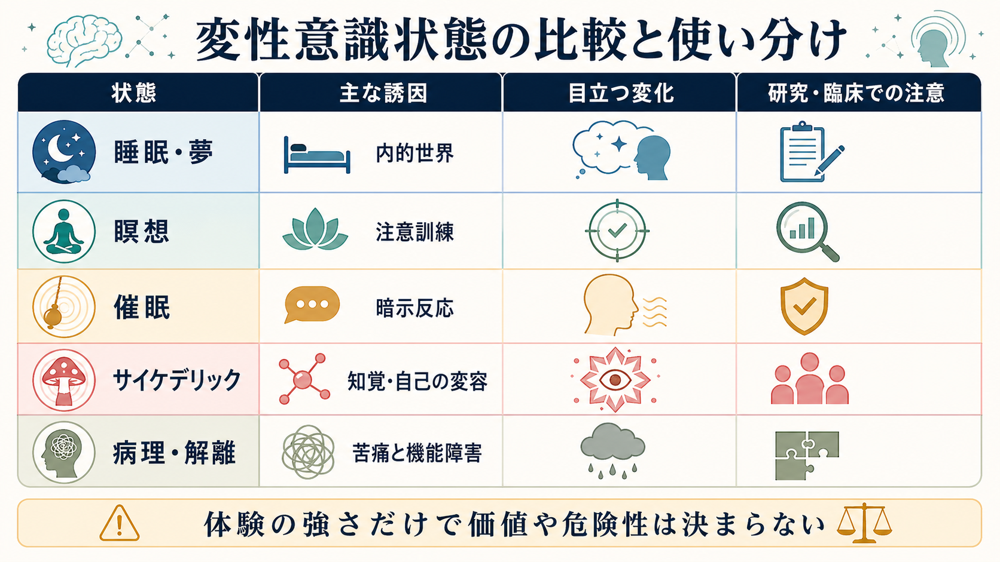

# 最小自己とは何か

## 要点

- 最小自己とは、「私は私である」と言葉で説明する以前に、経験がそもそも「私にとって」現れているという最小限の自己性を指す。
- 典型的には、身体が自分のものとして感じられる**身体所有感**、自分が行為を起こしているという**主体感**、経験が一人称的に与えられる**前反省的な自己性**から説明される [1][2]。
- 最小自己は、人生史・価値観・社会的役割として語られる**物語的自己**とは異なる。ただし両者は切り離されて存在するのではなく、物語的自己は最小自己を足場にして組織化される [1]。
- 身体所有感は、視覚・触覚・固有感覚・内受容感覚の統合によって変化しうる。ラバーハンド錯覚や全身錯覚は、この可塑性を示す代表的な実験である [3][4][5]。
- 統合失調症スペクトラムでは、思考・行為・身体感覚が「自分のもの」として自然にまとまる感覚が揺らぐことがあり、最小自己の障害として研究されている [7][8]。

## この記事で答える問い

1. 最小自己は、通常の「自己理解」や「人格」と何が違うのか。
2. 身体所有感と主体感は、最小自己の中でどのような役割をもつのか。
3. 最小自己は、脳・身体・予測処理の観点からどのように説明できるのか。
4. 統合失調症、離人感、身体感覚の変容などの研究とどのように接続するのか。

## まず結論

最小自己は、「自分について考えている自己」ではなく、「経験が最初から自分に属しているように現れる仕方」である。たとえば、腕を上げるとき、通常は「この腕は私の腕であり、私が動かしている」と逐一推論しない。身体はすでに自分のものとして感じられ、行為は自分から出ているものとして経験される。この、説明以前の自己性が最小自己である [1][2]。

この概念が重要なのは、自己を単なる記憶・性格・社会的アイデンティティとしてではなく、[[意識とは何か|意識]]経験そのものの形式として捉え直すからである。見える、触れる、痛む、動く、思うという経験は、ただ世界に浮かんでいるのではなく、通常は「私にとって」現れている。最小自己は、その「私にとって性」を説明するための概念である。

## 背景

日常語の「自己」は広い。名前、性格、職業、人生史、信念、価値観、他者からの評価まで含むことがある。しかし認知科学や現象学では、自己を一枚岩として扱うと、異なる現象が混ざってしまう。Gallagher は、時間的連続性や物語を含む自己を**物語的自己**、いまこの瞬間の経験にともなう最小限の自己性を**最小自己**として区別した [1]。

この区別は、[[メタ認知とは何か|メタ認知]]や自己報告の研究にも関係する。自分の経験について「私はいま痛みを感じている」と報告するには、言語化・記憶・注意・判断が必要である。しかし、痛みそのものが「誰のものでもない経験」として現れてから、後で自分に割り当てられるわけではない。多くの場合、痛みは最初から「私の痛み」として現れる。この報告以前の自己性を扱う点で、最小自己は反省的自己理解よりも基礎的である。

## 基本概念

### 前反省的な一人称性

前反省的とは、「自分について考える前に」という意味である。鏡を見て自分を認識する、過去を振り返って自分史を語る、性格を分析する、といった反省的な活動の前に、経験はすでに一人称的に与えられている。ここでいう一人称性は、「私はこう思う」と命題化された判断ではなく、経験が自分の視点から開けているという構造である [1][5]。

たとえば、[[知覚とは何か|知覚]]では、物体はある位置・距離・向きで現れる。その背景には、見る主体の身体位置や行為可能性がある。椅子は「座れるもの」として、扉は「通れるもの」として現れる。最小自己は、世界を身体化された視点から経験するという、この基本的な配置に関わる。

### 身体所有感

身体所有感とは、「この身体、あるいはこの身体部位は自分のものだ」と感じられることを指す。これは単なる知識ではない。目を閉じていても、自分の手足の位置や姿勢には一定の感覚があり、痛みや温度感覚も自分の身体に属するものとして感じられる。

ラバーハンド錯覚では、本物の手を隠し、見えているゴムの手と本物の手を同期して刺激すると、ゴムの手が自分の手のように感じられることがある。この錯覚は、身体所有感が固定された内的ラベルではなく、視覚・触覚・固有感覚の統合によって更新されることを示す [3][4]。関連する神経科学的背景として、身体情報の表現は[[体性感覚ネットワークは身体情報をどう表現するのか|体性感覚ネットワーク]]とも関係する。

### 主体感

主体感とは、「この行為を自分が起こしている」という感覚である。キーボードを打つ、腕を伸ばす、視線を向けるといった行為では、通常、自分が行為の起点であるという感覚が伴う。これに対して、反射、他者に手を動かされる状況、あるいは一部の精神病理では、行為や思考の起点が自分であるという感覚が弱まることがある。

主体感は、運動意図、遠心性コピー、感覚フィードバック、結果予測の一致だけで説明できるわけではない。Synofzik らは、主体感を単一の比較器モデルに還元せず、低次の「主体感の感じ」と、高次の「主体判断」を区別する多因子的な説明を提案した [2]。これは、行為中に生じる即時的な感覚と、後から「私がやった」と判断する過程を混同しないために重要である。

## 仕組み

### 多感覚統合としての身体自己

最小自己の身体的側面は、視覚、触覚、固有感覚、前庭感覚、内受容感覚の統合から生じる。身体は、外から見える物体であると同時に、内側から感じられる生きた身体でもある。所有感が安定するには、これらの信号が時間的・空間的にまとまり、身体モデルと矛盾しない必要がある [4]。

全身錯覚の研究では、自己位置づけや一人称視点も操作される。Blanke と Metzinger は、最小の現象的自己性を、自己位置づけ、一人称視点、身体との同一化の組み合わせとして整理した [5]。つまり、最小自己は手足の所有感だけではなく、「経験の中心がどこにあるか」「世界がどこから開けているか」にも関係する。

### 予測処理としての主体感

行為を起こすとき、脳は運動指令の結果としてどのような感覚が返ってくるかを予測する。実際の感覚フィードバックが予測とよく一致すれば、行為は自分が起こしたものとして感じられやすい。一方、遅延、ずれ、予期しない結果が大きいと、主体感は弱まりうる [2]。

ただし、主体感は運動予測だけで決まらない。意図、文脈、結果の意味、他者からのフィードバック、事後的な推論も関与する。たとえば、予測と結果が完全に一致しなくても、自分の行為として理解できる場合がある。逆に、偶然生じた結果でも、文脈によっては「自分が起こした」と感じることがある。このため、最小自己の研究では、[[注意とは何か|注意]]、行為制御、信念形成を分けつつ接続して考える必要がある。

### 内受容感覚と身体化された自己

内受容感覚とは、心拍、呼吸、胃腸感覚、体温、痛み、疲労など、身体内部の状態に関する感覚である。Seth は、感情と身体化された自己を、内受容信号に対する予測と推論として説明する枠組みを提示した [6]。この観点では、「私はここにいて、いま生きている」という基礎的な自己感は、外界の知覚だけでなく、身体内部の制御と密接につながる。

この見方は、[[情動と認知は分けられるのか|情動と認知]]の区別にも影響する。不安、緊張、違和感、離人感のような経験では、身体内部の信号とその解釈が自己感を大きく変えることがある。したがって最小自己は、知覚や運動だけでなく、生命維持に関わる身体制御にも根ざしている。

## 図解

| 図 | 読み方 | 対応する本文 |
|---|---|---|
| 概念地図 | 最小自己を、前反省的な一人称性・身体所有感・主体感・自己位置づけ・物語的自己との違いに分ける | 要点、基本概念 |
| メカニズム図 | 運動予測と感覚フィードバックの比較から、所有感・主体感が更新される流れを見る | 仕組み |
| 比較図 | 最小自己と物語的自己を比較し、研究・臨床応用への接続を確認する | 臨床・研究との接続、よくある誤解 |

## 臨床・研究との接続

### 統合失調症スペクトラムの自己障害

統合失調症スペクトラムでは、思考、知覚、身体感覚、行為が自然に「自分のもの」としてまとまる感覚が変化することがある。Sass と Parnas は、統合失調症を単に妄想や幻覚の集合としてではなく、自己性の基礎的な変容として理解する視点を提示した [7]。ここでは、通常は暗黙に働く自己感が過剰に対象化される「過反省性」と、自分が経験の主体であるという感覚の弱まりが重要になる。

EASE は、このような異常自己経験を半構造化面接で捉えるために開発された尺度であり、統合失調症スペクトラムの研究で用いられている [8]。ただし、これは教育・研究上の説明であり、個別の診断や治療方針をこの概念だけで決めることはできない。臨床では症状、生活機能、経過、薬物・身体疾患、文化的背景を含めて総合的に評価する必要がある。

### 予測誤差、妄想、外在化

主体感の揺らぎは、行為や思考の原因帰属にも関係する。予測された感覚結果と実際の結果のずれが大きいと、行為や思考が自分に由来するという感覚が弱まり、外部から来たもののように感じられる可能性がある。これは[[妄想は予測誤差処理の異常として説明できるのか|妄想と予測誤差処理]]の議論とも接続する。

ただし、最小自己の障害をすべて予測誤差に還元するのは単純化しすぎである。主体感や所有感には、神経計算、現象学的構造、社会的相互作用、言語的解釈が重なる。予測処理は有力な説明枠組みの一つだが、最小自己そのものを単一の計算量として測れる段階にはない。

### 身体症状、離人感、身体イメージ

身体が自分のものとして自然に感じられない、身体が遠い、感情が自分から切り離されている、といった経験は、離人感や身体感覚の変容として記述されることがある。これらは必ずしも統合失調症を意味しない。睡眠不足、強いストレス、不安、抑うつ、神経疾患、薬物、文化的文脈などでも自己感は変化しうる。

この領域では、[[身体症状症は脳の予測処理で説明できるのか|身体症状症と予測処理]]、摂食障害、慢性疼痛、機能性神経症状症などとの接続も重要である。最小自己の概念は、症状を「気のせい」と切り捨てるためではなく、身体・脳・経験・意味づけがどのように結びつくかを丁寧に記述するために使うべきである。

## よくある誤解

### 誤解1: 最小自己は「小さな自己」という実体である

最小自己は、脳内にいる小さな観察者や、魂のような実体を指す概念ではない。経験が一人称的に与えられ、身体や行為が自分のものとしてまとまる構造を指す。したがって、「最小自己がどこにあるか」と問うより、「どの条件で自己感が成立し、どの条件で揺らぐか」と問う方が研究上は有益である。

### 誤解2: 最小自己は物語的自己と無関係である

最小自己と物語的自己は区別できるが、無関係ではない。身体所有感や主体感が安定しているからこそ、過去の経験を「私の経験」として記憶し、将来の計画を「私の行為」として構成しやすい。逆に、人生史や社会的役割の変化は、身体の感じ方や行為主体感にも影響する。

### 誤解3: 主体感は「意志の強さ」で決まる

主体感は、努力や意志の強弱だけで決まるものではない。運動予測、感覚フィードバック、注意、文脈、結果の意味づけが重なって生じる。したがって、主体感が弱い経験を、単純に「本人の意志が弱い」と解釈するのは不正確である。

### 誤解4: 自己障害があれば特定の診断が決まる

自己感の変化は多くの状態で起こりうる。統合失調症スペクトラムで重要な研究対象ではあるが、最小自己の障害だけで診断を確定することはできない。臨床では、持続期間、苦痛、生活機能、他の症状、身体要因、発達歴、文化的背景を総合して評価する必要がある。

## 関連ノート

### 既存ノート

- [[意識とは何か]]
- [[知覚とは何か]]
- [[注意とは何か]]
- [[メタ認知とは何か]]
- [[エピソード記憶とは何か]]
- [[体性感覚ネットワークは身体情報をどう表現するのか]]
- [[妄想は予測誤差処理の異常として説明できるのか]]
- [[身体症状症は脳の予測処理で説明できるのか]]

### 今後の作成候補

- 身体所有感とは何か
- 主体感とは何か
- ラバーハンド錯覚とは何か
- 離人感とは何か
- 統合失調症の自己障害とは何か
- 内受容感覚と自己感はどう関係するのか

### MOC 更新候補

- `content/00_MOC/MOC｜認知科学・心理学.md`
- `content/00_MOC/MOC｜脳・神経科学.md`
- `content/00_MOC/MOC｜精神医学.md`

## 理解チェック

1. 最小自己と物語的自己は、どの点で異なるか。
2. 身体所有感と主体感は、どちらも「自分らしさ」だが、何を区別しているか。
3. ラバーハンド錯覚は、身体所有感について何を示しているか。
4. 主体感を比較器モデルだけで説明すると、どのような点が不足するか。
5. 統合失調症スペクトラムの自己障害を説明するとき、診断や治療指示として断定しないために何に注意すべきか。

## 未解決問題

- 最小自己を、主観報告に依存しすぎず、どのように測定できるか。
- 身体所有感、主体感、一人称視点、内受容感覚は、同じ自己性の側面なのか、それとも部分的に独立したシステムなのか。
- 予測処理モデルは、自己感の変化をどこまで説明でき、どこから現象学的・社会的説明が必要になるのか。
- 統合失調症スペクトラムの自己障害は、早期発見や心理療法にどの程度応用できるのか。

## 参考文献

[1] Gallagher, S. (2000). Philosophical conceptions of the self: implications for cognitive science. *Trends in Cognitive Sciences, 4*(1), 14-21. https://doi.org/10.1016/S1364-6613(99)01417-5

[2] Synofzik, M., Vosgerau, G., & Newen, A. (2008). Beyond the comparator model: A multifactorial two-step account of agency. *Consciousness and Cognition, 17*(1), 219-239. https://doi.org/10.1016/j.concog.2007.03.010

[3] Botvinick, M., & Cohen, J. (1998). Rubber hands “feel” touch that eyes see. *Nature, 391*, 756. https://doi.org/10.1038/35784

[4] Tsakiris, M. (2010). My body in the brain: A neurocognitive model of body-ownership. *Neuropsychologia, 48*(3), 703-712. https://doi.org/10.1016/j.neuropsychologia.2009.09.034

[5] Blanke, O., & Metzinger, T. (2009). Full-body illusions and minimal phenomenal selfhood. *Trends in Cognitive Sciences, 13*(1), 7-13. https://doi.org/10.1016/j.tics.2008.10.003

[6] Seth, A. K. (2013). Interoceptive inference, emotion, and the embodied self. *Trends in Cognitive Sciences, 17*(11), 565-573. https://doi.org/10.1016/j.tics.2013.09.007

[7] Sass, L. A., & Parnas, J. (2003). Schizophrenia, consciousness, and the self. *Schizophrenia Bulletin, 29*(3), 427-444. https://doi.org/10.1093/oxfordjournals.schbul.a007017

[8] Parnas, J., Møller, P., Kircher, T., Thalbitzer, J., Jansson, L. B., Handest, P., & Zahavi, D. (2005). EASE: Examination of Anomalous Self-Experience. *Psychopathology, 38*(5), 236-258. https://doi.org/10.1159/000088441
