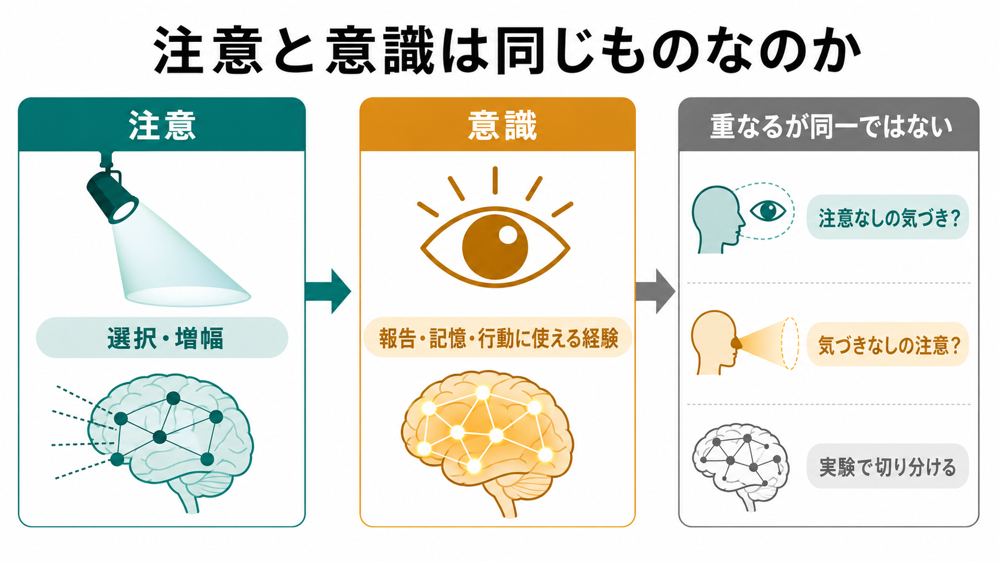
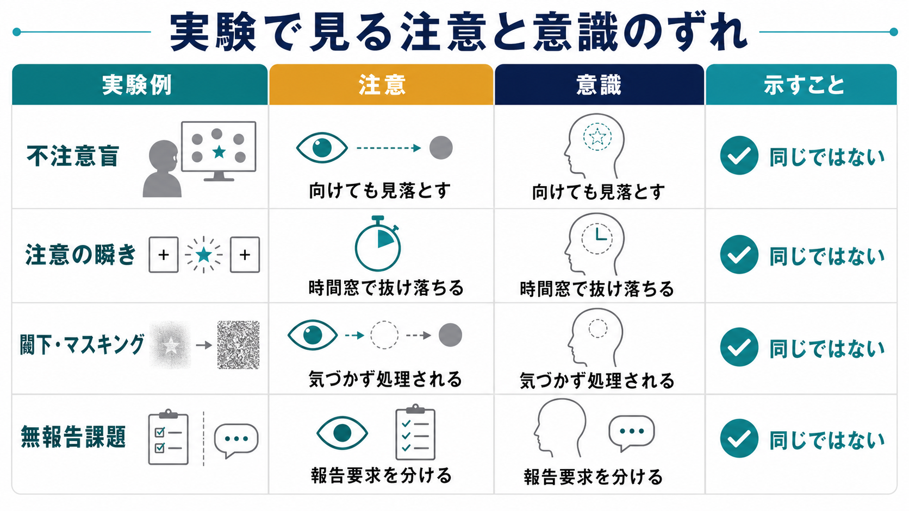

# 注意と意識は同じものなのか

## 要点

- 注意とは、限られた処理資源を特定の場所・対象・特徴・課題へ配分し、情報処理を選択・増幅・抑制する働きである。
- 意識とは、ある内容が主観的経験として現れ、しばしば報告・記憶・判断・行動に利用できる状態を指す。ただし「経験そのもの」と「報告できること」は同じではない。
- 注意と意識は強く関係するが、同一ではない。注意していても意識に上らない処理があり、逆に十分なトップダウン注意がなくても意識経験が成立する場合がある [1][2]。
- 実験的には、不注意盲、注意の瞬き、閾下・マスキング、無報告課題などが、両者のずれを調べる代表的な方法である [3][4][5][7]。
- 実用上は「注意を向けたから見えているはず」「意識していないから処理されていないはず」と考えないことが重要である。

## この記事で答える問い

この記事では、[[選択的注意はどのように働くのか|選択的注意]]や[[トップダウン注意とボトムアップ注意は何が違うのか|トップダウン注意・ボトムアップ注意]]と、[[意識とは何か|意識]]の関係を整理する。中心的な問いは次の三つである。

1. 注意を向けることは、意識に上ることと同じなのか。
2. 注意と意識を切り分ける実験には何があるのか。
3. 研究や臨床・教育場面で、この区別はどのように役立つのか。

## まず結論

注意と意識は「重なり合う別の過程」と考えるのが最も実用的である。注意は情報処理を選ぶ制御機構であり、意識は経験内容が成立し、必要に応じて報告・記憶・判断・行動に使える状態である。

たとえば、ある人が画面中央の文字課題に集中しているとき、周辺に出た刺激は視覚皮質で処理されていても本人は気づかないことがある。これは「注意が処理を調整しているが、意識経験には達していない」例である。一方で、風景の大まかな雰囲気や単独の目立つ物体は、細かなトップダウン注意を向けていなくても気づかれることがある [1]。したがって、注意は意識を起こしやすくする重要な調整因子だが、単純な必要十分条件ではない。

## 背景

日常語では「注意して見る」「意識して見る」がかなり近い意味で使われる。しかし認知科学では、両者を混同すると実験結果の解釈が曖昧になる。

不注意盲の研究では、参加者がパス回数などの課題に集中していると、画面内にかなり目立つ予期しない対象が現れても見落とすことが示された [4]。これは、視野に入っていること、網膜に像が届いていること、課題に集中していることが、必ずしも「その対象を意識していること」を意味しないことを示す。

一方、Lamme は視覚的注意と視覚的気づきの混同を批判し、注意は入力の選択・競合解決に、気づきは再帰的処理や知覚表象の成立に深く関わると整理した [2]。Koch と Tsuchiya も、トップダウン注意と意識はしばしば一緒に起こるが、実験的には分離できると論じた [1]。

## 基本概念

### 注意

注意は、情報処理の優先順位づけである。空間の一点に向ける空間的注意、色や動きなどの特徴に向ける特徴ベース注意、対象単位で向ける対象ベース注意、課題目標に従うトップダウン注意、突然の刺激に引き寄せられるボトムアップ注意がある。

注意の主な働きは、関連情報の増幅、無関連情報の抑制、処理資源の配分、行動選択の準備である。[[認知負荷とは何か|認知負荷]]が高いと、無関連刺激への処理が弱まり、見落としや反応遅延が増える。

### 意識

意識には少なくとも二つの側面がある。第一に、赤さ、音、痛み、違和感のように「何かが経験されている」という現象的側面である。第二に、その内容を報告し、[[ワーキングメモリとは何か|ワーキングメモリ]]に保持し、判断や行動へ利用できるアクセスの側面である。

意識研究で難しいのは、経験そのものを直接測定できず、報告、行動、脳活動などの間接指標に頼る点である。そのため、意識の神経相関を探す研究では、刺激の処理、注意、報告準備、意思決定、運動反応をできるだけ分けて考える必要がある [7]。

## 仕組み

### 閾下、前意識、意識

Dehaene らは、視覚刺激の処理を「閾下」「前意識」「意識」に分ける分類を提案した [3]。閾下刺激は、刺激が弱い、短い、マスクされるなどの理由で、そもそも大域的なアクセスに届きにくい。前意識刺激は、刺激自体は十分でも、その時点で注意が向いていないために意識報告に入らない。意識刺激は、注意や課題条件のもとで表象が増幅され、広域ネットワークに利用可能になる。

この分類の利点は、「見えなかった」を一種類にしない点である。見えなかった刺激にも、処理が弱すぎた場合、注意が足りなかった場合、報告課題に入らなかった場合がある。

### グローバル・ワークスペース的な見方

グローバル・ニューロナル・ワークスペース仮説では、意識的アクセスは、局所的に処理された情報が閾値を超え、前頭頭頂ネットワークなどを含む広域ネットワークへ放送される過程として説明される [8]。このとき注意は、関連する表象の増幅や競合解決を助ける。つまり注意は「放送されやすくする」働きを持つが、放送そのもの、あるいは経験そのものと同一ではない。

この見方は、[[前頭頭頂ネットワークは認知制御をどう支えるのか|前頭頭頂ネットワーク]]、課題要求、報告、記憶の関係を説明しやすい。一方で、前頭頭頂活動が意識そのものを反映するのか、それとも報告や課題遂行を反映するのかは、現在も重要な論点である [7]。

## 図解

三つの図は、同じ主張を別の粒度で示している。

| 図 | 読み方 | 対応する論点 |
|---|---|---|
| 概念地図 | 注意は選択・増幅、意識は経験・アクセスとして読む | 基本概念 |
| 処理フロー | 入力が初期処理、注意の増幅、広域放送を経て報告や行動に使われる | 仕組み |
| 実験比較 | 実験ごとに「注意」と「意識」のずれ方を見る | 実験例 |

## 実験例

### 不注意盲

不注意盲では、参加者が特定の課題に集中していると、予期しない対象が視野内に現れても気づかないことがある。Simons と Chabris の有名な動的場面の研究では、注意の課題難度や予期しない対象の特徴が、気づきやすさに影響した [4]。これは、目立つ対象でも、課題の外に置かれると意識に上らない場合があることを示す。

ただし、不注意盲は「注意がなければ絶対に意識はない」と示すだけの実験ではない。むしろ、どの対象が課題として選ばれ、どの表象が報告に組み込まれるかを調べる方法である。

### 注意の瞬き

注意の瞬きでは、高速に提示される刺激列の中で第一ターゲットを処理した直後、数百ミリ秒の時間窓に出る第二ターゲットを見落としやすくなる。Sergent と Dehaene は、この状況で主観的可視性が連続的に弱まるというより、見えるか見えないかの非線形な分岐として現れることを報告した [5]。

これは、注意資源の時間的制約が、意識的アクセスの成立に影響することを示す。注意は視野内のどこに向いているかだけでなく、いつ利用可能かという時間的側面も持つ。

### 閾下・マスキング

刺激を短時間提示したり、別の刺激でマスクしたりすると、参加者は刺激に気づかなくても、脳や行動には処理の痕跡が残ることがある。Bahrami らは、見えない周辺刺激に対する一次視覚皮質の反応が、中心課題の注意負荷によって変わることを示した [6]。これは、意識されない刺激処理にも注意が作用しうることを示す。

この結果は重要である。もし注意が意識された対象にしか向かないなら、見えない刺激の処理は注意負荷で変わらないはずである。しかし実際には、無意識処理の段階でも注意資源の影響を受ける。

### 無報告課題

多くの意識研究では、参加者に「見えたか」をボタン押しや言語で報告させる。しかし報告には、判断、ワーキングメモリ、反応選択、運動準備が含まれる。そのため、報告に伴う脳活動を意識そのものと取り違える危険がある。

Pitts らは、報告要求を減らす課題や、課題関連性と気づきを交差させるデザインによって、意識知覚に近い成分と報告に近い成分を分けようとした [7]。この方向の研究は、「意識に上ること」と「意識したと報告すること」を区別するうえで重要である。

## 臨床・研究との接続

臨床では、注意障害、半側空間無視、せん妄、意識障害、認知症、解離症状などで、注意と意識の区別が問題になる。たとえば反応しない患者を見たとき、覚醒水準、注意の配分、理解、運動出力、意識内容を分けて評価しなければならない。反応が乏しいことは、ただちに経験がないことを意味しない。

研究では、[[視覚認知はどのように対象を認識するのか|視覚認知]]、注意、報告、意思決定を分離する課題設計が重要になる。意識の神経相関を調べるときには、刺激強度、注意負荷、課題関連性、報告要求、記憶保持、運動反応を統制しなければならない。

教育や作業場面でも、この区別は役立つ。人は「見たつもり」「注意していたつもり」でも、課題外の重要情報を見落とす。[[分割注意はどこまで可能なのか|分割注意]]には限界があり、複数の重要情報を同時に扱う設計では、表示、警告、手順、負荷の調整が必要になる。

## よくある誤解

### 誤解1: 注意していれば必ず意識に上る

注意は意識化を助けるが、十分条件ではない。マスキングや閾下提示では、注意が処理に影響しても、本人が刺激に気づかないことがある [6]。

### 誤解2: 意識されていなければ処理されていない

意識されない刺激でも、初期視覚処理、意味処理、情動反応、行動準備に影響する場合がある。ただし、無意識処理の範囲を過大評価してはいけない。複雑な推論や柔軟な行動制御には、意識的アクセスやワーキングメモリが関わることが多い [3][8]。

### 誤解3: 意識研究は主観なので科学にならない

意識そのものは私的経験だが、報告、行動、脳活動、刺激操作、課題設計を組み合わせることで、仮説を検証できる。ただし、測っているものが経験、注意、報告、記憶、運動のどれに近いのかを常に区別する必要がある [7]。

### 誤解4: 注意と意識を完全に分ければよい

注意と意識は独立した箱ではない。多くの自然場面では、注意は意識経験を安定させ、意識された内容はさらに注意を引き寄せる。したがって、両者は「同じもの」ではないが、「無関係」でもない。

## 関連ノート

### 既存ノート

- [[意識とは何か]]
- [[選択的注意はどのように働くのか]]
- [[トップダウン注意とボトムアップ注意は何が違うのか]]
- [[分割注意はどこまで可能なのか]]
- [[認知負荷とは何か]]
- [[ワーキングメモリとは何か]]
- [[前頭頭頂ネットワークは認知制御をどう支えるのか]]
- [[視覚認知はどのように対象を認識するのか]]

### 今後の作成候補

- 不注意盲とは何か
- 注意の瞬きとは何か
- 閾下知覚とは何か
- 無報告課題とは何か
- 意識の神経相関とは何か
- グローバル・ニューロナル・ワークスペース仮説とは何か

### MOC更新候補

- `content/00_MOC/` 配下の認知科学・心理学系 MOC
- 意識・自己・身体性カテゴリの MOC
- 認知機能カテゴリの MOC

## 理解チェック

1. 注意と意識を、それぞれ一文で定義できるか。
2. 不注意盲は、注意と意識のどのようなずれを示すか。
3. 注意の瞬きでは、なぜ時間的な処理制約が問題になるか。
4. 閾下刺激への脳反応が注意負荷で変わることは、何を意味するか。
5. 無報告課題は、意識研究のどの交絡を減らそうとしているか。

## 参考文献

[1] Koch, C., & Tsuchiya, N. (2007). Attention and consciousness: two distinct brain processes. *Trends in Cognitive Sciences*, 11(1), 16-22. https://doi.org/10.1016/j.tics.2006.10.012

[2] Lamme, V. A. F. (2003). Why visual attention and awareness are different. *Trends in Cognitive Sciences*, 7(1), 12-18. https://doi.org/10.1016/S1364-6613(02)00013-X

[3] Dehaene, S., Changeux, J.-P., Naccache, L., Sackur, J., & Sergent, C. (2006). Conscious, preconscious, and subliminal processing: a testable taxonomy. *Trends in Cognitive Sciences*, 10(5), 204-211. https://doi.org/10.1016/j.tics.2006.03.007

[4] Simons, D. J., & Chabris, C. F. (1999). Gorillas in our midst: sustained inattentional blindness for dynamic events. *Perception*, 28(9), 1059-1074. https://doi.org/10.1068/p281059

[5] Sergent, C., & Dehaene, S. (2004). Is consciousness a gradual phenomenon? Evidence for an all-or-none bifurcation during the attentional blink. *Psychological Science*, 15(11), 720-728. https://doi.org/10.1111/j.0956-7976.2004.00748.x

[6] Bahrami, B., Lavie, N., & Rees, G. (2007). Attentional load modulates responses of human primary visual cortex to invisible stimuli. *Current Biology*, 17(6), 509-513. https://doi.org/10.1016/j.cub.2007.01.070

[7] Pitts, M. A., Metzler, S., & Hillyard, S. A. (2014). Isolating neural correlates of conscious perception from neural correlates of reporting one's perception. *Frontiers in Psychology*, 5, 1078. https://doi.org/10.3389/fpsyg.2014.01078

[8] Mashour, G. A., Roelfsema, P., Changeux, J.-P., & Dehaene, S. (2020). Conscious processing and the global neuronal workspace hypothesis. *Neuron*, 105(5), 776-798. https://doi.org/10.1016/j.neuron.2020.01.026

## 未解決問題

- 注意が意識経験の内容そのものを変える場合と、報告しやすさだけを変える場合をどこまで分離できるか。
- 後部皮質活動、前頭頭頂活動、P3b などのうち、どれが意識そのものに近く、どれが報告・意思決定に近いのか。
- 無意識処理が、意味理解、情動、意思決定にどの程度まで影響しうるのか。
- 臨床的な意識評価で、行動反応に依存しない指標をどのように組み込むべきか。

