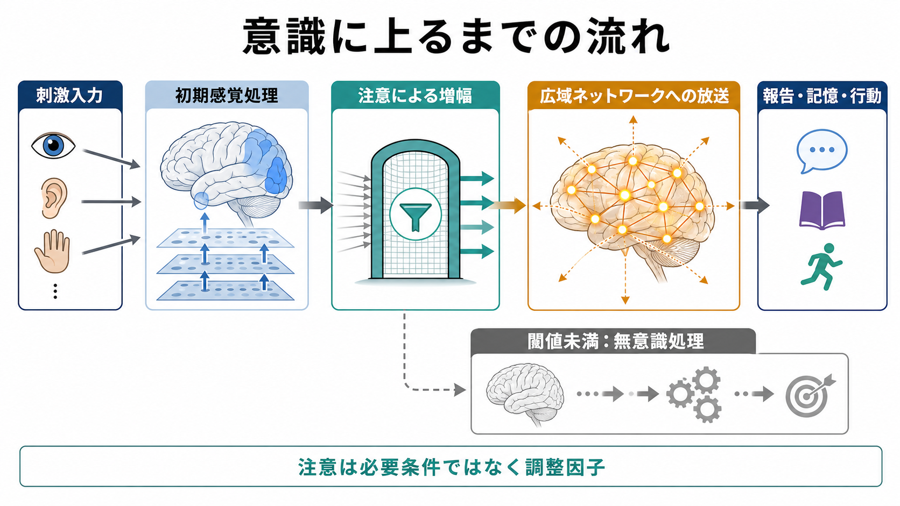
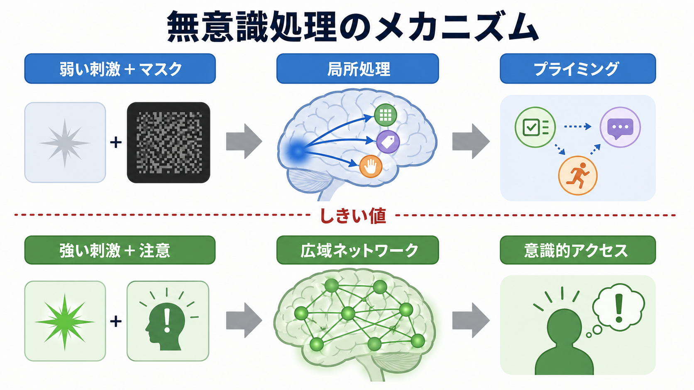
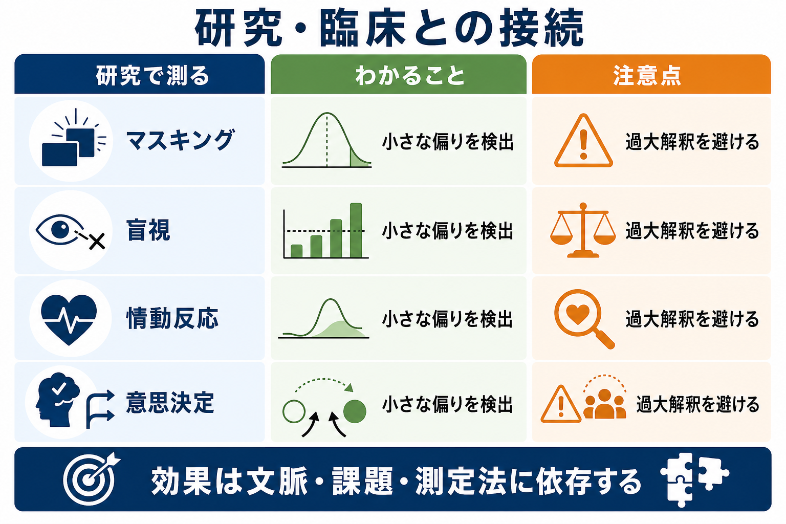

# 無意識処理とは何か

## 要点

- 無意識処理とは、刺激や情報が主観的には気づかれない、または報告できない状態でも、知覚、反応時間、情動反応、選択、記憶、判断に影響する処理を指す。
- 典型例は、短時間提示された刺激をマスクで見えにくくしても後続反応が変わるプライミング、一次視覚野損傷後に「見えない」と報告しながら刺激位置を当てられる盲視、注意外の情動刺激への扁桃体反応などである [1][4][5][6]。
- 無意識処理は「何でもできる隠れた知性」ではない。効果の多くは小さく、課題、刺激強度、注意、測定法、反応バイアスに強く依存する [2][7][8]。
- [[意識とは何か]]と対比すると、無意識処理は局所的・一時的・課題依存的な処理にとどまりやすく、意識的アクセスは報告、保持、柔軟な利用、広域ネットワークへの放送と結びつきやすい [3]。

## この記事で答える問い

1. 無意識処理は、単に「気づいていない」ことと同じなのか。
2. 意識されない刺激は、どの程度まで知覚・意味・情動・行動に影響するのか。
3. なぜある情報は意識に上り、別の情報は無意識処理にとどまるのか。
4. 研究や臨床で「無意識」を扱うとき、どのような過大解釈を避けるべきか。

## まず結論

無意識処理とは、「本人が見た・聞いた・考えたと報告できない情報が、脳内では一定程度処理され、後の反応を変えること」である。たとえば、画面に一瞬だけ提示された単語や数字がマスクで隠され、参加者が「見えなかった」と答えても、次の判断やボタン押しの速さがわずかに変わることがある [1][4]。

ただし、ここで重要なのは「報告できない」と「完全に処理されていない」は同じではない、という点である。脳は刺激を段階的に処理する。初期視覚処理、特徴抽出、価値づけ、運動準備、情動反応の一部は、明瞭な主観的経験を伴わずに起こりうる [1][5][6]。一方で、その情報を言語化し、[[ワーキングメモリとは何か|ワーキングメモリ]]に保持し、複数の課題で柔軟に使うには、意識的アクセスが関わりやすい [3]。

したがって、無意識処理は「意識の下に万能な司令塔がある」という話ではない。むしろ、刺激の強さ、注意、予測、課題設定、測定方法の条件がそろったときに観察される、限定的だが実在する処理の集合である [2][7][8]。

## 背景

日常語の「無意識」は、フロイト的な心の深層、習慣、直感、ぼんやりした気分、気づかない偏りなどを広く含む。しかし認知科学や神経科学でいう無意識処理は、もう少し狭く定義される。中心にあるのは、「本人の主観的報告では刺激が意識されていないが、行動指標や神経指標には刺激の影響が残るか」という実験的な問いである。

この問いを扱う代表的な方法が、視覚マスキングである。標的刺激を数十ミリ秒だけ提示し、直後に別の刺激を重ねると、参加者は標的を見たと報告できなくなることがある。それでも、標的が後続刺激の読みやすさ、分類、反応時間に影響すれば、標的は何らかの水準で処理されていたと考えられる [1][4]。

もう一つの背景は、[[知覚とは何か|知覚]]と行動が常に同じ経路で支えられているわけではないという発見である。視覚には、対象の同定に関わる腹側経路と、把持や到達運動に関わる背側経路があり、見えている経験と運動制御が解離することがある [6]。この視点は、無意識処理を「見えていないのに当てられる」「気づいていないのに反応が変わる」という現象として理解する土台になる。

## 基本概念

### 意識されない刺激

「意識されない刺激」とは、刺激が物理的に存在し、感覚器や脳に入力されているにもかかわらず、本人がそれを明瞭に経験したり報告したりできない刺激である。典型例には、マスクされた単語、注意を向けていない顔表情、視野欠損領域の視覚刺激、閾値近傍の音や光がある。

ただし、意識の有無は二分法だけでは測れない。本人の「見えた」という主観報告、強制選択課題での正答率、反応時間、脳活動は、それぞれ異なる側面を測っている。主観的には見えないのに強制選択では偶然以上に当たる場合もあれば、反応時間だけが変わる場合もある [1][7]。

### 無意識処理と注意

無意識処理は、[[注意とは何か|注意]]が不要であることを意味しない。注意は、刺激処理を増幅したり、どの情報が意識的アクセスへ進むかを調整したりする。注意されていない刺激が処理されることはあるが、注意は無意識処理の強さや範囲を大きく変える [3][7]。

このため、「注意されない情報」と「意識されない情報」は重なるが同じではない。注意されていても意識に上らない刺激があり、注意されていなくても後で意識される刺激がある。実験では、注意、覚醒、報告可能性、刺激強度を分けて測る必要がある。

### プライミング

プライミングとは、先行刺激が後続の知覚・判断・反応を変える現象である。無意識プライミングでは、先行刺激が報告できないほど短く、またはマスクされていても、後続刺激への反応が速くなったり遅くなったりする [1][4]。

たとえば、先行刺激が「左」を示す情報を含み、後続課題で左ボタンを押す必要があると、反応が速くなることがある。ただし、この効果は刺激の意味が自動的に深く理解されたからとは限らない。課題で準備された反応ルールや、刺激と反応の対応関係が影響することがある [4]。

## 仕組み

### 局所処理と意識的アクセス

無意識処理の基本的な考え方は、刺激処理が段階的に進むというものである。弱い刺激やマスクされた刺激でも、初期感覚野や関連する局所ネットワークは反応することがある。しかし、その活動が十分に強く、注意や課題目標と結びつき、前頭・頭頂を含む広域ネットワークに広がると、報告可能な意識的アクセスが生じやすくなる [3]。

グローバル・ニューロナル・ワークスペース仮説では、意識的アクセスを「情報が複数の脳システムで利用可能になる状態」と捉える。局所的な処理は無意識にとどまりうるが、ある閾値を超えて広域に放送されると、言語報告、記憶更新、計画、[[意思決定とは何か|意思決定]]に使いやすくなる [3]。

### 視覚マスキング

視覚マスキングでは、標的刺激の前後に別の刺激を提示して、標的の意識的知覚を妨げる。Kouider と Dehaene のレビューは、マスクされた刺激でも、低次の形態処理だけでなく、語彙・意味・数の処理に影響する場合があることを整理している [1]。

ただし、処理の深さには限界がある。無意識刺激の影響は、短時間で消えやすく、文脈や課題目標に依存し、複雑で新しい推論には届きにくい。したがって、無意識処理を評価するときは、「どの水準の処理が、どの指標で、どの程度示されたのか」を分けて読む必要がある。

### 盲視と行動の視覚

盲視は、一次視覚野の損傷などにより「見えない」と報告される視野領域で、刺激の位置や動きに対する強制選択が偶然以上に当たる現象である。これは、主観的な視覚経験がない場合でも、視覚情報が行動選択に利用されうることを示す代表例である。

Goodale と Milner の視覚二経路モデルは、対象を「何であるか」として認識する経路と、行為を制御する経路が部分的に分かれることを示した [6]。盲視や視覚性運動制御の研究は、[[視覚認知はどのように対象を認識するのか|視覚認知]]を意識的経験だけで説明できないことを教えてくれる。

### 情動反応

情動刺激も、意識的報告なしに処理されることがある。マスクされた恐怖表情が扁桃体活動を変えることを示した研究や、情動刺激の注意・意識非依存性に関するレビューは、情動処理の一部が比較的自動的に進む可能性を示している [5][7]。

ただし、ここでも「完全に自動」という表現は慎重に使うべきである。Pessoa のレビューは、情動刺激への反応にも注意、課題、個人差、刺激条件が影響することを強調している [7]。したがって、[[情動と認知は分けられるのか|情動と認知]]の関係を考えるとき、無意識情動処理を「理性をすり抜ける固定反応」とみなすのは単純化しすぎである。

### 意思決定への影響

無意識処理は、[[直感と熟慮はどう違うのか|直感]]や判断にも関わる。しかし、「無意識は複雑な意思決定を意識よりうまく行う」といった強い主張は、再現性や測定法の問題を抱えることがある。Newell と Shanks は、意思決定における無意識影響の研究を批判的に検討し、意識の測定不足、反応バイアス、結果の過大解釈に注意を促している [8]。

ここから得られる実用的な結論は、無意識処理を否定することではない。むしろ、無意識の影響は「小さな偏り」「反応準備」「選択肢への重みづけ」として現れやすく、それを「隠れた合理的意思決定者」として擬人化しないことが重要である。

## 図解

| 図 | 読み方 | 対応する本文 |
|---|---|---|
| 無意識処理が意識に上るまでの流れ | 刺激入力、初期感覚処理、注意による増幅、広域ネットワーク、報告・記憶・行動への流れを見る | まず結論、仕組み |
| 無意識処理のメカニズム | 弱い刺激は局所処理とプライミングにとどまり、強い刺激と注意がそろうと意識的アクセスへ進む | 局所処理と意識的アクセス |
| 研究・臨床との接続 | マスキング、盲視、情動反応、意思決定を「測れること」と「注意点」に分ける | 臨床・研究との接続 |

## 臨床・研究との接続

無意識処理の研究は、臨床診断そのものではなく、研究上の概念整理として役立つ。たとえば、意識障害、視野障害、解離、外傷後ストレス、強迫、不安、依存、疼痛などでは、本人が明確に言語化できない反応や回避が問題になることがある。そこに無意識処理の概念を使うと、「本人が説明できない反応にも、学習、情動、注意、身体状態の寄与がありうる」と考えやすくなる。

しかし、個別の症状を「無意識が原因」と断定するのは避けるべきである。臨床場面では、報告できないこと、言語化しにくいこと、記憶が曖昧なこと、注意が向かないこと、防衛的に語らないこと、神経学的に処理されないことが混ざりうる。無意識処理は教育・研究上の説明概念であり、個別診断や治療指示そのものではない。

研究では、無意識処理を主張するために、少なくとも次の点を確認する必要がある。第一に、刺激が本当に意識されていないかを主観報告だけでなく強制選択などで測ること。第二に、反応時間や正答率の差が反応バイアスや閾値近傍の弱い知覚で説明できないかを検討すること。第三に、効果量、再現性、課題依存性を明示すること [1][7][8]。

## よくある誤解

### 誤解1: 無意識処理は「見えていないのに完全に理解している」ことである

無意識処理は、完全な理解を意味しない。マスクされた単語や数字が意味処理に影響する場合はあるが、その影響は短時間で、課題依存的で、意識的に読んだ場合より限定されることが多い [1]。

### 誤解2: 無意識は意識より賢い

無意識処理は、速く、局所的で、反応準備に関わることがある。しかし、複雑な比較、理由づけ、長期計画、矛盾の検討には、意識的アクセス、[[実行機能とは何か|実行機能]]、[[メタ認知とは何か|メタ認知]]が重要になる。意思決定研究では、無意識の力を過大評価する解釈に批判がある [8]。

### 誤解3: 無意識処理は注意と無関係である

注意は、無意識処理と意識的処理の両方に影響する。注意がなくても処理される刺激はあるが、注意は処理の強さ、持続時間、行動への影響を変える [3][7]。

### 誤解4: 脳活動があれば意識がある

脳活動があることと、意識的経験があることは同じではない。刺激に対する局所的な脳活動、反応準備、扁桃体反応は、必ずしも本人がその刺激を経験していることを意味しない。意識の研究では、主観報告、行動、神経活動を組み合わせて慎重に推論する必要がある [3][5]。

## 関連ノート

### 既存ノート

- [[意識とは何か]]
- [[注意とは何か]]
- [[知覚とは何か]]
- [[視覚認知はどのように対象を認識するのか]]
- [[意思決定とは何か]]
- [[直感と熟慮はどう違うのか]]
- [[情動と認知は分けられるのか]]
- [[ワーキングメモリとは何か]]
- [[実行機能とは何か]]
- [[メタ認知とは何か]]

### 今後の作成候補

- プライミングとは何か
- 視覚マスキングとは何か
- 盲視とは何か
- グローバル・ニューロナル・ワークスペース理論とは何か
- 意識的アクセスとは何か
- 情動刺激は無意識に処理されるのか

### MOC 更新候補

- `content/00_MOC/MOC｜認知科学・心理学.md`
- `content/00_MOC/MOC｜脳・神経科学.md`

## 理解チェック

1. 無意識処理を示すには、「本人が見えなかったと言った」だけで十分だろうか。
2. 視覚マスキング研究で、反応時間が変わることは何を示し、何を示さないか。
3. 局所処理と意識的アクセスは、どのように区別できるか。
4. 情動刺激への扁桃体反応を「完全に自動」と言い切ることに、どのような問題があるか。
5. 意思決定における無意識の影響を議論するとき、なぜ反応バイアスや測定法を確認する必要があるか。

## 未解決問題

- 無意識処理の「深さ」を、知覚、意味、情動、行動準備、推論の各段階でどのように比較すべきか。
- 主観報告、強制選択、反応時間、脳活動の不一致を、どのようなモデルで統合すべきか。
- 無意識処理と意識的アクセスの境界は、連続的な閾値なのか、質的な相転移に近いのか。
- 臨床場面で、言語化しにくい反応を研究知見と結びつける際、どこまで一般化できるか。

## 参考文献

[1] Kouider, S., & Dehaene, S. (2007). Levels of processing during non-conscious perception: A critical review of visual masking. *Philosophical Transactions of the Royal Society B: Biological Sciences*, 362(1481), 857-875. https://doi.org/10.1098/rstb.2007.2093

[2] Hesselmann, G., & Moors, P. (2015). Definitely maybe: can unconscious processes perform the same functions as conscious processes? *Frontiers in Psychology*, 6, 584. https://doi.org/10.3389/fpsyg.2015.00584

[3] Dehaene, S., & Changeux, J.-P. (2011). Experimental and theoretical approaches to conscious processing. *Neuron*, 70(2), 200-227. https://doi.org/10.1016/j.neuron.2011.03.018

[4] Kunde, W., Kiesel, A., & Hoffmann, J. (2003). Conscious control over the content of unconscious cognition. *Cognition*, 88(2), 223-242. https://doi.org/10.1016/S0010-0277(03)00023-4

[5] Whalen, P. J., Rauch, S. L., Etcoff, N. L., McInerney, S. C., Lee, M. B., & Jenike, M. A. (1998). Masked presentations of emotional facial expressions modulate amygdala activity without explicit knowledge. *The Journal of Neuroscience*, 18(1), 411-418. https://doi.org/10.1523/JNEUROSCI.18-01-00411.1998

[6] Goodale, M. A., & Milner, A. D. (1992). Separate visual pathways for perception and action. *Trends in Neurosciences*, 15(1), 20-25. https://doi.org/10.1016/0166-2236(92)90344-8

[7] Pessoa, L. (2005). To what extent are emotional visual stimuli processed without attention and awareness? *Current Opinion in Neurobiology*, 15(2), 188-196. https://doi.org/10.1016/j.conb.2005.03.002

[8] Newell, B. R., & Shanks, D. R. (2014). Unconscious influences on decision making: A critical review. *Behavioral and Brain Sciences*, 37(1), 1-19. https://doi.org/10.1017/S0140525X12003214
