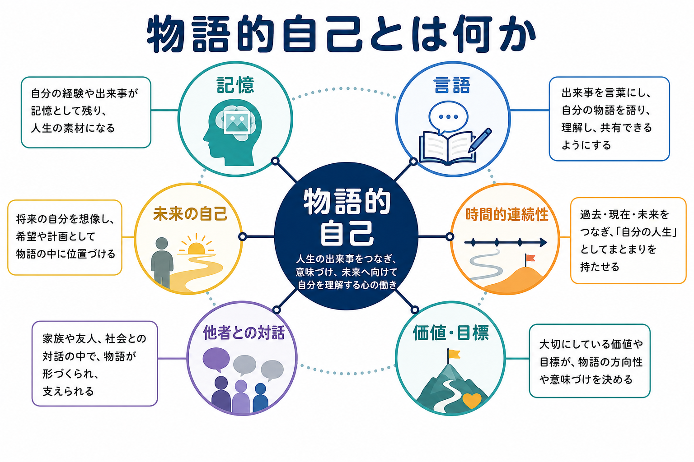
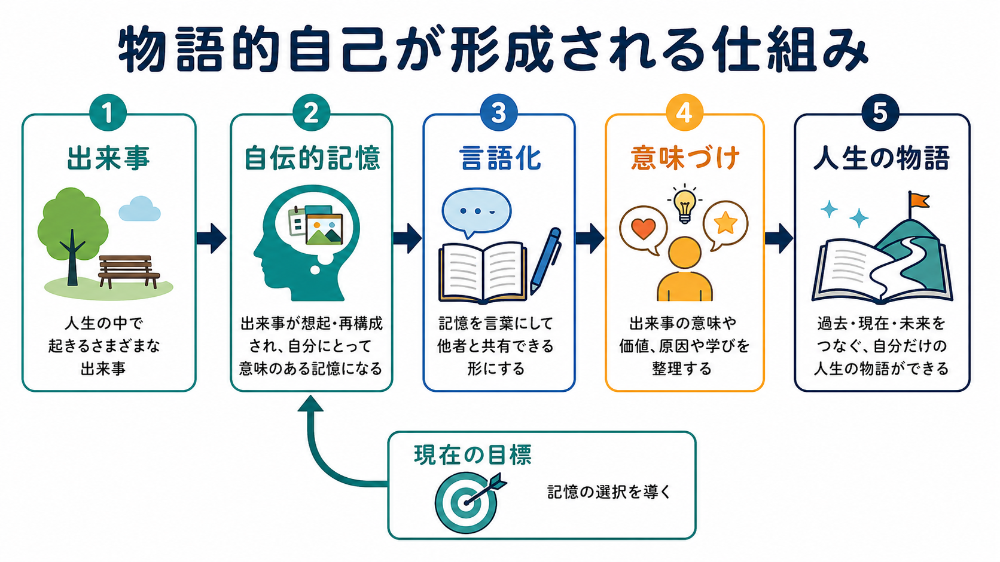
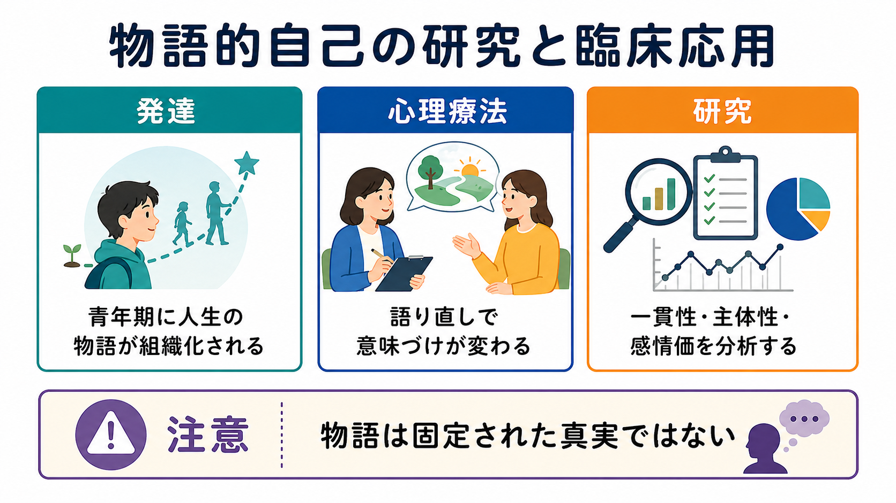

# 物語的自己とは何か

## 要点

- 物語的自己とは、「私はどのような人生を生きてきて、どこへ向かっているのか」という人生の物語として組織された自己理解である。
- これは単なる記憶の集まりではなく、[[エピソード記憶とは何か]]、[[意味記憶とは何か]]、言語、文化的な語り方、現在の目標が結びついて作られる。
- 哲学・認知科学では、瞬間ごとの主体感や身体所有感に近い「ミニマル自己」と、時間的連続性をもつ「物語的自己」が区別される [1]。
- 発達的には、人生全体を時間的・因果的・主題的にまとめる力は、児童期から準備され、青年期から成人初期にかけて強く組織化される [2][3]。
- 臨床的には、物語の一貫性、主体性、他者とのつながり、苦痛の意味づけが、心理的適応や精神疾患の理解に関わる。ただし、物語を「正しい過去の記録」とみなすのは誤りである [4][5][6]。

## この記事で答える問い

1. 物語的自己は、記憶・言語・アイデンティティとどう関係するのか。
2. 「今ここで経験している自己」と「人生の物語としての自己」は何が違うのか。
3. 物語的自己はどのように形成され、なぜ青年期以降に重要になるのか。
4. 心理療法や精神疾患研究では、物語的自己をどのように扱うのか。

## まず結論

物語的自己は、過去の出来事をそのまま保存した「内なる自伝」ではない。むしろ、現在の関心、将来の見通し、他者との対話、文化的な語りの型を使って、自己に時間的なまとまりを与える構成的なプロセスである。

McAdams と McLean は、ナラティブ・アイデンティティを「内面化され、発展し続ける人生の物語」として整理した。この物語は、再構成された過去と想像された未来を結び、人生に一定の統一性と目的を与える [4]。この定義は、物語的自己を「記憶の内容」だけでなく、「どの出来事を選び、どう意味づけ、どのような自己像へ統合するか」という働きとして見る点で重要である。

## 背景

自己は一枚岩ではない。認知科学では、身体を動かしている感じ、行為の主体である感じ、身体が自分のものである感じ、他者から見られる自己、長期的な自己像など、複数のレベルを分けて考える。Gallagher は、とくにミニマル自己と物語的自己を区別した。ミニマル自己は、時間的に厚い人生史をもたない「今この経験が私のものだ」という感覚に近い。一方、物語的自己は、個人の同一性と時間的連続性に関わる [1]。

この区別は、[[意識とは何か]]や身体性の議論ともつながる。たとえば、痛みを「今、私が感じている」と経験することと、「この病気を経験したことで私は人生をどう理解するようになったか」と語ることは、どちらも自己に関わるが、同じ水準ではない。前者は体験の所有感に近く、後者は記憶・言語・意味づけを通した自己理解である。

哲学的には、Ricoeur が「物語的アイデンティティ」という考え方を通じて、自己同一性を単なる不変性ではなく、変化しながら約束・責任・行為の連続性を保つものとして論じた [7]。心理学の文脈では、McAdams らのライフストーリー・モデルが、この発想を発達・人格・文化・自伝的記憶の研究へ接続した [4]。

## 基本概念

### 物語的自己

物語的自己とは、自分の人生を出来事の羅列ではなく、始まり、転機、葛藤、達成、喪失、関係性、将来像を含む物語として理解する働きである。ここでいう「物語」は、必ずしも小説のように整った文章を意味しない。断片的な記憶、繰り返し語られるエピソード、家族や友人から聞いた話、文化的な人生観、将来への期待が、ゆるやかに結びついた自己理解を指す。

たとえば「自分は昔から人前で話すのが苦手だったが、ある経験をきっかけに少しずつ変わった」という理解は、個別の記憶を越えて、過去・現在・未来をつなぐ自己の筋書きを作っている。この筋書きが、選択、感情、対人関係、困難への対処に影響する。

### ナラティブ・アイデンティティ

ナラティブ・アイデンティティは、物語的自己を人格心理学・発達心理学の研究対象として扱うときによく使われる用語である。McAdams と McLean は、人生物語の中に、主体性、他者との結びつき、贖罪的意味づけ、汚染的意味づけ、探索、統合的意味づけなどのテーマが現れると整理している [4]。

ここで重要なのは、物語の内容が「明るい」か「暗い」かだけではない。苦痛の経験があっても、それをどのように位置づけるか、そこにどの程度の主体性や他者とのつながりを見いだすか、出来事同士がどの程度まとまっているかが、自己理解や心理的適応と関わる [4][5]。

### 自伝的記憶

物語的自己の材料になるのが自伝的記憶である。Conway と Pleydell-Pearce の自己記憶システムでは、自伝的記憶は固定された記録ではなく、現在の目標をもつ「作業自己」と、自伝的知識基盤が相互作用して構成される [2]。この見方では、想起は単なる再生ではなく、手がかり、現在の関心、自己像に応じて作られる一時的な心的構成である。

そのため、物語的自己は[[エピソード記憶とは何か]]だけでなく、[[意味記憶とは何か]]にも支えられる。具体的な「ある日の出来事」と、「私はこういう家庭で育った」「自分は対人場面で慎重になりやすい」といった一般化された自己知識が組み合わさるからである。

## 仕組み

### 1. 出来事が記憶として残る

人生の出来事は、すべてが同じ強さで記憶されるわけではない。感情的に強い出来事、繰り返し語られた出来事、現在の目標に関係する出来事は、自己理解の材料になりやすい。Singer らは、自己定義的記憶が長期的な関心や人生のテーマと結びつき、ライフストーリーの中核になりうると述べている [5]。

### 2. 言語化によって出来事が共有可能になる

物語的自己は、[[言語理解はどのように行われるのか]]と[[言語産出はどのように行われるのか]]に深く依存する。出来事を言葉にすると、「何が起きたか」だけでなく、「なぜ重要だったのか」「自分はそこで何を学んだのか」「誰との関係が変わったのか」を整理できる。

ただし、言語化は記憶をそのまま写す作業ではない。語る相手、場面、文化的な語りの型によって、強調される点は変わる。家族に話す物語、面接で語る物語、日記に書く物語、研究参加者として語る物語は、同じ出来事を扱っていても同一ではない。

### 3. 時間的・因果的・主題的な一貫性が作られる

Habermas と Bluck は、人生物語には少なくとも時間的、伝記的、因果的、主題的なまとまりが関わると論じた [3]。時間的まとまりは「いつ、どの順番で起きたか」、因果的まとまりは「なぜそれが次の変化につながったのか」、主題的まとまりは「そこにどのような繰り返しのテーマがあるのか」に関わる。

この一貫性は、幼児期から完成しているわけではない。児童期には個別の出来事を語る能力が発達し、青年期以降に「人生全体をどう理解するか」という大きな物語が組織化されやすくなる [3]。進学、職業選択、親密な関係、価値観の選択が増える時期に、自己を時間的にまとめる必要が高まるからである。

### 4. 現在の自己が過去の意味を選び直す

物語的自己は、過去から現在へ一方向に作られるだけではない。現在の目標や悩みが、どの記憶を思い出すか、どのように意味づけるかを変える。Conway らのモデルでは、作業自己が自伝的知識へのアクセスを調整する [2]。つまり、「今の自分」が「過去の自分」を選び直す。

この性質は、心理療法やリカバリーの理解に重要である。過去の事実を変えることはできないが、出来事をどのような関係の中に置くか、そこからどのような未来を想像するかは変化しうる。

### 5. 脳ネットワークとしては自己関連処理と重なる

物語的自己を単一の脳部位に対応させることはできない。自伝的記憶、将来シミュレーション、他者視点、自己関連判断には、内側前頭前野、後部帯状皮質、楔前部、内側側頭葉などを含むネットワークが関わる。これは[[デフォルトモードネットワークとは何か]]として論じられる領域群と重なる。

ただし、「デフォルトモードネットワークが物語的自己である」と短絡してはいけない。脳ネットワークは材料や処理基盤を支えるが、物語的自己は記憶、言語、文化、対人関係、発達課題を含む心理社会的な構成物でもある。

## 図解

| 図 | 読み方 | 対応する内容 |
|---|---|---|
| 概念地図 | 物語的自己を、記憶・言語・時間的連続性・価値・他者・未来の自己の結節点として読む | 要点、基本概念 |
| 形成メカニズム | 出来事が自伝的記憶となり、言語化と意味づけを経て人生の物語へ統合される流れを見る | 仕組み |
| 研究・臨床接続 | 発達、心理療法、精神疾患研究でどの側面が扱われるかを比較する | 臨床・研究との接続 |

## 臨床・研究との接続

### 心理療法

心理療法では、出来事の事実確認だけでなく、その人が出来事をどのような物語として生きているかが重要になる。Adler の縦断研究では、心理療法の過程で語りの主体性や一貫性が変化し、精神健康の変化と関係することが示された [6]。これは、治療が単に症状を減らすだけでなく、「自分は何を経験し、どのように変わりうるのか」という自己理解の再構成に関わる可能性を示す。

ただし、臨床で物語を扱うことは、「つらい出来事には必ず意味がある」と押しつけることではない。苦痛の意味づけは、本人の速度と安全感に依存する。臨床者が先回りして肯定的な物語を作ると、かえって経験の複雑さを消してしまう。

### 精神疾患研究

精神疾患では、自己の連続性、主体性、他者との関係、将来像が揺らぐことがある。精神病スペクトラムに関するシステマティックレビューでは、物語的アイデンティティの困難として、構造の断片化、苦痛への焦点化、距離を置いた語りが整理されている [8]。これは、症状を脳機能や認知機能だけでなく、人生史のまとまりの困難としても理解する視点を与える。

一方で、物語的自己の研究は診断の代替ではない。ある人の語りが断片的であることだけから、特定の精神疾患を判断することはできない。臨床では、症状、生活機能、文化的背景、トラウマ歴、対人関係、身体疾患などを含めて慎重に評価する必要がある。

### 研究方法

研究では、人生物語インタビュー、自己定義的記憶課題、転機の語り、日記、語りのコーディングなどが使われる。分析されるのは、出来事の正確性だけではない。主体性、共同性、感情価、救済的展開、汚染的展開、因果的説明、一貫性、探索の有無などが評価される [4][5]。

この領域の難しさは、語りが測定場面に依存する点である。研究者の質問、文化、言語、語る相手との関係が、語りの内容を変える。したがって、物語的自己を研究するときは、語りを「内面の直接コピー」とみなさず、相互行為の中で生成されるデータとして扱う必要がある。

## よくある誤解

### 誤解1: 物語的自己は作り話である

物語的自己は構成されるが、だからといって虚構という意味ではない。記憶は再構成的であり、語りは状況に応じて変わる。それでも、そこには本人がどのように経験を理解し、価値づけ、未来へつなげているかが表れる。

### 誤解2: 一貫した物語を持つほどよい

一貫性は適応に役立つことがあるが、強すぎる一貫性は別の問題を生むこともある。たとえば「自分はいつも失敗する人間だ」という物語は一貫しているが、柔軟性を失わせる。重要なのは、出来事の複雑さを保ちながら、変化可能な自己理解を持てるかである。

### 誤解3: 過去を語り直せば必ず回復する

語り直しは有用なことがあるが、万能ではない。トラウマ、解離、重度の抑うつ、精神病症状、認知機能障害がある場合には、語ること自体が負担になることもある。教育・研究目的でこの概念を学ぶことと、個別の治療方針を決めることは分ける必要がある。

### 誤解4: 物語的自己は脳内の単一メカニズムで説明できる

物語的自己には脳基盤があるが、脳活動だけに還元できない。記憶、言語、社会的相互作用、文化的規範、発達課題が組み合わさっているからである。神経科学的説明と心理社会的説明は、競合するというより、異なる水準を扱っている。

## 関連ノート

### 既存ノート

- [[意識とは何か]]
- [[エピソード記憶とは何か]]
- [[意味記憶とは何か]]
- [[言語理解はどのように行われるのか]]
- [[言語産出はどのように行われるのか]]
- [[デフォルトモードネットワークとは何か]]

### 今後の作成候補

- 自己とは何か
- アイデンティティとは何か
- 自伝的記憶とは何か
- 自己概念とは何か
- 主体感とは何か
- 自己関連処理の脳ネットワークとは何か
- ナラティブ療法とは何か

### MOC 更新候補

- `content/00_MOC/MOC｜認知科学・心理学.md`
- 意識・自己・身体性カテゴリの索引

## 理解チェック

1. ミニマル自己と物語的自己は、時間的広がりの点でどう違うか。
2. 自伝的記憶が「過去の録画」ではなく「構成」だと言われる理由は何か。
3. 青年期に人生物語が組織化されやすいのはなぜか。
4. 心理療法で物語的自己を扱うとき、意味づけを押しつけてはいけない理由は何か。
5. 物語的自己を脳ネットワークだけに還元できない理由は何か。

## 未解決問題

- 物語の一貫性、柔軟性、複雑性のどの組み合わせが、どのような人にとって適応的なのか。
- 文化や言語が、人生物語の典型的な構造をどの程度変えるのか。
- 脳画像研究で測られる自己関連処理と、長期的な人生物語としての自己をどこまで対応づけられるのか。
- 精神疾患の治療で、物語的自己への介入が症状、生活機能、リカバリーにどの程度独自の効果を持つのか。

## 参考文献

[1] Gallagher, S. (2000). Philosophical conceptions of the self: Implications for cognitive science. *Trends in Cognitive Sciences*, 4(1), 14-21. https://doi.org/10.1016/S1364-6613(99)01417-5

[2] Conway, M. A., & Pleydell-Pearce, C. W. (2000). The construction of autobiographical memories in the self-memory system. *Psychological Review*, 107(2), 261-288. https://doi.org/10.1037/0033-295X.107.2.261

[3] Habermas, T., & Bluck, S. (2000). Getting a life: The emergence of the life story in adolescence. *Psychological Bulletin*, 126(5), 748-769. https://doi.org/10.1037/0033-2909.126.5.748

[4] McAdams, D. P., & McLean, K. C. (2013). Narrative identity. *Current Directions in Psychological Science*, 22(3), 233-238. https://doi.org/10.1177/0963721413475622

[5] Singer, J. A., Blagov, P., Berry, M., & Oost, K. M. (2013). Self-defining memories, scripts, and the life story: Narrative identity in personality and psychotherapy. *Journal of Personality*, 81(6), 569-582. https://doi.org/10.1111/jopy.12005

[6] Adler, J. M. (2012). Living into the story: Agency and coherence in a longitudinal study of narrative identity development and mental health over the course of psychotherapy. *Journal of Personality and Social Psychology*, 102(2), 367-389. https://doi.org/10.1037/a0025289

[7] Ricoeur, P. (1992). *Oneself as Another* (K. Blamey, Trans.). University of Chicago Press. https://press.uchicago.edu/ucp/books/book/chicago/O/bo3684737.html

[8] Cowan, H. R., Mittal, V. A., & McAdams, D. P. (2021). Narrative identity in the psychosis spectrum: A systematic review and developmental model. *Clinical Psychology Review*, 88, 102067. https://doi.org/10.1016/j.cpr.2021.102067
