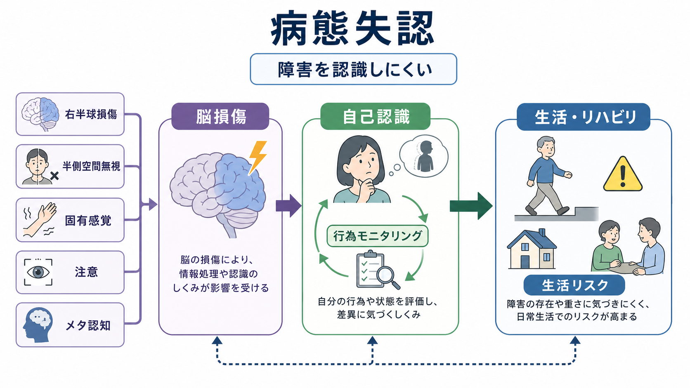
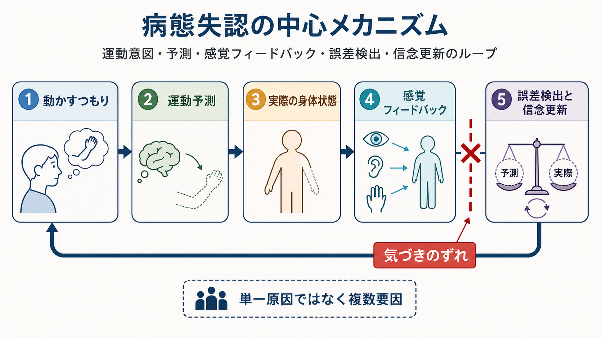
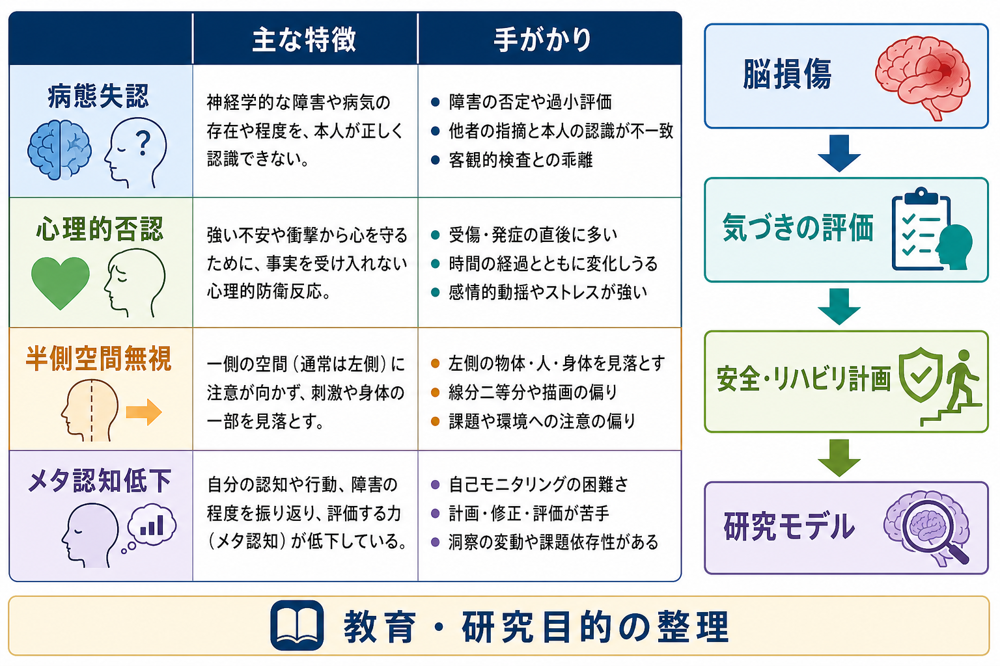

# 病態失認とは何か

## 要点

- 病態失認とは、脳損傷や神経疾患などによって生じた障害の存在や重さを、本人が十分に認識できない状態である。
- 典型例は、脳卒中後の片麻痺があるにもかかわらず「動かせる」と述べる病態失認、特に片麻痺に対する病態失認である[1][2]。
- これは単なる強がりや心理的否認ではなく、身体状態、感覚フィードバック、注意、空間表象、行為モニタリング、[[メタ認知とは何か|メタ認知]]が結びつく自己認識の障害として理解される[3][4]。
- 病態失認は、[[自己とは何か|自己]]が脳の中で一枚岩に表現されているのではなく、身体・行為・注意・信念更新の複数システムに支えられていることを示す。

## この記事で答える問い

1. 病態失認とは、どのような現象なのか。
2. なぜ「麻痺があるのに、麻痺を認めない」ことが起こりうるのか。
3. 病態失認は、自己認識、身体性、意識研究に何を教えるのか。
4. 心理的否認、半側空間無視、メタ認知低下とはどこが重なり、どこが異なるのか。

## まず結論

病態失認は、「見れば明らかな障害を本人が認めない」という奇妙な現象に見える。しかし、神経心理学的には、これは自己認識が単なる内省や言語的説明だけでできているわけではないことを示す重要な手がかりである。

たとえば片麻痺に対する病態失認では、本人は麻痺した腕を動かすつもりでいて、実際には動いていないにもかかわらず、「動かした」「問題ない」と答えることがある。ここでは、運動意図、予測、実際の身体状態、感覚フィードバック、誤差検出がうまく統合されていない可能性がある[5]。そのため、病態失認は[[最小自己とは何か|最小自己]]や身体所有感、行為主体感、[[意識とは何か|意識]]の自己的側面を考えるうえで重要である。

## 背景

病態失認という概念は、Joseph Babinski が1914年に、右半球脳卒中後の左片麻痺を本人が認識していない患者を報告したことにさかのぼる[1]。英語では anosognosia と呼ばれ、語源的には「病気を知らないこと」に近い意味をもつ。

現在では、病態失認は片麻痺だけでなく、半盲、記憶障害、失語、認知症、外傷性脳損傷、精神疾患における病識低下など、広い現象と関連づけて議論される。ただし、この記事では、神経心理学的に研究が進んでいる脳卒中後の運動障害、特に片麻痺に対する病態失認を中心に扱う。

重要なのは、病態失認が「本人が嘘をついている」「受け入れたくないだけ」とは限らない点である。古典的研究では、右半球損傷後の運動障害や視野障害への気づきの低下が、基本的な感覚・運動障害や半側空間無視から二重乖離しうることが示され、より高次の制御・自己評価機能の問題として議論されてきた[2]。

## 基本概念

病態失認は、障害そのものと、その障害への気づきが分離する現象である。腕が動かないこと、視野の一部が欠けていること、記憶が低下していることは、外部観察や検査では確認できる。それでも本人の報告や行動では、その障害がないかのように扱われる。

片麻痺に対する病態失認では、しばしば次のような特徴が見られる。

| 側面 | 例 | 読み取り方 |
|---|---|---|
| 明示的な気づき | 「左腕は動きます」と答える | 言語報告上の障害認識が低い |
| 行為の評価 | 実際には挙がっていない腕を「挙げた」と述べる | 運動意図と結果の照合が弱い |
| 日常生活 | 立ち上がりや歩行の危険を過小評価する | 安全判断やリハビリ参加に影響する |
| 感情面 | 障害に無関心に見える | 失認、無関心、心理的防衛の区別が必要 |

ただし、病態失認は全か無かではない。ある質問には気づきを示すが、別の場面では過小評価することがある。明示的には否認していても、反応時間や選択行動には暗黙の気づきが残る場合もある[6]。したがって、単に「病識あり／なし」と分けるより、何に、どの程度、どの状況で気づけているかを見る必要がある。

## 仕組み

病態失認の仕組みは単一ではない。系統的レビューは、片麻痺に対する病態失認を、感覚障害、空間無視、注意障害、遂行機能、情動、身体表象、運動予測が組み合わさる多面的現象として整理している[3]。

中心的な考え方の一つは、行為モニタリングの障害である。通常、私たちは「動かそうとする意図」と「動いた結果」を照合している。腕を挙げようとすると、脳は運動指令の予測を作り、視覚、固有感覚、触覚などのフィードバックと照らし合わせる。結果が予測とずれれば、「動いていない」「うまくいかなかった」と気づき、次の行動を修正する。

病態失認では、このループのどこかが損なわれる。運動予測が強く残りすぎる、麻痺した身体からの固有感覚が乏しい、左側空間や左半身への[[注意とは何か|注意]]が向きにくい、誤差を自己の状態として更新できない、といった要因が重なる。Vocat らの前向き研究では、右半球脳卒中後の片麻痺患者において、発症3日では病態失認が32%、1週では18%、6か月では5%に低下し、時期によって固有感覚障害、空間無視、見当識障害との関係が変化することが示された[4]。

病変部位についても、単一の「病態失認中枢」を想定するより、島皮質、内包、運動前野、前部帯状皮質、側頭頭頂接合部、前頭葉を含むネットワークとして考える方が妥当である。右半球損傷で多く報告されるが、左半球損傷後の運動障害に対する病態失認も報告されており、右半球だけの専属機能と決めつけることはできない[7]。

この意味で、病態失認は[[体性感覚ネットワークは身体情報をどう表現するのか|体性感覚ネットワーク]]、[[運動ネットワークは随意運動をどう生み出すのか|運動ネットワーク]]、[[脳内ネットワークとは何か|脳内ネットワーク]]を、自己認識の観点からつなぐ現象である。

## 図解

図1は、病態失認を「脳損傷があるから気づけない」という単線的な説明ではなく、身体情報、注意、メタ認知、生活上のリスクがつながる現象としてまとめている。

図2は、運動意図、予測、感覚フィードバック、誤差検出、信念更新のループを示している。病態失認では、本人の「動かしたつもり」と客観的な身体状態のずれが、十分に自己の状態として更新されないことがある。

図3は、病態失認を心理的否認、半側空間無視、メタ認知低下と比較し、研究・臨床評価への接続を整理している。実際の評価では、これらが重なりうるため、ひとつのラベルだけで説明しないことが重要である。

## 臨床・研究との接続

臨床的には、病態失認は安全管理、リハビリテーション、家族支援に関わる。障害の存在や重さを本人が過小評価すると、転倒、無理な歩行、服薬・訓練への不参加、介助拒否が起こりやすい。レビューでは、病態失認がリハビリテーションや予後に影響しうることが指摘されている[8]。ただし、この記事は教育・研究目的の整理であり、個別の診断や治療方針は専門職の評価に基づく必要がある。

研究上は、病態失認は自己認識を分解するための自然実験になる。通常、私たちは自分の身体状態をかなり自然に知っているように感じる。しかし病態失認は、「自分の身体を知っている」という感覚が、視覚、固有感覚、行為予測、注意、記憶、他者からのフィードバックの統合に依存していることを示す。

また、病態失認は[[高次表象理論とは何か|高次表象理論]]やメタ認知研究とも接続する。障害そのものが一次的な身体状態だとすれば、「自分には障害がある」と評価する過程は高次の自己表象に近い。病態失認では、一次障害と高次の自己評価がずれるため、意識経験、自己報告、行為制御を区別して考えやすくなる。

## よくある誤解

### 誤解1: 病態失認は嘘や演技である

病態失認では、本人が意図的に隠しているとは限らない。古典的報告でも、麻痺が周囲に明らかな状況で否認が続くことが問題にされた[1]。もちろん、心理的反応や対人状況が関与する場合はあるが、神経心理学的には、脳損傷後の自己モニタリング障害として検討する必要がある。

### 誤解2: 病態失認は心理的否認と同じである

心理的否認は、不安や衝撃から自己を守る防衛反応として理解される。一方、病態失認は脳損傷に伴う障害認識の低下として記述される。両者は見かけ上似ることがあるが、検査所見、病変、感覚・注意障害、時間経過、行動上の一貫性を見て区別する必要がある。

### 誤解3: 半側空間無視があれば病態失認も必ず起こる

半側空間無視と病態失認はしばしば併存するが、同じものではない。Bisiach らは、運動障害や視野障害への気づきの低下が、より基本的な神経障害や無視から二重乖離しうることを報告した[2]。つまり、左側を見落とすことと、自分の障害を認識できないことは重なりながらも区別される。

### 誤解4: 本人に何度も説明すれば必ず気づく

説明やフィードバックが役立つ場合はあるが、病態失認は単なる知識不足ではない。感覚フィードバックや誤差検出が自己評価に統合されにくい場合、言葉だけの説明では十分でないことがある。安全な環境設定、多職種評価、段階的なフィードバックが必要になるが、具体的な介入は専門的判断に委ねられる。

## 関連ノート

- [[意識とは何か]]
- [[自己とは何か]]
- [[最小自己とは何か]]
- [[メタ認知とは何か]]
- [[注意とは何か]]
- [[体性感覚ネットワークは身体情報をどう表現するのか]]
- [[運動ネットワークは随意運動をどう生み出すのか]]
- [[脳内ネットワークとは何か]]
- [[MOC｜認知科学・心理学]]

MOC 更新候補: `content/00_MOC/MOC｜認知科学・心理学.md` の「意識・自己・身体性」配下に、本記事 `[[病態失認とは何か]]` を追加する候補。

今後の作成候補:

- 半側空間無視とは何か
- 身体所有感とは何か
- 行為主体感とは何か
- 病識とは何か
- 神経心理学とは何か

## 理解チェック

1. 病態失認が「心理的な否認」だけでは説明しにくいのはなぜか。
2. 片麻痺に対する病態失認では、運動意図、予測、感覚フィードバック、誤差検出のどこに問題が起こりうるか。
3. 半側空間無視と病態失認は、どの点で重なり、どの点で区別されるか。
4. 病態失認が自己認識の研究にとって重要なのはなぜか。

## 参考文献

[1] Babinski, J. (1914/2014). Contribution to the study of the mental disorders in hemiplegia of organic cerebral origin (anosognosia). Translated by K. G. Langer & D. N. Levine. *Cortex*, 61, 5-8. https://doi.org/10.1016/j.cortex.2014.04.019

[2] Bisiach, E., Vallar, G., Perani, D., Papagno, C., & Berti, A. (1986). Unawareness of disease following lesions of the right hemisphere: Anosognosia for hemiplegia and anosognosia for hemianopia. *Neuropsychologia*, 24(4), 471-482. https://doi.org/10.1016/0028-3932(86)90092-8

[3] Orfei, M. D., Robinson, R. G., Prigatano, G. P., Starkstein, S., Rüsch, N., Bria, P., Caltagirone, C., & Spalletta, G. (2007). Anosognosia for hemiplegia after stroke is a multifaceted phenomenon: A systematic review of the literature. *Brain*, 130(12), 3075-3090. https://doi.org/10.1093/brain/awm106

[4] Vocat, R., Staub, F., Stroppini, T., & Vuilleumier, P. (2010). Anosognosia for hemiplegia: A clinical-anatomical prospective study. *Brain*, 133(12), 3578-3597. https://doi.org/10.1093/brain/awq297

[5] Jenkinson, P. M., & Fotopoulou, A. (2010). Motor awareness in anosognosia for hemiplegia: Experiments at last! *Experimental Brain Research*, 204(3), 295-304. https://doi.org/10.1007/s00221-009-1929-8

[6] Fotopoulou, A., Pernigo, S., Maeda, R., Rudd, A., & Kopelman, M. A. (2010). Implicit awareness in anosognosia for hemiplegia: Unconscious interference without conscious re-representation. *Brain*, 133(12), 3564-3577. https://doi.org/10.1093/brain/awq233

[7] Simioni, M., Basilico, S., & Gandola, M. (2025). Anosognosia for motor deficits in patients with left hemisphere lesions: A systematic review. *Frontiers in Neurology*, 16, 1681303. https://doi.org/10.3389/fneur.2025.1681303

[8] Jenkinson, P. M., Preston, C., & Ellis, S. J. (2011). Unawareness after stroke: A review and practical guide to understanding, assessing, and managing anosognosia for hemiplegia. *Journal of Clinical and Experimental Neuropsychology*, 33(10), 1079-1093. https://doi.org/10.1080/13803395.2011.596822

## 未解決問題

- 病態失認の各サブタイプを、感覚障害、注意障害、情動、遂行機能、身体表象のどの組み合わせとして分類できるのか。
- 明示的な障害認識と暗黙の気づきは、どの神経回路で分かれるのか。
- 右半球優位性は、運動意識そのものの性質なのか、空間注意や身体表象の偏りを反映したものなのか。
- 病態失認への介入は、どの時期、どの評価指標、どの生活場面で効果を測るべきか。
