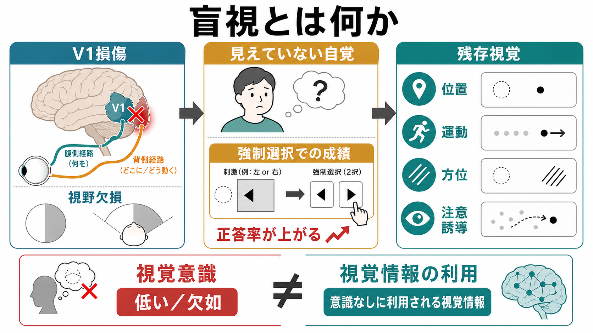
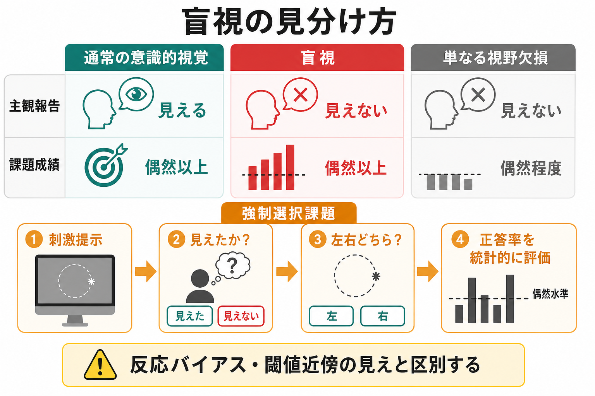
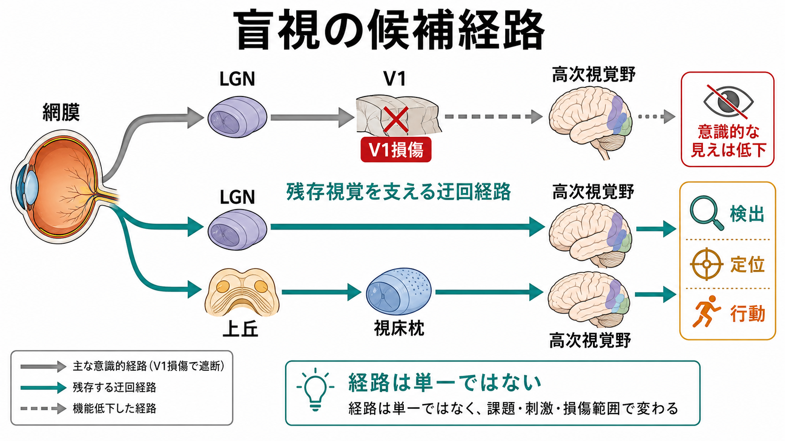

# 盲視とは何か

## 要点

- 盲視とは、一次視覚野（V1）損傷などで「見えていない」と報告される視野領域に刺激を出しても、強制選択課題では位置、運動、方位、単純な形などを偶然以上に判別できる現象である [1][2]。
- 重要なのは、視覚情報が完全に失われたのではなく、[[意識とは何か|意識的経験]]としてアクセスできないまま、行動や判断に利用される点である。
- 盲視は「無意識の視覚」の代表例として、無意識処理、[[注意と意識は同じものなのか]]、[[視覚認知はどのように対象を認識するのか]]を考える手がかりになる。
- ただし、盲視は単純な「V1を迂回する一本の経路」だけで説明できる現象ではない。LGN、上丘、視床枕、高次視覚野、残存皮質、課題条件が組み合わさる [6][7][8]。
- 臨床では、盲視そのものを診断名として扱うより、視野欠損、残存視覚、反応バイアス、閾値近傍の弱い見えを丁寧に区別する必要がある [4][6]。

## この記事で答える問い

1. 盲視は、通常の「視野欠損」や「気づきにくい見え」と何が違うのか。
2. なぜ、見えていないと報告するのに、刺激の位置や方向を当てられるのか。
3. 盲視は、[[視覚ネットワークはどのように階層的に情報処理するのか|視覚ネットワーク]]と意識研究に何を示すのか。
4. 盲視を研究・臨床で扱うとき、どのような限界と誤解に注意すべきか。

## まず結論

盲視は、「目が情報を受け取っていない」状態ではない。網膜から脳へ入った視覚情報の一部が、一次視覚野を介した通常の意識的視覚には乗らない一方で、別の経路や残存ネットワークを通じて行動選択に影響する現象である。

典型例では、患者は盲視野内の刺激について「見えない」「何もない」と言う。しかし、研究者が「左右どちらに出たか」「線は縦か横か」などを強制選択で尋ねると、偶然水準を超える成績を示すことがある [1][2]。このずれが、主観報告としての「見える」と、情報処理としての「利用できる」を分けて考える必要を示している。

## 背景

盲視が注目された背景には、一次視覚野損傷後の視野欠損がある。V1は、霊長類の視覚情報処理において、網膜から外側膝状体（LGN）を経て大脳皮質へ入る主要な入口である。V1が損傷されると、対応する視野領域には皮質盲や半盲が生じやすい [6]。

しかし 1974 年、Sanders、Warrington、Marshall、Weiskrantz らは、視野検査では盲とされる領域でも、刺激の位置や方位に関する能力が残る症例を報告した [1]。同年、Weiskrantz らは、限局性後頭葉切除後の半盲野における残存視覚能力を詳しく調べた [2]。この系列の研究が、後に blindsight、つまり「盲視」と呼ばれる現象の基礎になった。

盲視は、意識研究にとって強い意味を持つ。なぜなら、同じ刺激情報が「行動には使える」が「経験としては報告されない」ことを示すからである。これは、グローバルワークスペース理論や[[高次表象理論とは何か]]のような意識理論にとって、視覚情報がどの段階で報告・記憶・判断に利用可能になるのかを問う材料になる。

## 基本概念

### 盲視の最小定義

最小限に言えば、盲視は次の三条件で整理できる。

| 条件 | 内容 |
|---|---|
| 視野欠損 | V1損傷などにより、対応する視野領域で通常の意識的視覚が低下する |
| 主観報告 | 患者は盲視野内の刺激を「見えない」または「気づかない」と報告する |
| 行動成績 | 強制選択課題では、刺激の位置、運動、方位などを偶然以上に判別する |

この三つがそろうと、単なる失明や単なる見落としではなく、「視覚意識」と「視覚情報の利用」の解離として盲視を考えられる [3][4]。

### 強制選択課題が重要な理由

盲視は、自由報告だけでは見えにくい。患者が「何も見えない」と言えば、そこで評価が終わってしまうからである。そこで研究では、「見えたかどうか」とは別に、「それでも左右どちらかを選んでください」という強制選択課題を使う。

この方法により、主観報告と課題成績を分けられる。ただし、強制選択課題にも限界がある。成績が偶然以上だからといって、ただちに「完全な無意識視覚」とは言えない。反応基準、残存するごく弱い主観的経験、刺激強度、眼球運動、注意の向け方を統制しなければならない [4][6]。

## 仕組み

### V1損傷で何が失われるのか

V1は、視覚情報を高次視覚野へ送る主要な皮質入口である。ここが損傷されると、対象の輪郭、位置、運動、色、方位などを意識的に経験し、報告する能力が大きく損なわれる [6]。そのため、盲視は「V1がなくても視覚は普通に残る」という話ではない。

むしろ、盲視はV1損傷の重い影響を前提にしている。通常の[[視覚認知はどのように対象を認識するのか|視覚認知]]は大幅に損なわれるが、刺激検出や行動誘導に使える一部の情報が残る、という限定的な現象である。

### 候補経路

盲視の候補経路として、少なくとも二つの系が議論されてきた。

第一に、網膜からLGNを経て、高次視覚野へ届くV1非依存的またはV1を部分的に迂回する経路である。マカクを用いた研究では、V1損傷後の残存視覚や高次視覚野の活動がLGNに依存することが示され、LGNが単なる通常経路の中継点ではなく、盲視の残存視覚にも関わる可能性が示された [7]。

第二に、網膜から上丘、視床枕、高次視覚野へ至る経路である。上丘と視床枕は、刺激への定位、注意の向け直し、眼球運動、行動誘導に関わる。近年の霊長類研究では、この上丘・視床枕経路が盲視様の残存視覚に重要であることが示されている [8]。これは[[視床は単なる中継核なのか]]や[[皮質視床ループは意識や注意にどう関わるのか]]にもつながる論点である。

### 単一メカニズムではない

盲視を一つの経路だけで説明すると、現象を単純化しすぎる。患者の損傷範囲、発症からの時間、残存皮質、刺激の種類、注意条件、訓練歴によって、どの能力が残るかは変わる [5][6]。

たとえば、運動刺激には比較的反応しやすい症例がある一方、形や色の弁別は弱いことがある。眼球運動や手の到達運動には影響が出ても、明確な言語報告には結びつかないこともある。したがって盲視は「意識なしの視覚」という一語で片づけるより、残存する視覚機能の組み合わせとして見るほうが正確である。

## 図解

| 図 | 読み方 | 本文での対応 |
|---|---|---|
| 概念地図 | V1損傷、見えていない自覚、強制選択での残存成績を一枚で見る | 要点、基本概念 |
| 候補経路 | 通常のLGN-V1経路が損なわれても、LGNや上丘・視床枕を含む残存経路が高次視覚野へ影響しうる | 仕組み |
| 検査と比較 | 盲視を、通常の意識的視覚や単なる視野欠損と区別する | よくある誤解 |

## 臨床・研究との接続

臨床的には、盲視は「患者が本当は見えている」という意味ではない。視野欠損は現実の機能障害であり、歩行、読字、運転、物体探索、安全確認に大きく影響する。研究で観察される残存視覚能力は、限定された刺激と課題条件で示されることが多く、日常生活で自由に使える視覚とは区別する必要がある。

研究上は、盲視は[[意識とは何か|意識]]の神経基盤を調べるための重要な自然実験である。V1損傷により意識的視覚が大きく低下しても、一部の視覚処理が残るなら、意識的経験には「入力されること」以上の条件が必要だと考えられる [3][6]。その条件には、広範な皮質ネットワークへのアクセス、注意、報告可能性、記憶、自己モニタリングなどが含まれる可能性がある。

一方で、盲視を意識研究の決定的証拠として使うには慎重さも必要である。V1損傷後の視覚経験を「完全にゼロ」とみなせるか、弱い現象的経験や反応基準の問題をどう扱うかは、古くから議論されてきた [4][6]。したがって、盲視は「意識が完全にない視覚」の単純な証明ではなく、主観報告、課題成績、神経経路の対応を分けて検討するための現象として位置づけるのがよい。

## よくある誤解

### 「盲視は超能力である」

盲視は超能力ではない。実験的に制御された条件で、刺激の位置や方位などを偶然以上に選べるという現象である。成績は完全ではなく、日常の自由な視覚の代わりになるとは限らない。

### 「見えないと言うのは思い込みである」

これも誤りである。盲視の核心は、患者が主観的には見えていないと報告する点にある。その報告を否定するのではなく、主観報告と行動成績がずれること自体を研究対象にする。

### 「V1は意識に不要である」

盲視は、V1が視覚意識に不要だと示すものではない。むしろ、V1損傷で意識的視覚が大きく損なわれることを出発点にしている。残存視覚は、V1の直接的役割、V1以外の経路、残存皮質、視床皮質相互作用を区別して考える必要がある [6][7]。

### 「偶然以上なら完全な無意識処理である」

偶然以上の成績は重要だが、それだけでは十分ではない。微弱な主観的経験、反応基準、課題理解、視線、刺激の漏れ、統計的検出力を検討する必要がある [4][6]。

## 関連ノート

- [[意識とは何か]]
- [[注意と意識は同じものなのか]]
- [[視覚認知はどのように対象を認識するのか]]
- [[視覚ネットワークはどのように階層的に情報処理するのか]]
- [[視床は単なる中継核なのか]]
- [[皮質視床ループは意識や注意にどう関わるのか]]
- [[高次表象理論とは何か]]

今後の作成候補:

- 無意識処理とは何か
- グローバルワークスペース理論とは何か

## MOC更新候補

- `content/00_MOC/` 配下の認知科学・心理学、意識、視覚認知、神経科学関連MOCに `[[盲視とは何か]]` を追加する候補。
- 並列ジョブとの衝突を避けるため、本記事作成時点ではMOC本体は更新しない。

## 理解チェック

1. 盲視で解離しているのは、「何が見えているか」ではなく、どの二つの機能か。
2. 盲視の検査で強制選択課題が使われるのはなぜか。
3. LGN、上丘、視床枕は、盲視の説明でどのような役割候補を持つか。
4. 盲視を「完全な無意識視覚」と断定するとき、どのような測定上の問題が残るか。

## 参考文献

[1] Sanders, M. D., Warrington, E. K., Marshall, J., & Weiskrantz, L. (1974). "Blindsight": Vision in a field defect. *The Lancet, 303*(7860), 707-708. https://doi.org/10.1016/S0140-6736(74)92907-9

[2] Weiskrantz, L., Warrington, E. K., Sanders, M. D., & Marshall, J. (1974). Visual capacity in the hemianopic field following a restricted occipital ablation. *Brain, 97*(4), 709-728. https://doi.org/10.1093/brain/97.1.709

[3] Cowey, A., & Stoerig, P. (1991). The neurobiology of blindsight. *Trends in Neurosciences, 14*(4), 140-145. https://doi.org/10.1016/0166-2236(91)90085-9

[4] Azzopardi, P., & Cowey, A. (1998). Blindsight and visual awareness. *Consciousness and Cognition, 7*(3), 292-311. https://doi.org/10.1006/ccog.1998.0358

[5] Danckert, J., & Rossetti, Y. (2005). Blindsight in action: what can the different sub-types of blindsight tell us about the control of visually guided actions? *Neuroscience & Biobehavioral Reviews, 29*(7), 1035-1046. https://doi.org/10.1016/j.neubiorev.2005.02.001

[6] Leopold, D. A. (2012). Primary visual cortex: awareness and blindsight. *Annual Review of Neuroscience, 35*, 91-109. https://doi.org/10.1146/annurev-neuro-062111-150356

[7] Schmid, M. C., Mrowka, S. W., Turchi, J., Saunders, R. C., Wilke, M., Peters, A. J., Ye, F. Q., & Leopold, D. A. (2010). Blindsight depends on the lateral geniculate nucleus. *Nature, 466*, 373-377. https://doi.org/10.1038/nature09179

[8] Kinoshita, M., Kato, R., Isa, K., Kobayashi, K., Kobayashi, K., Onoe, H., & Isa, T. (2019). Dissecting the circuit for blindsight to reveal the critical role of pulvinar and superior colliculus. *Nature Communications, 10*, 135. https://doi.org/10.1038/s41467-018-08058-0

## 未解決問題

- 盲視における「完全に意識がない処理」と「弱いが報告しにくい経験」は、どこまで実験的に分離できるのか。
- V1損傷後の残存視覚は、発症直後と長期経過後でどのように変化するのか。
- LGN経路、上丘・視床枕経路、残存皮質の寄与は、患者ごと・課題ごとにどう違うのか。
- 残存視覚能力をリハビリテーションに応用できるとしても、どの機能が日常生活上の有益性に結びつくのか。
