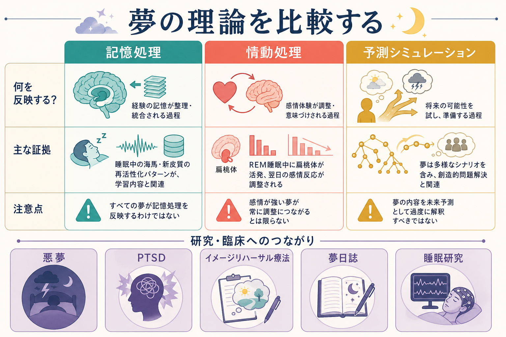
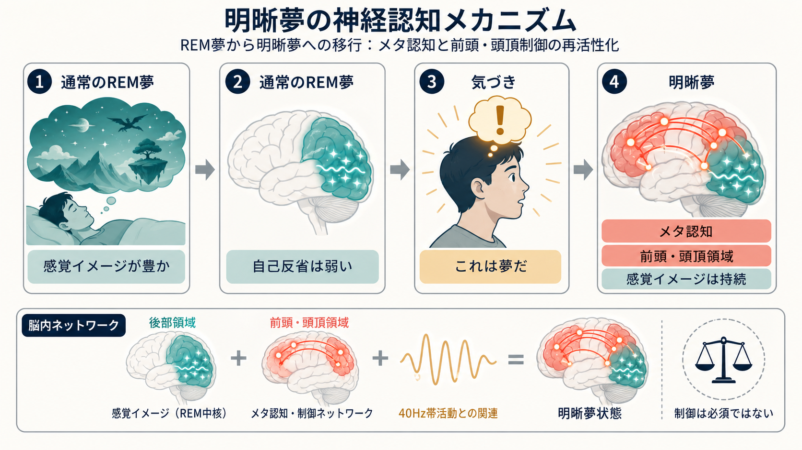
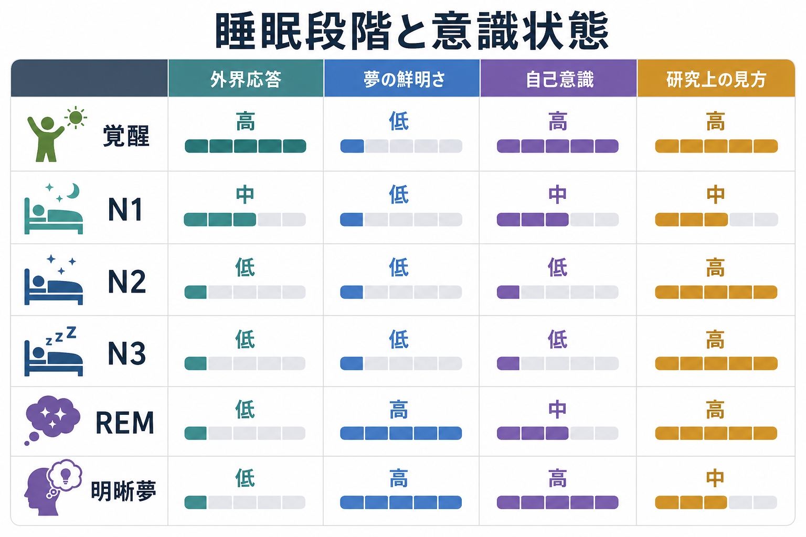

# 睡眠中の意識はどう理解できるのか

## 要点

- 睡眠中の意識は、「眠っているから意識がない」と単純化できない。外界への応答は低下しても、夢のような主観的経験が生じることがある。
- NREM睡眠とREM睡眠は、脳波、筋緊張、眼球運動、覚醒しやすさ、夢報告のされ方が異なる。意識研究では、これらを[[覚醒と意識内容は何が違うのか|覚醒水準]]と意識内容の変化として読む。
- REM睡眠では鮮明な夢が報告されやすいが、NREM睡眠でも夢や思考様経験は起こる。したがって「夢 = REM睡眠」ではない。
- 明晰夢は、夢を見ながら「これは夢だ」と気づく状態であり、通常の夢よりもメタ認知や自己意識が部分的に高まる。
- 睡眠中の意識は、[[意識とは何か|意識]]を「反応できること」だけでなく、「何かを経験していること」として考えるための重要な入口になる。

## この記事で答える問い

1. 睡眠中の意識は、覚醒時の意識と何が違うのか。
2. 夢はREM睡眠だけで起こるのか。
3. 明晰夢は、通常の夢や覚醒とどのように違うのか。
4. 睡眠中の意識研究は、臨床や精神医学とどうつながるのか。

## まず結論

睡眠中の意識は、「覚醒しているかどうか」と「経験内容があるかどうか」を分けると理解しやすい。覚醒時には、外界入力、行動反応、記憶、注意、自己意識が比較的そろって働く。睡眠中にはこの結びつきがほどけ、外界への応答は低下する一方で、内的な感覚イメージ、情動、物語、身体感覚が夢として経験されることがある[1][2]。

この分離は、[[主観的経験は科学的に扱えるのか|主観的経験]]を研究するうえで重要である。眠っている人はその場で報告できないことが多いが、覚醒直後の夢報告、睡眠ポリグラフ、脳波、fMRI、眼球運動を組み合わせることで、どの睡眠状態でどのような経験が起こりやすいかを推定できる[2][4]。

## 背景

睡眠は大きくNREM睡眠とREM睡眠に分けられる。NREM睡眠はN1、N2、N3に細分され、N1は浅い睡眠、N2は睡眠紡錘波やK複合を伴う安定した睡眠、N3は徐波睡眠として深い睡眠に対応する。REM睡眠では急速眼球運動、筋緊張の低下、覚醒に似た脳活動が見られ、鮮明で情動的な夢が報告されやすい[1]。

ただし、睡眠段階は意識の有無をそのまま決めるラベルではない。NREM睡眠でも夢報告は得られるし、REM睡眠でも報告される経験の内容や明瞭さは変動する。睡眠中の意識を理解するには、睡眠段階を「脳と身体の状態」、夢を「報告される経験内容」、明晰夢を「夢の中で自己の状態に気づく特殊な経験」として区別する必要がある[2][3]。

## 基本概念

### 覚醒水準

覚醒水準とは、外界刺激に反応し、行動を開始し、課題に応答できる全体的な準備状態である。睡眠中は覚醒水準が下がり、刺激への反応しやすさも低下する。しかし、それだけで意識内容が完全に消えるとは限らない。夢は、覚醒水準が低くても経験内容が成立しうることを示す例である。

### 意識内容

意識内容とは、「何が経験されているか」である。夢では、視覚イメージ、空間、人物、情動、身体感覚、自己の視点が現れる。外界からの入力が弱いにもかかわらず、脳内で生成された感覚イメージが主観的現実として経験される点が特徴である[2][3]。

### 自己意識とメタ認知

通常の夢では、奇妙な出来事を疑わずに受け入れることが多い。これは、現実検討、自己監視、メタ認知が覚醒時より弱くなるためだと考えられる。一方、明晰夢では「これは夢だ」と気づくため、[[自己とは何か|自己]]を経験の中で位置づける働きが部分的に戻る[5][6]。

## 仕組み

### 1. 外界入力の低下と内的生成

睡眠中は、感覚入力への応答、姿勢制御、随意運動が覚醒時とは異なる形で抑制される。特にREM睡眠では筋緊張が大きく低下し、夢の中の行動がそのまま身体運動として出にくい。外界との結びつきが弱まることで、記憶、情動、身体感覚、予測的イメージが相対的に前景化しやすくなる[1][2]。

### 2. 後部皮質ホットゾーン

夢研究では、夢を見ていたかどうかの報告と、後部皮質領域の活動パターンが関係することが示されている。Siclariらの研究では、NREM睡眠中でも、後部皮質の低周波活動が低いと夢報告が得られやすく、夢の内容に応じて顔、空間、運動などに関わる領域の活動が変わった[4]。これは、夢の有無をREM睡眠だけで説明するよりも、経験内容を支える皮質ネットワークを見る必要があることを示している。

### 3. 明晰夢とメタ認知の再上昇

明晰夢は、睡眠中でありながら夢であることを認識する状態である。古典的研究では、夢の中であらかじめ決めた眼球運動を行わせることで、明晰夢がREM睡眠中に起きていることが客観的に確認された[7]。その後の研究では、明晰夢が通常のREM睡眠と覚醒の中間的な性質をもつ可能性が示され、前頭・頭頂系の活動や高周波帯域活動がメタ認知の回復と関連する可能性が議論されている[5][6]。

### 4. 注意と記憶の変化

夢の中では、[[注意と意識は同じものなのか|注意]]の向け方が覚醒時とは異なる。外界刺激に注意を向けるより、夢場面の中で目立つ人物、危険、情動、身体感覚に引き寄せられやすい。また、目覚めたあとに夢を覚えているかどうかは、夢があったかどうかとは別問題である。夢経験、記憶への符号化、起床後の報告は分けて考える必要がある。

## 図解

| 状態 | 外界への応答 | 意識内容 | 自己意識 | ポイント |
|---|---:|---:|---:|---|
| 覚醒 | 高い | 高い | 高い | 外界入力、行動、報告がそろいやすい |
| N1 | 中程度 | 断片的 | 中程度 | 入眠時イメージや浮遊感が生じやすい |
| N2 | 低い | 低〜中 | 低〜中 | 夢や思考様経験はありうる |
| N3 | 低い | 低いことが多い | 低い | 徐波睡眠。覚醒しにくく、報告も少ない |
| REM | 低い | 高いことが多い | 中程度 | 鮮明で情動的な夢が多い |
| 明晰夢 | 低い | 高い | 高い | 夢の中で夢だと気づく |

この表は便宜的な整理であり、個人差、覚醒のタイミング、質問の仕方、睡眠不足、薬物、精神状態によって大きく変わる。重要なのは、睡眠段階を意識のオン/オフスイッチとしてではなく、経験内容・報告可能性・自己意識の組み合わせとして読むことである。

## 臨床・研究との接続

悪夢、PTSDに関連する夢、REM睡眠行動障害、ナルコレプシー、睡眠時随伴症は、睡眠中の意識と行動の関係を考えるうえで重要である。たとえば悪夢では、情動的に強い夢内容が苦痛や睡眠回避につながることがある。AASMのポジションペーパーでは、成人の悪夢障害に対してイメージリハーサル療法などが検討されている[8]。ただし、ここでの説明は教育・研究目的であり、個別の診断や治療指示ではない。

研究面では、睡眠中の意識は[[グローバルワークスペース理論とは何か|グローバルワークスペース理論]]や統合情報理論の検討材料になる。夢は外界入力が弱く、報告も遅延するため、覚醒時の実験より難しい。しかしその難しさこそ、意識を「刺激に反応すること」だけで定義できない理由を明確にする。

## よくある誤解

### 誤解1: 眠っている間は意識がない

眠っている間は外界への応答が弱いが、夢のような経験内容が生じることがある。反応の弱さと意識内容の不在は同じではない。

### 誤解2: 夢はREM睡眠だけで起こる

REM睡眠では鮮明な夢が報告されやすいが、NREM睡眠でも夢や思考様経験は起こる。夢研究では、睡眠段階だけでなく、覚醒直後の報告、脳活動、質問方法を合わせて評価する[2][4]。

### 誤解3: 明晰夢は完全な覚醒である

明晰夢では自己意識やメタ認知が部分的に高まるが、身体は睡眠状態にあり、外界への応答も通常の覚醒とは異なる。したがって、明晰夢は「覚醒」ではなく、睡眠中の意識状態の一変種として考えるほうがよい[5][6]。

### 誤解4: 夢の内容はそのまま心理状態を診断する

夢は記憶、情動、身体状態、睡眠段階、覚醒直後の再構成が混ざった経験である。研究や臨床では、夢内容を単独で診断根拠にするのではなく、睡眠の質、日中機能、苦痛、既往歴、文脈と合わせて扱う必要がある。

## 関連ノート

- [[意識とは何か]]
- [[覚醒と意識内容は何が違うのか]]
- [[主観的経験は科学的に扱えるのか]]
- [[注意と意識は同じものなのか]]
- [[自己とは何か]]
- [[グローバルワークスペース理論とは何か]]
- [[睡眠障害は脳機能にどのような影響を与えるのか]]

### 関連ノート候補

- 夢とは何か
- 明晰夢とは何か
- REM睡眠とは何か
- NREM睡眠とは何か
- 悪夢障害とは何か
- 睡眠ポリグラフとは何か

### MOC更新候補

- `content/00_MOC/` 配下の認知科学・意識関連MOCに、本記事 `[[睡眠中の意識はどう理解できるのか]]` を追加候補として扱う。
- 並列編集の衝突を避けるため、このジョブではMOC本体は更新していない。

## 理解チェック

1. 睡眠中の意識を考えるとき、なぜ「覚醒水準」と「意識内容」を分ける必要があるのか。
2. REM睡眠と夢を同一視すると、どのような誤解が生じるか。
3. 明晰夢では、通常の夢に比べてどのような自己意識・メタ認知の変化が起こるか。
4. 悪夢や睡眠障害を扱うとき、夢内容だけで診断的に断定してはいけない理由は何か。

## 未解決問題

- 夢経験の神経相関は、睡眠段階を超えてどこまで一般化できるのか。
- 夢を見ていたが覚えていない場合と、夢経験そのものがなかった場合をどこまで区別できるのか。
- 明晰夢の誘導法は、研究・臨床応用に十分な再現性と安全性をもつのか。
- 夢内容の個人差を、記憶、情動調整、予測処理、精神症状とどのように結びつけて扱うべきか。

## 参考文献

[1] National Institute of Neurological Disorders and Stroke. Brain Basics: Understanding Sleep. https://www.ninds.nih.gov/health-information/public-education/brain-basics/brain-basics-understanding-sleep

[2] Nir, Y., & Tononi, G. (2010). Dreaming and the brain: From phenomenology to neurophysiology. *Trends in Cognitive Sciences*, 14(2), 88-100. https://doi.org/10.1016/j.tics.2009.12.001

[3] Hobson, J. A., Pace-Schott, E. F., & Stickgold, R. (2000). Dreaming and the brain: Toward a cognitive neuroscience of conscious states. *Behavioral and Brain Sciences*, 23(6), 793-842. https://doi.org/10.1017/S0140525X00003976

[4] Siclari, L., Baird, B., Perogamvros, L., et al. (2017). The neural correlates of dreaming. *Science*, 356(6332), 65-68. https://doi.org/10.1126/science.aam6544

[5] Baird, B., Mota-Rolim, S. A., & Dresler, M. (2019). The cognitive neuroscience of lucid dreaming. *Neuroscience & Biobehavioral Reviews*, 100, 305-323. https://doi.org/10.1016/j.neubiorev.2019.03.008

[6] Voss, U., Holzmann, R., Tuin, I., & Hobson, J. A. (2009). Lucid dreaming: A state of consciousness with features of both waking and non-lucid dreaming. *Sleep*, 32(9), 1191-1200. https://doi.org/10.1093/sleep/32.9.1191

[7] LaBerge, S., Nagel, L. E., Dement, W. C., & Zarcone, V. P. (1981). Lucid dreaming verified by volitional communication during REM sleep. *Perceptual and Motor Skills*, 52(3), 727-732. https://doi.org/10.2466/pms.1981.52.3.727

[8] Morgenthaler, T. I., Auerbach, S., Casey, K. R., et al. (2018). Position paper for the treatment of nightmare disorder in adults: An American Academy of Sleep Medicine position paper. *Journal of Clinical Sleep Medicine*, 14(6), 1041-1055. https://doi.org/10.5664/jcsm.7178
