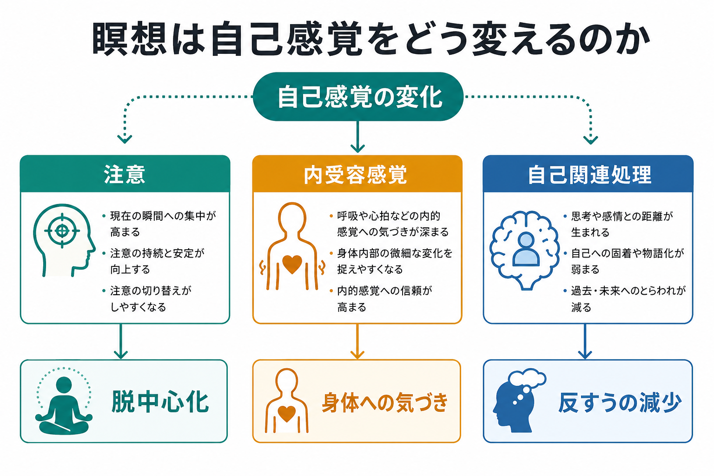
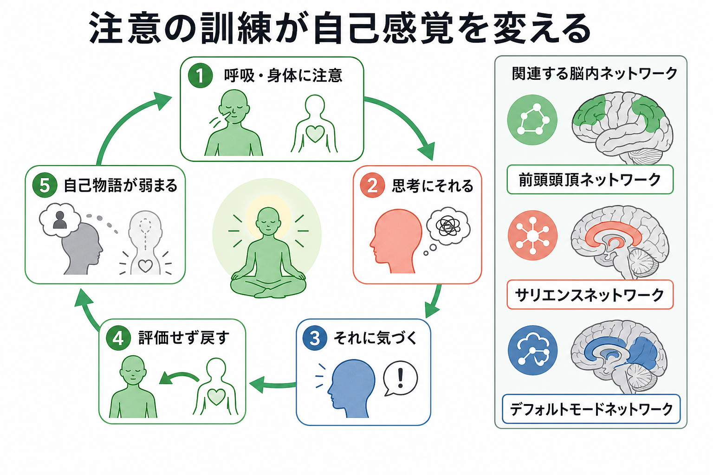
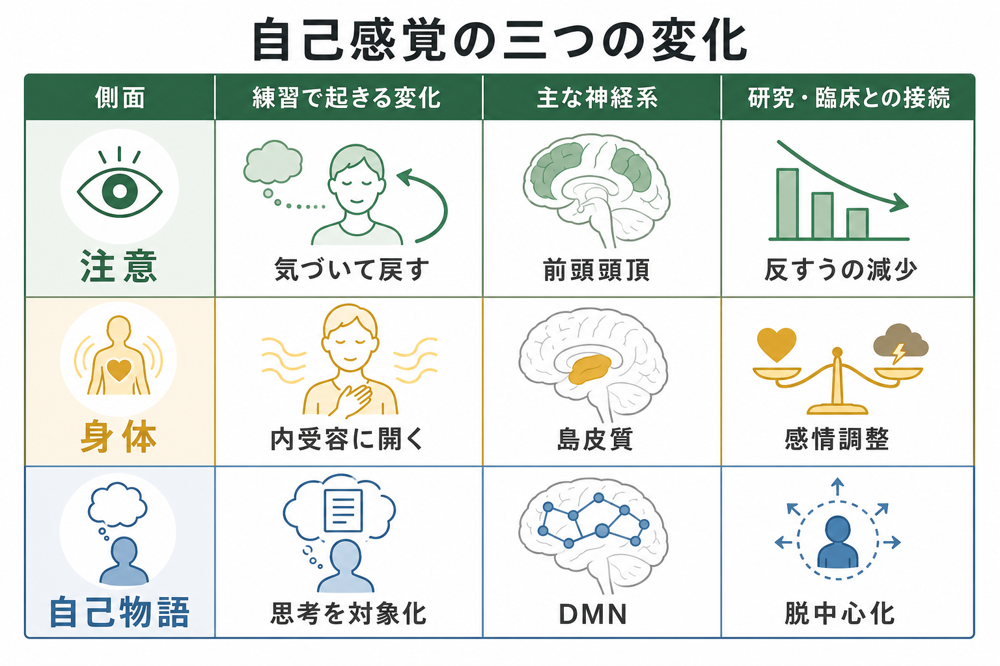

# 瞑想は自己感覚をどう変えるのか

## 要点

- 瞑想は「自己を消す技法」というより、注意を向ける対象、身体感覚の読み取り方、思考との距離の取り方を変える訓練として理解できる。
- 集中瞑想では、注意がそれる、気づく、戻すという反復が、[[注意と意識は同じものなのか|注意]]制御と[[メタ認知とは何か|メタ認知]]を鍛える。
- マインドフルネス瞑想では、呼吸・心拍・緊張・痛みなどの[[内受容感覚とは何か|内受容感覚]]に気づきやすくなる一方、それをすぐに「自分はだめだ」「危険だ」と物語化しない練習が行われる。
- 神経科学的には、前頭頭頂ネットワーク、[[サリエンスネットワークとは何か|サリエンスネットワーク]]、[[デフォルトモードネットワークとは何か|デフォルトモードネットワーク]]（DMN）の相互作用として整理しやすい。
- 臨床応用では、不安・抑うつ・痛みへの小から中等度の効果が報告されるが、瞑想だけを治療指示として一般化するのは避けるべきである。

## この記事で答える問い

この記事では、瞑想が[[自己とは何か|自己]]感覚をどう変えるのかを、次の三つの問いとして扱う。

1. 注意を呼吸や身体に向ける練習は、自己経験のどこを変えるのか。
2. 内受容感覚への気づきは、身体所有感や感情経験にどう関わるのか。
3. 自己関連思考、反すう、物語的自己は、瞑想によってどのように扱われるのか。

ここでいう自己感覚は、単一の「自我」ではない。身体がここにあるという[[最小自己とは何か|最小自己]]、行為を自分が起こしているという[[主体感とは何か|主体感]]、自分について語る[[物語的自己とは何か|物語的自己]]、社会的評価の中で形成される[[自己概念とは何か|自己概念]]が重なったものとして考える。

## まず結論

瞑想は、自己感覚の内容を直接書き換えるというより、「経験を自己に結びつける癖」を弱める。たとえば、呼吸に注意を置いていると、すぐに予定、記憶、評価、後悔が浮かぶ。通常はそのまま「私の問題」「私の失敗」「私の将来」として展開しやすい。瞑想では、その展開に気づき、評価せず、再び呼吸や身体に戻る。

この反復により、思考は「自分そのもの」ではなく「いま生じている心的出来事」として扱われやすくなる。これが脱中心化である。脱中心化は、自己を否定することではなく、自己物語に巻き込まれすぎない距離を作ることである。神経科学的には、自己関連処理に関わるDMNと、注意制御・気づきに関わるネットワークの結合様式が変わる可能性として研究されている[1][5]。

## 背景

瞑想研究で扱われる実践は一枚岩ではない。集中瞑想は、呼吸、音、身体部位、マントラなど特定の対象へ注意を保つ練習である。開放モニタリングは、経験内容を選別せず、思考・感覚・感情の出現と消失を観察する練習である。マインドフルネスは、現在の経験に意図的に注意を向け、できるだけ評価や反応を保留する姿勢として研究されることが多い[1][2]。

この区別は重要である。瞑想の効果を「脳が変わる」「自己が消える」と一括りにすると、実践の種類、熟達度、測定課題、期待効果、臨床対象の違いが見えなくなる。マインドフルネス神経科学のレビューでも、既存研究には横断研究の限界、サンプルサイズの小ささ、瞑想経験者の事前差、介入内容の不均一性があると指摘されている[1]。

## 基本概念

### 注意

瞑想の第一の入口は注意である。集中瞑想では、注意は対象に置かれ、逸脱したら戻される。Lutzらは、瞑想を注意・感情調整の訓練体系として整理し、集中瞑想と開放モニタリングを代表的なスタイルとして区別した[2]。

この「戻す」動作は単純に見えるが、少なくとも四つの過程を含む。第一に、対象に注意を維持する。第二に、注意がそれたことに気づく。第三に、思考や感情に巻き込まれずに離れる。第四に、対象へ戻る。HasenkampらのfMRI研究は、集中瞑想中の心の迷い、気づき、注意の移行、注意維持を時間的に分け、それぞれ異なるネットワークが関わる可能性を示した[3]。

### 内受容感覚

[[内受容感覚とは何か|内受容感覚]]とは、心拍、呼吸、胃腸、痛み、温度、筋緊張など、身体内部の状態に関する感覚である。瞑想では、呼吸や身体スキャンを通じて、身体の微細な変化に注意を向けることが多い。

ただし、内受容感覚が高まることは常に快適さを意味しない。身体感覚への気づきが増えると、不安や痛みへの注意も増えうる。重要なのは、身体信号を「危険」「失敗」「病気の証拠」とすぐに解釈せず、感覚として観察する枠組みである。ここでは[[内受容感覚は感情にどう関わるのか|内受容感覚と感情]]の結びつきが問題になる。

### 自己関連処理

自己関連処理とは、自分の性格、過去、未来、評価、他者からの見られ方などを自分に関係づけて処理する働きである。これは[[自己関連処理の脳ネットワークとは何か|自己関連処理の脳ネットワーク]]やDMNと強く結びつけて研究されてきた。

Farbらは、マインドフルネス訓練後に、自己を物語的・評価的に考えるモードと、現在の身体感覚を中心に経験するモードが神経的に分離しやすくなる可能性を示した[4]。これは、瞑想が自己関連処理をなくすというより、「物語としての自己」と「現在の身体的経験」を区別しやすくすることを示唆する。

## 仕組み

### 1. 注意の反復が「気づいて戻す」回路を作る

瞑想中、心がそれることは失敗ではない。むしろ、心がそれたことに気づく瞬間が訓練の中心になる。呼吸へ戻るたびに、注意制御、エラー検出、メタ認知的気づきが組み合わされる[3]。

この反復により、思考が現れても、それをすぐ行動や反応に結びつけない余地が生まれる。たとえば「不安だ」という思考が出ても、「不安な私」ではなく「不安という内容が出ている」と見やすくなる。この距離が、自己感覚の硬さをゆるめる。

### 2. 内受容感覚が「身体としての私」を再調整する

自己感覚には、言語的な自己物語だけでなく、身体がここにあるという感覚が含まれる。呼吸、姿勢、痛み、心拍に注意を向ける練習は、身体内部の予測と誤差に気づく機会を増やす。

この変化は、[[身体所有感とは何か|身体所有感]]や[[身体図式とは何か|身体図式]]のような身体性の問題とも接続する。瞑想は身体を「操作対象」として扱うだけでなく、身体状態が情動、注意、自己評価をどう支えているかに気づく方法になる。

### 3. 自己物語への同一化が弱まる

日常の自己経験では、「私はこういう人間だ」「また失敗する」「あの人にどう思われたか」といった物語が連鎖する。これ自体は異常ではないが、反すうや自己批判が強いと、自己感覚が狭く固定される。

Brewerらは、経験豊富な瞑想者では複数の瞑想条件でDMNの活動や結合に差が見られることを報告し、瞑想経験が自己関連処理・心の迷いに関わるネットワークと関連する可能性を示した[5]。ただし、この研究は熟達者と対照群の比較であり、瞑想が直接その差を作ったと断定するには限界がある。

### 4. 自己調整から自己超越までを連続体として見る

VagoとSilbersweigのS-ARTモデルは、マインドフルネスを自己認識、自己調整、自己超越の三つの軸から整理する[6]。ここでの自己超越は神秘的な主張ではなく、自己中心的な評価や防衛に過度に固定されない状態として読むと理解しやすい。

つまり瞑想は、自己を消去するのではなく、自己をより柔軟に運用する訓練である。自己経験は残るが、それに飲み込まれる度合いが変わる。

## 図解

瞑想による自己感覚の変化は、次の三層で整理できる。

| 層 | 変化 | 関連する既存ノート |
|---|---|---|
| 注意 | 気づいて戻す、反応を一拍遅らせる | [[注意と意識は同じものなのか]], [[選択的注意はどのように働くのか]], [[メタ認知とは何か]] |
| 身体 | 呼吸・心拍・緊張を感覚として観察する | [[内受容感覚とは何か]], [[身体所有感とは何か]], [[身体化認知とは何か]] |
| 自己物語 | 思考を自己そのものではなく出来事として扱う | [[自己とは何か]], [[最小自己とは何か]], [[物語的自己とは何か]], [[デフォルトモードネットワークとは何か]] |

## 臨床・研究との接続

臨床的には、瞑想やマインドフルネスは不安、抑うつ、痛み、ストレス反応に関する介入研究で扱われてきた。Goyalらの系統的レビュー・メタ解析では、マインドフルネス瞑想プログラムは不安、抑うつ、痛みに小から中等度の改善を示した一方、注意、睡眠、体重、物質使用などについては十分な効果証拠がない、または低いと評価された[8]。

神経画像研究では、MBSR後に海馬、後帯状皮質、側頭頭頂接合部、小脳などで灰白質濃度の変化が報告されている[7]。これらの領域は学習・記憶、自己関連処理、情動調整、視点取得と関係する。ただしサンプル数は小さく、画像指標の変化をそのまま臨床改善や「人格の変化」と読んではならない。

研究上の焦点は、瞑想の有無よりも、どの実践が、どの程度の訓練量で、どの人に、どの自己過程を変えるのかである。たとえば、反すうが強い人には自己物語から距離を取る効果が重要かもしれない。一方、身体感覚に過敏な人では、内受容感覚への注意が一時的に不快感を強める可能性もある。

## よくある誤解

### 誤解1: 瞑想は何も考えない練習である

瞑想中に思考が出るのは自然である。重要なのは、思考をなくすことではなく、思考が出たことに気づき、それを追い続けるかどうかを選べるようにすることだ。

### 誤解2: 瞑想は自己を消す

自己感覚が弱まる体験は報告されるが、それをそのまま目標にすると危うい。認知科学的には、瞑想は[[物語的自己とは何か|物語的自己]]への過剰な同一化をゆるめ、[[最小自己とは何か|最小自己]]や身体感覚への気づきを再編する訓練として捉えるほうが安全である。

### 誤解3: 瞑想は誰にでも同じように良い

瞑想は万能ではない。強い不安、トラウマ反応、[[解離とは認知科学的に何か|解離]]、[[離人感とは何か|離人感]]がある場合、内面や身体感覚への集中が負担になることもある。医療・臨床文脈では、個別の診断や治療指示ではなく、専門家の評価と安全な枠組みの中で扱う必要がある。

## 関連ノート

- [[自己とは何か]]
- [[最小自己とは何か]]
- [[物語的自己とは何か]]
- [[自己関連処理の脳ネットワークとは何か]]
- [[内受容感覚とは何か]]
- [[内受容感覚は感情にどう関わるのか]]
- [[注意と意識は同じものなのか]]
- [[デフォルトモードネットワークとは何か]]
- [[サリエンスネットワークとは何か]]
- [[メタ認知とは何か]]
- [[身体所有感とは何か]]
- [[解離とは認知科学的に何か]]

## 理解チェック

1. 瞑想中に注意がそれることは、なぜ単なる失敗ではなく訓練の一部といえるのか。
2. 内受容感覚への気づきが、自己感覚と感情調整の両方に関わるのはなぜか。
3. 「自己物語が弱まる」とは、自己がなくなることとどう違うのか。
4. DMNの変化を、瞑想の因果効果としてすぐ断定できない理由は何か。
5. 臨床応用で、瞑想を万能な介入として扱わないほうがよい理由は何か。

## 参考文献

[1] Tang, Y.-Y., Hölzel, B. K., & Posner, M. I. (2015). The neuroscience of mindfulness meditation. *Nature Reviews Neuroscience, 16*, 213-225. https://doi.org/10.1038/nrn3916

[2] Lutz, A., Slagter, H. A., Dunne, J. D., & Davidson, R. J. (2008). Attention regulation and monitoring in meditation. *Trends in Cognitive Sciences, 12*(4), 163-169. https://doi.org/10.1016/j.tics.2008.01.005

[3] Hasenkamp, W., Wilson-Mendenhall, C. D., Duncan, E., & Barsalou, L. W. (2012). Mind wandering and attention during focused meditation: A fine-grained temporal analysis of fluctuating cognitive states. *NeuroImage, 59*(1), 750-760. https://doi.org/10.1016/j.neuroimage.2011.07.008

[4] Farb, N. A. S., Segal, Z. V., Mayberg, H., Bean, J., McKeon, D., Fatima, Z., & Anderson, A. K. (2007). Attending to the present: Mindfulness meditation reveals distinct neural modes of self-reference. *Social Cognitive and Affective Neuroscience, 2*(4), 313-322. https://doi.org/10.1093/scan/nsm030

[5] Brewer, J. A., Worhunsky, P. D., Gray, J. R., Tang, Y.-Y., Weber, J., & Kober, H. (2011). Meditation experience is associated with differences in default mode network activity and connectivity. *Proceedings of the National Academy of Sciences, 108*(50), 20254-20259. https://doi.org/10.1073/pnas.1112029108

[6] Vago, D. R., & Silbersweig, D. A. (2012). Self-awareness, self-regulation, and self-transcendence (S-ART): A framework for understanding the neurobiological mechanisms of mindfulness. *Frontiers in Human Neuroscience, 6*, 296. https://doi.org/10.3389/fnhum.2012.00296

[7] Hölzel, B. K., Carmody, J., Vangel, M., Congleton, C., Yerramsetti, S. M., Gard, T., & Lazar, S. W. (2011). Mindfulness practice leads to increases in regional brain gray matter density. *Psychiatry Research: Neuroimaging, 191*(1), 36-43. https://doi.org/10.1016/j.pscychresns.2010.08.006

[8] Goyal, M., Singh, S., Sibinga, E. M. S., Gould, N. F., Rowland-Seymour, A., Sharma, R., Berger, Z., Sleicher, D., Maron, D. D., Shihab, H. M., Ranasinghe, P. D., Linn, S., Saha, S., Bass, E. B., & Haythornthwaite, J. A. (2014). Meditation programs for psychological stress and well-being: A systematic review and meta-analysis. *JAMA Internal Medicine, 174*(3), 357-368. https://doi.org/10.1001/jamainternmed.2013.13018

## 未解決問題

- 瞑想のどの構成要素が、注意、内受容感覚、自己関連処理のどれに効いているのかは、まだ分解が不十分である。
- 熟達者研究では、瞑想経験の効果と、瞑想を続けやすい人の事前特性を分けにくい。
- 自己感覚の変化は主観報告に依存しやすく、神経指標・行動指標・現象学的記述をどう統合するかが課題である。

## MOC更新候補

- `content/00_MOC/` 配下の認知科学・意識・身体性関連MOCに、バッチ統合時に本記事 `[[瞑想は自己感覚をどう変えるのか]]` を追加する候補。

