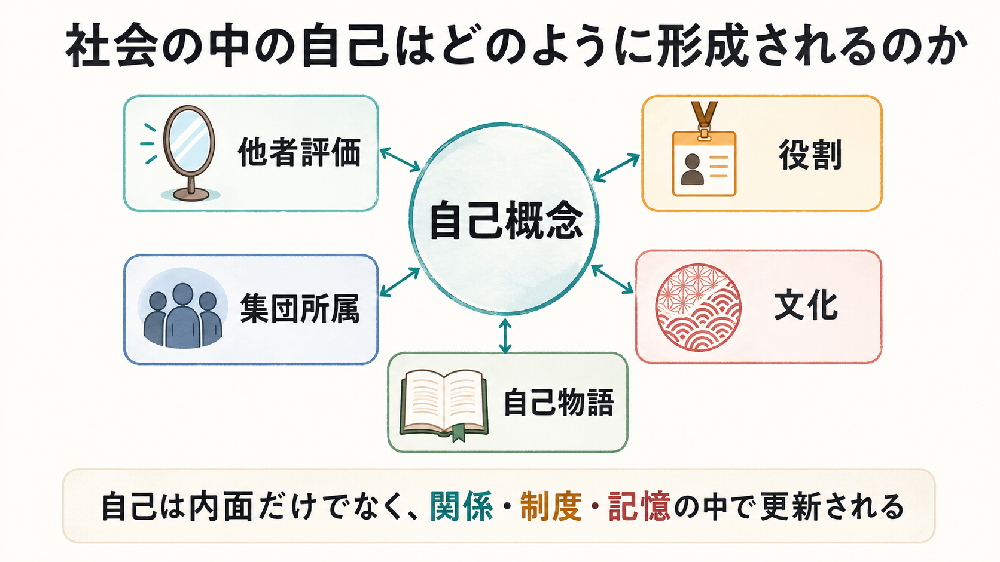
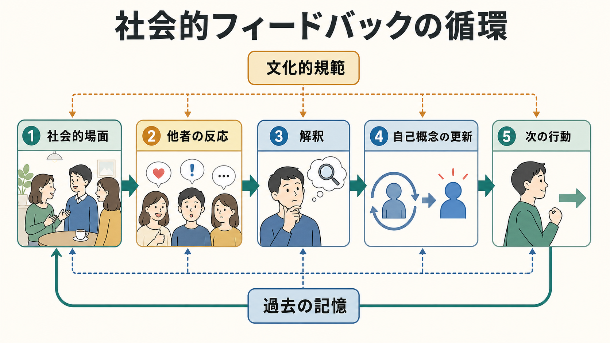
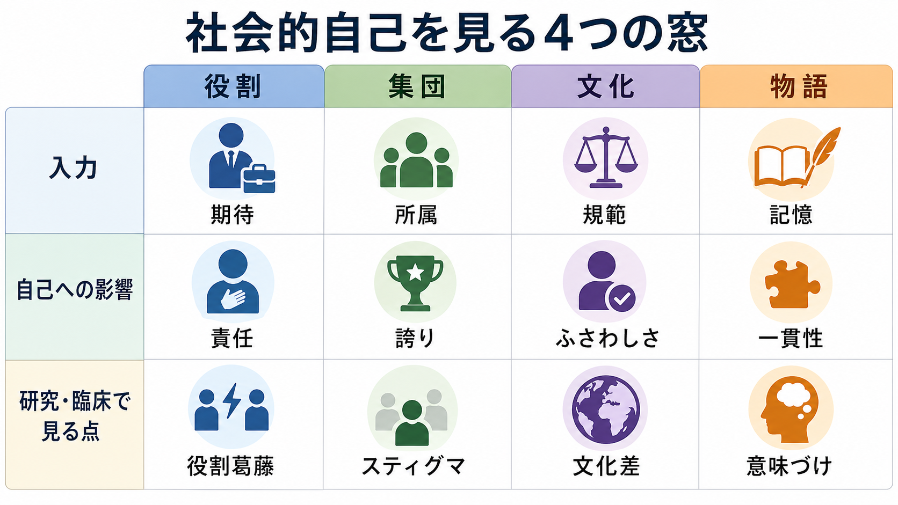

# 社会の中の自己はどのように形成されるのか

## 要点

- 自己は、内面にあらかじめ完成している実体ではなく、身体感覚、記憶、他者評価、役割、集団所属、文化的規範の中で更新される構成物である。
- Cooley の「鏡映自己」は、他者が自分をどう見ていると想像するかが自己感情を形作ることを示した古典的な出発点である [1]。
- Mead の立場では、自己は他者の態度を取り入れ、「一般化された他者」の視点から自分を見られるようになることで社会的に形成される [2]。
- 役割や集団所属は、期待、承認、逸脱、比較を通じて、[[自己概念とは何か|自己概念]]の内容と重要度を変える [3][4]。
- 文化は「自立した自己」か「相互協調的な自己」かといった自己観の違いを通じて、認知、感情、動機づけの前提を変える [5]。
- [[物語的自己とは何か|物語的自己]]は、自伝的記憶を現在の目標や関係の中で再構成し、人生に一貫性と意味を与える [6][7]。

## この記事で答える問い

1. 他者評価は、どのように「私はこういう人間だ」という理解へ変わるのか。
2. 役割や集団所属は、自己のどの部分を強め、どの部分を隠すのか。
3. 文化は、自己概念や自己物語の形をどのように方向づけるのか。
4. 研究・臨床では、社会的に形成された自己をどのように扱えばよいのか。

## まず結論

社会の中の自己は、単に「他人に影響される自己」ではない。より正確には、他者のまなざし、制度上の役割、所属集団、文化的に共有された語り方、自伝的記憶が相互に結びついて、[[自己とは何か|自己]]をそのつど形作る。

たとえば、同じ失敗でも、「私は無能だ」と読む場合、「新しい役割にまだ慣れていない」と読む場合、「困難を通じて学んだ」と読む場合では、自己概念への影響が違う。社会的経験は出来事そのものではなく、評価、解釈、記憶、物語化を通じて自己に入る。

## 背景

近代的な直感では、自己は個人の内側にあるものと考えられやすい。しかし社会心理学や社会学の古典は、自己を他者との関係から切り離して理解できないと考えてきた。

Cooley は、自己感情が「他者にどう見えているか」という想像を通じて生じると論じた [1]。これは、実際の他者評価そのものよりも、「自分はこう見られているはずだ」という解釈が自己感情を媒介する、という点で重要である。

Mead は、子どもが具体的な他者の視点だけでなく、集団や共同体が期待する視点を取り入れることで自己を形成すると考えた [2]。この見方は、[[自己意識はどのように発達するのか|自己意識の発達]]を、身体や認知だけでなく社会的視点取得の発達として理解する道を開く。

## 基本概念

### 社会的自己

社会的自己とは、他者、集団、制度、文化の中で成立する自己の側面である。これは「本当の自己」と対立する仮面ではない。親、学生、研究者、友人、患者、支援者、ある文化圏の成員といった役割や所属は、本人の行動、感情、記憶の選び方に深く関わる。

### 鏡映自己

鏡映自己は、他者の評価を鏡のように使って自分を理解する過程である [1]。ここには、少なくとも三つの段階がある。

1. 自分が他者にどう見えているかを想像する。
2. その見え方が、称賛、失望、軽蔑、期待などとしてどう評価されるかを想像する。
3. その想像された評価から、誇り、恥、不安、安心などの自己感情が生じる。

### 役割アイデンティティ

役割アイデンティティは、「私は教師である」「私は親である」「私は研究者である」のように、社会的地位や関係に結びついた自己理解である。アイデンティティ理論では、自己は役割、集団、個人的特徴に関する意味の体系として働き、状況からの入力がその意味と一致するかどうかが重要になる [3]。

### 社会的アイデンティティ

社会的アイデンティティは、所属集団に基づく自己理解である。人は自分を個人としてだけでなく、専門職、国籍、ジェンダー、世代、学校、職場、疾患コミュニティなどの成員としても理解する。社会的アイデンティティ研究は、集団コミットメントや社会的文脈が、知覚、感情、行動に影響することを整理してきた [4]。

### 文化的自己観

文化は、自己を「独立した個人」として見るか、「関係の中の存在」として見るかを方向づける。Markus と Kitayama は、文化ごとに自己・他者・相互依存の捉え方が異なり、それが認知、感情、動機づけに影響すると論じた [5]。これは、文化差を固定的な国民性として扱うのではなく、利用可能な自己理解の枠組みの違いとして見るために重要である。

## 仕組み

### 1. 他者評価が自己感情を作る

他者の反応は、そのまま自己概念に入るわけではない。自分がその反応をどう解釈するかが媒介する。褒められても「本心ではない」と思えば自己評価は上がりにくい。批判されても「役割上の改善点だ」と読めば、人格全体への否定とは限らない。

このため、社会的自己を考えるときは、実際の評価、想像された評価、評価の解釈、自己感情を区別する必要がある。

### 2. 役割が「ふるまうべき自己」を定義する

役割は、行動の台本を与える。医師、教師、親、学生、管理職、友人といった役割には、それぞれ期待されるふるまいがある。人はその期待に応えようとするだけでなく、応えられたかどうかを通じて「私はこの役割にふさわしいか」を判断する。

アイデンティティ理論では、役割に結びついた自己意味と、状況の中で得られるフィードバックが一致すると、アイデンティティが確認された感覚が生じる [3]。逆に、期待と自己理解がずれると、役割葛藤、恥、不安、怒り、撤退が生じやすい。

### 3. 集団所属が比較と承認の枠を作る

所属集団は、「誰と比べるか」「何を誇りに思うか」「何を恥と感じるか」を変える。社会的アイデンティティの観点では、集団へのコミットメント、集団の地位、外集団との比較、差別やスティグマの経験が、自己評価や行動に影響する [4]。

重要なのは、集団所属は単なるラベルではないという点である。所属は、仲間、規範、資源、歴史、将来像と結びつく。したがって、社会的排除やスティグマは、対人ストレスであるだけでなく、自己概念の土台を揺らす経験にもなる。

### 4. 文化が「自然な自己」の形を変える

文化は、何を成熟、責任、自由、親密さ、成功とみなすかを決める。ある文脈では、自分の意見を明確に述べることが自律性の表れになる。別の文脈では、関係全体の調和を読んで発言を調整することが成熟の表れになる。

この違いは、単に行動様式の違いではない。どの感情を大切にするか、どの記憶を自分らしいものとして語るか、どの目標を恥ずかしい／望ましいものとみなすかにも影響する [5]。

### 5. 記憶と物語が自己を時間の中でつなぐ

自伝的記憶は、過去の出来事をそのまま保存する倉庫ではない。Conway と Pleydell-Pearce の自己記憶システムでは、自伝的記憶は現在の目標をもつ「作業自己」と自伝的知識基盤の相互作用によって構成される [6]。つまり、何を思い出し、どう意味づけるかは、現在の自己理解に左右される。

McAdams と McLean は、物語的アイデンティティを、再構成された過去と想像された未来を統合し、人生に一定の統一性と目的を与える物語として整理した [7]。社会の中で語られる物語は、家族、友人、臨床家、学校、文化的物語に支えられながら変わる。

## 図解

この図の四つの窓は、社会的自己を観察するときの焦点を表す。

| 焦点 | 入力 | 自己への影響 | 研究・臨床で見る点 |
|---|---|---|---|
| 役割 | 期待、責任、評価 | 「私はこの役割にふさわしいか」 | 役割葛藤、過剰適応、役割喪失 |
| 集団 | 所属、比較、承認 | 誇り、恥、連帯、疎外 | スティグマ、内集団・外集団比較 |
| 文化 | 規範、価値、語り方 | 自立性、関係性、ふさわしさ | 文化差、移行、少数派経験 |
| 物語 | 記憶、出来事、未来像 | 一貫性、意味、目的 | 反復する自己物語、意味づけ |

## 臨床・研究との接続

臨床・支援の場で社会的自己を扱うときは、個別診断や治療指示ではなく、教育・研究目的の概念整理として慎重に考える必要がある。

第一に、自己評価の低さを個人内の認知だけに還元しないことが重要である。いじめ、差別、スティグマ、役割喪失、家族内の評価、職場文化などが、自己概念の材料になっていることがある。

第二に、自己概念の「明確さ」は適応と関係する。Campbell らは、自己概念明確性を測定し、人格特性や文化的境界との関連を検討した [8]。ただし、明確な自己概念が常に望ましいとは限らない。硬直した自己物語は、変化や回復を妨げることもある。

第三に、物語を扱う実践では、「正しい過去」を回収することより、本人がどのような関係の中で出来事を意味づけ、どのような未来像を持てるかが重要になる。これは[[物語的自己とは何か|物語的自己]]や[[自己概念とは何か|自己概念]]の研究と接続する。

## よくある誤解

### 誤解1: 社会的自己は、本当の自己を隠す仮面である

役割や集団所属は、たしかに本人を縛ることがある。しかし、それらは単なる外側の仮面ではない。言語、責任、承認、共同作業を通じて、本人が何を大切にし、どのように行動するかを実際に形作る。

### 誤解2: 他者評価がそのまま自己評価になる

他者評価は重要だが、自己評価への影響は解釈に媒介される。同じ言葉でも、誰が、どの文脈で、どの関係性の中で言うかによって意味が変わる。

### 誤解3: 文化差は個人差を消す

文化的自己観は、個人を型にはめるための概念ではない。むしろ、自己理解に利用される規範や語り方が文脈によって異なることを説明するための概念である。

### 誤解4: 一貫した自己物語ほど健康である

一貫性は安定感を与えるが、過度に硬い物語は変化を妨げる。研究・臨床では、一貫性だけでなく、柔軟性、他者とのつながり、未来への開きも見る必要がある。

## 関連ノート

### 既存ノート

- [[自己とは何か]]
- [[自己概念とは何か]]
- [[物語的自己とは何か]]
- [[自己意識はどのように発達するのか]]
- [[最小自己とは何か]]
- [[主体感とは何か]]
- [[身体所有感とは何か]]

### 関連ノート候補

- 役割アイデンティティとは何か
- 鏡映自己とは何か
- 社会的アイデンティティ理論とは何か
- スティグマは自己概念にどう影響するのか
- 文化的自己観とは何か

### MOC更新候補

- `content/00_MOC/` 配下の認知科学・心理学系 MOC に、本記事を「意識・自己・身体性」または「社会的自己」関連ノートとして追加する。
- 並列ジョブとの競合を避けるため、この作業では MOC 本体は更新しない。

## 理解チェック

1. 鏡映自己では、実際の他者評価と想像された他者評価をなぜ区別する必要があるか。
2. 役割アイデンティティが確認される場合と、役割葛藤が生じる場合の違いを説明できるか。
3. 集団所属は、自己評価にどのような正の影響と負の影響を持ちうるか。
4. 文化的自己観を、固定的な国民性と混同してはいけない理由を説明できるか。
5. 物語的自己は、自伝的記憶を単に保存する仕組みではないと言える理由は何か。

## 未解決問題

- 社会的自己を構成する要因のうち、他者評価、集団所属、文化、記憶のどれが長期的変化に最も強く関わるのかは、発達段階や文脈によって異なる。
- デジタル環境での評価、可視化された反応、アルゴリズムによる推薦が、自己概念や自己物語をどのように変えるかは今後も検討が必要である。
- 自己概念の明確さと柔軟性の最適なバランスは、文化、年齢、臨床状態、社会的支援によって変わる可能性がある。

## 参考文献

[1] Cooley, C. H. (1902). *Human Nature and the Social Order*. Charles Scribner's Sons. Project Gutenberg. https://www.gutenberg.org/ebooks/75145

[2] Mead, G. H. (1934/2015). *Mind, Self, and Society: The Definitive Edition*. University of Chicago Press. https://press.uchicago.edu/ucp/books/book/chicago/M/bo20099389.html

[3] Burke, P. J., & Stets, J. E. (2009). *Identity Theory*. Oxford University Press. https://doi.org/10.1093/acprof:oso/9780195388275.001.0001

[4] Ellemers, N., Spears, R., & Doosje, B. (2002). Self and social identity. *Annual Review of Psychology, 53*, 161-186. https://doi.org/10.1146/annurev.psych.53.100901.135228

[5] Markus, H. R., & Kitayama, S. (1991). Culture and the self: Implications for cognition, emotion, and motivation. *Psychological Review, 98*(2), 224-253. https://doi.org/10.1037/0033-295X.98.2.224

[6] Conway, M. A., & Pleydell-Pearce, C. W. (2000). The construction of autobiographical memories in the self-memory system. *Psychological Review, 107*(2), 261-288. https://doi.org/10.1037/0033-295X.107.2.261

[7] McAdams, D. P., & McLean, K. C. (2013). Narrative identity. *Current Directions in Psychological Science, 22*(3), 233-238. https://doi.org/10.1177/0963721413475622

[8] Campbell, J. D., Trapnell, P. D., Heine, S. J., Katz, I. M., Lavallee, L. F., & Lehman, D. R. (1996). Self-concept clarity: Measurement, personality correlates, and cultural boundaries. *Journal of Personality and Social Psychology, 70*(1), 141-156. https://doi.org/10.1037/0022-3514.70.1.141
