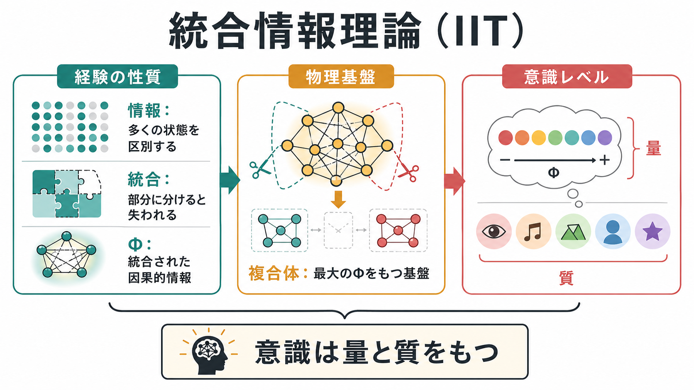
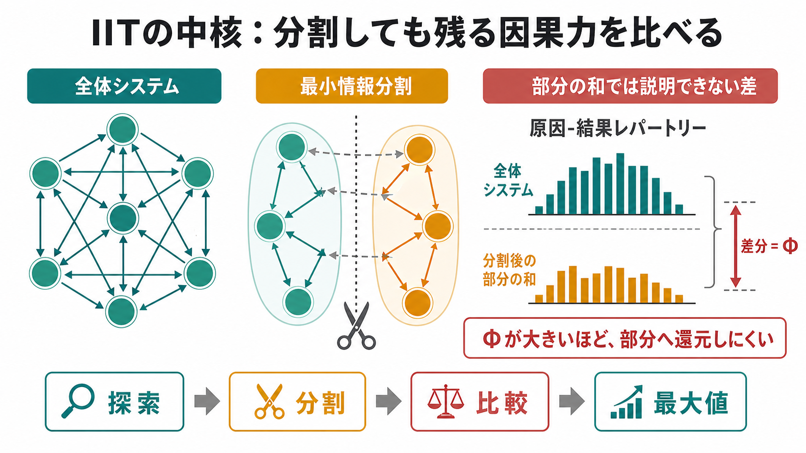
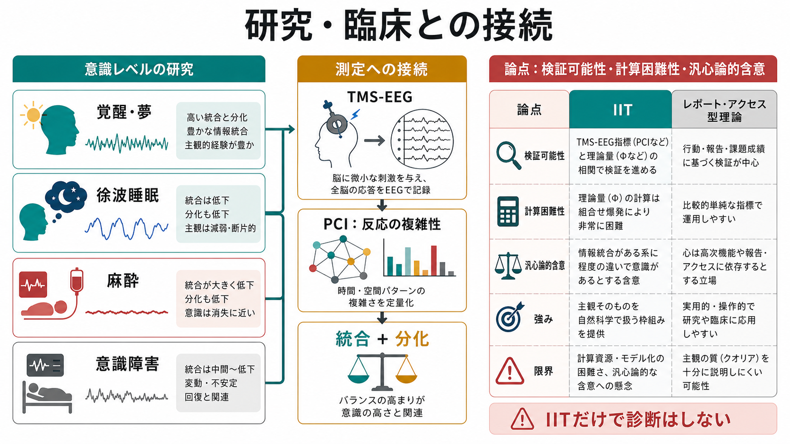

# 統合情報理論とは何か

## 要点

- 統合情報理論、Integrated Information Theory: IIT は、[[意識とは何か|意識]]を「外から観察できる機能」だけでなく、「経験がそれ自身として存在する条件」から説明しようとする理論である。
- 中核は、あるシステムがどれだけ多くの状態を区別できるかという「情報」と、その情報が部分に分けても失われないかという「統合」を同時に考える点にある [1][2]。
- IIT では、意識の量は統合情報量、しばしば $\Phi$ と表記される量に関係し、意識の質は原因-結果構造の形に対応すると考える [2][3]。
- 睡眠、麻酔、意識障害では、脳活動そのものが消えるというより、広域皮質ネットワークの有効結合や応答の複雑性が変化することが重要な手がかりになる [5][6]。
- ただし、IIT は有力な意識理論の一つであって、決着済みの標準理論ではない。計算困難性、検証可能性、汎心論的含意、他理論との比較可能性をめぐる論争が続いている [7][8]。

## この記事で答える問い

1. IIT は何を説明しようとしているのか。
2. 「情報」「統合」「$\Phi$」「複合体」とは何を意味するのか。
3. 脳、睡眠、麻酔、意識障害の研究とどのように接続するのか。
4. IIT を理解するとき、どの論点と限界に注意すべきか。

## まず結論

統合情報理論とは、「意識がある」とは、システムが自分自身の現在状態によって多くの可能状態を区別し、しかもその区別が部分の寄せ集めへ還元できない、という条件で捉える理論である。単に神経活動が多い、情報処理が速い、外界へよく反応する、というだけでは十分ではない。重要なのは、システム全体が一つのまとまりとして、原因と結果の可能性をどれだけ固有に制約しているかである [1][2]。

この見方は、意識研究に二つの強い問いを投げる。第一に、なぜ同じ脳でも覚醒時、夢、深い睡眠、麻酔で主観的経験が変わるのか。第二に、なぜ小脳のように膨大なニューロンをもつ構造よりも、皮質-視床系のような再帰的で統合的なネットワークが意識と深く関係すると考えられるのか。IIT は、この違いを「統合された因果的情報」という観点から説明しようとする [3][5]。

ただし、IIT は「脳の意識メーターが完成した」という話ではない。理論上の $\Phi$ を現実の大規模脳ネットワークで厳密に計算することは難しく、実験で直接測っているのはしばしば近似指標や関連指標である。したがって、IIT は意識の自然科学を進めるための強い枠組みだが、臨床診断や人工システムの意識判定にそのまま使える完成品ではない [4][6][7]。

## 背景

意識研究には、大きく分けて二つの入口がある。一つは、報告、注意、記憶、行動制御、[[ワーキングメモリとは何か|ワーキングメモリ]]などの認知機能から意識を捉える入口である。もう一つは、「赤く見える」「痛い」「音が響く」といった主観的経験そのものの性質から出発する入口である。IIT は後者を強く採る。

Tononi の初期論文は、意識を「情報が統合されていること」として定式化し、意識が段階的で、脳の特定システムに依存し、深い睡眠などで低下するという神経生物学的観察を説明しようとした [1]。その後、IIT 3.0 では、現象的経験の公理から物理システムの要件を導く形に整理され、IIT 4.0 では、存在、内在性、情報、統合、排他性、構成といった性質を物理的・操作的に表す枠組みがさらに洗練された [2][4]。

このため IIT は、単なる「複雑な情報処理ほど意識的」という理論ではない。脳が何を出力するか、何を報告できるかだけでなく、ある物理システムが内在的にどのような原因-結果力をもつかを問う理論である [3][4]。

## 基本概念

### 情報

IIT における情報とは、受け取ったビット数のような外部観察者向けの情報量だけではない。あるシステムの現在状態が、過去と未来の可能な状態をどれだけ特異的に制約するかを指す。たとえば、多くの可能状態の中から「今この状態である」と決まるなら、その状態は他の状態との差異によって意味をもつ [2]。

### 統合

統合とは、その情報がシステム全体として不可分であることを指す。二つの部分に切り分けても、それぞれの部分が独立に同じ情報をもつだけなら、全体としての統合は弱い。逆に、部分に分けると失われる因果的制約があるなら、そのシステムは全体として統合されている [2][3]。

### $\Phi$

$\Phi$ は、システム全体が指定する原因-結果構造と、最小の分割を入れたときに残る構造との差を表す量として理解できる。直感的には、$\Phi$ が大きいほど「部分の和では説明しきれない全体性」が大きい。ただし、実際の IIT ではバージョンによって定義が変化しており、単純な相互情報量やネットワーク密度とは同じではない [2][4]。

### 複合体

複合体 complex とは、ある時空間スケールで最大の統合情報をもつシステムのことである。IIT では、意識は任意の部分に無制限に重複して宿るのではなく、最大の内在的原因-結果力をもつまとまりに対応するとされる。この「排他性」は、個々のニューロン、脳領域、全脳、さらに社会やインターネットのような巨大システムのどれを意識主体とみなすべきかという問題に関わる [3][4]。

## 仕組み

IIT の考え方は、次のように読める。

1. まず、システムの候補を決める。たとえば、ある皮質ネットワーク、ニューロン集団、論理ゲートの集合などである。
2. そのシステムが現在状態にあるとき、過去の可能状態と未来の可能状態をどのように制約するかを調べる。
3. システムにさまざまな分割を入れ、全体の原因-結果構造がどれだけ失われるかを比べる。
4. 最も情報を失わない、つまり最も弱い分割に対しても残る不可分性を評価する。
5. その不可分性が最大になる候補を、意識を支える複合体として扱う。

この流れで重要なのは、IIT が「脳が入力を処理して出力する」ことだけを見ていない点である。外部から同じ入出力に見えるシステムでも、内部の因果構造が異なれば、IIT では意識に関する評価が異なりうる。この点が、機能主義的な理論やグローバル・ワークスペース系の理論との対立点になりやすい [7][8]。

## 図解

| 図 | 読み方 | 対応する本文 |
|---|---|---|
| 概念地図 | 情報、統合、$\Phi$、複合体、意識の量と質を一枚で見る | 要点、基本概念 |
| 分割メカニズム | 全体システムと分割後の部分の和を比べ、残る差分を $\Phi$ と読む | 仕組み |
| 研究・臨床接続 | 睡眠、麻酔、意識障害、TMS-EEG/PCI、論争点を接続する | 臨床・研究との接続、論点 |

## 臨床・研究との接続

IIT が研究に影響を与えた代表例は、意識レベルを「統合と分化の両立」として測ろうとする方向である。Massimini らは TMS と高密度 EEG を用い、覚醒時には刺激反応が皮質内で広がる一方、非 REM 睡眠では局所で消えやすいことを示した [5]。これは、意識低下が単なる活動量低下ではなく、皮質間の有効結合の崩れと関係する可能性を示す。

Casali らの perturbational complexity index: PCI は、TMS で皮質を摂動し、EEG 応答がどれだけ広く、かつ複雑に展開するかを定量化する指標である。PCI は、覚醒、睡眠、麻酔、意識障害の区別に有用な可能性を示し、行動反応に依存しない意識評価の方向を開いた [6]。ただし PCI は IIT の $\Phi$ そのものではなく、統合と分化に関係する経験的指標として読むのが正確である。

臨床的には、意識障害患者の評価、麻酔中の意識、睡眠中の夢経験などが関連する。ただし、IIT や PCI だけで個別診断や治療方針を決めることはできない。実際の評価では、神経学的診察、行動評価、脳波、画像、経時変化、家族情報などを合わせて解釈する必要がある。

## よくある誤解

### 誤解1: IIT は「複雑なシステムなら何でも意識がある」と言っている

IIT は複雑さだけでなく、内在的な原因-結果力と統合を重視する。部品が多くても、相互作用が弱く、部分に分けても失われるものが少ないなら、IIT 的には高い意識を支えるとは限らない [3][4]。

### 誤解2: $\Phi$ は脳活動量の別名である

$\Phi$ は発火率、脳波振幅、代謝量、ネットワーク密度の単純な別名ではない。全体の因果構造が、分割によってどれだけ失われるかに関係する理論量である。活動が大きくても、同期しすぎて状態の分化が乏しい場合や、局所に閉じて統合が弱い場合には、意識を十分に説明できない。

### 誤解3: IIT はすでに臨床診断法である

IIT は臨床評価の発想に影響を与えているが、それ自体が診断基準ではない。PCI などの指標も研究・補助評価として重要でありうるが、個別患者の診断や治療指示は、標準的な臨床評価と専門家の判断に基づく必要がある [6]。

### 誤解4: IIT は完全に実証済み、または完全に疑似科学である

どちらも粗い言い方である。IIT には数理的定式化、神経科学的予測、睡眠・麻酔・意識障害研究との接続がある。一方で、厳密な $\Phi$ 計算の困難さ、反証可能性、人工システムへの適用、機能主義との対立をめぐって強い批判もある [7][8]。現時点では、意識理論の競合的プログラムの一つとして読むのが妥当である。

## 関連ノート

### 既存ノート

- [[意識とは何か]]
- [[知覚とは何か]]
- [[注意とは何か]]
- [[ワーキングメモリとは何か]]
- [[脳波EEGは何を測っているのか]]
- [[MEGはEEGと何が違うのか]]
- [[トランスクラニアル磁気刺激TMSは何をしているのか]]
- [[皮質視床ループは意識や注意にどう関わるのか]]

### 今後の作成候補

- グローバル・ニューロナル・ワークスペース理論とは何か
- 意識の神経相関とは何か
- Perturbational Complexity Index とは何か
- 夢と意識はどう関係するのか
- 汎心論と意識科学はどう関係するのか

### MOC 更新候補

- `content/00_MOC/MOC｜認知科学・心理学.md`
- `content/00_MOC/MOC｜脳・神経科学.md`
- `content/00_MOC/MOC｜数理モデル・計算論.md`

## 理解チェック

1. IIT における「情報」は、日常的な情報量や外部観察者向けの通信量とどう違うか。
2. システムを分割したときに失われるものを調べるのはなぜか。
3. $\Phi$ を「脳活動の多さ」と同一視すると、どの点を見落とすか。
4. PCI は IIT の $\Phi$ そのものではないが、どの意味で IIT 的発想と関係するか。
5. IIT をめぐる検証可能性や汎心論的含意の論争は、意識研究にどのような問いを残しているか。

## 未解決問題

- 現実の大規模な脳ネットワークで、IIT の理論量をどこまで計算可能な形に近似できるのか。
- IIT、グローバル・ワークスペース理論、高次表象理論、予測処理系の理論を、同じ実験デザインでどう比較するか。
- 人工知能、培養神経系、動物、発達初期の乳児に対して、どのような意識評価基準を採るべきか。
- 主観的経験の「質」を、神経活動・行動報告・数理モデルのどれとどの粒度で対応づけるべきか。

## 参考文献

[1] Tononi, G. (2004). An information integration theory of consciousness. *BMC Neuroscience*, 5, 42. https://doi.org/10.1186/1471-2202-5-42

[2] Oizumi, M., Albantakis, L., & Tononi, G. (2014). From the phenomenology to the mechanisms of consciousness: integrated information theory 3.0. *PLOS Computational Biology*, 10(5), e1003588. https://doi.org/10.1371/journal.pcbi.1003588

[3] Tononi, G., Boly, M., Massimini, M., & Koch, C. (2016). Integrated information theory: from consciousness to its physical substrate. *Nature Reviews Neuroscience*, 17, 450-461. https://doi.org/10.1038/nrn.2016.44

[4] Albantakis, L., Barbosa, L., Findlay, G., Grasso, M., Haun, A. M., Marshall, W., et al. (2023). Integrated information theory (IIT) 4.0: Formulating the properties of phenomenal existence in physical terms. *PLOS Computational Biology*, 19(10), e1011465. https://doi.org/10.1371/journal.pcbi.1011465

[5] Massimini, M., Ferrarelli, F., Huber, R., Esser, S. K., Singh, H., & Tononi, G. (2005). Breakdown of cortical effective connectivity during sleep. *Science*, 309(5744), 2228-2232. https://doi.org/10.1126/science.1117256

[6] Casali, A. G., Gosseries, O., Rosanova, M., Boly, M., Sarasso, S., Casali, K. R., et al. (2013). A theoretically based index of consciousness independent of sensory processing and behavior. *Science Translational Medicine*, 5(198), 198ra105. https://doi.org/10.1126/scitranslmed.3006294

[7] Doerig, A., Schurger, A., & Herzog, M. H. (2021). Hard criteria for empirical theories of consciousness. *Cognitive Neuroscience*, 12(2), 41-62. https://doi.org/10.1080/17588928.2020.1772214

[8] Tononi, G., Albantakis, L., Barbosa, L., Boly, M., Cirelli, C., Comolatti, R., et al. (2025). Consciousness or pseudo-consciousness? A clash of two paradigms. *Nature Neuroscience*, 28, 694-702. https://doi.org/10.1038/s41593-025-01880-y
