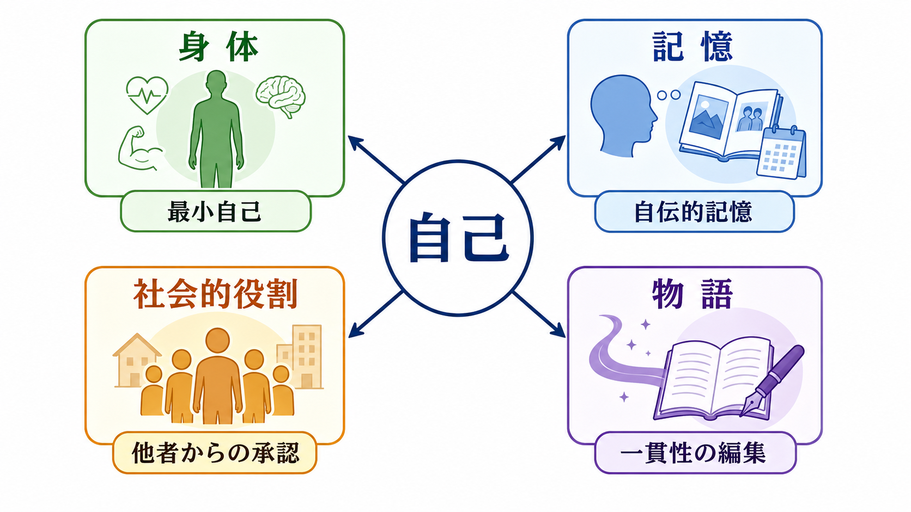
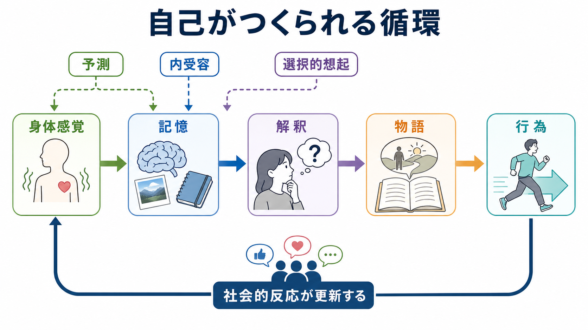
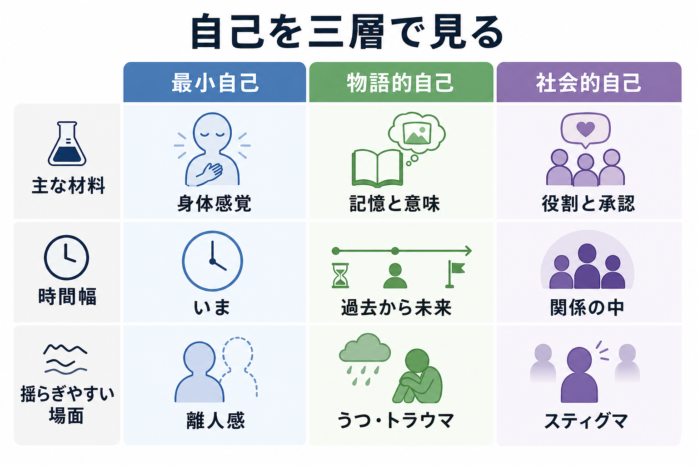

# 自己とは何か

## 要点

- 自己は、脳内のどこかにある単一の「実体」ではなく、身体感覚、行為主体感、記憶、社会的役割、語りを統合して保たれる動的な構成である。
- 認知科学では、いまここで「この身体・この行為は私のものだ」と感じる[[最小自己とは何か|最小自己]]と、時間をまたいで「私はこういう人間だ」と理解する物語的自己を区別することが多い [1]。
- 身体は自己の土台である。内受容、固有受容、視覚、触覚、運動予測が組み合わさることで、身体所有感や行為主体感が生まれる [2][3]。
- 記憶は過去の記録をそのまま保存する倉庫ではなく、現在の目標や関心に応じて再構成される。したがって、自己物語も固定された履歴ではなく、想起のたびに更新される [4][5]。
- 社会的自己は、役割、所属集団、承認、スティグマ、他者からの期待の中で形成される。自己理解は一人称の内面だけでなく、対人関係と制度の中にも埋め込まれている [6]。

## この記事で答える問い

1. 「自己」と「意識」は同じものなのか。
2. 身体感覚や行為感は、自己のどの部分を支えているのか。
3. 記憶と物語は、なぜ自己の連続性を生み出すのか。
4. 社会的役割や他者の反応は、自己概念をどのように変えるのか。
5. 離人感、うつ、トラウマ、精神病症状の研究では、自己のどの側面が問題になるのか。

## まず結論

自己とは、「私」という名前で呼ばれる単一の中心ではなく、複数の処理が重なった実用的なまとまりである。最も基礎には、身体がここにあり、感覚や行為が自分に属しているという前反省的な自己感がある。その上に、エピソード記憶、意味記憶、目標、価値観が組み合わさり、「私はどこから来て、何を大事にし、これからどう生きるのか」という物語が作られる。さらに、家族、職業、ジェンダー、文化、診断名、所属集団などの社会的カテゴリーが、自己理解の輪郭を与える。

このため、自己について考えるときは「本当の自分」を一つ探すよりも、どの層の自己を問題にしているのかを分ける方が有用である。たとえば、離人感では「自分の身体や感情が自分のものに感じられない」という最小自己の揺らぎが前景化することがある。一方、うつ病やトラウマでは、過去の出来事の意味づけ、将来像、自己評価が硬直し、物語的自己が狭くなることがある。社会的排除やスティグマでは、社会的自己が脅かされ、それが感情、行動、身体感覚にまで影響する。

## 背景

日常語の「自己」は幅が広い。自分の身体を指すこともあれば、性格、記憶、名前、価値観、職業、責任、人生の物語を指すこともある。この多義性は混乱の原因になるが、同時に重要な手がかりでもある。自己は、身体だけでも、記憶だけでも、社会的役割だけでも説明できない。

哲学と認知科学の接点では、Gallagher が「最小自己」と「物語的自己」を区別した [1]。最小自己は、時間的に厚い自伝ではなく、経験が一人称的に与えられるという薄い自己感である。物語的自己は、記憶、言語、社会的承認を通じて構成される、時間的に広がった自己理解である。この区別は、[[意識とは何か]]、[[主観的経験は科学的に扱えるのか]]、[[身体症状症は脳の予測処理で説明できるのか]]と接続する。

## 基本概念

### 最小自己

最小自己とは、「この経験は私に起きている」「この身体は私の身体である」「この行為は私が起こしている」といった、反省以前の自己感である [1]。ここには少なくとも二つの要素がある。

身体所有感は、身体や身体部位が自分のものとして感じられることである。行為主体感は、自分がある行為を引き起こしていると感じることである。両者は近いが同じではない。自分の手は自分のものだと感じても、けいれんのように自分の意図で動かしていないと感じることがある。逆に、道具を操作しているときには、道具そのものは身体ではないが、行為の制御範囲に入っているように感じることがある。

### 身体的自己

身体的自己は、内受容、固有受容、触覚、視覚、前庭感覚、運動予測の統合に支えられる。Seth と Tsakiris は、自己性の身体的基盤を、単なる外界知覚ではなく、生命維持に関わる身体状態の予測と調整に結びつけて論じている [2]。つまり、自己は「頭の中の表象」だけでなく、心拍、呼吸、緊張、疲労、痛み、姿勢のような身体状態に深く根ざしている。

この観点は、[[体性感覚ネットワークは身体情報をどう表現するのか]]、[[自律神経ネットワークは内臓状態をどう制御するのか]]、[[予測処理とは何か]]とよく接続する。

### 記憶的自己

記憶的自己とは、自分の過去をどのように想起し、現在の目標や価値観と結びつけるかによって形づくられる自己である。Conway と Pleydell-Pearce の自己記憶システムでは、自伝的記憶は固定的なデータベースではなく、現在の「作業自己」の目標によって検索・構成されるものとされる [4]。そのため、同じ出来事でも、現在の気分、関係、課題、臨床状態によって思い出され方が変わる。

この点は、[[エピソード記憶とは何か]]、[[長期記憶とは何か]]、[[想起は記憶を変えるのか]]と関連する。

### 物語的自己

物語的自己は、人生の出来事を意味ある系列としてまとめる自己理解である。McAdams と McLean は、物語的アイデンティティを、再構成された過去と想像された未来を統合し、人生に統一性と目的を与える内面化された物語として整理している [5]。ここで重要なのは、物語が単なる作り話ではなく、感情調整、目標設定、対人関係、成熟、心理的適応に関わる実践的な枠組みだという点である。

### 社会的自己

社会的自己は、他者や集団の中で成立する自己である。人は、家族の一員、学生、研究者、患者、支援者、専門職、特定の文化やコミュニティの成員として自分を理解する。社会的アイデンティティ研究では、所属集団へのコミットメントや社会的文脈が、自己評価、脅威への反応、感情、行動を大きく左右するとされる [6]。これは[[社会的認知とは何か]]と直接つながる。

## 仕組み

自己は、下から上へ一方向に積み上がるだけではない。身体感覚、記憶、解釈、物語、行為、社会的反応が循環しながら更新される。

### 1. 身体感覚が「私の場所」を与える

自己の最初の足場は、身体がここにあるという感覚である。ラバーハンド錯覚の研究では、見えているゴムの手と自分の隠れた手に同期した触覚刺激が与えられると、ゴムの手が自分の身体の一部のように感じられることがある [3]。これは身体所有感が固定されたものではなく、視覚、触覚、固有受容、既存の身体表象の整合性から推定されることを示す。

### 2. 予測と行為が「私がしている」を作る

行為主体感は、意図、運動指令、感覚フィードバック、結果予測の一致に依存する。予測した結果と実際の結果がよく一致すると、「自分が起こした」と感じやすい。逆に、遅延、予期しない結果、外部からの操作感が強い場合、行為主体感は弱くなる。この問題は、[[妄想は予測誤差処理の異常として説明できるのか]]や統合失調症スペクトラムにおける作為体験の理解にも関係する。

### 3. 記憶が「私は同じ人である」を支える

自己の連続性は、過去の出来事が保存されているからだけではなく、それらが現在の自己理解に沿って検索され、編集されるから成り立つ [4]。子どものころの経験、成功、失敗、喪失、関係性は、その時点の意味だけでなく、後から作られる物語の中で位置づけ直される。

### 4. 物語が「私はこういう人間だ」を与える

物語は、ばらばらの出来事を因果、価値、目的の系列にまとめる。たとえば「私は失敗ばかりしてきた」という物語と、「困難を通じて学んできた」という物語では、同じ出来事でも感情と未来予測が変わる。物語的自己は心理的適応と関連するが、どの物語が望ましいかは文化や状況によっても変わる [5]。

### 5. 他者の反応が自己を更新する

自己は内面で完結しない。呼び名、評価、役割、診断、称賛、差別、期待は、本人の自己理解に入ってくる。社会的アイデンティティが脅かされると、所属集団への反応、自己防衛、回避、怒り、恥、連帯などが生じうる [6]。したがって、自己を扱う臨床や研究では、個人内の認知だけでなく、対人関係と社会環境を切り離さないことが重要である。

## 図解

| 層 | 中心となる材料 | 時間幅 | 揺らぎやすい例 |
|---|---|---|---|
| 最小自己 | 身体所有感、行為主体感、内受容、固有受容 | いまここ | 離人感、作為体験、身体所有感の変化 |
| 記憶的自己 | 自伝的記憶、目標、意味づけ | 過去から現在 | 抑うつ的想起、トラウマ記憶、記憶の再固定化 |
| 物語的自己 | 人生の筋書き、価値観、将来像 | 過去から未来 | 希望の喪失、自己物語の硬直、アイデンティティ危機 |
| 社会的自己 | 役割、所属、承認、文化、制度 | 関係と文脈 | スティグマ、排除、役割喪失、社会的脅威 |

## 臨床・研究との接続

### 離人感・現実感消失

離人感では、自分の身体、感情、思考、記憶が自分のものとして感じられにくくなる。現実感消失では、周囲の世界が夢のよう、映画のよう、遠いもののように感じられる。これらは、自己の全体が失われるというより、身体的自己、感情的自己、現実感の統合が一時的または持続的に変化する現象として理解できる。Sierra と Berrios は、離人感を感覚、情動、身体イメージ、自己経験の変化と結びつけて整理している [8]。ただし、ここでの説明は教育・研究目的であり、個別の診断や治療指示ではない。

### うつと自己物語

うつ状態では、自己評価が否定的になり、過去の失敗が選択的に想起され、未来が閉ざされたものとして予測されやすい。これは「自分は価値がない」という単一の信念だけでなく、記憶検索、注意、身体疲労、社会的撤退、将来イメージが結びついた物語的自己の狭まりとしても読める。関連して、[[報酬系の異常はうつ病をどう説明するのか]]、[[神経可塑性低下はうつ病をどう説明するのか]]が参照できる。

### トラウマと自己の連続性

トラウマ経験は、身体反応、記憶、感情、対人安全感、自己評価を同時に揺さぶる。[[PTSDでは恐怖記憶ネットワークに何が起きているのか]]で扱うように、恐怖記憶は単なる過去の記録ではなく、現在の身体反応や脅威予測として再活性化されうる。トラウマ臨床で「私は以前の私ではない」と語られることがあるのは、物語的自己だけでなく、身体的安全感と社会的信頼が変化するためでもある。

### 神経科学での自己関連処理

自己関連刺激の処理には、内側前頭前野、前部・後部帯状皮質、楔前部などの皮質正中構造が関わるとされる [7]。これらは[[デフォルトモードネットワークとは何か]]とも重なる。ただし、「自己の場所」が脳内の一領域にあるという意味ではない。神経科学が扱っているのは、自己に関連した評価、モニタリング、統合、記憶、内的シミュレーションのネットワークである。

## よくある誤解

### 誤解1: 自己は脳内にある小さな観察者である

自己を説明するとき、頭の中に「私を見ている私」がいるように考えたくなる。しかし、それでは説明すべき自己をもう一度内側に置くだけになる。認知科学では、自己を小さな観察者ではなく、身体、予測、記憶、行為、社会的反応を統合する処理のまとまりとして扱う。

### 誤解2: 本当の自己は社会的役割の下に隠れている

社会的役割は、単なる仮面ではない。もちろん、役割が本人を押しつぶすことはある。しかし、言語、名前、所属、承認、責任、文化がなければ、物語的自己の多くは成立しない。自己は社会に汚染されるのではなく、社会の中で形を得る。

### 誤解3: 記憶が正確なら自己も安定する

自己の連続性は、記憶の正確さだけで保たれるわけではない。記憶は現在の目標、感情、社会的文脈に応じて再構成される [4]。重要なのは、記憶が完全な録画であることではなく、現在の生活と矛盾しすぎない形で意味づけられ、必要に応じて更新されることである。

### 誤解4: 自己を強く持つほど健康である

硬すぎる自己物語は、変化への適応を妨げることがある。「私はこういう人間だから変われない」という物語は、安心を与える一方で、学習や回復を狭める。自己には一貫性だけでなく、状況に応じて更新できる柔軟性も必要である。

## 関連ノート

### 既存ノート

- [[意識とは何か]]
- [[最小自己とは何か]]
- [[主観的経験は科学的に扱えるのか]]
- [[体性感覚ネットワークは身体情報をどう表現するのか]]
- [[予測処理とは何か]]
- [[エピソード記憶とは何か]]
- [[長期記憶とは何か]]
- [[想起は記憶を変えるのか]]
- [[社会的認知とは何か]]
- [[デフォルトモードネットワークとは何か]]
- [[PTSDでは恐怖記憶ネットワークに何が起きているのか]]

### 今後の作成候補

- 身体所有感とは何か
- 行為主体感とは何か
- 物語的自己とは何か
- 社会的アイデンティティとは何か
- 離人感とは何か
- 自伝的記憶とは何か

### MOC更新候補

- `content/00_MOC/MOC｜認知科学・心理学.md`
- `content/00_MOC/MOC｜倫理・哲学・社会.md`
- `content/00_MOC/MOC｜精神医学.md`

## 理解チェック

1. 最小自己と物語的自己は、時間幅と構成材料の点でどのように違うか。
2. 身体所有感と行為主体感は、なぜ同じものではないのか。
3. 自伝的記憶が「再構成」されるとは、自己理解にとって何を意味するか。
4. 社会的役割は、自己にとって単なる外側のラベルではない。なぜか。
5. 離人感やトラウマを、自己の複数層の揺らぎとして見ると何が理解しやすくなるか。

## 未解決問題

- 最小自己、物語的自己、社会的自己を、同じ実験パラダイムや計算モデルでどこまで接続できるのか。
- 身体的自己の変化と、語りとしての自己理解の変化は、どの時間スケールで相互作用するのか。
- 自己物語の柔軟性を高める介入は、どのような臨床群で有効で、どのような場合に逆効果になりうるのか。
- 文化差、制度、スティグマが自己関連処理の神経・認知指標に及ぼす影響を、どのように測定できるのか。

## 参考文献

[1] Gallagher, S. (2000). Philosophical conceptions of the self: implications for cognitive science. *Trends in Cognitive Sciences*, 4(1), 14-21. https://doi.org/10.1016/S1364-6613(99)01417-5

[2] Seth, A. K., & Tsakiris, M. (2018). Being a beast machine: the somatic basis of selfhood. *Trends in Cognitive Sciences*, 22(11), 969-981. https://doi.org/10.1016/j.tics.2018.08.008

[3] Tsakiris, M., & Haggard, P. (2005). The rubber hand illusion revisited: visuotactile integration and self-attribution. *Journal of Experimental Psychology: Human Perception and Performance*, 31(1), 80-91. https://doi.org/10.1037/0096-1523.31.1.80

[4] Conway, M. A., & Pleydell-Pearce, C. W. (2000). The construction of autobiographical memories in the self-memory system. *Psychological Review*, 107(2), 261-288. https://doi.org/10.1037/0033-295X.107.2.261

[5] McAdams, D. P., & McLean, K. C. (2013). Narrative identity. *Current Directions in Psychological Science*, 22(3), 233-238. https://doi.org/10.1177/0963721413475622

[6] Ellemers, N., Spears, R., & Doosje, B. (2002). Self and social identity. *Annual Review of Psychology*, 53, 161-186. https://doi.org/10.1146/annurev.psych.53.100901.135228

[7] Northoff, G., & Bermpohl, F. (2004). Cortical midline structures and the self. *Trends in Cognitive Sciences*, 8(3), 102-107. https://doi.org/10.1016/j.tics.2004.01.004

[8] Sierra, M., & Berrios, G. E. (1998). Depersonalization: neurobiological perspectives. *Biological Psychiatry*, 44(9), 898-908. https://doi.org/10.1016/S0006-3223(98)00015-8
