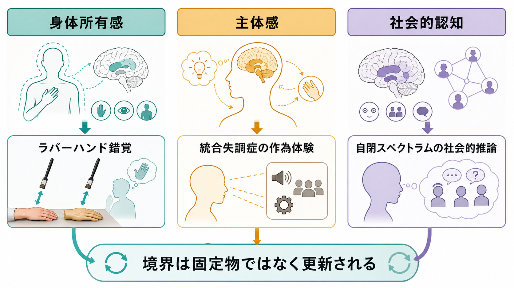

# 自己と他者はどのように区別されるのか

## 要点

- 自己と他者の区別は、頭の中に固定された境界線があるからではなく、身体感覚、行為の予測、記憶、他者との相互作用が、そのつど統合されることで成立する。
- 「これは自分が起こした感覚だ」と感じるには、運動意図から生じる予測と、実際に返ってくる感覚入力の一致が重要である。自分で自分をくすぐりにくいことは、この仕組みの代表例である [2]。
- [[最小自己とは何か|最小自己]]の水準では、身体所有感と主体感が中心になる。身体所有感は「この身体は自分のものだ」という感覚、主体感は「この行為を自分が起こした」という感覚である [1][3]。
- [[物語的自己とは何か|物語的自己]]や社会的認知の水準では、他者の視点、言語、記憶、文化的役割が、自己理解を更新する。
- 統合失調症スペクトラムの作為体験、自閉スペクトラムの社会的推論、離人感、身体錯覚の研究は、自己他者境界が単一の機能ではなく、複数の処理の組み合わせであることを示す。ただし、これらは個別診断や治療指示ではなく、研究上の説明枠組みとして扱う。

## この記事で答える問い

1. 「自分がしたこと」と「他者がしたこと」は、どのように分けられるのか。
2. 身体所有感と主体感は、自己他者境界にどのように関わるのか。
3. 感覚予測と予測誤差は、なぜ主体感の説明で重要なのか。
4. 社会的認知や他者理解は、自己の境界をどのように変えるのか。
5. 臨床・研究では、この境界の揺らぎをどのように慎重に読むべきか。

## まず結論

自己と他者の区別は、「内側が自己、外側が他者」という単純な空間境界ではない。むしろ、脳と身体は、行為を起こす前から「この行為をすれば、どのような感覚が返ってくるはずか」を予測している。予測された感覚と実際の感覚がよく合えば、その出来事は自己由来としてまとまりやすい。ずれが大きければ、外部由来、他者由来、あるいはまだ解釈できない出来事として扱われやすくなる [2][3]。

ただし、この説明だけでは不十分である。自己他者境界は、手を動かす、触れられる、声を聞くといった短い時間幅の処理だけでなく、他者からどう見られるか、過去の経験をどう語るか、共同注意や心の理論をどう使うかにも支えられる [6][8]。つまり、自己とは[[自己とは何か|自己]]の中に閉じた実体ではなく、身体、行為、記憶、他者との関係が重なって作られる動的なまとまりである。

## 背景

日常生活では、自己他者境界はほとんど意識されない。自分で腕を上げたときには「腕が勝手に上がった」とは通常感じない。自分の声を話しているときには、録音された声ほど奇妙には聞こえにくい。誰かに肩を叩かれたときには、同じ皮膚刺激でも「自分で触った」のではなく「他者に触られた」と感じる。

この当たり前さは、実はかなり複雑な処理に支えられている。哲学と認知科学では、自己を、時間的に厚い物語としての自己と、いまここで経験が自分に属しているという最小自己に分けて考えることが多い [1]。この記事では、自己他者境界をとくに次の三つの層から整理する。

| 層 | 中心となる問い | 代表的な手がかり |
|---|---|---|
| 感覚予測 | この感覚は自分の行為から生じたのか | 遠心性コピー、予測誤差、感覚減衰 |
| 身体所有感・主体感 | この身体・行為は自分のものか | 視触覚同期、運動意図、フィードバック |
| 社会的認知 | 他者の心と自己の心をどう分けるか | 共同注意、心の理論、視点取得、記憶 |

## 基本概念

### 自己他者境界

自己他者境界とは、経験、身体、行為、感情、思考、意図について、「これは自分に属する」「これは他者や外界に由来する」と区別する働きである。重要なのは、境界が一つの線ではなく、複数の判断の束だという点である。

たとえば、相手の悲しみに共感して自分も胸が痛むとき、その感情は自分の身体に生じている。しかし、通常は「これは相手の状況に反応して生じた感情だ」と理解できる。ここでは感情は自分の中にあるが、原因や参照先は他者に向けられている。自己他者境界は、内外の単純な仕分けではなく、所有、原因、視点、意味づけを組み合わせた分類である。

### 身体所有感

身体所有感は、「この身体、またはこの身体部位は自分のものだ」と感じることである。ラバーハンド錯覚では、隠された本物の手と見えているゴムの手を同期して刺激すると、ゴムの手が自分の手のように感じられることがある [4]。これは身体所有感が固定的な身体地図だけでなく、視覚、触覚、固有感覚の時間的・空間的統合によって更新されることを示す。

### 主体感

主体感は、「この行為を自分が起こしている」と感じることである。主体感は、単に「動いた」という感覚ではない。運動意図、運動指令、予測された結果、実際の感覚フィードバック、文脈的な解釈が組み合わさって成立する。Synofzik らは、主体感を低次の感覚的な「feeling of agency」と、高次の判断としての「judgment of agency」に分けて考える必要を指摘した [3]。

### 遠心性コピーと予測誤差

運動指令が出るとき、脳は筋肉に命令を送るだけでなく、その命令のコピーを使って「これからどのような感覚が返ってくるか」を予測すると考えられる。このコピーを遠心性コピーと呼ぶ。予測と実際の感覚入力の差が予測誤差である。

予測誤差が小さいと、感覚は自己由来として処理されやすく、感覚の強さも抑制されやすい。自分で自分をくすぐりにくいのは、自分の運動によって生じる触覚が予測され、感覚反応が弱められるためだと説明される [2]。

## 仕組み

### 1. 行為の前に、感覚結果が予測される

自己由来の行為では、感覚入力が生じる前に、運動意図と運動指令から感覚結果が予測される。たとえば、右手で左手に触れるとき、脳は「このタイミングで、この位置に、この程度の触覚が返ってくるはずだ」と見積もる。

この予測は、実際の感覚入力と比較される。一致が高ければ、入力は自己由来として説明されやすい。逆に、予測していないタイミングで触覚が生じたり、予測と異なる方向から刺激が来たりすれば、他者や外界からの出来事として処理されやすい [2][3]。

### 2. 身体所有感は、多感覚統合によって更新される

身体所有感は、身体図式が一度作られれば終わりではない。視覚、触覚、固有感覚、内受容感覚が、現在の文脈の中で統合され続ける。ラバーハンド錯覚では、見えているゴムの手と隠された本物の手に同期した触覚刺激が与えられると、「見えている手」と「感じている手」が同じ出来事として統合されやすくなる [4][5]。

この錯覚は、自己身体の境界が意外に柔軟であることを示す。ただし、何でも自分の身体になるわけではない。手らしい形、解剖学的にもっともらしい位置、刺激の同期、既存の身体表象との整合性が重要である [5]。

### 3. 主体感は、低次の感覚と高次の解釈に分かれる

主体感は一枚岩ではない。行為中に「自分が動かしている」と即時に感じる水準と、後から「これは自分がしたことだ」と判断する水準がある。前者は感覚予測とフィードバックに強く依存し、後者は意図、目標、社会的文脈、言語的説明に影響される [3]。

この区別は、錯覚や臨床現象を理解するうえで重要である。ある人が「自分の身体が動いた」と感じていても、「自分がその行為を起こした」とは感じられないことがある。逆に、感覚フィードバックが不完全でも、文脈や意図から「自分がやった」と判断される場合もある。

### 4. 他者理解は、自己モデルを更新する

自己と他者の区別は、行為や身体だけでなく、社会的認知にも支えられる。人は、他者の視線、表情、声、行為の目標を読み取りながら、「相手は何を感じ、何を意図しているのか」を推論する。このとき、自己の身体や感情のシミュレーションが使われる一方で、「これは相手の状態であって、自分の状態そのものではない」という区別も必要になる [6]。

心の理論やメンタライジングの研究では、自己の信念と他者の信念を分ける能力が重要視される [8]。たとえば、相手が誤った信念を持っていることを理解するには、自分が知っている事実と、相手が見ている世界を分離しなければならない。

## 図解

| 図 | 読み方 |
|---|---|
| 概念地図 | 自己他者境界を、身体感覚、行為予測、言語・記憶、共同注意、他者応答の統合として読む。 |
| メカニズム図 | ラバーハンド錯覚を、同期刺激と共通原因推定による身体所有感の変化として読む。 |
| 研究・臨床接続 | 身体所有感、主体感、社会的認知が、それぞれ研究パラダイムや臨床的現象に接続する様子を見る。 |

## 臨床・研究との接続

### 統合失調症スペクトラムと作為体験

統合失調症スペクトラムでは、思考、声、身体運動が自分のものとして自然にまとまる感覚が揺らぐことがある。作為体験では、自分の行為であるはずの運動や思考が、外部から操作されているように感じられることがある。Frith は、こうした現象を、行為のモニタリングや予測に関わる障害として理解する枠組みを提示した [7]。

ただし、作為体験を「予測誤差だけ」で説明するのは単純化しすぎである。実際には、感覚予測、注意、信念形成、社会的意味づけ、症状の持続、苦痛の程度が重なる。教育・研究目的では、自己他者境界の揺らぎを理解する手がかりになるが、個別の診断や治療方針をこの説明だけで決めることはできない。

### 自閉スペクトラムと社会的推論

自閉スペクトラムでは、他者の意図、視線、暗黙の文脈を読むことが難しい場合がある。ただし、これは「他者の心が分からない」と単純化すべきではない。社会的推論には、注意の向け方、感覚特性、言語処理、経験、環境側の分かりやすさが関わる。自己と他者の視点を分ける課題は、メンタライジング研究の重要な対象である [8]。

ここでも重要なのは、臨床的ラベルと認知メカニズムを混同しないことである。同じ診断名の中にも多様な認知スタイルがあり、同じ課題成績でも背景は異なる。自己他者境界の研究は、支援環境やコミュニケーション設計を考える材料にはなるが、本人の経験を外側から断定する道具ではない。

### 身体錯覚とリハビリテーション研究

ラバーハンド錯覚や全身錯覚の研究は、身体所有感がどの条件で更新されるかを調べる方法として使われる。リハビリテーションや身体認知の研究では、視覚フィードバック、触覚刺激、運動イメージ、仮想現実などを使い、身体表象をどのように支援できるかが検討されている [5]。

この領域でも、錯覚が強く起きることを「よい」「悪い」と単純に評価しない方がよい。身体所有感の柔軟性は学習や回復に役立つ可能性がある一方、過度な混乱や苦痛を伴う場合には慎重な評価が必要になる。

## よくある誤解

### 誤解1: 自己と他者の境界は、脳内の一か所で決まる

自己他者境界は、単一の脳部位や単一の機能で決まるわけではない。感覚予測、身体表象、行為モニタリング、記憶、言語、社会的推論が重なっている。したがって、「ここが自己の場所である」というより、「どの処理がどの文脈で自己由来性を支えているのか」と問う方が正確である。

### 誤解2: 予測が一致すれば、必ず自己由来と判断される

予測と入力の一致は重要だが、それだけで自己由来性が決まるわけではない。文脈、意図、注意、他者の存在、過去経験が関わる。たとえば、同じ触覚刺激でも、実験室で受ける刺激、親しい人からの接触、予期しない接触では意味づけが異なる。

### 誤解3: 共感は自己他者境界を消す

共感では、他者の感情を自分の身体や感情システムを通して理解することがある。しかし、健康な共感には「これは相手の状態である」という区別も必要である。自己他者境界が弱すぎると、他者の苦痛に巻き込まれすぎることがある。逆に境界が硬すぎると、他者の視点を柔軟に取ることが難しくなる。

### 誤解4: 自己他者境界の揺らぎは、すぐ病理を意味する

自己他者境界は日常的にも揺らぐ。没入、共同作業、音楽演奏、スポーツ、瞑想、強い疲労、睡眠不足、ストレスでも、主体感や身体感覚は変化する。臨床的に問題になるかどうかは、持続性、苦痛、生活への影響、本人の解釈、周囲の支援状況を含めて慎重に見る必要がある。

## 関連ノート

### 既存ノート

- [[自己とは何か]]
- [[最小自己とは何か]]
- [[物語的自己とは何か]]
- [[意識とは何か]]
- [[主観的経験は科学的に扱えるのか]]

### 今後の作成候補

- 身体所有感とは何か
- 主体感とは何か
- ラバーハンド錯覚とは何か
- 遠心性コピーとは何か
- 心の理論とは何か
- メンタライジングとは何か
- 作為体験とは何か

### MOC更新候補

- `content/00_MOC/MOC・認知科学・心理学.md`
- `content/00_MOC/MOC・脳・神経科学.md`
- `content/00_MOC/MOC・精神医学.md`

## 理解チェック

1. 身体所有感と主体感は、どちらも自己感に関わるが、何を区別しているか。
2. 自分で自分をくすぐりにくい現象は、感覚予測のどの働きを示しているか。
3. ラバーハンド錯覚は、身体所有感が固定的ではないことをどのように示すか。
4. 主体感を、低次の感覚と高次の判断に分けると何が見えやすくなるか。
5. 自己他者境界の揺らぎを、すぐ病理とみなしてはいけない理由は何か。

## 未解決問題

- 感覚予測、身体所有感、社会的認知は、どの発達段階でどのように結びつくのか。
- 主体感の「感じ」と「判断」は、実験的にどこまで分離できるのか。
- 文化、言語、対人関係は、自己他者境界の柔軟性にどの程度影響するのか。
- 臨床的な自己感の揺らぎに対して、どの介入がどのメカニズムに作用しているのか。

## 参考文献

[1] Gallagher, S. (2000). Philosophical conceptions of the self: Implications for cognitive science. *Trends in Cognitive Sciences*, 4(1), 14-21. https://doi.org/10.1016/S1364-6613(99)01417-5

[2] Blakemore, S.-J., Wolpert, D. M., & Frith, C. D. (2000). Why can't you tickle yourself? *NeuroReport*, 11(11), R11-R16. https://doi.org/10.1097/00001756-200008030-00002

[3] Synofzik, M., Vosgerau, G., & Newen, A. (2008). Beyond the comparator model: A multifactorial two-step account of agency. *Consciousness and Cognition*, 17(1), 219-239. https://doi.org/10.1016/j.concog.2007.03.010

[4] Botvinick, M., & Cohen, J. (1998). Rubber hands “feel” touch that eyes see. *Nature*, 391, 756. https://doi.org/10.1038/35784

[5] Tsakiris, M. (2010). My body in the brain: A neurocognitive model of body-ownership. *Neuropsychologia*, 48(3), 703-712. https://doi.org/10.1016/j.neuropsychologia.2009.09.034

[6] Decety, J., & Sommerville, J. A. (2003). Shared representations between self and other: A social cognitive neuroscience view. *Trends in Cognitive Sciences*, 7(12), 527-533. https://doi.org/10.1016/j.tics.2003.10.004

[7] Frith, C. D. (2005). The self in action: Lessons from delusions of control. *Consciousness and Cognition*, 14(4), 752-770. https://doi.org/10.1016/j.concog.2005.04.002

[8] Frith, C. D., & Frith, U. (2006). The neural basis of mentalizing. *Neuron*, 50(4), 531-534. https://doi.org/10.1016/j.neuron.2006.05.001
