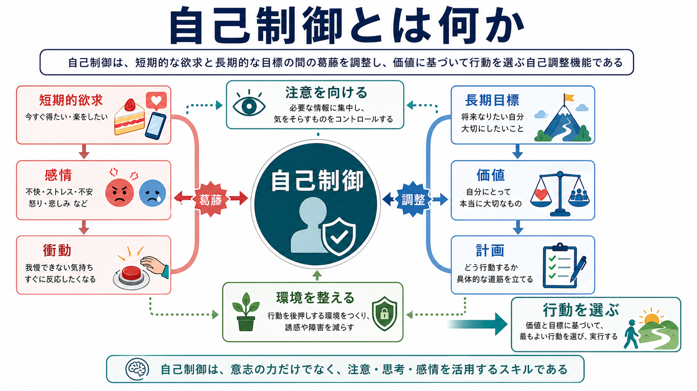
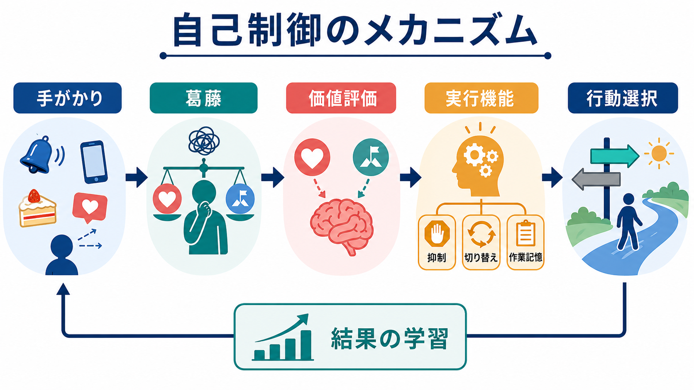
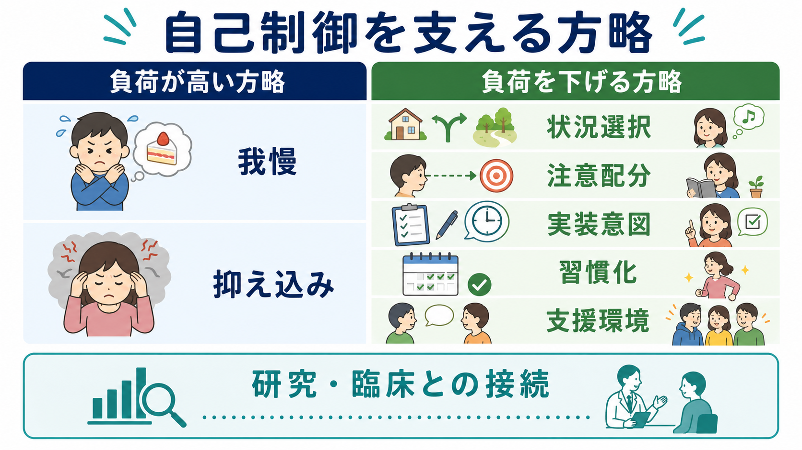

# 自己制御とは何か

## 要点

- 自己制御とは、目の前の欲求・感情・習慣的反応を、長期目標や価値に照らして調整する[[自己とは何か|自己]]の機能である。
- 「衝動を力で抑え込むこと」だけではなく、注意の向け方、状況選択、計画、習慣化、環境設計まで含む。
- 実行機能、価値評価、感情調整、学習、社会的文脈が相互に関わるため、単一の能力として測ることには限界がある。
- 臨床・教育・健康行動では、本人の意志だけに還元せず、環境と支援を含めて設計する必要がある。

## この記事で答える問い

1. 自己制御とは何を制御しているのか。
2. 自己制御は「我慢」や「意志力」と同じなのか。
3. 脳・認知・感情・環境はどのように関わるのか。
4. 研究や臨床で自己制御を扱うとき、どこに注意すべきか。

## まず結論

自己制御とは、短期的な欲求や感情反応と、長期的な目標・価値・社会的要請とのあいだに葛藤が生じたとき、行動を目標に近づく方向へ調整するプロセスである。近年の研究では、自己制御は「内側の衝動を抑圧する筋力」のようなものではなく、目標設定、注意、実行機能、価値評価、習慣、環境設計が統合された自己調整システムとして理解されることが多い[1]。

## 背景

自己制御は、古くは「誘惑に勝つ」「忍耐する」「意志が強い」といった日常語で語られてきた。心理学では、遅延報酬、衝動性、実行機能、自己調整、感情調整、目標追求などの研究領域をまたいで扱われてきた概念である。

有名な遅延満足研究では、子どもが目の前の報酬をすぐ受け取るか、待ってより大きな報酬を得るかという葛藤状況が用いられた。この研究は、単なる「我慢強さ」ではなく、報酬から注意をそらす、報酬を別の意味で捉える、待つ状況を変えるといった認知的方略の重要性を示した[5]。

ただし、自己制御を個人の固定的な徳や能力としてだけ見るのは危険である。自己制御の行動は、家庭、学校、貧困、ストレス、報酬の信頼性、文化的規範、睡眠、精神症状などの文脈に強く左右される。したがって、自己制御の低さをただ「本人の努力不足」とみなす説明は、研究的にも臨床的にも粗い。

## 基本概念

### 自己制御と自己調整

自己制御は、自己調整の一部として理解できる。自己調整は、目標を設定し、現在状態をモニターし、目標との差を検出し、行動を修正する広いプロセスである。自己制御はその中でも、とくに短期的欲求と長期的目標が衝突する場面で目立つ。

たとえば、仕事に集中したいのにスマートフォンを見たい、健康のために眠りたいのに夜更かししたい、不安を避けたいのに必要な対話をしたい、という場面で自己制御が問題になる。

### 「抑制」だけではない

自己制御を「衝動を抑えること」とだけ定義すると、重要な側面が抜け落ちる。Fujita は、自己制御を近位の動機と遠位の動機が競合するときに、遠位の動機を前進させるプロセスとして捉えるべきだと論じた[2]。この見方では、抑制は自己制御の一手段にすぎない。

より負荷の低い自己制御には、誘惑が起こりにくい場所に移動する、通知を切る、食べ物を目につかない場所に置く、事前に「もし X が起きたら Y する」と決める、支援者と約束する、といった環境・計画の工夫が含まれる。

### 自己制御と感情

感情は自己制御の敵ではない。恐怖、怒り、悲しみ、恥、罪悪感、誇り、希望などは、行動の価値を変え、注意を特定の対象へ向け、将来の結果を予測させる。したがって、自己制御は[[内受容感覚は感情にどう関わるのか|感情]]を消す働きではなく、感情からの情報を目標に沿って利用・再評価・調整する働きでもある。

## 仕組み

自己制御は、少なくとも次の要素の相互作用として考えると理解しやすい。

| 要素 | 役割 | 例 |
|---|---|---|
| 手がかり | 欲求や習慣を誘発する刺激 | 通知音、匂い、SNS、対人場面 |
| 葛藤検出 | 短期目標と長期目標の衝突に気づく | 「今見たいが、締切もある」 |
| 価値評価 | 各選択肢の主観的価値を計算する | 楽しさ、疲労、将来利益、社会的意味 |
| 実行機能 | 注意・抑制・切り替え・作業記憶を支える | 誘惑から注意を戻す、計画を保持する |
| 学習 | 結果から次の行動傾向を更新する | 成功体験、失敗経験、報酬履歴 |

実行機能は自己制御の中心的な支えであり、作業記憶、抑制、課題切り替えなどが、目標を保ちながら行動を調整する過程に関与する[3]。ただし、実行機能だけで自己制御を説明することはできない。価値ベース選択モデルでは、自己制御は特別な「我慢装置」ではなく、選択肢に割り当てられる主観的価値が、目標・文脈・注意によって変わる意思決定として説明される[4]。

## 図解

自己制御を実践的に考えるときは、「我慢する力を増やす」よりも「我慢に頼らなくてよい構造を作る」ことが重要になる。

具体的には、次のように整理できる。

| 高負荷の方略 | 低負荷の方略 |
|---|---|
| 欲求が強くなってから耐える | 欲求が強くなる状況を減らす |
| 感情を押し込める | 感情の意味を再評価する |
| 毎回その場で決める | 事前に実装意図を作る |
| 失敗を人格の問題にする | 失敗した状況を分析する |
| 個人だけで抱える | 環境・道具・他者支援を使う |

実装意図は、「もし状況 X が起きたら、反応 Y をする」という形で計画を作る方法であり、目標行動を状況手がかりに結びつけることで、行動開始や注意の戻しを助ける[7]。これは、自己制御を意志力だけに任せない代表的な方略である。

## 臨床・研究との接続

自己制御は、教育、依存、摂食、睡眠、運動、服薬、衝動性、ADHD、気分障害、不安、対人関係など、多くの領域と関わる。大規模縦断研究では、子どもの自己制御の個人差が、成人期の健康、経済状態、公共安全に関連することが報告されている[6]。ただし、これは「幼少期の自己制御で人生が決まる」という意味ではない。自己制御は、発達・環境・社会資源・介入によって変化しうる。

臨床的には、自己制御の困難を「わかっているのにできない」と表現する人が多い。このとき、知識不足だけでなく、疲労、睡眠不足、ストレス、報酬感受性、[[内受容感覚とは何か|身体状態]]、環境の誘惑、対人支援の不足が関わる。したがって、個別診断や治療指示としてではなく、教育・研究目的では、次のような問いを立てると整理しやすい。

- どの手がかりが行動を誘発しているか。
- どの感情や身体感覚が行動直前に強まるか。
- 長期目標は本人にとって本当に価値をもっているか。
- 「しない」だけでなく「代わりに何をするか」が決まっているか。
- 環境を変えれば、同じ人でも違う行動が出るか。

## よくある誤解

### 誤解1: 自己制御は意志が強い人だけの能力である

自己制御には個人差があるが、状況設計や学習によって行動は変わる。むしろ自己制御が高い人ほど、誘惑が強くなってから戦うのではなく、誘惑が起きにくい生活構造を作っている場合がある。

### 誤解2: 感情を消せば自己制御できる

感情を消そうとするほど、かえって注意が感情に固定されることがある。自己制御では、感情を抑え込むよりも、感情が何を知らせているかを読み、行動選択に使える形へ変えることが重要である。

### 誤解3: 自己制御は脳の抑制機能だけで決まる

実行機能は重要だが、自己制御は価値評価、報酬学習、習慣、社会的文脈、[[注意と意識は同じものなのか|注意]]、身体状態の組み合わせで成り立つ。したがって、単一の脳部位や単一課題で「自己制御の強さ」を断定することはできない。

### 誤解4: 自我消耗は確立した事実である

自己制御を使うと有限資源が減るという「自我消耗」モデルは影響力が大きかったが、再現性や効果量をめぐって議論が続いている[8]。現在は、疲労、期待、動機づけ、価値評価、注意配分などを含む複数要因モデルとして慎重に扱うのがよい。

## 関連ノート

- [[自己とは何か]]
- [[物語的自己とは何か]]
- [[内受容感覚とは何か]]
- [[内受容感覚は感情にどう関わるのか]]
- [[注意と意識は同じものなのか]]
- [[身体化認知とは何か]]

## 関連ノート候補

- 実行機能とは何か
- 感情調整とは何か
- 遅延満足とは何か
- 実装意図とは何か
- 価値ベース意思決定とは何か
- 習慣形成とは何か

## MOC更新候補

- `content/00_MOC/` 配下の認知科学・心理学系 MOC
- 意識・自己・身体性に関する MOC
- 感情・動機づけ・実行機能に関する MOC

## 理解チェック

1. 自己制御を「衝動の抑制」だけで説明すると、どのような要素が抜け落ちるか。
2. 実行機能は自己制御のどの部分を支えるか。
3. 価値ベース選択モデルでは、自己制御をどのように捉えるか。
4. 自己制御の困難を、本人の意志だけに還元しないためには、どのような文脈を確認すべきか。

## 参考文献

[1] Inzlicht, M., Werner, K. M., Briskin, J. L., & Roberts, B. W. (2021). Integrating Models of Self-Regulation. *Annual Review of Psychology, 72*, 319-345. https://doi.org/10.1146/annurev-psych-061020-105721

[2] Fujita, K. (2011). On conceptualizing self-control as more than the effortful inhibition of impulses. *Personality and Social Psychology Review, 15*(4), 352-366. https://doi.org/10.1177/1088868311411165

[3] Hofmann, W., Schmeichel, B. J., & Baddeley, A. D. (2012). Executive functions and self-regulation. *Trends in Cognitive Sciences, 16*(3), 174-180. https://doi.org/10.1016/j.tics.2012.01.006

[4] Berkman, E. T., Hutcherson, C. A., Livingston, J. L., Kahn, L. E., & Inzlicht, M. (2017). Self-Control as Value-Based Choice. *Current Directions in Psychological Science, 26*(5), 422-428. https://doi.org/10.1177/0963721417704394

[5] Mischel, W., Shoda, Y., & Rodriguez, M. L. (1989). Delay of gratification in children. *Science, 244*(4907), 933-938. https://doi.org/10.1126/science.2658056

[6] Moffitt, T. E., Arseneault, L., Belsky, D., Dickson, N., Hancox, R. J., Harrington, H., Houts, R., Poulton, R., Roberts, B. W., Ross, S., Sears, M. R., Thomson, W. M., & Caspi, A. (2011). A gradient of childhood self-control predicts health, wealth, and public safety. *Proceedings of the National Academy of Sciences, 108*(7), 2693-2698. https://doi.org/10.1073/pnas.1010076108

[7] Gollwitzer, P. M. (1999). Implementation intentions: Strong effects of simple plans. *American Psychologist, 54*(7), 493-503. https://doi.org/10.1037/0003-066X.54.7.493

[8] Friese, M., Loschelder, D. D., Gieseler, K., Frankenbach, J., & Inzlicht, M. (2019). Is ego depletion real? An analysis of arguments. *Personality and Social Psychology Review, 23*(2), 107-131. https://doi.org/10.1177/1088868318762183

## 未解決問題

- 自己制御の自己報告、行動課題、神経指標はどの程度同じ構成概念を測っているのか。
- 自己制御の困難を、個人差、状況、社会的資源、発達歴にどう分解して評価すべきか。
- 自己制御を高める介入は、どの条件で長期的に一般化するのか。
- 「よい自己制御」が、本人の幸福や自律性と衝突する場合をどう扱うべきか。
