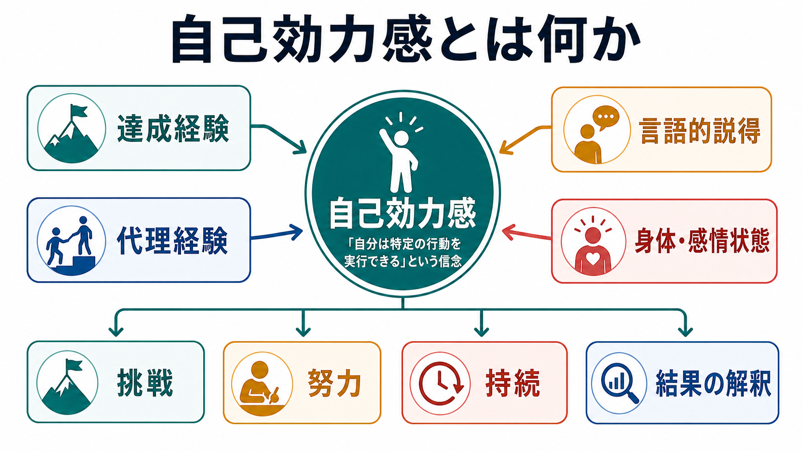
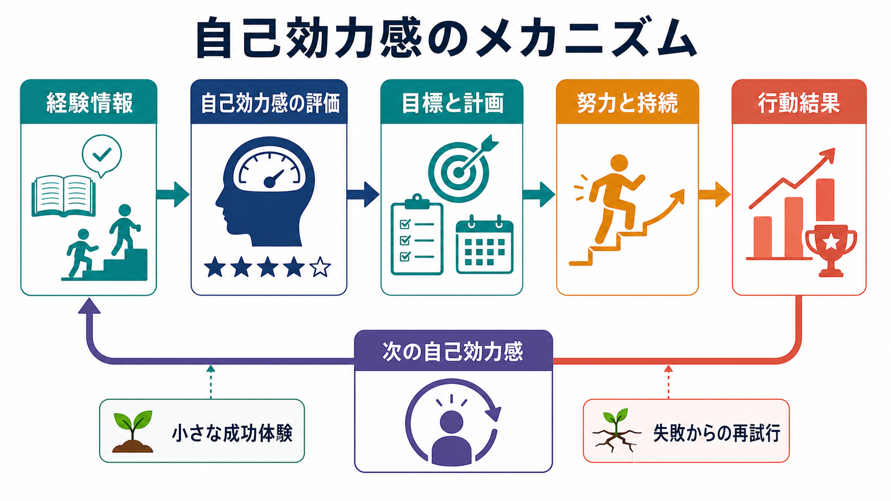
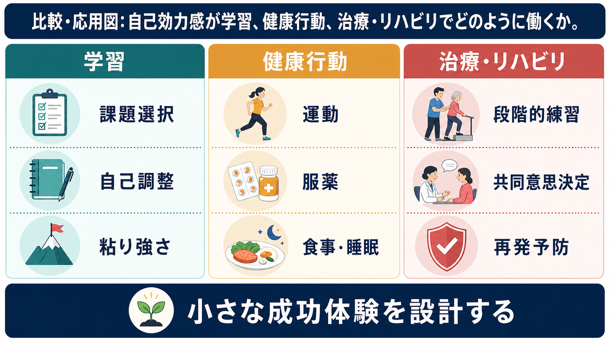

# 自己効力感とは何か

## 要点

- 自己効力感とは、「自分はこの行動を実行できる」という、課題や状況に結びついた信念である。
- 「結果が望ましいか」という期待と、「自分にできるか」という効力期待は区別される。
- 達成経験、代理経験、言語的説得、身体・感情状態が、自己効力感を形づくる主要な情報源になる。
- 自己効力感は、学習、健康行動、治療・リハビリの場面で、挑戦、努力、持続、失敗後の再試行に関わる。
- ただし、自己効力感は万能な内面資源ではなく、能力、環境、支援、報酬、症状、制度条件と一緒に考える必要がある。

## この記事で答える問い

この記事では、次の問いに答える。

- 自己効力感は、[[自己とは何か]]や自尊感情とどう違うのか。
- なぜ「できると思うこと」が、学習や健康行動の実行に影響するのか。
- 臨床・教育・研究で自己効力感を扱うとき、何に注意すべきか。

## まず結論

自己効力感は、「自分は価値ある人間だ」という全般的な自己評価ではなく、「この条件で、この行動を、どの程度うまく実行できるか」という行為に結びついた予測である。Bandura は、効力期待を結果期待から区別した。たとえば「運動すれば健康によい」と思っていても、「疲れている日にも10分歩ける」と思えなければ、行動は始まりにくい[1]。

そのため、自己効力感は単なる楽観主義ではない。むしろ、行動を小さく分け、成功可能な練習を積み、失敗を能力の証明としてではなく次の調整情報として扱うための、実践的な認知である。

## 背景

自己効力感は、社会的認知理論の中心概念として提案された。初期の行動変容理論では、報酬、罰、結果期待が重視されたが、Bandura は「望ましい結果を知っていること」と「その結果を生む行動を自分が実行できると信じること」は別だと考えた[1]。

この区別は、教育、健康心理学、臨床心理学に大きな影響を与えた。学習では、自己効力感が課題選択、努力量、自己調整、成績予測に関わる[3]。健康行動では、運動、服薬、食事、禁煙など、長期的な行動維持の説明変数として使われてきた[6][7]。治療やリハビリでは、患者が自分で症状管理や生活調整に参加する「セルフマネジメント」の機序として位置づけられることがある[8]。

## 基本概念

### 自己効力感の定義

自己効力感は、ある人が「特定の達成を生み出すために必要な行動を組織し、実行できる」と判断する信念である[2]。重要なのは、自己効力感が一般的な性格特性ではなく、領域、課題、状況に依存する点である。

たとえば、同じ人でも次の判断は別々に変わりうる。

| 場面 | 自己効力感の問い |
|---|---|
| 学習 | 「試験まで毎日20分復習できるか」 |
| 健康行動 | 「雨の日でも代替運動を選べるか」 |
| 治療 | 「不安が上がったときに呼吸法を試せるか」 |
| リハビリ | 「痛みを観察しながら段階的に練習できるか」 |

したがって、測定でも介入でも「私は自信があるか」では粗すぎる。Bandura は、自己効力感尺度を作るとき、対象行動、困難条件、達成水準を具体化する必要があると論じている[2]。

### 関連概念との違い

自己効力感は、次の概念と混同されやすい。

| 概念 | 中心となる問い | 自己効力感との違い |
|---|---|---|
| 自尊感情 | 「自分には価値があるか」 | 全般的な自己評価であり、特定行動の実行可能性とは別 |
| 結果期待 | 「その行動はよい結果を生むか」 | 行動の価値や結果についての信念 |
| 統制感 | 「結果を自分が左右できるか」 | 行動実行能力だけでなく環境統制を含みやすい |
| 楽観性 | 「将来はよくなるか」 | 未来への一般的期待であり、課題特異性が弱い |
| [[メタ認知とは何か]] | 「自分の認知をどう監視・調整するか」 | 自己効力感は実行可能性の判断に焦点を置く |

## 仕組み

Bandura の枠組みでは、自己効力感には四つの主要な情報源がある[1][2]。

1. 達成経験  
自分で実際に成功した経験である。最も強い情報源とされる。ただし、成功が簡単すぎると転移しにくく、困難を調整しながら達成する経験が重要になる。

2. 代理経験  
自分に近い他者が行動を実行する様子を見ること。教育、ピアサポート、集団療法、リハビリ場面で重要になる。

3. 言語的説得  
教師、治療者、支援者、同僚からの励ましや具体的フィードバックである。ただし、根拠のない励ましは失敗時に逆効果になりうる。

4. 身体・感情状態  
緊張、痛み、疲労、動悸、不安、気分などの内的状態を、能力不足のサインとして読むか、課題負荷や状況反応として読むかが判断に影響する。ここは[[内受容感覚とは何か]]や[[情動と認知は分けられるのか]]とも接続する。

自己効力感が行動に影響する経路は、単純な「信じればできる」ではない。より正確には、自己効力感は、目標の高さ、計画の具体性、努力量、困難時の持続、失敗の解釈に影響する。学習研究では、自己効力感が自己調整学習や成績と関連することが繰り返し示されているが、課題に合った具体的な自己効力感尺度のほうが、一般的な自己評価より予測力が高い[3][4]。

## 図解

自己効力感を実践に落とすときは、「内面を高める」よりも「行動を設計する」と考えるほうがよい。

| 領域 | 自己効力感が関わる行動 | 実践上の工夫 |
|---|---|---|
| 学習 | 課題選択、復習、自己調整、粘り強さ | 課題を小分けにし、達成基準を明確にする |
| 健康行動 | 運動、服薬、食事、睡眠、禁煙 | 障害条件を想定し、代替行動を準備する |
| 治療・リハビリ | 段階的練習、症状管理、再発予防 | 患者と共同で現実的な行動計画を作る |
| 研究 | 尺度作成、介入評価、媒介分析 | 対象行動と測定項目の対応を厳密にする |

## 臨床・研究との接続

### 学習と教育

教育場面では、自己効力感は「できる気がする」だけではなく、課題に取り組む前の選択、困難時の粘り、失敗後の方略変更に関わる。Pajares は、自己効力感が動機づけや自己調整学習の研究に重要な貢献をした一方で、測定が粗いと自己概念や一般的自信と混ざりやすいと指摘している[3]。

### 健康行動

健康行動では、自己効力感は運動や生活習慣介入の重要な構成概念として扱われる。身体活動介入のメタ分析では、自己効力感を高める介入は平均的には小さいが有意な変化を生むと報告されている[6]。ただし、効果は技法、対象者、行動、測定方法に左右される。

また、Williams と Rhodes は、自己効力感尺度が「能力の信念」だけでなく「やる気」や結果期待を反映してしまう問題を論じている[7]。これは、自己効力感を研究で使うときに重要な注意点である。「できますか」と尋ねたとき、回答者は「やりたいか」「やる価値があるか」「今の生活で可能か」まで含めて答えているかもしれない。

### 治療・リハビリ

慢性疾患のセルフマネジメント教育では、医療管理、役割管理、感情管理を患者が日常生活の中で行う必要がある。Lorig と Holman は、問題解決、意思決定、資源利用、患者・医療者の協働、行動計画、自己調整をセルフマネジメントの技能として整理し、自己効力感をその機序の一つとして位置づけた[8]。

臨床では、自己効力感を「患者の意志が強いか弱いか」と読んではならない。症状、痛み、疲労、経済状況、家庭環境、支援資源、治療同盟が実行可能性を大きく変える。医療・心理支援の文脈では、個別の診断や治療指示ではなく、教育・研究目的の概念として扱う必要がある。

## よくある誤解

### 誤解1: 自己効力感は高ければ高いほどよい

高い自己効力感は挑戦や持続を助けるが、現実の技能や環境を無視した過大評価は、準備不足や危険行動につながることがある。重要なのは、根拠のある自己効力感である。

### 誤解2: 褒めれば自己効力感は上がる

言語的説得は一つの情報源だが、実際の達成経験を伴わない励ましは弱い。特に学習や治療では、「よくできるはず」よりも、「どの条件なら実行できたか」「次に何を調整するか」を具体化するほうが有効である。

### 誤解3: 自己効力感が低い人は努力不足である

自己効力感は、個人の内面だけで決まらない。失敗経験、周囲のモデル不足、支援の欠如、身体症状、[[認知バイアスとは何か]]、社会的障壁が関わる。したがって、介入の焦点は「本人を責めること」ではなく、成功可能な行動環境を設計することにある。

### 誤解4: 自己効力感は全領域に一般化する

ある領域で高い自己効力感を持っていても、別の領域で同じとは限らない。研究でも実践でも、「何についての自己効力感か」を明確にする必要がある[2][3]。

## 関連ノート

既存ノートへの関連リンク:

- [[自己とは何か]]
- [[物語的自己とは何か]]
- [[内受容感覚とは何か]]
- [[身体化認知とは何か]]
- [[メタ認知とは何か]]
- [[情動と認知は分けられるのか]]
- [[認知バイアスとは何か]]
- [[神経可塑性は発達と学習をどう支えるのか]]

関連ノート候補:

- 自尊感情とは何か
- 結果期待とは何か
- 自己調整学習とは何か
- 健康行動変容とは何か
- セルフマネジメント教育とは何か

MOC 更新候補:

- `content/00_MOC/MOC｜認知科学・心理学.md`
- `content/00_MOC/MOC｜臨床実践・治療.md`
- `content/00_MOC/MOC｜キャリア・学習法.md`

## 理解チェック

1. 自己効力感と結果期待はどう違うか。
2. 自己効力感の四つの情報源を、学習または健康行動の例で説明できるか。
3. 「自己効力感が低い」と言う前に、どの環境要因や身体・感情状態を確認すべきか。
4. 自己効力感を測定するとき、なぜ対象行動と困難条件を具体化する必要があるのか。

## 参考文献

[1] Bandura, A. (1977). Self-efficacy: Toward a unifying theory of behavioral change. *Psychological Review, 84*(2), 191-215. https://doi.org/10.1037/0033-295X.84.2.191

[2] Bandura, A. (2006). Guide for constructing self-efficacy scales. In F. Pajares & T. Urdan (Eds.), *Self-Efficacy Beliefs of Adolescents* (pp. 307-337). Information Age Publishing. https://doi.org/10.1108/978-1-60752-837-120251015

[3] Pajares, F. (1996). Self-efficacy beliefs in academic settings. *Review of Educational Research, 66*(4), 543-578. https://doi.org/10.3102/00346543066004543

[4] Zimmerman, B. J. (2000). Self-efficacy: An essential motive to learn. *Contemporary Educational Psychology, 25*(1), 82-91. https://doi.org/10.1006/ceps.1999.1016

[5] Strecher, V. J., DeVellis, B. M., Becker, M. H., & Rosenstock, I. M. (1986). The role of self-efficacy in achieving health behavior change. *Health Education Quarterly, 13*(1), 73-92. https://doi.org/10.1177/109019818601300108

[6] Ashford, S., Edmunds, J., & French, D. P. (2010). What is the best way to change self-efficacy to promote lifestyle and recreational physical activity? A systematic review with meta-analysis. *British Journal of Health Psychology, 15*(2), 265-288. https://doi.org/10.1348/135910709X461752

[7] Williams, D. M., & Rhodes, R. E. (2016). The confounded self-efficacy construct: Review, conceptual analysis, and recommendations for future research. *Health Psychology Review, 10*(2), 113-128. https://doi.org/10.1080/17437199.2014.941998

[8] Lorig, K. R., & Holman, H. R. (2003). Self-management education: History, definition, outcomes, and mechanisms. *Annals of Behavioral Medicine, 26*(1), 1-7. https://doi.org/10.1207/S15324796ABM2601_01

## 未解決問題

- 自己効力感が行動を変えるのか、行動への動機づけが自己効力感回答に反映されるのかを、研究デザイン上どう切り分けるべきか。
- デジタル介入やウェアラブル測定で、自己効力感の変動をどこまで日常的に捉えられるか。
- 精神症状、慢性痛、疲労、社会的孤立がある場合、自己効力感介入をどのように環境調整と組み合わせるべきか。
