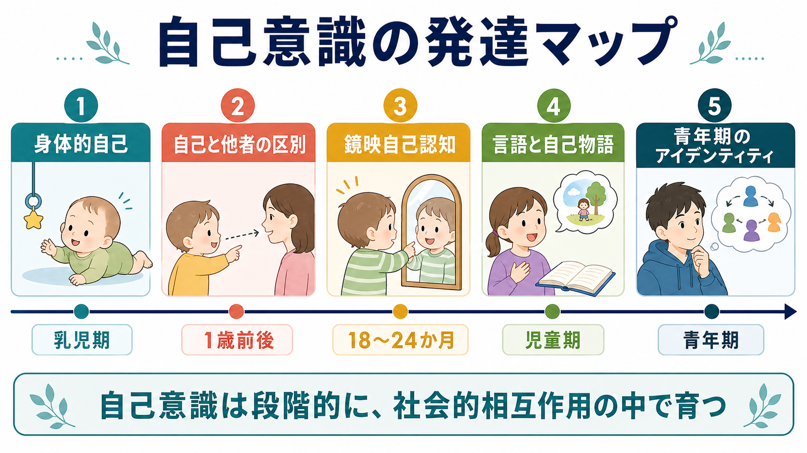
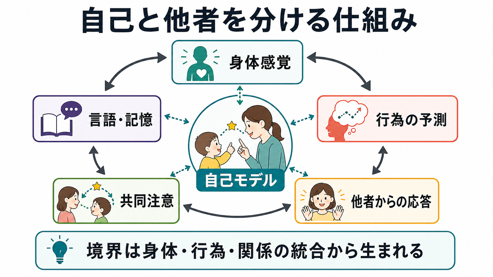
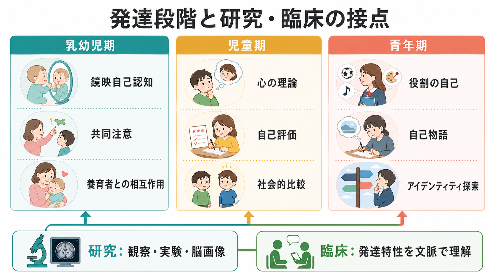

# 自己意識はどのように発達するのか

## 要点

- 自己意識は、ある日突然生じる単一能力ではなく、身体感覚、行為の予測、他者との相互作用、言語、記憶、社会的評価が積み重なって形成される。
- 乳児期には「身体をもつ主体」としての自己が先行し、1歳前後から自己と他者の区別、共同注意、意図理解が発達する[1][3][4]。
- 鏡に映った姿を「自分」として扱う鏡映自己認知は、典型的には18から24か月ごろに明瞭になるが、それだけで自己意識全体を測れるわけではない[1][2]。
- 児童期には、言語、記憶、心の理論、社会的比較を通じて「私はどんな人か」という自己概念が精緻化する[5][6]。
- 青年期には、複数の役割、価値観、将来像を統合しながら、アイデンティティと自己物語が再構成される[7][8]。

## この記事で答える問い

1. 乳幼児は、どのように自分の身体と外界を区別し始めるのか。
2. 鏡映自己認知は、自己意識の発達で何を示し、何を示さないのか。
3. 他者との相互作用、言語、記憶は、自己概念の発達にどう関わるのか。
4. 青年期のアイデンティティ形成は、乳幼児期の自己認識とどのようにつながるのか。

## まず結論

自己意識の発達は、「身体としての自己」から「他者と区別され、他者から見られ、時間の中で語られる自己」への移行として理解できる。乳児は、触覚、固有感覚、運動の結果予測を通じて、自分の身体が外界に働きかけることを学ぶ。次に、養育者とのやり取り、共同注意、模倣、意図理解を通じて、自分と他者の視点が分かれつつ関係していることを学ぶ[3][4]。

その後、鏡映自己認知、言語的な自己記述、過去の出来事を「私の経験」として語る能力、他者からの評価を取り込む能力が発達する。青年期には、自己は単なる特徴リストではなく、友人関係、学校、家族、文化、将来像の中で再編集される物語になる[6][7][8]。

## 背景

自己意識という語は、少なくとも三つの水準を含む。第一は、身体が「自分のもの」として経験される身体的自己である。第二は、自分の行為、欲求、注意、感情を、他者のそれと区別する対人的自己である。第三は、「私はこういう人間だ」と説明できる概念的・物語的自己である。

この区別は、[[意識とは何か]]を考えるうえでも重要である。意識が「経験があること」を指すなら、自己意識は「その経験が私に関わるものとして組織化されること」を指す。ただし、自己意識は常に明示的な内省を必要としない。乳児の行為調整や身体感覚の統合は、言葉で報告できなくても自己の基盤になりうる[1]。

## 基本概念

### 身体的自己

身体的自己とは、視覚、触覚、固有感覚、内受容感覚、運動指令の結果を統合し、「この身体が自分の行為と感覚の中心である」と扱う仕組みである。乳児は、手足を動かした結果として生じる感覚の規則性を通じて、外界の物体と自分の身体を区別していく[1]。

### 自己と他者の区別

自己と他者の区別は、単に「別の身体が見える」という知覚だけではない。他者が何を見ているか、何を意図しているか、こちらの行為にどう応答するかを学ぶ過程で形成される。共同注意はこの発達の中心にあり、乳児が養育者と同じ対象へ注意を向けることで、世界・自己・他者の三項関係が成立する[3]。

### 鏡映自己認知

鏡映自己認知は、鏡の中の像を自分として扱えるかをみる代表的課題である。古典的なルージュ課題では、子どもの顔に気づかれないよう印をつけ、鏡を見たときに鏡像ではなく自分の顔へ手を伸ばすかを観察する。多くの子どもは18から24か月ごろにこの反応を示すが、文化、課題状況、運動能力、恥ずかしさの影響も受ける[2]。

### 心の理論とメタ認知

心の理論は、他者が自分とは異なる信念、欲求、知識をもつと理解する能力である。典型的な誤信念課題の成績は幼児期後半に大きく伸び、自己と他者の視点を区別する力と関係する[5]。また、自分の記憶や判断の確かさを評価する[[メタ認知とは何か]]も、自己理解を高次に組織化する。

## 仕組み

### 1. 感覚と運動の予測から身体的自己が生まれる

乳児は、自分が動かした身体から返ってくる感覚と、外界から偶然生じる感覚を区別していく。自分の手を動かすと視覚像も動く、触ると触覚が返る、声を出すと音が返る。このような感覚運動の対応は、身体を「行為の中心」として扱う基礎になる[1]。

### 2. 他者の応答が自己の輪郭を作る

養育者が乳児の表情、声、視線、身ぶりに応答すると、乳児は自分の行為が他者に影響を与えることを学ぶ。共同注意や模倣は、自己と他者を混同させるものではなく、むしろ「同じ対象を共有しながら、別々の視点をもつ」ことを学ぶ足場になる[3][4]。

### 3. 鏡映自己認知が「見られる自己」を開く

鏡映自己認知は、身体的自己と社会的自己をつなぐ節目である。鏡の像を自分として扱うには、見えている身体像と、自分の身体感覚・運動感覚を対応づける必要がある。さらに、鏡を見る自分は「他者からもこのように見えているかもしれない」という社会的自己の入口になる[1][2]。

### 4. 言語と記憶が自己を物語にする

言語を使えるようになると、子どもは自分の特徴、好み、過去の出来事、感情を説明できるようになる。自己は単なる現在の身体ではなく、「昨日こうした」「私はこれが好き」「友だちにこう思われた」という時間的なまとまりをもつ。自己概念は、記憶、感情、他者からのフィードバックを含む構造として発達する[6]。

### 5. 青年期には複数の自己を統合する

青年期には、家族の中の自分、友人関係の中の自分、学校や仕事の中の自分、将来の自分が必ずしも一致しないことが目立つ。脳の社会的認知ネットワークと認知制御の発達も進み、他者からどう見られるか、どの価値観を選ぶか、どの集団に属するかが自己理解に強く影響する[7][8]。

## 図解

| 図 | 読み方 |
|---|---|
| 自己意識の発達マップ | 身体的自己からアイデンティティまでを、発達順に並べた全体像。 |
| 自己と他者を分ける仕組み | 身体感覚、行為予測、他者応答、共同注意、言語・記憶が循環して自己モデルを作ることを示す。 |
| 発達段階と研究・臨床の接点 | 乳幼児期、児童期、青年期で観察すべき自己関連能力が異なることを示す。 |

## 臨床・研究との接続

研究では、鏡映自己認知、共同注意、模倣、誤信念課題、自己記述、自己評価尺度、脳画像などを組み合わせて自己意識の発達を調べる。ただし、どれか一つの課題を通過しないことを、ただちに「自己意識がない」と解釈してはいけない。課題理解、運動能力、不安、文化的規範、対人状況が成績に影響するからである[2][5]。

臨床では、自己意識の発達を診断名に直結させるのではなく、発達特性、養育環境、対人経験、言語能力、感情調整、学校や家庭での文脈と合わせて理解する必要がある。たとえば共同注意や視点取得の難しさは、社会的理解の支援点を示すことがあるが、個別の診断や治療方針は専門的評価に基づくべきである。

## よくある誤解

### 誤解1: 鏡に気づけば自己意識は完成している

鏡映自己認知は重要な節目だが、自己意識全体の完成を意味しない。自己評価、社会的比較、物語的自己、アイデンティティは、その後も長く発達する[6][7]。

### 誤解2: 乳児には自己がない

乳児は言語的に「私」を説明できないが、身体を動かし、感覚の結果を予測し、他者の応答を使って行為を調整する。明示的な自己概念がなくても、身体的・対人的な自己の基盤は発達している[1][3]。

### 誤解3: 自己は内面だけで作られる

自己は内面の反省だけでなく、他者からの応答、文化的な物語、学校や家族での役割、社会的比較の中で形成される。青年期の自己理解は、個人内の成熟だけでなく、社会的文脈との相互作用として見る必要がある[7][8]。

## 関連ノート

### 既存ノート

- [[意識とは何か]]
- [[メタ認知とは何か]]

### 関連ノート候補

- 自己とは何か
- 自己と他者はどのように区別されるのか
- 自己概念とは何か
- 身体所有感とは何か
- 共同注意とは何か
- 心の理論とは何か
- 青年期のアイデンティティ形成とは何か

### MOC 更新候補

- `content/00_MOC/` 配下の認知科学・心理学系 MOC に、本記事を「意識・自己・身体性」カテゴリの自己意識発達ノートとして追加する。

## 理解チェック

1. 身体的自己と物語的自己は、どのように違うか。
2. 鏡映自己認知は、自己意識のどの側面を示し、どの側面を示さないか。
3. 共同注意は、自己と他者の区別にどのように関わるか。
4. 児童期の自己概念と青年期のアイデンティティ形成は、どの点で連続し、どの点で異なるか。
5. 研究課題の成績を、発達や臨床上の意味へ解釈するとき、どのような注意が必要か。

## 未解決問題

- 乳幼児期の身体的自己と、青年期の物語的自己がどの神経発達過程で連続するのかは、まだ十分に説明されていない。
- 鏡映自己認知、共同注意、心の理論、自己評価を横断する統一的モデルは発展途上である。
- 文化差、養育環境、デジタル環境が、自己物語とアイデンティティ形成に与える影響は今後も検討が必要である。

## 参考文献

[1] Rochat, P. (2003). Five levels of self-awareness as they unfold early in life. *Consciousness and Cognition, 12*(4), 717-731. https://doi.org/10.1016/S1053-8100(03)00081-3

[2] Amsterdam, B. (1972). Mirror self-image reactions before age two. *Developmental Psychobiology, 5*(4), 297-305. https://doi.org/10.1002/dev.420050403

[3] Carpenter, M., Nagell, K., & Tomasello, M. (1998). Social cognition, joint attention, and communicative competence from 9 to 15 months of age. *Monographs of the Society for Research in Child Development, 63*(4), i-vi, 1-143. https://doi.org/10.2307/1166214

[4] Meltzoff, A. N. (1995). Understanding the intentions of others: Re-enactment of intended acts by 18-month-old children. *Developmental Psychology, 31*(5), 838-850. https://doi.org/10.1037/0012-1649.31.5.838

[5] Wellman, H. M., Cross, D., & Watson, J. (2001). Meta-analysis of theory-of-mind development: The truth about false belief. *Child Development, 72*(3), 655-684. https://doi.org/10.1111/1467-8624.00304

[6] Harter, S. (2012). *The Construction of the Self: Developmental and Sociocultural Foundations* (2nd ed.). Guilford Press. https://www.guilford.com/books/The-Construction-of-the-Self/Susan-Harter/9781462522729

[7] Sebastian, C., Burnett, S., & Blakemore, S.-J. (2008). Development of the self-concept during adolescence. *Trends in Cognitive Sciences, 12*(11), 441-446. https://doi.org/10.1016/j.tics.2008.07.008

[8] Crone, E. A., & Fuligni, A. J. (2020). Self and others in adolescence. *Annual Review of Psychology, 71*, 447-469. https://doi.org/10.1146/annurev-psych-010419-050937
