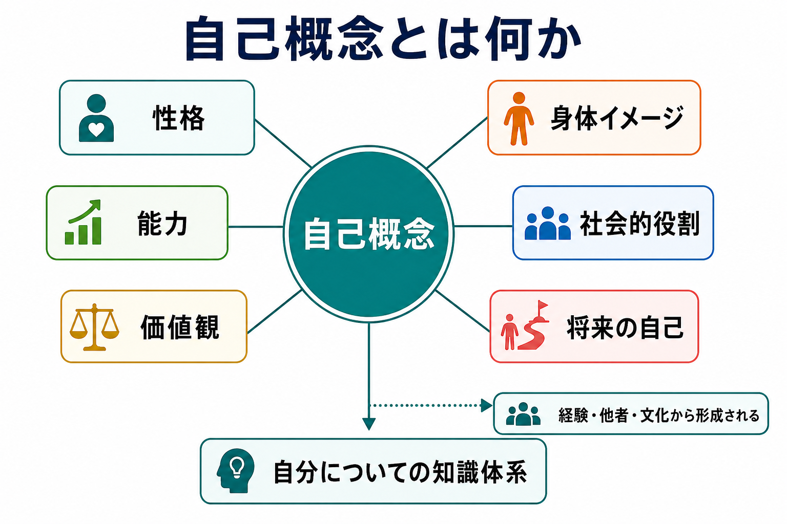
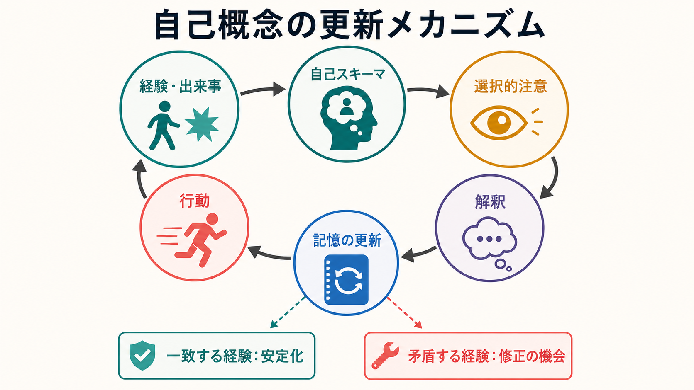
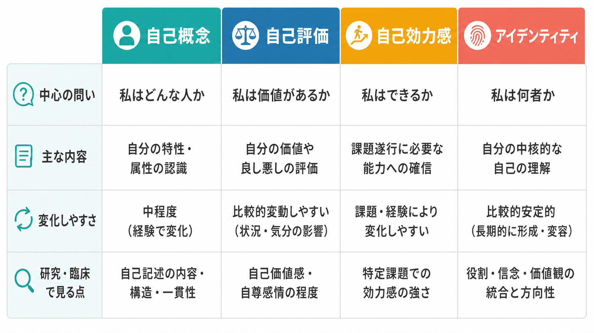

# 自己概念とは何か

## 要点

- 自己概念とは、「私はどのような人間か」についての知識体系であり、性格、能力、価値観、身体イメージ、社会的役割、将来の自己像を含む。
- 自己概念は固定された本質ではなく、経験、他者からのフィードバック、文化、記憶、比較を通じて更新される。
- 自己概念は、注意、解釈、記憶、行動選択に影響する。つまり、自己についての考えは、世界の見え方そのものを変える。
- 自己評価、自己効力感、アイデンティティとは重なるが同一ではない。自己概念は、評価以前の「自分についての内容」を含む広い概念である。

## この記事で答える問い

- 自己概念は、自己評価やアイデンティティと何が違うのか。
- 自己概念はどのように形成され、どのように更新されるのか。
- 自己概念は研究や臨床でどのように扱われるのか。

## まず結論

自己概念とは、自分自身に関する知識のまとまりである。たとえば「私は内向的だ」「数学が得意だ」「人との信頼を大切にする」「身体をこう見ている」「この集団の一員である」「将来はこうありたい」といった表象が、相互に結びついたネットワークとして働く。

古典的には、自己は「知る主体としての自己」と「知られる対象としての自己」に分けて考えられてきた[1]。自己概念は主に後者、つまり「自分について何を知っているか」に関わる。したがって、[[意識とは何か]]や[[主観的経験は科学的に扱えるのか]]が扱う「経験している主体」の問題と接続しつつも、自己概念の中心は、記述可能な自己知識にある。

## 背景

自己概念研究は、教育心理学、社会心理学、発達心理学、認知心理学、臨床心理学にまたがる。教育心理学では、自己概念は学業、身体、社会関係などの領域に分かれる多次元的・階層的な構成概念として扱われてきた[2]。たとえば「自分は勉強が得意か」という学業的自己概念と、「自分は友人関係をうまく築けるか」という社会的自己概念は関連するが、完全には同じではない。

社会心理学では、自己概念は情報処理の枠組みとして捉えられる。Markus の自己スキーマ研究は、人が自己に関係する情報を選択的に処理し、記憶しやすいことを示した[3]。この観点では、自己概念は単なる自己紹介文ではなく、どの情報に注意を向け、どの経験を「自分らしい」と解釈するかを方向づける認知構造である。

## 基本概念

自己概念は、少なくとも次の層を含む。

| 層 | 例 | 役割 |
|---|---|---|
| 特性の自己 | 「几帳面」「人見知り」「好奇心が強い」 | 自分の性格や傾向を説明する |
| 能力の自己 | 「文章を書くのが得意」「計算が苦手」 | 課題選択や努力の見積もりに関わる |
| 価値の自己 | 「公正さを大切にする」「自由を重視する」 | 判断や葛藤場面の基準になる |
| 身体的自己 | 「自分の身体をどう見ているか」 | 身体イメージや対人場面に関わる |
| 社会的自己 | 「親」「学生」「専門職」「集団の一員」 | 役割、所属、規範と結びつく |
| 時間的自己 | 「過去の私」「現在の私」「将来の私」 | 自伝的記憶と目標をつなぐ |

ここで重要なのは、自己概念が「良い自己」だけを意味しない点である。自分についての肯定的知識も否定的知識も、中立的知識も含む。自己概念のうち、良い・悪いという価値づけに焦点を当てたものが自己評価であり、特定の課題を遂行できるという見込みに焦点を当てたものが自己効力感である。

## 仕組み

自己概念は、経験をそのまま蓄積した倉庫ではない。経験は、すでにある自己スキーマによって選択され、解釈され、記憶に組み込まれる[3]。たとえば「私は人前で話すのが苦手だ」という自己スキーマが強い人は、発表で少し詰まった場面に注意を向けやすく、うまく話せた部分を軽視しやすい。この処理は[[認知バイアスとは何か]]とも関係する。

自己関連情報は記憶にも深く関わる。自己に関連づけて処理された情報は、意味処理だけの場合より想起されやすいことが示されており、これは自己参照効果として知られる[4]。つまり、自己概念は「自分についての記憶」だけでなく、「何が記憶に残りやすいか」にも影響する。

将来の自己像も、現在の行動を方向づける。Markus と Nurius は、なりたい自己、なりたくない自己、なりうる自己を「可能自己」として整理した[5]。可能自己は、単なる空想ではなく、目標、回避、動機づけ、選択の枠組みとして働く。

## 図解

自己概念を近接概念と区別すると、次のように整理できる。

文章で言い換えると、自己概念は「私はどんな人か」、自己評価は「私は価値があるか」、自己効力感は「私はできるか」、アイデンティティは「私は何者として生きるか」に近い問いを扱う。実際には相互に影響するが、研究や支援では混同しない方がよい。

## 臨床・研究との接続

研究では、自己概念の内容だけでなく、構造の明確さも測定される。自己概念明確性は、自分についての信念がどれほど明確で、一貫し、時間的に安定しているかを指す[6]。自己概念が不明確な場合、気分、対人フィードバック、失敗経験によって自己理解が大きく揺れやすくなる。

社会的自己の側面では、個人は所属集団を通じても自己を定義する。社会的アイデンティティ理論では、集団成員性が自己概念の一部になり、内集団・外集団の比較や評価に影響するとされる[7]。この観点は、偏見、スティグマ、集団規範、所属感の理解に役立つ。

神経科学では、自己関連処理は内側前頭前野、後部帯状皮質、楔前部などの皮質正中構造と関連づけて議論されてきた[8]。ただし、自己概念そのものが特定の単一脳部位に「ある」と考えるのは単純化しすぎである。自己概念は、記憶、言語、感情、身体感覚、社会認知が結びついた多層的な表象として理解する方がよい。

臨床的には、自己概念は教育・研究目的で慎重に扱うべき概念である。「自分は無価値だ」「自分は人に迷惑をかけるだけだ」といった自己記述は、抑うつ、不安、トラウマ、対人関係の困難と関連しうる。しかし、個別の診断や治療方針は、症状、生活史、文脈、身体疾患、薬剤、社会環境を含めて専門的に評価される必要がある。

## よくある誤解

### 誤解1：自己概念は性格と同じである

性格は自己概念の一部になりうるが、自己概念は性格だけではない。能力、価値観、身体イメージ、役割、所属、将来像も含む。

### 誤解2：自己概念は一度できたら変わらない

自己概念には安定性があるが、経験によって変化する。重要なのは、変化が単発の出来事だけで起きるとは限らず、繰り返される経験、他者からのフィードバック、環境の変化、言語化によって進む点である。

### 誤解3：自己概念は内面だけの問題である

自己概念は内面の表象だが、社会的文脈から切り離せない。家族、学校、職場、文化、メディア、制度は、どの自己記述が強化されるかに影響する。

### 誤解4：自己概念を変えれば必ず気分や行動が改善する

自己概念は重要だが、気分や行動は睡眠、身体状態、対人環境、生活リズム、経済状況、発達特性、疾患など多くの要因に影響される。自己概念だけに原因を還元しない方がよい。

## 関連ノート

- [[意識とは何か]]
- [[主観的経験は科学的に扱えるのか]]
- [[メタ認知とは何か]]
- [[認知バイアスとは何か]]

関連ノート候補:

- 自己とは何か
- 自己評価はどのように形成されるのか
- 自己効力感とは何か
- アイデンティティとは何か
- 自己関連処理の脳ネットワークとは何か

MOC更新候補:

- content/00_MOC/配下の認知科学・心理学系 MOC に、本記事へのリンクを追加する。
- 並列ジョブとの競合を避けるため、本ジョブでは MOC 本体は更新しない。

## 理解チェック

1. 自己概念、自己評価、自己効力感、アイデンティティの違いを一文ずつ説明できるか。
2. 自己スキーマが注意、解釈、記憶に影響する例を一つ挙げられるか。
3. 自己概念が「個人の内面」だけでなく、社会的フィードバックや文化から形成される理由を説明できるか。

## 未解決問題

- 自己概念の安定性と変化しやすさを、発達段階や文化差を超えてどのように測るか。
- 自己概念の内容、明確性、柔軟性のどれが、精神健康や学習成果に最も強く関わるか。
- 自己関連処理の神経基盤を、主観的経験、社会的自己、言語的自己記述とどう統合するか。

## 参考文献

[1] James, W. (1890). *The Principles of Psychology*. Henry Holt. https://psychclassics.yorku.ca/James/Principles/

[2] Shavelson, R. J., Hubner, J. J., & Stanton, G. C. (1976). Self-concept: Validation of construct interpretations. *Review of Educational Research, 46*(3), 407-441. https://doi.org/10.3102/00346543046003407

[3] Markus, H. (1977). Self-schemata and processing information about the self. *Journal of Personality and Social Psychology, 35*(2), 63-78. https://doi.org/10.1037/0022-3514.35.2.63

[4] Rogers, T. B., Kuiper, N. A., & Kirker, W. S. (1977). Self-reference and the encoding of personal information. *Journal of Personality and Social Psychology, 35*(9), 677-688. https://doi.org/10.1037/0022-3514.35.9.677

[5] Markus, H., & Nurius, P. (1986). Possible selves. *American Psychologist, 41*(9), 954-969. https://doi.org/10.1037/0003-066X.41.9.954

[6] Campbell, J. D., Trapnell, P. D., Heine, S. J., Katz, I. M., Lavallee, L. F., & Lehman, D. R. (1996). Self-concept clarity: Measurement, personality correlates, and cultural boundaries. *Journal of Personality and Social Psychology, 70*(1), 141-156. https://doi.org/10.1037/0022-3514.70.1.141

[7] Tajfel, H., & Turner, J. C. (1979). An integrative theory of intergroup conflict. In W. G. Austin & S. Worchel (Eds.), *The Social Psychology of Intergroup Relations* (pp. 33-47). Brooks/Cole. https://psycnet.apa.org/record/1980-00126-001

[8] Northoff, G., Heinzel, A., de Greck, M., Bermpohl, F., Dobrowolny, H., & Panksepp, J. (2006). Self-referential processing in our brain: A meta-analysis of imaging studies on the self. *NeuroImage, 31*(1), 440-457. https://doi.org/10.1016/j.neuroimage.2006.01.004
