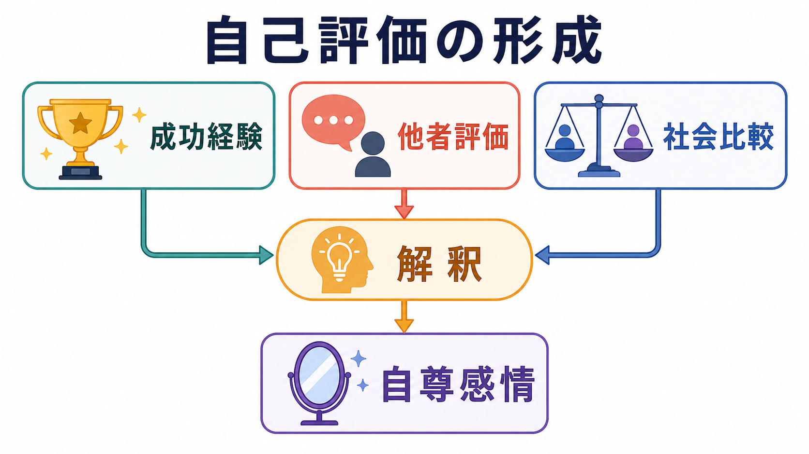
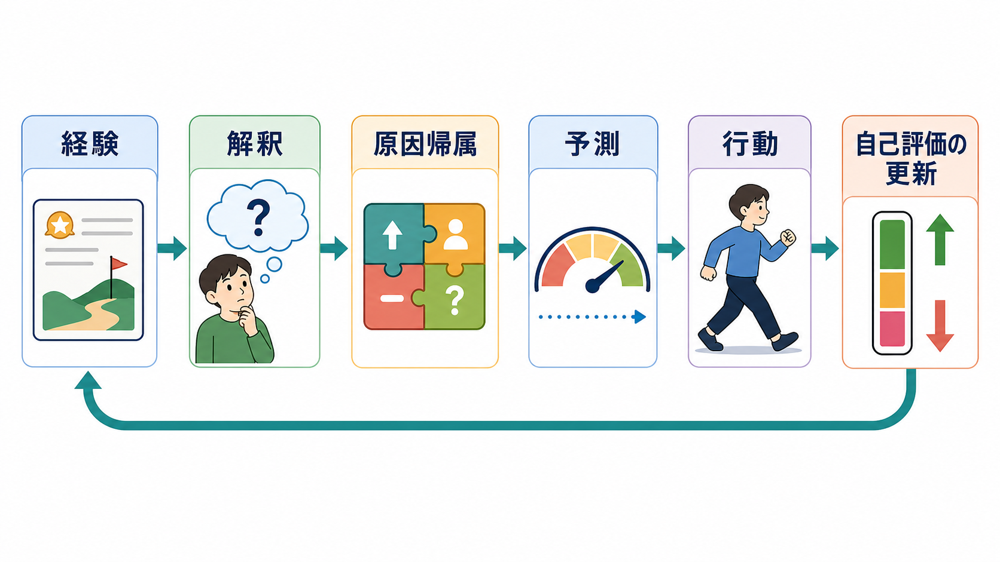
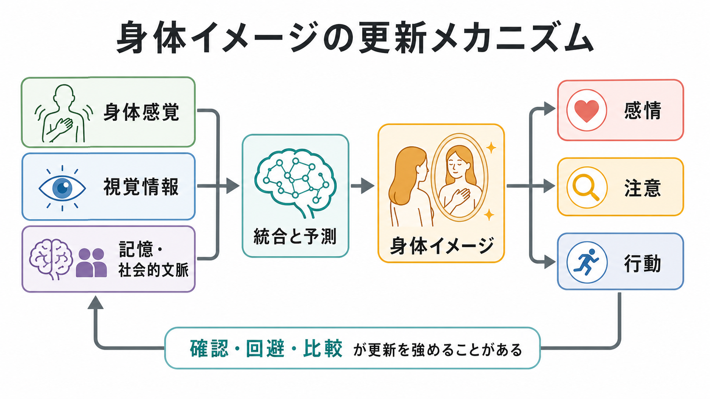

# 自己評価はどのように形成されるのか

## 要点

- 自己評価とは、「自分には価値があるか」「自分はできるか」「他者から受け入れられているか」をめぐる評価的な自己理解であり、自己概念の一部である。Rosenberg 以降の研究では、全体的な自尊感情と領域別の有能感を区別して扱うことが多い [1][3]。
- 自己評価は固定値ではない。発達的には比較的安定する側面をもちつつ、成功・失敗、他者からの承認や拒絶、所属集団の中での比較によって状態的に上下する [2][5][6]。
- 成功経験は自己評価を直接高めるというより、「何が原因で成功したのか」「再現できるのか」「自分にとって重要な領域なのか」という解釈を通して効く [4][7]。
- 他者評価は、単なる褒め言葉ではなく、「自分が受け入れられているか」を知らせる社会的信号として働く。ソシオメーター理論は、自尊感情を社会的受容のモニターとして説明する [5]。
- 社会比較は、自己評価を校正する便利な手がかりだが、比較対象・比較方向・比較領域が偏ると、能力や価値を過度に低く、または過度に高く見積もりやすい [6]。

## この記事で答える問い

1. 自己評価と自尊感情は、どのような心理学的概念なのか。
2. 成功経験・失敗経験は、どのような経路で自己評価に影響するのか。
3. 他者評価や社会比較は、なぜ自分への見方を変えるのか。
4. 自己評価を研究・臨床で扱うとき、どのような限界に注意すべきか。

## まず結論

自己評価は、「経験そのもの」ではなく「経験の解釈」によって形成される。たとえば同じ成功でも、「努力の結果で、次も再現できる」と解釈されれば自己効力感や自尊感情を支えやすい。一方で、「たまたま運がよかっただけ」と解釈されると、成功経験は自己評価に残りにくい。逆に失敗も、「自分には価値がない」という全体的判断に結びつく場合と、「この課題では戦略を変える必要がある」という局所的な学習にとどまる場合がある。

このため、自己評価を理解するには、成功経験・他者評価・社会比較を別々に見るだけでは足りない。それらが、[[メタ認知とは何か|メタ認知]]、[[認知バイアスとは何か|認知バイアス]]、[[情動と認知は分けられるのか|情動と認知]]、社会的所属感と結びつき、どのような「自分についての物語」に統合されるかを見る必要がある。

## 背景

自己評価は日常語では「自信」や「自己肯定感」と混同されやすい。しかし心理学では、少なくとも三つの層を分けて考えると整理しやすい。

第一に、全体的な自尊感情である。これは「自分は価値ある存在だと思えるか」という全般的評価であり、Rosenberg Self-Esteem Scale に代表される尺度で測定されてきた [1]。第二に、領域別の有能感である。学業、運動、対人関係、外見など、どの領域で「できる」と感じるかは分かれうる。Harter の子どもの有能感尺度は、この領域別自己知覚を測定する代表的研究である [3]。第三に、自己効力感である。Bandura は、自己効力感を「特定の行為を実行できるという期待」として扱い、達成経験、代理経験、言語的説得、生理的・情動的状態を主要な情報源として整理した [4]。

この三層は重なるが同一ではない。「私は人として価値がある」という自尊感情、「数学は得意だ」という領域別有能感、「次の試験でこの方法なら解ける」という自己効力感は、互いに影響しあいながらも、測っているものが違う。

## 基本概念

### 自己評価

自己評価とは、自分の特徴、能力、価値、社会的位置づけについての評価的判断である。[[意識とは何か|意識]]や[[主観的経験は科学的に扱えるのか|主観的経験]]の研究と同じく、自己評価も本人の報告に依存する部分が大きい。そのため、研究では自己報告尺度、他者評定、行動指標を組み合わせて慎重に扱う必要がある。

### 自尊感情

自尊感情は、自己評価のうち全体的な「自己価値感」に近い。Orth と Robins のレビューによれば、自尊感情は青年期から中年期にかけて上昇し、その後高齢期に低下しやすいという平均的発達軌跡が示されている。ただし、比較的安定していても不変ではなく、人生上の出来事や対人関係によって変化しうる [2]。

### 領域別有能感と自己効力感

領域別有能感は「どの領域で自分を有能と感じるか」を表す。自己効力感はさらに状況特異的で、「この課題に対して自分は行動を起こし、努力を続けられるか」に関わる [3][4]。たとえば「自分は価値ある人間だ」と思っていても、初めての統計解析には自己効力感が低いことがある。逆に、特定課題の自己効力感が高くても、全体的な自尊感情が安定しているとは限らない。

## 仕組み

### 1. 成功経験は「解釈」を通って自己評価になる

成功経験は自己評価を支える重要な材料である。しかし重要なのは、成功の有無だけではない。Bandura の自己効力感理論では、最も強い情報源の一つは遂行達成、つまり自分で実行してうまくいった経験である [4]。ただし、その経験が自己評価を高めるには、本人が「自分の行動と結果が結びついている」と理解する必要がある。

たとえば発表がうまくいったとき、「準備したから説明できた」と考えれば、次の発表への自己効力感は上がりやすい。「聞き手がたまたま優しかっただけ」と考えれば、同じ成功でも自己評価への影響は弱い。ここには原因帰属、予測、[[意思決定とは何か|意思決定]]、学習方略が関わる。

### 2. 他者評価は「受け入れられているか」の信号になる

他者からの評価は、自己評価を大きく動かす。Leary らのソシオメーター理論では、自尊感情は社会的受容と排斥の可能性を知らせるモニターとして説明される [5]。この見方では、褒められること自体が重要なのではなく、「自分が集団や関係の中で受け入れられている」という信号が重要になる。

そのため、同じ褒め言葉でも、信頼できる相手から具体的に伝えられる評価と、形式的で曖昧な称賛では作用が違う。前者は「自分の行動が他者に届いた」という手がかりになりやすいが、後者は一時的な気分を上げても、安定した自己評価にはつながりにくい。

### 3. 社会比較は自己評価の座標軸をつくる

Festinger の社会比較理論は、人が自分の意見や能力を評価するために他者と比較する傾向をもつことを示した [6]。自己評価は絶対的な点数だけではなく、「誰と比べるか」「どの集団の中で見るか」によって変わる。

上方比較、つまり自分より優れている人との比較は、学習や向上の手がかりになる一方、距離が大きすぎると劣等感を強めることがある。下方比較は一時的に自己評価を守ることがあるが、学習機会を減らす場合もある。比較は避けるべきものではなく、比較対象と比較目的を調整する認知的スキルとして扱う方がよい。

### 4. 自己価値の「随伴性」が揺れやすさを決める

Crocker と Wolfe は、自己価値が何に随伴しているか、つまり「何がうまくいけば自分に価値があると思えるのか」に注目した [7]。自己価値を成績、外見、承認、競争上の勝利など狭い領域に強く結びつけると、その領域の成功・失敗に自己評価が大きく振れやすい。

これは成功を重視すること自体が悪いという意味ではない。問題は、特定領域の結果が「自分全体の価値」に直結してしまうことである。失敗を「この戦略は合わなかった」と扱える場合、自己評価は学習と結びつく。失敗を「自分には価値がない」と扱う場合、自己評価は脆くなりやすい。

## 図解

| 図 | 役割 | 読み方 |
|---|---|---|
| 概念地図 | 成功経験・他者評価・社会比較が解釈を通って自尊感情に関わる全体像 | 入力よりも、中央の「解釈」が自己評価形成の焦点になる |
| 更新メカニズム | 経験から原因帰属・予測・行動を経て自己評価が更新される流れ | 成功や失敗は次の行動選択を変え、さらに新しい経験を生む |
| 研究・日常・臨床の接続 | 測定、比較、支援という三つの視点 | 自己評価は単独で診断するものではなく、文脈の中で扱う |

## 臨床・研究との接続

研究では、自己評価はしばしば質問紙で測定される。代表的には Rosenberg Self-Esteem Scale が使われるが、自己評価は本人の自己記述に依存するため、社会的望ましさ、気分、比較対象、文化的規範の影響を受ける [1][8]。したがって、尺度得点だけで個人の状態を断定するのではなく、生活史、対人関係、現在の課題、行動指標と合わせて読む必要がある。

臨床的には、低い自己評価は抑うつ、不安、対人回避、過度な承認希求などと関連して語られることが多い。ただし、この記事は教育・研究目的の整理であり、個別の診断や治療指示を行うものではない。重要なのは、「自己評価が低いから問題が起きる」と単純化しないことである。自己評価の低さは、過去の経験、現在の環境、身体状態、対人関係、思考様式の相互作用として現れる。

また、Baumeister らのレビューは、「自尊感情を高めれば学業や仕事の成績が自動的に改善する」という単純な見方に注意を促している [8]。自己評価を支えるには、空疎な称賛よりも、具体的な技能形成、現実的なフィードバック、達成可能な課題設定、社会的所属感の改善が重要である。

## よくある誤解

### 誤解1: 成功すれば自己評価は必ず高まる

成功は重要な材料だが、必ず自己評価に変換されるわけではない。本人が成功を自分の行動と結びつけられない場合、あるいは成功領域が本人にとって重要でない場合、自己評価への影響は弱い。

### 誤解2: 褒めれば自尊感情は安定する

称賛は短期的な気分を変えることがあるが、曖昧で過剰な称賛は安定した自己評価をつくるとは限らない。自己評価を支えやすいのは、具体的な行動、努力、戦略、改善点に結びついたフィードバックである。

### 誤解3: 社会比較は悪いものだから避けるべき

社会比較は自己評価を傷つけることもあるが、学習や目標設定の手がかりにもなる。問題は比較そのものではなく、比較対象が極端であること、比較領域が狭すぎること、比較結果を自分全体の価値に広げすぎることである。

### 誤解4: 自尊感情が高ければ成果も人間関係もよくなる

自尊感情と良い結果は関連することがあるが、因果は単純ではない。成果が自尊感情を高める場合もあり、第三の要因が両方に影響する場合もある。高い自己評価が防衛的・誇大的になると、むしろ対人関係を難しくすることもある [8]。

## 関連ノート

### 既存ノート

- [[メタ認知とは何か]]
- [[認知バイアスとは何か]]
- [[情動と認知は分けられるのか]]
- [[意思決定とは何か]]
- [[共感は認知機能としてどう理解できるのか]]
- [[熟達者の認知は初心者と何が違うのか]]
- [[意識とは何か]]
- [[主観的経験は科学的に扱えるのか]]

### 今後の作成候補

- 自尊感情とは何か
- 自己効力感とは何か
- 社会比較理論とは何か
- ソシオメーター理論とは何か
- 承認欲求はどのように自己評価に影響するのか
- 失敗経験はどのように学習と自己評価を変えるのか

### MOC更新候補

- `content/00_MOC/` 配下の認知科学・心理学系 MOC
- 自己・意識・身体性に関する MOC
- 社会心理学または発達心理学に関する MOC

並列ジョブとの衝突を避けるため、このタスクでは MOC 本体は更新しない。

## 理解チェック

1. 自己評価、自尊感情、自己効力感はどのように違うか。
2. 同じ成功経験でも、自己評価に残る場合と残りにくい場合があるのはなぜか。
3. ソシオメーター理論では、自尊感情は何をモニターしていると考えるか。
4. 社会比較が自己評価を支える場合と傷つける場合の違いは何か。
5. 「自尊感情を高めれば成果が上がる」という説明には、どのような限界があるか。

## 未解決問題

- 自己評価の変化を、自己報告だけでなく行動・生理・社会ネットワーク指標とどのように統合して測定できるか。
- 領域別有能感、全体的自尊感情、自己効力感の因果方向を、長期縦断研究でどこまで分離できるか。
- SNS 環境における社会比較が、従来の対面比較と同じ仕組みで自己評価に影響するのか。
- 文化差、発達段階、臨床状態によって、他者評価や社会比較の重みはどのように変わるのか。

## 参考文献

[1] Rosenberg, M. (1965). *Society and the Adolescent Self-Image*. Princeton University Press. https://press.princeton.edu/books/paperback/9780691622682/society-and-the-adolescent-self-image

[2] Orth, U., & Robins, R. W. (2014). The development of self-esteem. *Current Directions in Psychological Science, 23*(5), 381-387. https://doi.org/10.1177/0963721414547414

[3] Harter, S. (1982). The perceived competence scale for children. *Child Development, 53*(1), 87-97. https://doi.org/10.2307/1129640

[4] Bandura, A. (1977). Self-efficacy: Toward a unifying theory of behavioral change. *Psychological Review, 84*(2), 191-215. https://doi.org/10.1037/0033-295X.84.2.191

[5] Leary, M. R., Tambor, E. S., Terdal, S. K., & Downs, D. L. (1995). Self-esteem as an interpersonal monitor: The sociometer hypothesis. *Journal of Personality and Social Psychology, 68*(3), 518-530. https://doi.org/10.1037/0022-3514.68.3.518

[6] Festinger, L. (1954). A theory of social comparison processes. *Human Relations, 7*(2), 117-140. https://doi.org/10.1177/001872675400700202

[7] Crocker, J., & Wolfe, C. T. (2001). Contingencies of self-worth. *Psychological Review, 108*(3), 593-623. https://doi.org/10.1037/0033-295X.108.3.593

[8] Baumeister, R. F., Campbell, J. D., Krueger, J. I., & Vohs, K. D. (2003). Does high self-esteem cause better performance, interpersonal success, happiness, or healthier lifestyles? *Psychological Science in the Public Interest, 4*(1), 1-44. https://doi.org/10.1111/1529-1006.01431
