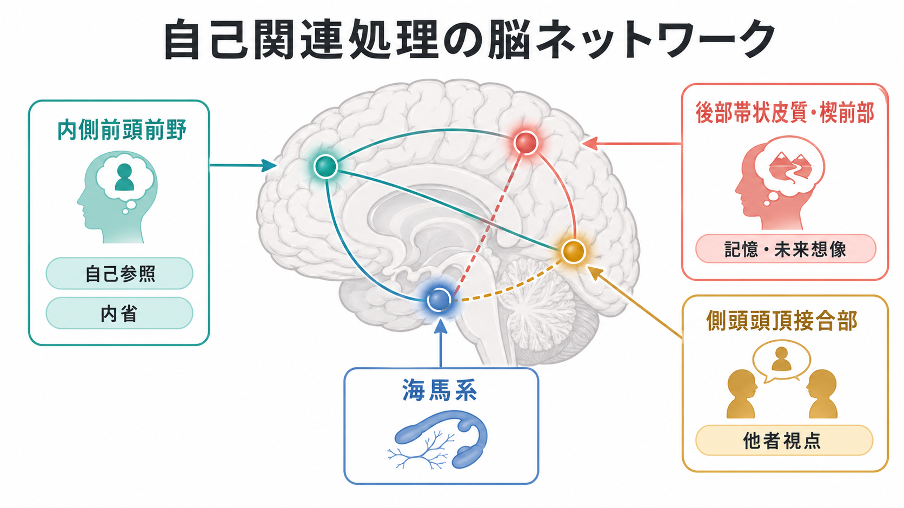
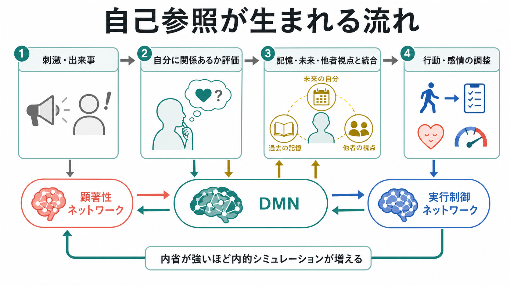
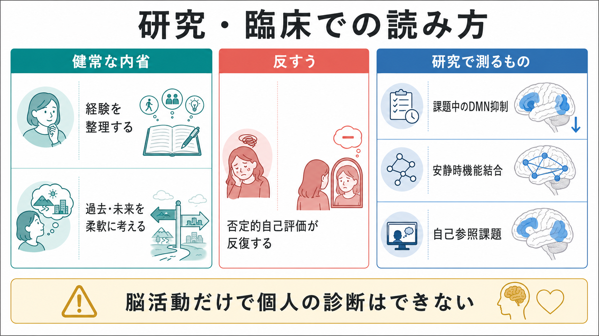

# 自己関連処理の脳ネットワークとは何か

## 要点

- 自己関連処理とは、刺激・記憶・感情・他者からの評価を「自分に関係するもの」として評価し、意味づける処理である。
- 中心になるのは、内側前頭前野、後部帯状皮質・楔前部、側頭頭頂接合部、側頭葉内側部を含むデフォルトモードネットワークである。ただし、自己は DMN だけで完結せず、顕著性ネットワークや実行制御ネットワークとも相互作用する。
- 自己参照課題では、他者判断や意味判断よりも内側前頭前野などの皮質正中構造が活動しやすい。これは自己が「一つの場所」にあるという意味ではなく、評価・記憶・視点取得・感情調整の分散処理として理解する方がよい。
- 内省は適応的にも働くが、否定的自己評価が反復すると反すうになり、うつ病研究などで DMN との関係が検討されている。
- 脳活動や機能結合だけで個人の自己理解、性格、診断を読み取ることはできない。

## この記事で答える問い

1. 自己関連処理とは何をしている処理なのか。
2. なぜデフォルトモードネットワークが自己参照や内省と結びつけられるのか。
3. 内側前頭前野、後部帯状皮質・楔前部、海馬系、側頭頭頂接合部はどのように役割分担しているのか。
4. 健康な内省と、反すうのような臨床的問題はどこで分かれるのか。

## まず結論

自己関連処理の脳ネットワークとは、「私に関係があるか」「この出来事は私の過去や将来にどうつながるか」「他者から見た私はどう見えるか」を統合する広域ネットワークである。とくにデフォルトモードネットワークは、外界への注意を強く要求されない場面で活動しやすく、記憶、将来想像、社会的推論、内省に関わるため、自己参照処理の基盤として重視されてきた [1][2]。

ただし、DMN は「自己そのもの」ではない。自己について考えるには、価値づけや情動的顕著性を扱うネットワーク、注意を切り替えるネットワーク、目標に沿って思考を制御する実行制御ネットワークも必要になる。したがって自己関連処理は、[[自己とは何か]]や[[物語的自己とは何か]]で扱うような心理学的概念を、脳の分散ネットワークとして読むための接点である。

## 背景

デフォルトモードネットワークという考え方は、課題をしていない安静時や、外的課題への注意が弱いときにも、脳が組織だった活動を示すという発見から発展した。Raichle らは、外界課題で活動が低下しやすい領域群を手がかりに、脳には「デフォルトモード」と呼べる基準状態があると論じた [1]。

その後の研究では、このネットワークが単なる休止状態ではなく、自伝的記憶、未来の想像、他者の心の推測、自己評価のような内的メンタル活動に関与することが示された [2][3]。このため、DMN は[[意識とは何か]]で扱われる主観的経験や、[[物語的自己とは何か]]で扱われる時間的連続性とも深く関係する。

## 基本概念

### 自己関連処理

自己関連処理とは、ある情報を「自分に関係するもの」として評価し、記憶や感情や行動方針に結びつける処理である。たとえば「几帳面」「不安になりやすい」といった性格語を見たとき、それが自分に当てはまるかを判断する課題は、自己参照課題の典型である。Kelley らの fMRI 研究では、自己判断が他者判断や文字判断と比べて内側前頭前野の活動を強めることが示された [7]。

ここでいう「自己」は、単なる名前や顔の認識だけではない。身体感覚に近い[[最小自己とは何か]]、行為の主体である[[主体感とは何か]]、時間をまたいだ[[物語的自己とは何か]]、社会的評価のなかで形成される自己概念が重なっている。

### 皮質正中構造

自己関連処理で繰り返し報告されるのが、内側前頭前野、前部帯状皮質、後部帯状皮質、楔前部などの皮質正中構造である。Northoff と Bermpohl は、これらの領域を、自己関連刺激の表象、モニタリング、評価、統合に関わる構造として整理した [4]。さらに Northoff らのメタ分析では、言語、顔、情動、空間など刺激の種類が違っても、自己関連刺激では皮質正中構造が一貫して関与することが示された [5]。

### デフォルトモードネットワーク

DMN は、内側前頭前野、後部帯状皮質・楔前部、角回、側頭頭頂接合部、側頭葉内側部、海馬傍回などを含む広域ネットワークである。Buckner らは、DMN を内的認知、記憶、将来シミュレーション、社会的推論に関わる解剖学的にまとまったネットワークとして整理した [2]。近年は、DMN を一枚岩ではなく、複数のサブシステムが重なったネットワークとして見る理解が強い [3]。

## 仕組み

自己関連処理は、おおまかに四つの段階で考えると理解しやすい。

1. 刺激や出来事が入る。
2. それが自分に関係するかを評価する。
3. 過去の記憶、将来の想像、他者視点、価値づけと統合する。
4. 感情、行動選択、対人反応を調整する。

内側前頭前野は、自己評価、価値づけ、社会的意味づけに関わる。後部帯状皮質・楔前部は、自伝的記憶、内的注意、場面構成と結びつきやすい。海馬系は、過去の経験や将来の場面を組み立てる。側頭頭頂接合部や角回は、他者視点、社会的推論、意味処理と関連する [2][3]。

Qin と Northoff のメタ分析は、自己関連活動と安静時活動の重なりを検討し、皮質正中領域と DMN の重なりが自己処理を理解するうえで重要であることを示した [6]。つまり、自己参照は「課題中だけ突然出現する処理」ではなく、安静時にも保たれている内的シミュレーションの土台を利用している可能性がある。

## 図解

次の図は、研究・臨床で自己関連処理を読むときの三つの視点をまとめたものである。

| 視点 | 何を見るか | 注意点 |
|---|---|---|
| 自己参照課題 | 自分に当てはまるか、他者に当てはまるかを判断するときの脳活動 | 課題文、比較条件、個人差に左右される |
| 安静時機能結合 | DMN 内部、DMN と他ネットワークの結合 | 「考えていた内容」を直接読めるわけではない |
| 課題中の抑制 | 外的注意課題中に DMN がどの程度低下するか | 抑制が強いほど常に良い、とは限らない |
| 臨床研究 | 反すう、抑うつ、自己否定、社会的引きこもりとの関係 | 個人診断ではなく群平均・仮説検証として読む |

## 臨床・研究との接続

健康な内省では、経験を振り返り、失敗から学び、将来の選択を調整できる。これは[[自己概念とは何か]]や[[物語的自己とは何か]]を柔軟に更新する働きである。一方、同じ内省でも、否定的自己評価が狭く反復すると反すうになる。うつ病研究では、自己焦点的反すうと DMN、特に内側前頭前野や後部帯状皮質周辺の機能結合が議論されてきた [8]。

ここで重要なのは、「DMN が強いから悪い」「内省が多いから病的」とは言えない点である。DMN は記憶、計画、社会的理解にも必要であり、反すうが問題になるのは、内容が否定的で固定化し、注意の切り替えや行動調整が難しくなる場合である。したがって、[[内受容感覚とは何か]]、感情調整、実行機能、生活文脈を合わせて見る必要がある。

## よくある誤解

### 誤解1: DMN は何もしていないときの無駄な活動である

DMN は休止の残り火ではなく、内的メンタル活動を支えるネットワークである。記憶、将来想像、社会的推論、自己評価に関わるため、外的課題に集中していない時間にも重要な役割をもつ [2][3]。

### 誤解2: 自己は内側前頭前野にある

内側前頭前野は自己評価に重要だが、自己全体の座席ではない。自己関連処理は、皮質正中構造、記憶系、社会的認知ネットワーク、感情・注意ネットワークが協調して成立する。

### 誤解3: 自己参照が強いほど自己理解が深い

自己参照が強いことと、自己理解が柔軟で正確であることは同じではない。反すうでは、自己への注意が強くても、解釈が狭く否定的に固定されることがある [8]。

### 誤解4: 脳画像から個人の本当の自己が分かる

脳画像研究は、群平均や条件差を通して仮説を検証する方法である。単一個人の脳活動だけから性格、価値観、診断を断定することはできない。

## 関連ノート

- [[自己とは何か]]
- [[最小自己とは何か]]
- [[物語的自己とは何か]]
- [[自己概念とは何か]]
- [[主体感とは何か]]
- [[身体所有感とは何か]]
- [[内受容感覚とは何か]]
- [[意識とは何か]]
- [[グローバルワークスペース理論とは何か]]

MOC 更新候補: `content/00_MOC/` 配下の認知科学、意識、自己、神経科学関連 MOC がある場合、本記事を「自己・意識」「デフォルトモードネットワーク」「社会的認知」の接点として追加する。

## 理解チェック

1. 自己関連処理と、単なる自己刺激の知覚はどう違うか。
2. DMN が自己参照や内省と結びつけられる理由を、記憶・未来想像・他者視点の三語を使って説明できるか。
3. 内側前頭前野と後部帯状皮質・楔前部の役割を、一文ずつで区別できるか。
4. 健康な内省と反すうの違いを、内容の柔軟性と注意の切り替えから説明できるか。

## 未解決問題

- 自己関連活動のうち、どこまでが自己に特異的で、どこからが価値評価、記憶、社会的推論の一般機能なのか。
- DMN のサブネットワーク分化を、個人差や発達、精神疾患の症状次元とどう結びつけるか。
- 反すう、自己批判、自己洞察を、脳活動だけでなく行動、経験サンプリング、生活文脈と統合して測る方法。
- 文化差、言語、社会的役割が自己関連処理の神経基盤に与える影響。

## 参考文献

[1] Raichle, M. E., MacLeod, A. M., Snyder, A. Z., Powers, W. J., Gusnard, D. A., & Shulman, G. L. (2001). A default mode of brain function. *Proceedings of the National Academy of Sciences*, 98(2), 676-682. https://doi.org/10.1073/pnas.98.2.676

[2] Buckner, R. L., Andrews-Hanna, J. R., & Schacter, D. L. (2008). The brain's default network: Anatomy, function, and relevance to disease. *Annals of the New York Academy of Sciences*, 1124, 1-38. https://doi.org/10.1196/annals.1440.011

[3] Andrews-Hanna, J. R., Reidler, J. S., Sepulcre, J., Poulin, R., & Buckner, R. L. (2010). Functional-anatomic fractionation of the brain's default network. *Neuron*, 65(4), 550-562. https://doi.org/10.1016/j.neuron.2010.02.005

[4] Northoff, G., & Bermpohl, F. (2004). Cortical midline structures and the self. *Trends in Cognitive Sciences*, 8(3), 102-107. https://doi.org/10.1016/j.tics.2004.01.004

[5] Northoff, G., Heinzel, A., de Greck, M., Bermpohl, F., Dobrowolny, H., & Panksepp, J. (2006). Self-referential processing in our brain: A meta-analysis of imaging studies on the self. *NeuroImage*, 31(1), 440-457. https://doi.org/10.1016/j.neuroimage.2005.12.002

[6] Qin, P., & Northoff, G. (2011). How is our self related to midline regions and the default-mode network? *NeuroImage*, 57(3), 1221-1233. https://doi.org/10.1016/j.neuroimage.2011.05.028

[7] Kelley, W. M., Macrae, C. N., Wyland, C. L., Caglar, S., Inati, S., & Heatherton, T. F. (2002). Finding the self? An event-related fMRI study. *Journal of Cognitive Neuroscience*, 14(5), 785-794. https://doi.org/10.1162/08989290260138672

[8] Hamilton, J. P., Farmer, M., Fogelman, P., & Gotlib, I. H. (2015). Depressive rumination, the default-mode network, and the dark matter of clinical neuroscience. *Biological Psychiatry*, 78(4), 224-230. https://doi.org/10.1016/j.biopsych.2015.02.020
