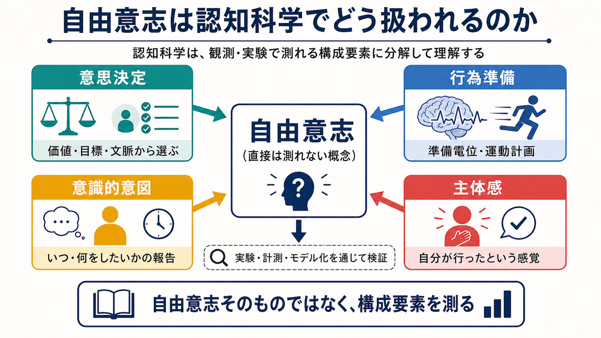
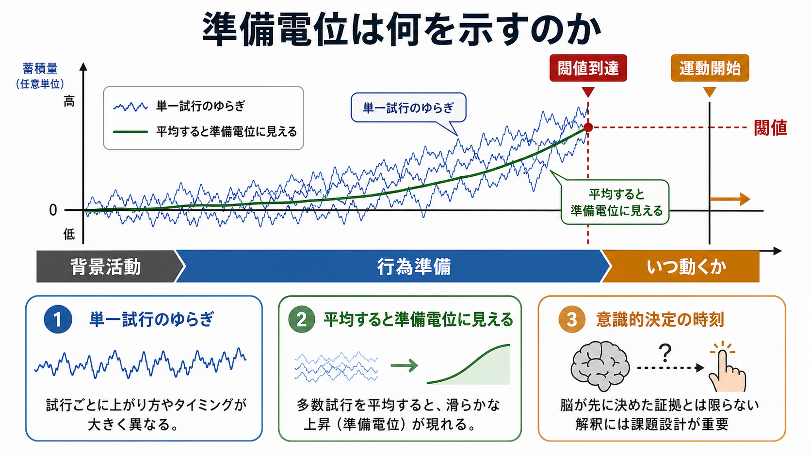

# 自由意志は認知科学でどう扱われるのか

## 要点

- 認知科学は「自由意志が実在するか」を直接判定するよりも、意思決定、行為準備、[[意識とは何か|意識]]的意図、[[主体感とは何か|主体感]]、責任帰属といった測定可能な構成要素に分けて扱う。
- Libet の準備電位研究は、意識的な「今動こう」という報告より前に脳活動が立ち上がることを示したが、それだけで「脳が先に決め、意識は無力である」とは結論できない[1]。
- 準備電位は、単一試行で毎回同じ計画信号が増大するというより、ノイズを含む神経活動が閾値に達する過程を平均した結果としても説明できる[4]。
- 主体感は、運動予測、感覚フィードバック、行為結果、文脈、自己解釈が統合されて生じるため、実際の因果過程と主観的な「自分がやった」という経験はずれることがある[5][6]。
- 認知科学的な結論は、倫理・法・責任能力の問題を置き換えるものではなく、どの条件で選択、抑制、自己制御、責任帰属が成立しにくくなるかを精密化するための材料である。

## この記事で答える問い

この記事では、自由意志をめぐる古典的な哲学問題を、認知科学がどのような実験課題・神経指標・主観報告へ変換してきたのかを整理する。中心になる問いは、次の3つである。

1. 意識的な「意図」は、行為をどこまで原因として動かしているのか。
2. 準備電位や脳活動の先行性は、自由意志の否定を意味するのか。
3. 「自分が行った」という[[自己とは何か|自己]]経験は、どのような認知メカニズムで作られるのか。

## まず結論

認知科学において自由意志は、単一の能力ではなく、複数の処理の束として扱われる。たとえば、価値や目標に基づいて選ぶ処理、運動を準備する処理、行為直前の意図を報告する処理、行為結果を自分に帰属する処理、社会的に責任を問う処理は、互いに関連するが同一ではない。

したがって「準備電位が意識より先に出たから自由意志はない」という形の結論は粗すぎる。より妥当なのは、自由意志を「何もないところから意識が行為を発生させる力」と見なすのではなく、脳・身体・環境の制約の中で、選択肢を評価し、行為を抑制し、理由に応答し、結果を学習する能力として分析することである[7]。

## 背景

自由意志という語は、日常的には「自分で選んだ」「強制されていない」「別の行為もできた」といった意味で使われる。一方、哲学では、決定論と両立するか、道徳責任の根拠になるか、意識が因果的効力を持つかといった問題を含む。

認知科学は、この大きな問いをそのまま実験室に持ち込むことはできない。そこで、より限定された問いに分解する。たとえば、被験者がボタンを押す時刻を自分で決める課題では、「いつ動くか」の決定、運動準備、意図の時刻報告を測る。リスク選択課題では、報酬、損失、確率、衝動性、自己制御を測る。主体感課題では、行為と結果の時間的結合や予測誤差を測る。

この分解は、自由意志を小さくするためではなく、議論の混線を避けるために重要である。たとえば、単純な指の運動で示された脳活動の先行性を、人生上の熟慮的選択や法的責任へそのまま外挿することはできない。

## 基本概念

### 意思決定

意思決定は、選択肢の価値、予測される結果、現在の目標、過去の学習、社会的文脈を統合して行為を選ぶ過程である。自由意志の文脈では「何を選ぶか」が問題になるが、神経科学ではさらに「選ぶまでの証拠蓄積」「探索と活用」「報酬予測」「抑制制御」などに分けて扱う。

### 準備電位

準備電位は、自発的な運動の前に頭皮上 EEG で観察されるゆっくりした陰性方向の電位変化である。Libet らは、被験者が自発的に手首や指を動かす前に準備電位が始まり、意識的な運動意図の報告はその後に来ると報告した[1]。この結果は、自由意志論争を認知神経科学へ引き込んだ代表的研究である。

ただし、準備電位は「最終決定の署名」そのものではない。運動準備、注意、時間推定、課題構造、平均化手続きの影響を受ける。Schurger らは、明確な外的合図がなく「好きな時に動く」課題では、ゆらぎを含む神経活動が閾値を越えた時点で行為が生じ、運動時点でそろえて平均すると準備電位のような滑らかな上昇が現れると説明した[4]。

### 意識的意図

意識的意図とは、「今、動こうと思った」「この行為をしようと思った」という主観的経験である。Libet 型課題では時計盤を見ながら意図が生じた時刻を報告するため、測定値には記憶、注意、時間知覚、行為後の再構成が混ざる。つまり、意図の報告時刻は、意図の因果的な発生時刻をそのまま写したものではない。

### 主体感

主体感は、「この行為を自分が起こした」という感覚である。Haggard らの intentional binding 研究では、自発的行為とその結果の知覚時刻が互いに引き寄せられる現象が示され、行為と結果を結びつける意識経験の指標として扱われた[3]。一方、Wegner は、意識的意志の経験は、思考と行為と結果の関係から自分が原因だと推論する過程でもあると論じた[6]。

Synofzik らは、主体感を単純な運動予測の比較器モデルだけで説明するのではなく、非概念的な「感じ」と、理由や文脈を含む「判断」の二段階として整理した[5]。この区別は、[[身体所有感とは何か|身体所有感]]、作為体験、統合失調症の自己帰属異常などを考えるうえでも重要である。

## 仕組み

自由意志らしい行為は、少なくとも次の連鎖として考えられる。

1. 内的状態と外的状況が、行為候補を活性化する。
2. 価値、目標、規範、記憶が候補を重みづける。
3. 運動系が、実行可能な行為を準備する。
4. 意識は、意図、迷い、決断、抑制としてその一部を経験する。
5. 行為結果が予測と照合され、主体感や責任帰属が更新される。

この連鎖のどこを「自由」と呼ぶかで議論は変わる。もし自由を「神経過程に先立つ非物理的原因」と定義すれば、認知科学はそれを支持しにくい。もし自由を「理由に応答して行為を調整し、衝動を抑制し、結果から学習できる能力」と定義すれば、認知科学はその条件をかなり具体的に調べられる。

Soon らの fMRI 研究は、被験者が左右どちらのボタンを押すかを意識的に決めたと報告する数秒前から、前頭・頭頂領域の活動パターンに選択結果を予測する情報が含まれることを示した[2]。しかし、予測精度は完全ではなく、課題も「意味のある熟慮的選択」ではなく任意のボタン選択である。これは、意識に上る前から選択に関わる情報処理が進むことを示すが、すべての選択が完全に決定済みだと示すものではない。

## 図解

上の2枚の図は、自由意志研究の読み方を分けて示している。

1枚目は、自由意志を「意思決定」「行為準備」「意識的意図」「主体感」に分解する概念地図である。認知科学が直接扱うのは、自由意志という全体概念そのものではなく、実験・計測・モデル化が可能な下位過程である。

2枚目は、準備電位の解釈を示す。古典的には、運動前に生じる準備電位が「意識より前の脳内決定」と読まれやすかった。しかし蓄積モデルでは、単一試行の神経ゆらぎが閾値を越えた時点で運動が起こり、運動時点でそろえて平均すると準備電位のように見える。したがって、準備電位は重要な手がかりだが、それだけで自由意志の有無を決める証拠ではない。

## 臨床・研究との接続

臨床的には、自由意志の問題は「患者は本当に自分で選んだのか」という単純な問いにしてはいけない。衝動制御、強迫、依存、うつ病の意欲低下、統合失調症の作為体験、解離、前頭葉損傷などでは、選択肢の評価、行為抑制、結果予測、自己帰属がそれぞれ異なる形で変化しうる。

この観点は、[[リスク下の意思決定はどのように行われるのか|リスク下の意思決定]]、[[無意識処理とは何か|無意識処理]]、[[予測処理とは何か|予測処理]]、[[運動ネットワークは随意運動をどう生み出すのか|随意運動の神経回路]]、[[事象関連電位ERPとは何か|ERP]] の理解と接続する。教育・研究目的では、自由意志を「ある／ない」の二分法で扱うより、どの処理がどの条件で弱まり、どの支援で回復しうるかを問う方が有用である。

また、法的責任や道徳責任は、神経活動の先行性だけでは決まらない。責任能力は、行為時の理解、制御、予見可能性、代替行為可能性、社会規範との関係を含む制度的概念である。神経科学はその判断材料を提供しうるが、判断そのものを自動化するものではない。

## よくある誤解

### 誤解1: 準備電位は自由意志を否定した

準備電位は、意識的意図の報告より前に行為関連活動が始まることを示した。しかし、それは「意識が何もしていない」ことや「すべての行為が事前に完全決定されている」ことを示さない。課題は単純な自発運動であり、意図時刻の報告にも測定上の限界がある[1][4]。

### 誤解2: 無意識過程があるなら自由ではない

意思決定の多くが無意識的処理に支えられることは、自由の不在を意味しない。むしろ、熟練、直感、感情、身体状態、過去の学習が選択に関与するからこそ、人間の行為は速く柔軟になる。問題は、無意識過程が理由に応答できるか、修正可能か、抑制可能かである。

### 誤解3: 主体感は常に正確な自己観察である

主体感は、行為と結果の関係を脳が推定する経験である。予測と結果がよく合い、文脈的にも自分の行為として説明しやすいと主体感は強くなる。一方、遅延、予測誤差、外的操作、病的体験があると、主体感は弱まったり誤帰属されたりする[3][5][6]。

### 誤解4: 認知科学は責任を消す

認知科学は、責任を消すというより、責任を支える能力の条件を分解する。たとえば、計画、抑制、理解、予測、学習、社会的応答性がどの程度保たれているかを検討できる。これは、責任を単純に否定するためではなく、支援、治療、制度設計を精密にするために使うべき知識である。

## 関連ノート

- [[主体感とは何か]]
- [[自己とは何か]]
- [[身体所有感とは何か]]
- [[意識とは何か]]
- [[無意識処理とは何か]]
- [[予測処理とは何か]]
- [[リスク下の意思決定はどのように行われるのか]]
- [[運動ネットワークは随意運動をどう生み出すのか]]
- [[事象関連電位ERPとは何か]]

## 理解チェック

1. Libet 型実験で測っているのは、自由意志そのものではなく、どのような構成要素か。
2. 準備電位を「脳が先に決めた証拠」と読むとき、どのような課題設計上の限界があるか。
3. 主体感と実際の因果過程がずれる例には、どのようなものがあるか。
4. 「自由」を、非物理的原因ではなく理由応答性や自己制御として定義すると、研究上どのような利点があるか。

## 参考文献

[1] Libet, B., Gleason, C. A., Wright, E. W., & Pearl, D. K. (1983). Time of conscious intention to act in relation to onset of cerebral activity (readiness-potential): The unconscious initiation of a freely voluntary act. *Brain*, 106(3), 623-642. https://doi.org/10.1093/brain/106.3.623

[2] Soon, C. S., Brass, M., Heinze, H.-J., & Haynes, J.-D. (2008). Unconscious determinants of free decisions in the human brain. *Nature Neuroscience*, 11, 543-545. https://doi.org/10.1038/nn.2112

[3] Haggard, P., Clark, S., & Kalogeras, J. (2002). Voluntary action and conscious awareness. *Nature Neuroscience*, 5, 382-385. https://doi.org/10.1038/nn827

[4] Schurger, A., Sitt, J. D., & Dehaene, S. (2012). An accumulator model for spontaneous neural activity prior to self-initiated movement. *Proceedings of the National Academy of Sciences*, 109(42), E2904-E2913. https://doi.org/10.1073/pnas.1210467109

[5] Synofzik, M., Vosgerau, G., & Newen, A. (2008). Beyond the comparator model: A multifactorial two-step account of agency. *Consciousness and Cognition*, 17(1), 219-239. https://doi.org/10.1016/j.concog.2007.03.010

[6] Wegner, D. M. (2003). The mind's best trick: How we experience conscious will. *Trends in Cognitive Sciences*, 7(2), 65-69. https://doi.org/10.1016/S1364-6613(03)00002-0

[7] Haggard, P. (2008). Human volition: Towards a neuroscience of will. *Nature Reviews Neuroscience*, 9, 934-946. https://doi.org/10.1038/nrn2497

[8] Maoz, U., Yaffe, G., Koch, C., & Mudrik, L. (2019). Neural precursors of decisions that matter: An ERP study of deliberate and arbitrary choice. *eLife*, 8, e39787. https://doi.org/10.7554/eLife.39787

## 関連ノート候補・MOC更新候補

- MOC更新候補: `content/00_MOC/` 配下の認知科学・意識・自己関連 MOC に、バッチ統合時に本記事へのリンクを追加する。
- 今後の作成候補: 「意識的意図とは何か」「準備電位とは何か」「責任能力と認知科学はどう関係するのか」「作為体験とは何か」。

## 未解決問題

- 単純な任意運動課題の知見を、価値葛藤や熟慮を含む現実的選択へどこまで一般化できるか。
- 意識的意図は、行為原因ではなく行為モニタリングなのか、それとも長い時間スケールでは制御・学習に因果的に関与するのか。
- 主体感、道徳責任、法的責任を、神経指標と社会制度のあいだでどのように接続するのが妥当か。
