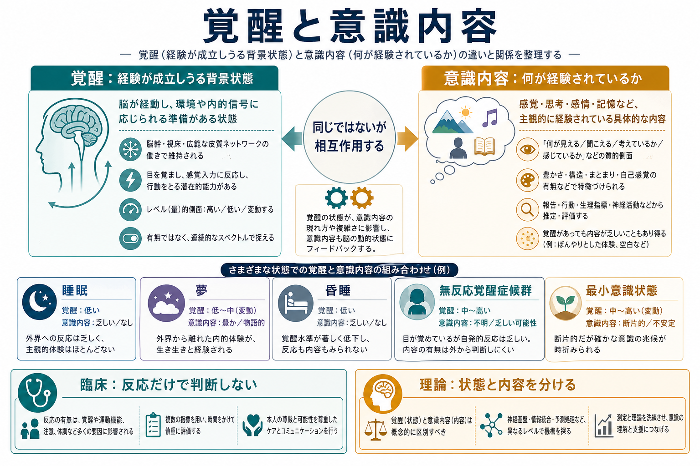
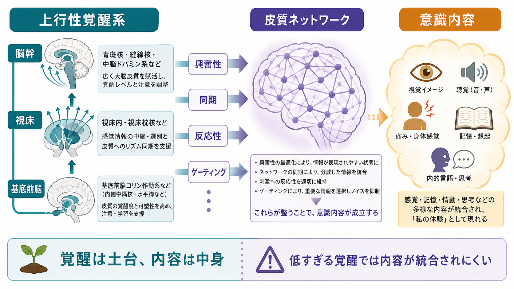
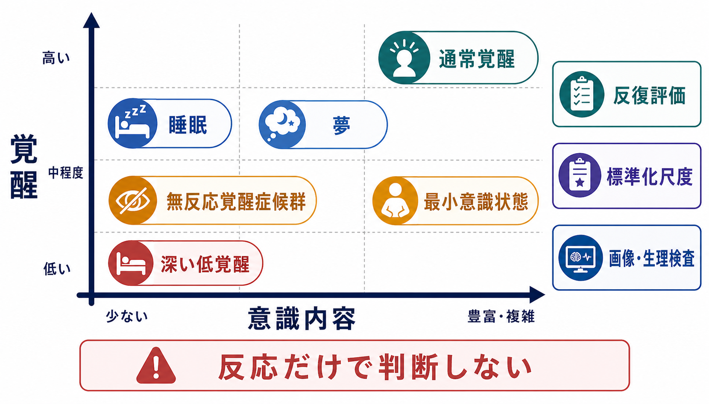

# 覚醒と意識内容は何が違うのか

## 要点

- 覚醒は、眠気から清明な覚醒までの「経験が成立しうる背景状態」である。
- 意識内容は、見えているもの、聞こえている音、痛み、内的な思考、夢の場面など「何が経験されているか」である。
- 両者は強く連動するが、同じものではない。覚醒が高くても内容が乏しい状態、覚醒が低くても夢のような内容が生じる状態がある。
- 臨床では、行動反応だけで「意識がない」と断定しないために、覚醒と意識内容を分けて評価する必要がある。
- 理論研究では、覚醒を支える脳幹・視床・基底前脳などの系と、内容を支える皮質ネットワークを区別することで、意識の神経相関を過大に単純化しにくくなる。

## この記事で答える問い

1. 覚醒と意識内容は、日常語の「意識」とどう違うのか。
2. なぜ意識研究では「レベル」と「内容」を分けるのか。
3. 脳幹、視床、基底前脳、皮質ネットワークはどのように関わるのか。
4. 昏睡、睡眠、無反応覚醒症候群、最小意識状態の理解に、この区別はどう役立つのか。

## まず結論

覚醒と意識内容の違いは、「経験できる状態にあるか」と「何を経験しているか」の違いである。

たとえば、眠っている人は外から見ると反応が乏しい。しかし夢を見ているときには、外界への反応は弱くても、内的な視覚場面や感情を経験していることがある。一方、重い意識障害では、目が開いて睡眠覚醒周期が見えても、持続的で再現性のある意識内容を行動から確認できない場合がある。このような状態を理解するには、覚醒を単なる「意識の有無」と同一視しないことが重要になる[3][4]。

意識の神経科学では、覚醒を支える広域調節系と、特定の経験内容を支える皮質活動を分けて考える。前者は脳全体の準備状態を調整し、後者は顔、音、痛み、内的思考などの内容を形づくる。この二分法は完全な答えではないが、臨床評価、神経画像研究、意識理論を整理するための有用な出発点である[1][2]。

## 背景

日常会話では「意識がある」「意識がない」という表現がよく使われる。しかし研究や臨床では、この表現だけでは粗すぎる。目が開いているか、命令に従えるか、痛み刺激に反応するか、あとで経験を報告できるか、脳活動が外界刺激や課題に応答しているかは、互いに関連するが同じ指標ではない。

意識の神経相関をめぐる議論でも同じ問題がある。意識に伴う脳活動を探すとき、単に「覚醒している脳」と「眠っている脳」を比べるだけでは、覚醒度、注意、記憶、報告、運動反応、課題理解が混ざってしまう。Koch らは、意識の神経相関を考える際に、特定の主観的経験を支える最小限の神経機構を慎重に切り分ける必要があると整理している[1]。また Seth と Bayne は、現代の意識理論が「意識の状態」と「意識の内容」をどのように扱うかを比較し、単一の尺度に還元しない重要性を強調している[2]。

この区別は、[[意識とは何か]]、[[主観的経験は科学的に扱えるのか]]、[[注意とは何か]]、[[知覚とは何か]]の理解にも関わる。注意や知覚は意識内容を強く変えるが、注意が向いていることと覚醒していることは同じではない。

## 基本概念

### 覚醒

覚醒とは、脳と身体が外界や内的状態に反応しうる全体的な準備状態である。眠気、傾眠、清明な覚醒、過覚醒のように連続的に変化する。神経学的には、脳幹網様体、視床、基底前脳、視床下部、モノアミン系、コリン作動系などが関わる広域調節の問題として扱われる[5][6]。

覚醒は「内容そのもの」ではない。部屋の照明にたとえるなら、覚醒は明るさや電源に近い。明るいからといって、机の上に何が置かれているかまでは決まらない。同様に、覚醒が高いことは、経験内容が豊かで、統合され、報告可能であることを自動的には意味しない。

### 意識内容

意識内容とは、その時点で経験されている具体的な中身である。赤い色、顔、音楽、痛み、空腹感、内的独白、過去の記憶、未来の想像などが含まれる。意識内容は、視覚、聴覚、体性感覚、内受容感覚、記憶、情動、言語などの処理と結びつく。

内容を考えるときには、[[知覚とは何か]]や[[ワーキングメモリとは何か]]が重要になる。知覚は外界入力を意味ある対象として構成し、ワーキングメモリは一部の内容を保持し、比較し、報告や意思決定に使える形にする。

### 意識レベルという言い方

臨床では「意識レベル」という表現がよく使われる。これは主に覚醒度や反応性を評価する実用的な言葉である。ただし、意識レベルが低いことと、意識内容が完全にないことは同義ではない。行動反応が乏しい理由には、覚醒低下、運動出力の障害、感覚入力の障害、言語理解の障害、課題の負荷、疼痛、薬剤、せん妄などが含まれる。

したがって、意識レベルは臨床上の重要な指標だが、主観的経験の有無や豊かさを直接読む窓ではない。

## 仕組み

### 覚醒を支える広域調節系

覚醒には、脳幹から視床、基底前脳、大脳皮質へ向かう上行性の調節系が関わる。これらの系は、ノルアドレナリン、セロトニン、アセチルコリン、ヒスタミン、オレキシンなどの神経調節物質を通じて、皮質全体の興奮性、同期、反応性を変える[5][6]。関連して、[[ノルアドレナリンは覚醒とストレスにどう関わるのか]]や[[アセチルコリンは注意や記憶にどう関わるのか]]を読むと、覚醒が単なるオン・オフではなく、課題、情動、注意と結びついた調節状態であることが見えやすい。

この系は特定の内容を描くというより、内容が安定して生じるための条件を整える。覚醒が極端に低いと、皮質ネットワークは入力を統合し、保持し、報告可能な経験として組み立てにくくなる。

### 内容を支える皮質ネットワーク

意識内容は、感覚皮質、連合皮質、前頭頭頂ネットワーク、内側皮質ネットワークなどの活動と関わる。顔の経験には顔処理に関わる視覚領域が、音の経験には聴覚系が、痛みの経験には体性感覚・島皮質・前帯状皮質などが関わる。重要なのは、これらの領域が局所的に活動するだけでなく、内容が他の処理へ利用可能になるための統合や相互作用が必要になる点である[1][2]。

この観点では、[[皮質視床ループは意識や注意にどう関わるのか]]が関連する。視床は単なる中継点ではなく、皮質活動の同期、ゲーティング、状態調整に関わるため、覚醒と内容の境界にまたがる重要な位置を占める。

### 二軸で見ると何がわかるか

覚醒と意識内容を二軸にすると、単純な「ある・ない」よりも多くの状態を整理できる。

| 状態 | 覚醒 | 意識内容 | 注意点 |
|---|---|---|---|
| 通常覚醒 | 高い | 豊か | 報告、行動、脳活動が比較的一致しやすい |
| 睡眠 | 低いことが多い | 乏しいことが多い | 睡眠段階により異なる |
| REM睡眠・夢 | 外界反応は低い | 内的内容は豊かになりうる | 覚醒度と内容の解離を示す例 |
| 昏睡 | 低い | 行動上確認困難 | 目覚めや睡眠覚醒周期が乏しい |
| 無反応覚醒症候群 | ある程度保たれる | 行動上確認困難 | 目が開いても内容を確認できるとは限らない |
| 最小意識状態 | 変動する | 部分的に確認可能 | 再現性ある意図的反応が鍵になる |

この表は診断基準の代替ではない。臨床評価では、神経学的診察、反復評価、標準化尺度、画像・生理検査、薬剤や全身状態の確認を組み合わせる必要がある[4]。

## 図解

図の要点は、左上や右下のような「直感に反する組み合わせ」を見落とさないことである。目が開いているから意識内容が豊かだとは限らないし、外界への反応が弱いから主観的経験がまったくないとも限らない。

## 臨床・研究との接続

### 意識障害の評価

昏睡、無反応覚醒症候群、最小意識状態では、覚醒と意識内容の区別が特に重要になる。Laureys らは、これらの状態を理解するうえで、覚醒、反応性、認知内容、脳代謝、ネットワーク機能を分けて考える必要があると整理した[3]。2018年の米国神経学会などの実践ガイドラインも、意識障害の評価では標準化された行動評価を反復し、予後や治療方針について慎重に判断することを推奨している[4]。

ここで重要なのは、この記事が個別患者の診断や治療方針を示すものではないという点である。意識障害の判断は、専門職による包括的評価と臨床文脈に依存する。

### 隠れた意識と神経画像

Owen らは、植物状態と診断された患者にメンタルイメージ課題を行わせ、健常者と類似した fMRI 活動パターンを報告した[7]。Monti らは、意識障害患者の一部で、意志的な脳活動変調を用いた応答が可能であることを示した[8]。これらの研究は、行動反応が乏しいことと、内的な理解や意図が完全にないことを同一視できないことを示している。

ただし、fMRI や EEG は万能ではない。課題理解、聴覚入力、疲労、薬剤、運動障害、統計解析、偽陰性・偽陽性の問題がある。[[fMRIは神経活動を直接測っているのか]]や[[脳波EEGは何を測っているのか]]で扱うように、神経計測は主観的経験を直接撮影しているわけではなく、経験と関連する生理信号を間接的に扱う方法である。

### 意識理論への意味

意識理論では、覚醒と内容を混ぜると議論が混乱しやすい。ある理論が説明しているのは、意識が存在するための全体状態なのか、特定の経験内容が生じる仕組みなのか、内容が報告可能になる仕組みなのかを区別する必要がある[2]。

たとえば、グローバルな利用可能性を重視する理論は、内容が報告、推論、行動制御に使えるようになる条件を説明しやすい。一方、統合や複雑性を重視する理論は、経験が単なる局所処理ではなく、統一された主観的場として成立する条件に焦点を当てる。どちらの場合も、覚醒を「意識そのもの」とみなすと、内容の違いや臨床状態の多様性を説明しにくくなる。

## よくある誤解

### 誤解1: 目が開いていれば意識内容がある

目が開くことは覚醒の指標になりうるが、意識内容の十分な証拠ではない。睡眠覚醒周期や開眼があっても、意味ある命令追従や一貫した意思表示が確認できない状態がある[3][4]。

### 誤解2: 反応しなければ経験もない

行動反応がない理由は多い。運動出力の障害、失語、感覚障害、疲労、薬剤、課題理解の困難があると、経験があっても外に表れにくい。神経画像研究は、この問題を強く意識させた[7][8]。

### 誤解3: 覚醒は高いほど常によい

覚醒は高すぎても注意や判断を乱すことがある。過覚醒、不安、疼痛、せん妄では、単に覚醒が高いだけでは適応的な意識内容や行動につながらない。覚醒は「量」だけでなく、安定性、調節可能性、文脈への適合性が重要である。

### 誤解4: 意識内容は脳の一部だけで決まる

特定の内容には特定の領域が関わるが、経験として成立するには、局所処理、広域ネットワーク、記憶、身体状態、注意、報告可能性が重なり合う。単一領域だけで「意識内容の場所」を決めるのは単純化しすぎである[1][2]。

## 関連ノート

- [[意識とは何か]]
- [[主観的経験は科学的に扱えるのか]]
- [[皮質視床ループは意識や注意にどう関わるのか]]
- [[注意とは何か]]
- [[知覚とは何か]]
- [[ワーキングメモリとは何か]]
- [[ノルアドレナリンは覚醒とストレスにどう関わるのか]]
- [[アセチルコリンは注意や記憶にどう関わるのか]]
- [[fMRIは神経活動を直接測っているのか]]
- [[脳波EEGは何を測っているのか]]

## MOC更新候補

- [[MOC｜認知科学・心理学]] の「意識・自己・身体性」配下に追加候補。
- [[MOC｜脳・神経科学]] の意識・覚醒系・皮質視床ループ関連から参照候補。
- 並列ジョブとの衝突を避けるため、本記事では MOC 本体は更新しない。

## 理解チェック

1. 覚醒と意識内容を、それぞれ一文で説明するとどうなるか。
2. REM睡眠は、覚醒と意識内容の二軸で見るとどのような位置づけになるか。
3. 無反応覚醒症候群で「目が開いている」ことだけでは不十分なのはなぜか。
4. fMRI や EEG が意識内容の評価に役立つ一方で、万能ではない理由は何か。

## 未解決問題

- 意識内容が「ある」と判断するための最小条件は、行動、報告、脳活動のどれに置くべきか。
- 覚醒系と内容ネットワークの相互作用を、個人差や病態差まで含めてどうモデル化できるか。
- 意識障害患者の残存経験を検出する技術を、臨床倫理と結びつけてどこまで実装できるか。
- 夢、麻酔、せん妄、精神病症状を同じ二軸でどこまで比較できるか。

## 参考文献

[1] Koch, C., Massimini, M., Boly, M., & Tononi, G. (2016). Neural correlates of consciousness: progress and problems. *Nature Reviews Neuroscience*, 17, 307-321. https://doi.org/10.1038/nrn.2016.22

[2] Seth, A. K., & Bayne, T. (2022). Theories of consciousness. *Nature Reviews Neuroscience*, 23, 439-452. https://doi.org/10.1038/s41583-022-00587-4

[3] Laureys, S., Owen, A. M., & Schiff, N. D. (2004). Brain function in coma, vegetative state, and related disorders. *The Lancet Neurology*, 3(9), 537-546. https://doi.org/10.1016/S1474-4422(04)00852-X

[4] Giacino, J. T., Katz, D. I., Schiff, N. D., Whyte, J., Ashwal, S., Ashman, E. J., et al. (2018). Practice guideline update recommendations summary: Disorders of consciousness. *Neurology*, 91(10), 450-460. https://doi.org/10.1212/WNL.0000000000005926

[5] Parvizi, J., & Damasio, A. R. (2001). Consciousness and the brainstem. *Cognition*, 79(1-2), 135-160. https://doi.org/10.1016/S0010-0277(00)00127-X

[6] Brown, E. N., Lydic, R., & Schiff, N. D. (2010). General anesthesia, sleep, and coma. *New England Journal of Medicine*, 363, 2638-2650. https://doi.org/10.1056/NEJMra0808281

[7] Owen, A. M., Coleman, M. R., Boly, M., Davis, M. H., Laureys, S., & Pickard, J. D. (2006). Detecting awareness in the vegetative state. *Science*, 313(5792), 1402. https://doi.org/10.1126/science.1130197

[8] Monti, M. M., Vanhaudenhuyse, A., Coleman, M. R., Boly, M., Pickard, J. D., Tshibanda, L., Owen, A. M., & Laureys, S. (2010). Willful modulation of brain activity in disorders of consciousness. *New England Journal of Medicine*, 362, 579-589. https://doi.org/10.1056/NEJMoa0905370
