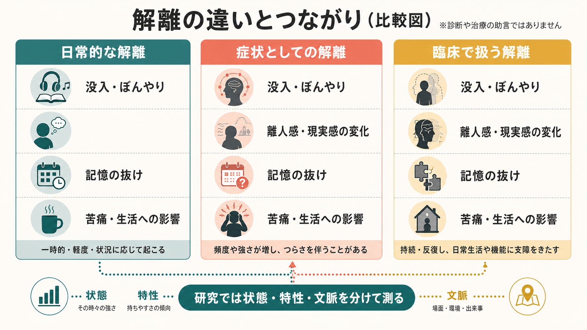
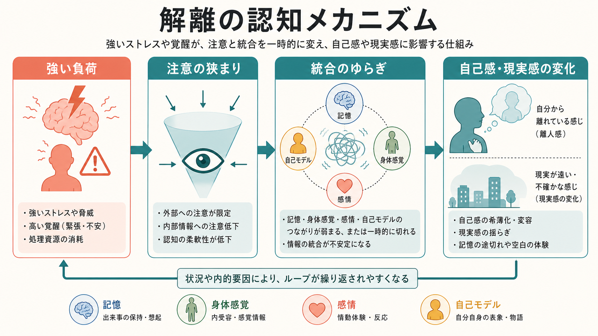

# 解離とは認知科学的に何か

## 要点

- 解離とは、ふつうはまとまって働く記憶、[[意識とは何か|意識]]、感情、身体感覚、自己感覚、行為感が、一時的または持続的にばらけて経験される現象である。
- 認知科学的には、「心が壊れる」というより、注意、記憶検索、身体信号、情動調整、自己モデルの統合様式が変わることとして理解できる。
- 解離には、ぼんやり・没入のような日常的経験から、離人感、現実感消失、解離性健忘、同一性の変化まで幅がある。すべてを同じ重症度の一本線で扱うと、機序も臨床的意味も見えにくくなる [1][2]。
- 強いストレス、疲労、睡眠不足、恐怖、トラウマ関連刺激などは、注意の狭まりや情動調整の変化を通じて、自己感・現実感・記憶のまとまりを変えうる [3][4]。
- 臨床では、解離があるかどうかだけでなく、頻度、持続、苦痛、生活機能への影響、他の精神症状や身体疾患との関係を慎重に評価する必要がある [1][5]。



## この記事で答える問い

1. 解離を、認知科学ではどのような情報処理の変化として捉えられるのか。
2. 離人感、現実感消失、記憶の抜け、没入、同一性の変化はどこでつながり、どこで分けるべきか。
3. 解離は、[[最小自己とは何か|最小自己]]、[[物語的自己とは何か|物語的自己]]、身体感覚、記憶の研究とどう接続するのか。
4. 研究・臨床で解離を扱うとき、どのような誤解を避けるべきか。

## まず結論

解離は、「意識がなくなること」でも「記憶が単に弱いこと」でもない。認知科学的には、ふだん一つの経験としてまとまっている複数の情報流が、同じ時間・同じ自己・同じ文脈に結びつきにくくなる現象である。

たとえば、ある出来事を見ているのに「自分がそこにいる感じ」が薄い。身体感覚はあるのに「自分の身体としての手触り」が弱い。出来事の断片は残っているのに、前後関係や自伝的意味づけが抜け落ちる。これらは別々の症状名に分けられることもあるが、共通しているのは、記憶・身体・感情・自己モデルの結合が変わる点である [2][6]。

ただし、解離を一つの原因で説明するのは危険である。トラウマとの関連は重要だが、解離はトラウマだけで生じるわけではないし、解離があることだけで特定の過去体験や診断を推定することもできない [4][5]。認知科学的には、状態、特性、文脈、課題、身体状態を分けて考える必要がある。

## 背景

「解離」という語は、日常語、精神医学、心理療法、神経科学で少しずつ違う意味で使われる。DSM-5-TR では、解離性障害は意識、記憶、同一性、感情、知覚、身体表象、運動制御、行動の統合における断絶・途切れとして整理される [1]。この定義は広い。だからこそ、研究では下位タイプを分ける必要がある。

代表的な整理では、解離は大きく「離隔 detachment」と「区画化 compartmentalization」に分けられる [2]。離隔は、自己や世界から距離があるように感じる経験であり、離人感や現実感消失が典型である。区画化は、通常なら意識的にアクセスできる記憶、感覚、運動、同一性が、特定の文脈で利用できなくなる経験であり、解離性健忘や一部の機能性神経症状と関係する。

この区別は、[[注意と意識は同じものなのか|注意と意識]]の区別にも近い。注意が外界の一部に強く向いていても、自己感や身体感覚が十分に統合されているとは限らない。逆に、外界への反応が保たれていても、本人の主観的経験では「自分が自分としてそこにいる感じ」が弱まることがある。

## 基本概念

### 離人感と現実感消失

離人感は、自分の思考、感情、身体、行為が自分から離れているように感じられる経験である。現実感消失は、周囲の世界が遠い、夢のよう、薄い、人工的に感じられる経験である。両者はしばしば一緒に現れ、離人感・現実感消失症では、現実検討は保たれたまま、持続的または反復的な苦痛と機能低下が問題になる [1][7]。

認知科学的には、これは「世界が見えない」ことではなく、見えている世界を「自分がいまここで経験している」と結びつける自己関連処理の変化である。つまり、知覚内容そのものよりも、知覚内容の所有感、親近感、情動的な手触りが変わる。

### 解離性健忘

解離性健忘では、通常の忘却では説明しにくい重要な個人的記憶へのアクセス困難が問題になる [1]。これは記憶痕跡が完全に消えたという意味ではなく、検索手がかり、感情状態、自己物語との接続が変わる現象として考えられる。

[[物語的自己とは何か|物語的自己]]の観点から見ると、記憶は出来事の保存庫ではなく、「私の過去」として配置されることで現在の自己理解に組み込まれる。解離性の記憶の抜けは、この配置が一時的に機能しにくくなる現象として読める。

### 没入と病的解離

本を読んで時間を忘れる、作業に没頭して周囲への気づきが薄れる、といった経験も広い意味では解離的である。しかし、日常的な没入と臨床的に問題となる解離を同一視してはいけない。重要なのは、本人の苦痛、制御困難、反復性、生活機能への影響、危険な状況との関係である [5]。

## 仕組み

### 1. 注意の狭まり

強いストレスや脅威は、注意を危険関連情報へ狭める。これは適応的な面をもつが、内受容感覚、周辺文脈、時間的つながりへのアクセスを弱めることがある。結果として、出来事の一部は鮮明なのに、全体のまとまりや「自分がそこにいる感じ」が薄くなる。

### 2. 情動調整と身体信号

離人感・現実感消失では、情動的な鈍さ、身体感覚の遠さ、世界の平板さが報告されることがある。神経生物学的モデルでは、前頭前野による情動系の抑制、扁桃体や島皮質、帯状皮質、身体表象ネットワークの関与が議論されている [6][8]。ただし、特定の脳部位だけで解離を説明できる段階ではない。

### 3. 自己モデルのゆらぎ

[[最小自己とは何か|最小自己]]は、身体が自分のものとして感じられ、行為が自分から生じているように経験される基盤である。解離では、この基盤が完全に消えるというより、身体感覚、内受容、行為予測、情動価値づけの重みづけが変わる。能動推論や予測処理の枠組みでは、自己感は身体状態と行為可能性を推定する生成モデルとして扱われ、離人感は身体信号や制御感の精度づけの変化として説明される [7]。



### 4. 記憶と文脈の結びつき

記憶は、出来事、場所、身体状態、感情、意味づけが結びついて成立する。解離が強いと、出来事の断片は残っても、時間順序、自己関連性、感情的意味がまとまりにくいことがある。これは、トラウマ記憶の議論とも接続するが、すべての解離をトラウマ記憶だけで説明する必要はない [4]。

## 図解

| 図 | 役割 | 本文での読み方 |
|---|---|---|
| 図1 | 解離のスペクトラム | 日常的な没入、症状としての解離、臨床で扱う解離を、強さ・持続・影響・文脈で分ける |
| 図2 | 認知メカニズム | 強い負荷、注意の狭まり、統合のゆらぎ、自己感・現実感の変化という流れで理解する |

### 図解案: 第3図

画像生成では第3図の主題適合が不十分だったため、存在しない画像リンクは挿入しない。必要なら、次のプロンプトで再生成する。

```text
日本語の科学教育インフォグラフィック。タイトル「解離の研究と臨床の接続」。3つの横並びの枠を置く。左から「測定：状態・特性・文脈」「仮説：注意・記憶・身体信号・自己モデル」「応用：評価・心理教育・安全な支援」。下部に「診断や治療方針は専門家が総合的に判断」と小さく入れる。解離だけを扱い、半側空間無視、病態失認、麻痺、リハビリ、脳卒中を入れない。暖かい白背景、黒文字、ティール・コーラル・マスタードの控えめな配色。
```

## 臨床・研究との接続

解離は、解離性障害だけでなく、PTSD、境界性パーソナリティ症、機能性神経症状症、摂食症、物質関連症、不安症、抑うつ症、精神病性障害など、複数の診断カテゴリーにまたがって観察される。DES を用いたメタ分析では、解離性障害で最も高い平均スコアが示され、PTSD、境界性パーソナリティ症、転換症でも高い値が報告された [5]。この結果は、解離を単一診断の付属物ではなく、横断診断的な症候として評価する必要を示している。

臨床的には、教育・研究目的の整理と、個別の診断や治療判断を分ける必要がある。離人感や記憶の抜けがあるからといって、特定の疾患や過去体験が直ちに確定するわけではない。逆に、外から普通に会話できているように見えても、本人の主観的苦痛が小さいとは限らない。評価では、主観報告、生活機能、時間経過、安全性、身体疾患や薬物、睡眠、ストレス状況、併存症を合わせて見る。

研究では、少なくとも三つを分けると見通しがよい。第一に、その時々の解離の強さである「状態」。第二に、解離しやすさという「特性」。第三に、トラウマ、対人関係、疲労、睡眠、薬物、文化的意味づけなどの「文脈」である。この三つを混ぜると、脳画像や質問紙の結果を解釈しにくくなる。

## よくある誤解

### 誤解1: 解離は演技である

解離は主観的経験に強く依存するため、外から見えにくい。しかし、見えにくいことは存在しないことを意味しない。質問紙、面接、行動課題、神経画像、心理生理指標を組み合わせることで、部分的に検討可能である [5][6]。

### 誤解2: 解離があれば必ずトラウマがある

トラウマと解離の関連は重要で、複数の研究で支持されている [4]。しかし、解離は疲労、ストレス、睡眠不足、薬物、パニック、身体疾患、文化的実践などとも関係しうる。したがって、解離から過去体験を逆算して断定してはいけない。

### 誤解3: 解離は意識が低下することだけである

解離では、覚醒水準が保たれている場合も多い。問題は、経験内容、自己感、記憶、身体感覚、感情がどのように統合されているかである。これは[[意識とは何か|意識]]の水準だけでなく、意識内容と自己関連処理の問題である。

### 誤解4: 解離は一つのメカニズムで説明できる

離人感、現実感消失、解離性健忘、没入、同一性の変化は、重なる部分をもちつつも同じ機序とは限らない。離隔と区画化を分け、さらに状態・特性・文脈を分けることで、より精密な理解に近づける [2]。

## 関連ノート

### 既存ノート

- [[意識とは何か]]
- [[最小自己とは何か]]
- [[注意と意識は同じものなのか]]
- [[物語的自己とは何か]]

### 今後の作成候補

- 離人感とは何か
- 現実感消失とは何か
- 解離性健忘とは何か
- トラウマ記憶と解離はどう関係するのか
- 予測処理から見た自己感の変化
- 内受容感覚と精神症状

### MOC 更新候補

- `content/00_MOC/` 配下の認知科学・心理学系 MOC
- 意識・自己・身体性カテゴリの索引
- 精神医学・臨床心理学系 MOC

## 理解チェック

1. 解離を「記憶が弱いこと」だけで説明すると、何を見落とすか。
2. 離隔と区画化は、どのような経験の違いとして説明できるか。
3. 離人感・現実感消失では、現実検討が保たれることがある。この点は精神病性体験との区別でなぜ重要か。
4. 解離を研究するとき、状態・特性・文脈を分ける必要があるのはなぜか。
5. 解離とトラウマの関係を説明するとき、どのような断定を避けるべきか。

## 未解決問題

- 解離の下位タイプごとに、どの認知機構と脳ネットワークが共有され、どこが異なるのか。
- 主観的な自己感の変化を、質問紙・行動課題・神経画像・生理指標でどこまで対応づけられるのか。
- トラウマ、睡眠、疲労、薬物、文化的実践、瞑想経験など、異なる文脈で生じる自己感の変化を同じモデルで扱えるのか。
- 解離を「防衛」「障害」「適応的反応」「予測処理の変化」として説明するモデルを、どの水準で統合すべきか。

## 参考文献

[1] American Psychiatric Association. (2022). *Diagnostic and Statistical Manual of Mental Disorders, Fifth Edition, Text Revision (DSM-5-TR)*. American Psychiatric Association Publishing. https://doi.org/10.1176/appi.books.9780890425787

[2] Holmes, E. A., Brown, R. J., Mansell, W., Fearon, R. P., Hunter, E. C. M., Frasquilho, F., & Oakley, D. A. (2005). Are there two qualitatively distinct forms of dissociation? A review and some clinical implications. *Clinical Psychology Review*, 25(1), 1-23. https://doi.org/10.1016/j.cpr.2004.08.006

[3] Hunter, E. C. M., Phillips, M. L., Chalder, T., Sierra, M., & David, A. S. (2003). Depersonalisation disorder: A cognitive-behavioural conceptualisation. *Behaviour Research and Therapy*, 41(12), 1451-1467. https://doi.org/10.1016/S0005-7967(03)00066-4

[4] Dalenberg, C. J., Brand, B. L., Gleaves, D. H., Dorahy, M. J., Loewenstein, R. J., Cardeña, E., Frewen, P. A., Carlson, E. B., & Spiegel, D. (2012). Evaluation of the evidence for the trauma and fantasy models of dissociation. *Psychological Bulletin*, 138(3), 550-588. https://doi.org/10.1037/a0027447

[5] Lyssenko, L., Schmahl, C., Bockhacker, L., Vonderlin, R., Bohus, M., & Kleindienst, N. (2018). Dissociation in psychiatric disorders: A meta-analysis of studies using the Dissociative Experiences Scale. *American Journal of Psychiatry*, 175(1), 37-46. https://doi.org/10.1176/appi.ajp.2017.17010025

[6] Lebois, L. A. M., Kumar, P., Palermo, C. A., et al. (2022). Deconstructing dissociation: A triple network model of trauma-related dissociation and its subtypes. *Neuropsychopharmacology*, 47, 2261-2270. https://doi.org/10.1038/s41386-022-01468-1

[7] Deane, G., Miller, M., & Wilkinson, S. (2020). Losing ourselves: Active inference, depersonalization, and meditation. *Frontiers in Psychology*, 11, 539726. https://doi.org/10.3389/fpsyg.2020.539726

[8] Murphy, R. J. (2023). Depersonalization/derealization disorder and neural correlates of trauma-related pathology: A critical review. *Innovations in Clinical Neuroscience*, 20(1-3), 53-59. https://pmc.ncbi.nlm.nih.gov/articles/PMC10132272/
