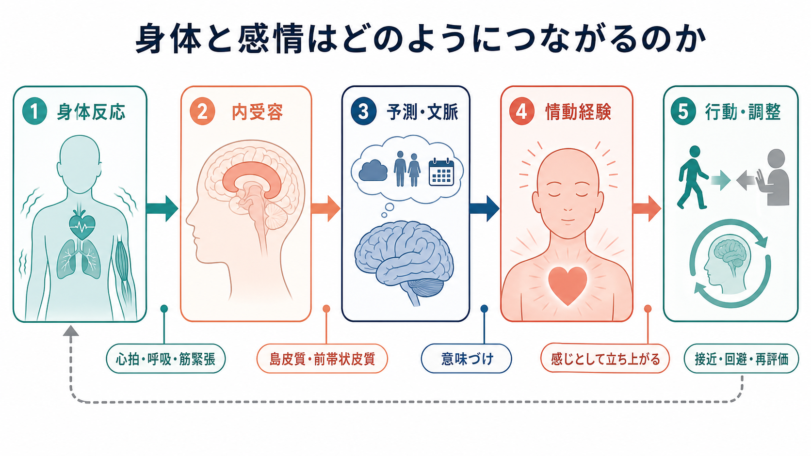
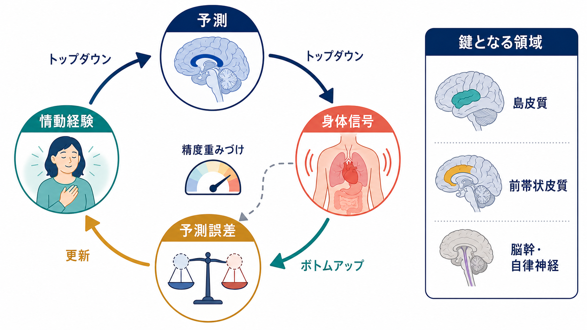
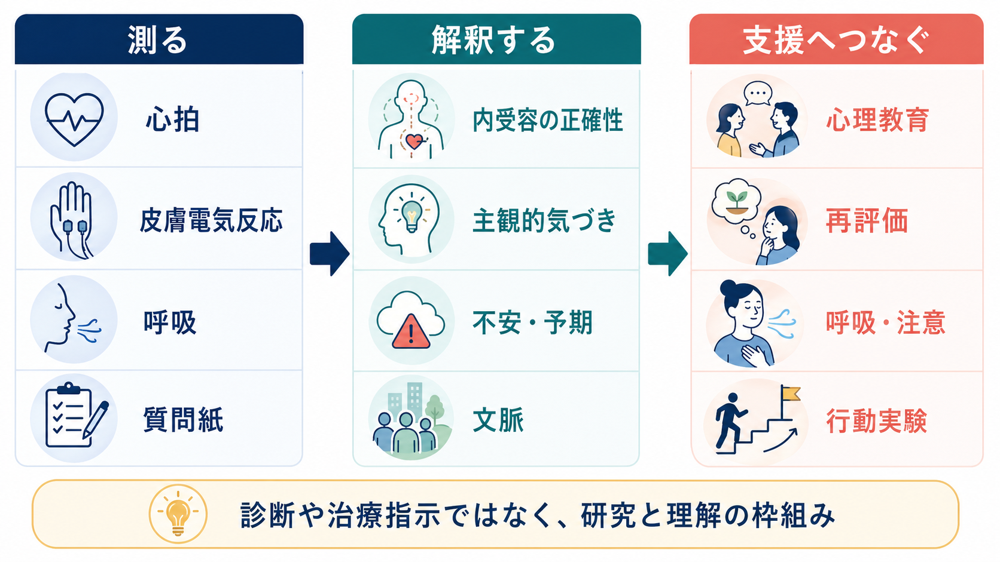

# 身体と感情はどのようにつながるのか

## 要点

- 感情は「心だけ」の出来事ではなく、心拍、呼吸、筋緊張、胃腸感覚、痛み、体温などの身体信号と深く結びつく。
- ただし、身体反応がそのまま感情を一対一に決めるわけではない。同じ心拍上昇でも、文脈によって「恐怖」「怒り」「興奮」「期待」として経験されうる。
- 現代的には、身体から脳へ上がる内受容信号と、脳が身体状態について作る予測・意味づけが循環し、その結果として情動経験が生まれると考えると見通しがよい[6][7]。
- 臨床や研究では、身体感覚を「気のせい」と扱うのではなく、身体信号、注意、予測、不安、行動、対人文脈が組み合わさる経験として理解する。

## この記事で答える問い

この記事では、次の問いに答える。

1. 身体反応は、感情経験の原因なのか、結果なのか。
2. 内受容とは何で、なぜ感情や自己感と関係するのか。
3. 予測処理の観点では、身体と感情の関係をどう説明できるのか。
4. 研究や臨床では、この考え方をどこまで使えるのか。

関連する基礎としては、[[体性感覚ネットワークは身体情報をどう表現するのか]]、[[身体症状症は脳の予測処理で説明できるのか]]、[[前頭前野は情動制御にどう関わるのか]]、[[リスク下の意思決定はどのように行われるのか]]が接続しやすい。

## まず結論

身体と感情の関係は、「身体反応が先で、感情はその読み取りである」という単純な順序でも、「脳だけが感情を作り、身体は付随反応にすぎない」という単純な順序でもない。身体反応は情動経験の材料であり、脳はその材料を過去経験、現在の文脈、注意、予測、言語的カテゴリーと照合して「いま自分は何を感じているのか」を構成する。

したがって、身体は感情の背景ノイズではない。身体は、行動の準備、危険や報酬の予期、自己状態の把握、意思決定を支える信号源である。一方で、身体信号は常に曖昧で、文脈によって意味が変わる。感情とは、身体、脳、環境、言語、社会的文脈が一つの経験としてまとまる過程だと捉えるとよい。

## 背景

身体と感情の関係をめぐる古典的な出発点は、James-Lange 型の考え方である。William James は、感情はまず身体変化が起こり、その身体変化を感じることとして成立する、という方向の議論を提示した[1]。この発想は、「悲しいから泣く」のではなく「泣く身体を感じるから悲しい」という逆転を含む点で、現在でも重要である。

一方、Cannon は、内臓反応は遅く、異なる感情を十分に区別できない場合があり、身体反応だけで感情を説明するのは難しいと批判した[2]。その後、Schachter と Singer は、身体的覚醒と認知的ラベルづけの組み合わせで情動状態を説明する二要因説を提示した[3]。この流れは、身体反応そのものだけでなく、「それを何として解釈するか」が感情経験に重要だという方向へ議論を進めた。

現在の研究では、古典理論のどれか一つをそのまま採用するより、身体信号、脳内表象、予測、文脈、行動調整を統合的に見る。特に内受容と予測処理の研究は、身体からの信号がどのように情動経験や自己感に関わるかを説明する中心的な枠組みになっている[5][6][7]。

## 基本概念

### 情動、感情、気分

日常語では「情動」「感情」「気分」は混ざって使われる。この記事では、情動を身体反応、行動傾向、評価、主観経験を含む広い過程として扱う。感情は、その情動過程が「怖い」「楽しい」「不安だ」「腹が立つ」のような主観的経験として意識される側面を指す。気分は、対象が比較的はっきりしない持続的な情動状態として扱う。

### 内受容

内受容とは、心拍、呼吸、胃腸、体温、痛み、疲労、空腹、筋緊張など、身体内部の状態を神経系が感知し、統合し、解釈する過程である。島皮質、とくに前部島皮質は、身体内部の信号を主観的な気づきへ統合する候補領域として議論されてきた[5]。ただし、内受容は島皮質だけで完結する機能ではなく、脳幹、自律神経系、視床、前帯状皮質、体性感覚系、前頭前野などを含む広いネットワークとして考える必要がある。

### 身体反応

身体反応には、心拍数の上昇、呼吸の変化、発汗、皮膚電気反応、血圧変化、胃腸感覚、姿勢、表情、声、筋緊張などが含まれる。これらは感情の「結果」でもあるが、同時に次の感情経験を形作る入力にもなる。たとえば、速い心拍を「危険のサイン」と解釈すれば不安が強まりやすいが、「運動後の自然な反応」と解釈すれば同じ信号の意味は変わる。

### 予測処理

予測処理では、脳は身体や環境からの入力を受動的に読むだけでなく、「いま何が起きているはずか」という予測を作り、入力とのズレを使って経験や行動を更新すると考える。内受容に適用すると、情動経験は、身体信号そのものと、身体状態についての予測、予測誤差、その誤差をどれだけ重く扱うかという精度重みづけから生じる[6][7]。

## 仕組み

### 1. 身体は行動の準備状態を作る

感情は、出来事をただ眺めるためのものではない。危険が迫れば心拍や呼吸が変わり、筋肉は動きやすくなり、注意は脅威へ向く。魅力的な対象があれば接近の準備が起こり、嫌悪や痛みがあれば回避の準備が起こる。身体反応は、行動をすばやく調整するための基盤である。

この点は、意思決定にも関わる。ソマティック・マーカー仮説では、情動・身体状態が将来の利得や損失を予期する信号として選択を方向づけると考える。扁桃体や腹内側前頭前野は、外界の情報と身体・情動状態を結びつけ、判断や意思決定に寄与するとされる[4]。これは、[[リスク下の意思決定はどのように行われるのか]]で扱う情動と価値評価の問題にもつながる。

### 2. 身体信号は曖昧で、文脈によって意味が変わる

心拍上昇は、恐怖、怒り、喜び、運動、カフェイン、不眠、発熱など、さまざまな原因で起こる。身体信号だけを見ても、どの感情かは一意に決まらない。そこで脳は、周囲の状況、過去経験、現在の目標、他者の表情、言語的カテゴリーを使って、その身体信号に意味を与える。

Schachter と Singer の二要因説が重要なのは、この「覚醒の意味づけ」を明示した点にある[3]。現代の見方では、意味づけは意識的な推論だけではない。多くの場合、文脈の読み取り、予測、身体状態の調整は自動的かつ階層的に進む。

### 3. 内受容は「正確さ」だけではない

内受容能力を語るとき、「自分の心拍を正確に当てられるか」だけに注目すると狭すぎる。Garfinkel らは、内受容を少なくとも三つの側面に分けた。第一に、客観課題で身体信号をどれだけ検出できるかという内受容の正確性。第二に、質問紙や自己評価で示される主観的な身体への気づき。第三に、自分の内受容判断がどれくらい正しいかを把握するメタ認知的気づきである[8]。

この区別は臨床的にも重要である。身体に強く注意を向けている人が、必ずしも身体信号を客観的に正確に読んでいるとは限らない。逆に、身体信号の検出が比較的正確でも、それを不安や破局的予測と結びつけると苦痛が増すことがある。

### 4. 予測と身体信号は循環する

内受容の予測処理モデルでは、脳は身体からの信号を受け取るだけでなく、身体状態を予測し、必要に応じて自律神経、内分泌、行動を通じて身体を変える。たとえば「これから危険な場面に入る」という予測は、心拍や呼吸を先回りして変える。その変化がさらに「やはり危険だ」という経験を強めることもある。

重要なのは、この循環が正常な適応にも、苦痛の維持にもなりうる点である。試験前に緊張して覚醒が上がることは準備として有用だが、心拍上昇を「倒れる前兆」と予測すると、不安、注意の固定、回避行動が連鎖しやすい。[[身体症状症は脳の予測処理で説明できるのか]]で扱う身体症状の持続も、この循環として理解できる部分がある。

## 図解

上の 1 枚目は、身体反応、内受容、予測・文脈、情動経験、行動調整が一方向だけでなく循環することを示している。感情は身体から脳への信号だけでなく、脳から身体への予測的な調整、そして行動後のフィードバックを含む。

2 枚目は、内受容予測の基本ループである。トップダウンの予測、ボトムアップの身体信号、予測誤差、精度重みづけが組み合わさり、情動経験が更新される。図中の島皮質、前帯状皮質、脳幹・自律神経は重要な候補領域だが、特定の感情を単一部位に対応させる図ではない。

3 枚目は、研究と支援への接続である。心拍、皮膚電気反応、呼吸、質問紙などは身体と感情の関係を測る手段になるが、それだけで個人の感情や診断を決められるわけではない。研究では測定指標の限界を意識し、臨床では心理教育、再評価、注意や呼吸の扱い、行動実験などを個別の文脈に合わせて検討する。

## 臨床・研究との接続

身体と感情の関係を理解することは、不安、パニック、疼痛、身体症状、うつ、トラウマ、摂食、依存、発達特性など幅広い領域に関係する。ただし、この記事の内容は教育・研究目的の整理であり、個別の診断や治療指示ではない。

研究では、心拍知覚課題、呼吸負荷課題、皮膚電気反応、心拍変動、表情・姿勢解析、質問紙、経験サンプリング、脳画像などが使われる。これらはそれぞれ異なる層を測るため、「心拍に敏感だから不安が強い」と単純に結論づけるのは危険である。内受容の正確性、主観的気づき、メタ認知、注意スタイル、予測、文脈を分けて考える必要がある[8]。

臨床的には、身体感覚を否定せず、かつ身体感覚の意味づけが変わりうることを扱う姿勢が重要である。たとえば、心拍上昇を「危険の証拠」と捉えるのか、「覚醒が上がっているサイン」と捉えるのかで、次の注意、行動、感情は変わる。ここで必要なのは、「気にしなければよい」という助言ではなく、身体信号、注意、予測、回避、生活文脈がどう循環しているかを丁寧に見ることである。

情動制御との関係では、[[前頭前野は情動制御にどう関わるのか]]で扱う再評価や注意制御が、身体反応の意味づけに影響する。一方で、情動制御は身体を完全にコントロールする技術ではない。身体反応を消すことより、身体反応をどう読み、どう行動につなげるかが重要になる。

## よくある誤解

### 誤解1: 身体反応があるなら、その感情は本物である

身体反応は感情経験の重要な材料だが、身体反応だけで感情の種類や意味は決まらない。心拍上昇は恐怖にも興奮にも運動にもなりうる。感情の「本物らしさ」は、単一の生理指標ではなく、身体、文脈、本人の報告、行動、時間経過を合わせて見る必要がある。

### 誤解2: 感情は脳が作るなら、身体は重要ではない

これは逆である。脳が感情を構成するという考え方は、身体を不要にするものではない。むしろ、身体信号があるからこそ、脳は現在の自己状態、行動の準備、環境への適応を推論できる。身体を抜きにした感情理論は、主観的な「感じ」の厚みを説明しにくい。

### 誤解3: 身体に注意を向ければ、感情は必ず安定する

身体への注意は有用なこともあるが、常に安心を生むわけではない。身体感覚への注意が、破局的な予測や確認行動と結びつくと、不安や症状へのとらわれが強まる場合もある。重要なのは、身体に注意を向けるかどうかだけでなく、どのような態度、文脈、支援のもとで注意を向けるかである。

### 誤解4: 感情を理解するには、脳画像を見れば十分である

脳画像は有力な研究手段だが、感情の全体を直接写すものではない。情動経験は、脳活動、身体反応、言語報告、行動、社会的文脈が組み合わさる現象である。単一の領域活動から「この人はこの感情を感じている」と読むことはできない。

## 関連ノート

- [[体性感覚ネットワークは身体情報をどう表現するのか]]
- [[身体症状症は脳の予測処理で説明できるのか]]
- [[前頭前野は情動制御にどう関わるのか]]
- [[リスク下の意思決定はどのように行われるのか]]
- [[疼痛と精神疾患は脳内でどうつながるのか]]
- [[MOC｜認知科学・心理学]]
- [[MOC｜脳・神経科学]]

## MOC更新候補

- [[MOC｜認知科学・心理学]] の「意識・自己・身体性」または「情動・身体性」付近に追加候補。
- [[MOC｜脳・神経科学]] の「内受容」「島皮質」「情動ネットワーク」関連項目として追加候補。
- [[MOC｜精神医学]] では、不安、身体症状、疼痛、情動制御をつなぐ基礎ノートとして参照候補。

## 今後の作成候補

- 内受容とは何か
- 島皮質は身体感覚と意識にどう関わるのか
- 感情の構成主義とは何か
- パニック発作は身体感覚の予測で説明できるのか
- 呼吸と情動調整はどのようにつながるのか

## 理解チェック

1. James-Lange 型の考え方は、身体反応と感情の順序をどのように捉えたか。
2. 同じ心拍上昇が、恐怖にも興奮にもなりうるのはなぜか。
3. 内受容の正確性、主観的気づき、メタ認知的気づきはどう違うか。
4. 予測処理の観点では、身体信号と情動経験はどのような循環を作るか。
5. 身体感覚を臨床的に扱うとき、「気のせい」と言ってはいけない理由は何か。

## 参考文献

[1] James, W. (1884). What is an emotion? *Mind*, os-IX(34), 188-205. https://doi.org/10.1093/mind/os-IX.34.188

[2] Cannon, W. B. (1927). The James-Lange theory of emotions: A critical examination and an alternative theory. *The American Journal of Psychology*, 39(1/4), 106-124. https://doi.org/10.2307/1415404

[3] Schachter, S., & Singer, J. (1962). Cognitive, social, and physiological determinants of emotional state. *Psychological Review*, 69(5), 379-399. https://doi.org/10.1037/h0046234

[4] Bechara, A., Damasio, H., & Damasio, A. R. (2003). Role of the amygdala in decision-making. *Annals of the New York Academy of Sciences*, 985, 356-369. https://doi.org/10.1111/j.1749-6632.2003.tb07094.x

[5] Craig, A. D. (Bud). (2009). How do you feel - now? The anterior insula and human awareness. *Nature Reviews Neuroscience*, 10, 59-70. https://doi.org/10.1038/nrn2555

[6] Seth, A. K. (2013). Interoceptive inference, emotion, and the embodied self. *Trends in Cognitive Sciences*, 17(11), 565-573. https://doi.org/10.1016/j.tics.2013.09.007

[7] Barrett, L. F., & Simmons, W. K. (2015). Interoceptive predictions in the brain. *Nature Reviews Neuroscience*, 16, 419-429. https://doi.org/10.1038/nrn3950

[8] Garfinkel, S. N., Seth, A. K., Barrett, A. B., Suzuki, K., & Critchley, H. D. (2015). Knowing your own heart: Distinguishing interoceptive accuracy from interoceptive awareness. *Biological Psychology*, 104, 65-74. https://doi.org/10.1016/j.biopsycho.2014.11.004

## 未解決問題

- 内受容の各側面が、不安、疼痛、身体症状、うつ、発達特性にどのように異なる寄与をするかは、まだ統一的に整理されていない。
- 予測処理モデルは説明力が高い一方、個別症例の治療選択を直接決めるバイオマーカーとしては確立していない。
- 身体感覚への注意が助けになる条件と、かえって症状へのとらわれを強める条件を、研究・臨床の両方でさらに分けて検討する必要がある。
