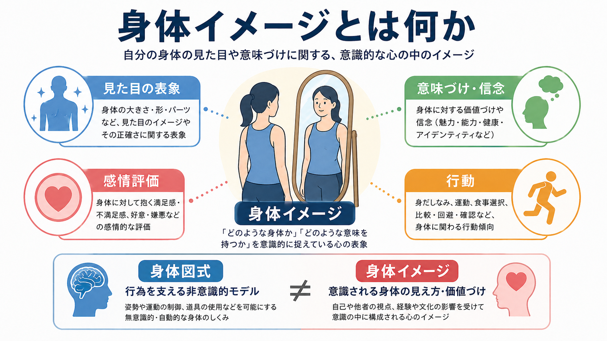
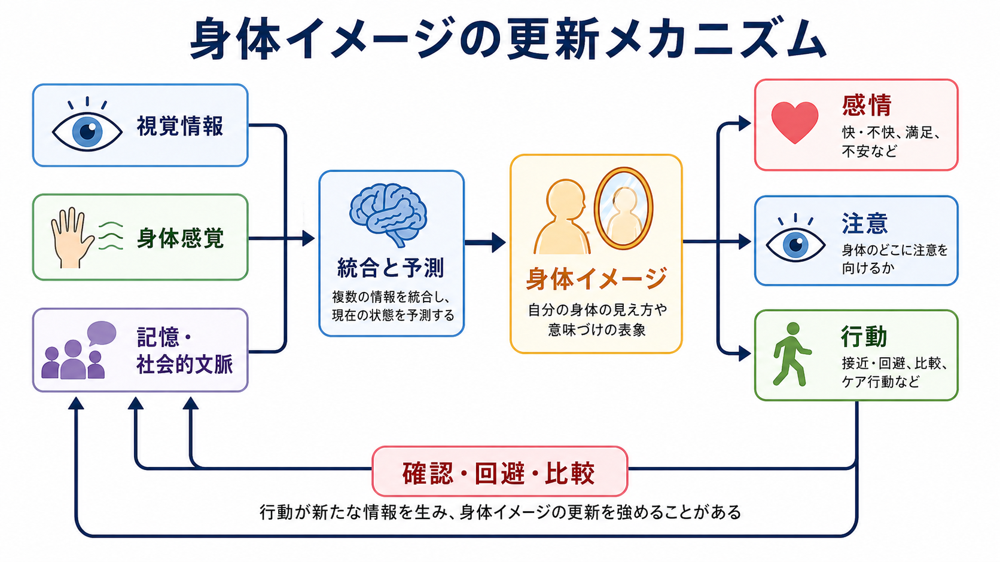
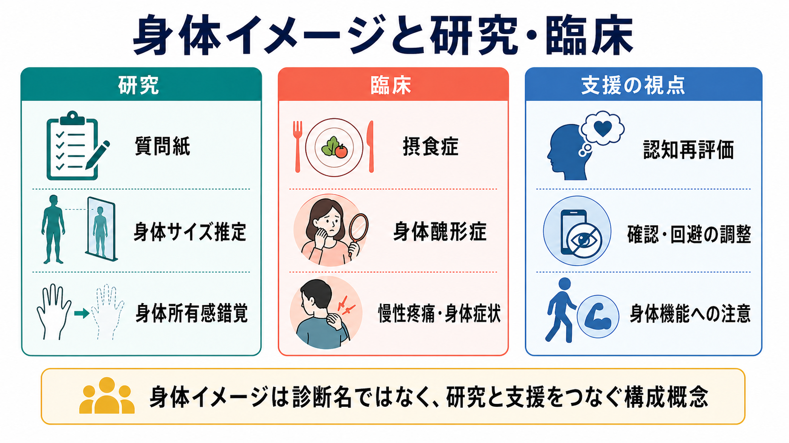

# 身体イメージとは何か

## 要点

- 身体イメージとは、自分の身体の見た目、大きさ、形、魅力、健康、能力、社会的意味についての、意識的で評価を含む表象である。
- 身体イメージは「鏡に映る身体を正しく見ているか」だけではない。知覚、信念、感情、注意、比較、確認、回避、食事・運動・対人行動までを含む多次元的な構成概念である [1][5]。
- 身体図式は、姿勢制御や道具使用などを支える非意識的・感覚運動的な身体モデルとして整理されることが多い。一方、身体イメージは、意識される身体の見え方や価値づけに近い [2][3]。
- 身体イメージは、視覚、触覚、固有感覚、内受容感覚、記憶、社会的規範、他者からの評価を統合して更新される [3][4]。
- 臨床では、摂食症、身体醜形症、慢性疼痛、身体症状への注意、外見不安などと接続する。ただし身体イメージの問題は診断名そのものではなく、研究と支援をつなぐ説明枠組みである [5][7][8]。

## この記事で答える問い

1. 身体イメージとは、何を指す概念なのか。
2. 身体イメージと身体図式、身体所有感、自己意識はどう違うのか。
3. 身体イメージはどのように形成・更新されるのか。
4. 研究や臨床では、身体イメージをどのように扱うのか。

## まず結論

身体イメージは、「自分の身体についての心の中の絵」だけではない。より正確には、**自分の身体をどのように見なし、どのような意味を与え、どのように感じ、その結果どのように行動するか**をまとめた構成概念である。

たとえば同じ身体サイズでも、ある人は「健康的で動ける身体」と感じ、別の人は「人前に出すべきではない身体」と感じるかもしれない。この差は、視覚的な推定だけでなく、過去の経験、文化的基準、他者との比較、[[注意とは何か|注意]]の向き、[[認知バイアスとは何か|認知バイアス]]、感情状態によって変わる。したがって身体イメージは、知覚研究、[[意識とは何か|意識]]研究、自己研究、臨床心理学を横断する概念である。

## 背景

身体イメージ研究は、神経心理学、精神医学、社会心理学、摂食症研究、発達心理学、フェミニズム研究、メディア研究をまたいで発展してきた。Cash と Pruzinsky によるハンドブックは、身体イメージを理論・研究・臨床実践を結ぶ中心概念として整理し、知覚、感情、認知、行動、文化、医療文脈を統合的に扱った [1]。

重要なのは、身体イメージが単なる「外見への不満」より広い点である。身体への不満は身体イメージの一部だが、身体イメージには、身体への肯定的評価、機能への感謝、身体が自分の人生で何を可能にしているかという意味づけも含まれる。近年のポジティブ身体イメージ研究は、肯定的な身体イメージを「不満がない状態」ではなく、身体への尊重、受容、機能への注意、外見規範から身を守る情報処理を含む独自の構成概念として扱っている [6]。

## 基本概念

### 身体イメージ

身体イメージは、少なくとも次の四つに分けると理解しやすい。

| 側面 | 何を表すか | 例 |
|---|---|---|
| 知覚的側面 | 身体の大きさ、形、部位、姿勢、見た目の推定 | 「自分の腕は太い」「顔の左右差が目立つ」 |
| 認知・意味づけ | 身体に関する信念、価値づけ、自己評価との結びつき | 「痩せていないと価値がない」「この傷は自分の歴史だ」 |
| 感情的側面 | 満足、不安、嫌悪、恥、安心、誇り | 鏡を見ると落ち込む、身体機能に感謝する |
| 行動的側面 | 確認、回避、比較、食事、運動、衣服選択、対人行動 | 鏡を何度も見る、写真を避ける、他者と比較する |

この多次元性が、身体イメージを測定しにくくする。質問紙は信念や感情を捉えやすいが、身体サイズ推定課題は知覚的歪みを捉えやすい。面接や行動観察は確認・回避行動を捉えやすい。したがって、単一の尺度だけで「身体イメージ全体」を測ったと考えるのは危うい [5]。

### 身体図式との違い

身体図式は、歩く、手を伸ばす、姿勢を保つ、道具を使うといった行為を支える、非意識的で感覚運動的な身体モデルとして説明されることが多い。身体イメージが「自分の身体をどう意識し、どう意味づけるか」に近いのに対し、身体図式は「身体を使って世界に働きかけるための操作モデル」に近い [2][3]。

ただし、両者は完全に分離しているわけではない。たとえば「自分は運動が苦手だ」という身体イメージは、新しい運動への回避を生み、実際の運動経験を減らし、身体図式の更新機会にも影響しうる。逆に、リハビリテーションや運動学習で身体を使う経験が増えると、身体に対する自己評価も変わることがある。

### 身体所有感との違い

身体所有感は、「この身体、またはこの身体部位は自分のものだ」という経験である。ラバーハンド錯覚では、見えている人工の手と隠された自分の手に同期した触覚刺激を与えると、人工の手を自分の手のように感じることがある。この現象は、視覚と体性感覚の統合が身体所有感を支えることを示す代表的な実験である [4]。

身体所有感は身体イメージの土台になりうるが、同じではない。身体所有感は「これは自分の身体か」に関わり、身体イメージは「その身体をどう見なし、どう評価するか」に関わる。前者は[[主観的経験は科学的に扱えるのか|主観的経験]]の自己帰属に近く、後者は外見・意味・感情・行動を含むより広い評価システムである。

## 仕組み

身体イメージは、身体から上がってくる信号をそのまま写し取る鏡ではない。視覚情報、触覚、固有感覚、内受容感覚、記憶、言語、社会的文脈、期待が組み合わされ、現在の身体についての推定と評価が作られる。

### 1. 入力は多感覚的である

自分の身体を理解するには、鏡や写真のような視覚情報だけでなく、筋肉や関節の固有感覚、皮膚感覚、内臓感覚、疲労、痛み、呼吸、姿勢の感覚が関わる。Longo と Haggard は、意識的な身体イメージの背後に、手や身体部位の大きさ・形を推定する暗黙的な身体表象があることを示し、身体表象が意識的報告だけでは捉えきれないことを論じている [3]。

### 2. 予測と意味づけが入る

身体イメージは、感覚入力だけでなく、「自分の身体はこういうものだ」という予測に影響される。過去にからかわれた経験、家族や友人の言葉、メディアの外見基準、文化的な性別役割、スポーツや医療経験は、身体の見え方に意味を与える。ここで[[情動と認知は分けられるのか|情動と認知]]は分けにくい。身体への不安が強いと、身体の気になる部位へ注意が向きやすくなり、注意が向くほどその部位がさらに重要に見える。

### 3. 行動が身体イメージを維持・更新する

確認、比較、回避は、短期的には不安を下げることがある。しかし、鏡確認、身体チェック、写真回避、他者との比較、安心保証の要求が繰り返されると、「確認しないと耐えられない」「この部位は危険だ」という学習が強まり、身体イメージの柔軟性が下がることがある。認知行動モデルでは、このような近接要因を評価し、身体イメージの問題を維持する循環として扱う [5]。

### 4. ポジティブ身体イメージは別軸である

身体イメージの改善は、「不満をゼロにする」だけではない。ポジティブ身体イメージ研究では、身体への感謝、身体機能への注意、身体を大切に扱う態度、外見規範に対する批判的距離が重視される [6]。これは、身体を常に好きでいなければならないという意味ではない。むしろ、揺らぎや不満があっても、身体を自分の生活と経験を支えるものとして扱える柔軟性に近い。

## 図解

| 図 | 読み方 | 対応する本文 |
|---|---|---|
| 概念地図 | 身体イメージを、見た目の表象、意味づけ、感情評価、行動に分けて読む | 要点、基本概念 |
| 更新メカニズム | 視覚情報・身体感覚・記憶社会的文脈が統合され、確認・回避・比較で再更新される循環を見る | 仕組み |
| 研究・臨床接続 | 測定法、臨床領域、支援の視点を混同せずに対応づける | 臨床・研究との接続 |

## 臨床・研究との接続

### 摂食症

摂食症では、体重・体型の過大な価値づけ、身体不満、身体確認、回避、食行動の制限や過食・排出行動が問題になることがある。NICE の摂食症ガイドラインは、評価と治療を早期に行うこと、標準化された尺度を用いること、治療内容を摂食症に焦点化したマニュアルに基づけることを推奨している [8]。ただし、身体イメージの問題があるから摂食症である、あるいは摂食症なら必ず同じ身体イメージの問題がある、と単純化してはならない。

### 身体醜形症

身体醜形症では、他者には目立たない、またはわずかに見える外見上の欠点への強いとらわれと、確認、比較、身だしなみ、皮膚を触る、安心を求めるなどの反復行動が問題になる [7]。これは「外見を気にしすぎる性格」ではなく、生活機能や苦痛を含めて評価すべき精神医学的状態である。この記事は教育・研究目的であり、個別診断や治療指示を行うものではない。

### 慢性疼痛・身体症状・リハビリテーション

身体イメージは外見だけでなく、痛み、疲労、運動能力、病気による身体変化にも関わる。慢性疼痛や身体症状では、痛む部位が大きく感じられる、身体の一部が信頼できない、動かすと悪化するという予測が強まることがある。リハビリテーションや身体活動では、身体機能への注意、段階的な経験、自己効力感の回復が身体イメージを変える可能性がある。

### 測定法

研究では、質問紙、身体サイズ推定課題、画像選択課題、鏡曝露課題、行動観察、面接、ラバーハンド錯覚、神経画像、心理生理指標などが使われる。どの方法も身体イメージの一部を測るだけであり、測定法の違いを無視して結果を比較すると混乱する [5]。

## よくある誤解

### 誤解1: 身体イメージは外見への不満だけである

外見への不満は重要だが、それだけではない。身体イメージには、身体機能への評価、身体を使う自信、健康への意味づけ、他者から見られる感覚、身体への感謝も含まれる [1][6]。

### 誤解2: 身体イメージは実際の身体と一致すればよい

身体サイズ推定の正確性は一つの側面にすぎない。実際の身体と知覚が近くても、身体に対する価値づけや感情が極端に否定的であれば苦痛は残る。逆に、知覚が完全に正確でなくても、生活上の柔軟性が保たれることもある。

### 誤解3: 身体図式と身体イメージは同じである

両者は関連するが、身体図式は行為のための非意識的な感覚運動モデル、身体イメージは意識される身体の見え方・価値づけとして区別すると理解しやすい [2]。

### 誤解4: 身体イメージの問題は本人の努力不足である

身体イメージは、個人の認知だけでなく、いじめ、差別、外見規範、医療経験、メディア、家族関係、痛みや病気などの文脈に影響される。したがって、個人だけを責める説明は不十分である。

## 関連ノート

- [[意識とは何か]]
- [[主観的経験は科学的に扱えるのか]]
- [[知覚とは何か]]
- [[注意とは何か]]
- [[メタ認知とは何か]]
- [[情動と認知は分けられるのか]]
- [[認知バイアスとは何か]]

### 関連ノート候補

- 身体図式とは何か
- 身体所有感とは何か
- ラバーハンド錯覚とは何か
- 摂食症における身体イメージ
- 身体醜形症とは何か
- ポジティブ身体イメージとは何か

### MOC更新候補

- `content/00_MOC/` 配下の認知科学・心理学系 MOC
- 意識・自己・身体性に関する MOC
- 臨床心理・精神医学系 MOC

## 理解チェック

1. 身体イメージを、知覚的側面、認知・意味づけ、感情的側面、行動的側面に分けると、それぞれ何が見えるか。
2. 身体図式と身体イメージを区別する利点は何か。
3. 身体イメージの問題を、本人の「見方の誤り」だけで説明すると何を見落とすか。
4. 身体イメージを測定するとき、質問紙だけに頼ることの限界は何か。

## 未解決問題

- 身体イメージ、身体図式、身体所有感、内受容感覚の境界は、研究領域によって定義が揺れている。
- 身体イメージの改善を、知覚の正確性、苦痛の低下、行動の柔軟性、身体機能への注意、生活の質のどれで評価すべきかは文脈依存である。
- SNS、生成AI画像、フィルター加工、身体改変技術が身体イメージに与える影響は、今後さらに検討が必要である。

## 参考文献

[1] Cash, T. F., & Pruzinsky, T. (Eds.). (2002). *Body Image: A Handbook of Theory, Research, and Clinical Practice*. Guilford Press. JAMA book review: https://jamanetwork.com/journals/jama/fullarticle/196316

[2] de Vignemont, F. (2010). Body schema and body image: Pros and cons. *Neuropsychologia, 48*(3), 669-680. https://doi.org/10.1016/j.neuropsychologia.2009.09.022

[3] Longo, M. R., & Haggard, P. (2012). Implicit body representations and the conscious body image. *Acta Psychologica, 141*(2), 164-168. https://doi.org/10.1016/j.actpsy.2012.07.015

[4] Ehrsson, H. H., Holmes, N. P., & Passingham, R. E. (2005). Touching a rubber hand: Feeling of body ownership is associated with activity in multisensory brain areas. *Journal of Neuroscience, 25*(45), 10564-10573. https://pmc.ncbi.nlm.nih.gov/articles/PMC1395356/

[5] Reas, D. L., & Grilo, C. M. (2004). Cognitive-behavioral assessment of body image disturbances. *Journal of Psychiatric Practice, 10*(5), 314-322. https://doi.org/10.1097/00131746-200409000-00005

[6] Tylka, T. L., & Wood-Barcalow, N. L. (2015). What is and what is not positive body image? Conceptual foundations and construct definition. *Body Image, 14*, 118-129. https://doi.org/10.1016/j.bodyim.2015.04.001

[7] Nicewicz, H. R., Torrico, T. J., & Boutrouille, J. F. (2024). Body Dysmorphic Disorder. *StatPearls*. https://www.ncbi.nlm.nih.gov/books/NBK555901/

[8] National Institute for Health and Care Excellence. (2020). *Eating disorders: recognition and treatment* (NICE Guideline NG69). https://www.ncbi.nlm.nih.gov/books/NBK568394/
