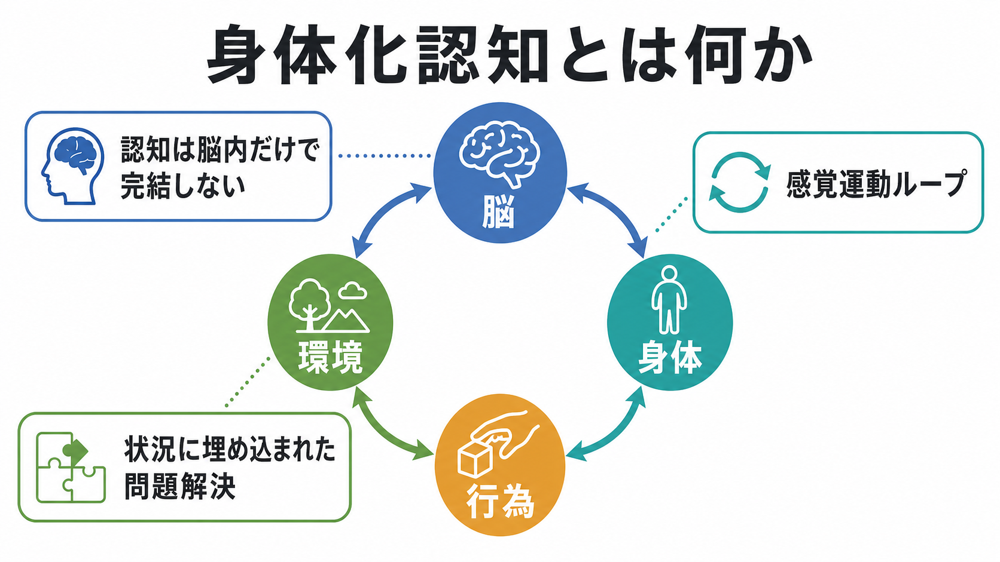
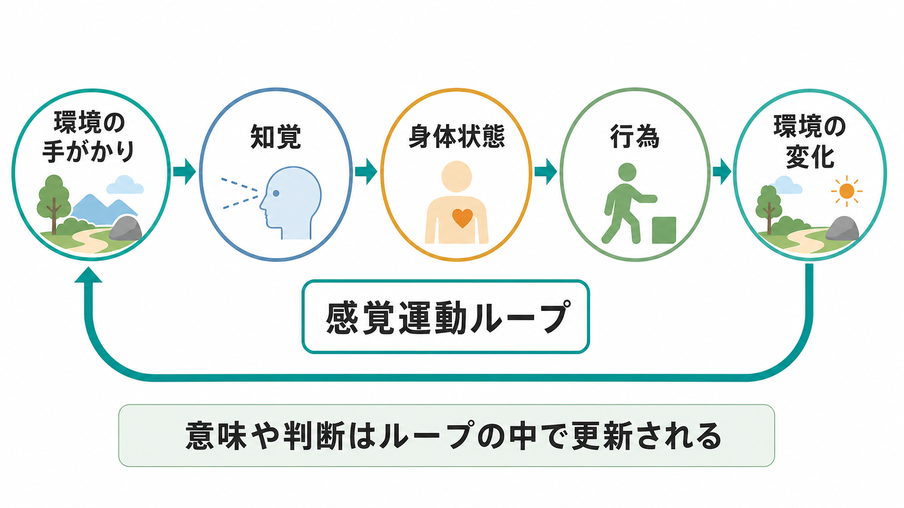
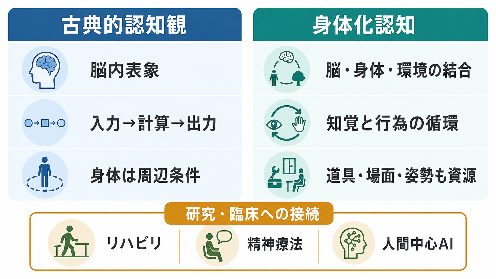

# 身体化認知とは何か

## 要点

- 身体化認知とは、認知を「脳内で記号を計算する処理」だけでなく、身体の構造、感覚運動、行為、環境との相互作用の中で成立するものとして捉える立場である [1][2]。
- 重要なのは「脳が不要」という主張ではない。脳は中核的だが、知覚、姿勢、身体状態、道具、空間配置、社会的場面が認知過程の一部または強い制約条件になる、という見方である [3][7]。
- 知覚は受動的な入力ではなく、動く、触る、見る方向を変える、試す、修正するという行為ループの中で更新される [4]。
- 言語理解、概念、記憶、社会認知、臨床実践、リハビリテーション、人間中心AIにも接続するが、すべての認知を単純に身体反応へ還元できるわけではない [3][5][8]。

## この記事で答える問い

1. 身体化認知は、古典的な認知観と何が違うのか。
2. 「脳・身体・行為・環境の相互作用」とは、具体的に何を意味するのか。
3. 身体化認知は研究や臨床でどのように役立つのか。
4. どのような誤解や限界に注意すべきか。

## まず結論

身体化認知は、認知を頭蓋骨の内側だけで完結する情報処理としてではなく、**身体をもった主体が環境の中で行為する過程**として理解する枠組みである。たとえば、コップを「持てるもの」として知覚すること、道具を使って問題を解くこと、姿勢や呼吸が注意や感情に影響すること、メモやスマートフォンが記憶を補助することは、認知が身体と環境に支えられている例である。

ただし、身体化認知は一枚岩ではない。Wilson は身体化認知に少なくとも複数の見方があると整理した。認知が状況づけられている、時間圧の中で働く、環境を外部記憶として利用する、身体が認知を制約する、身体が認知の内容に入り込む、オフライン認知にも身体基盤が関わる、というように論点は分かれる [2]。したがって、身体化認知を理解するには「脳か身体か」ではなく、「どの課題で、どの身体・環境要因が、どの程度認知過程を構成または制約するのか」と問う必要がある。

## 背景

20世紀後半の認知科学では、心をコンピュータに似た情報処理システムとして捉える見方が大きな影響力をもった。この見方では、外界からの入力が内部表象に変換され、規則や計算によって処理され、行動として出力される、という流れが強調される。これは[[ワーキングメモリとは何か]]、[[推論とは何か]]、[[意思決定とは何か]]の研究に強力な道具を与えた。

一方で、身体化認知は、この枠組みが身体と環境を「入力装置」と「出力装置」に押し込めすぎると批判する。Varela、Thompson、Rosch は、認知を身体化された行為、すなわち主体と環境が相互に形づくる過程として捉える enaction の方向を示した [1]。その後、知覚心理学、神経科学、言語研究、ロボティクス、哲学で、身体化・状況づけ・拡張・能動的行為を重視する研究が広がった [3][6][8]。

## 基本概念

### 身体化

身体化とは、認知が身体の形態、感覚器、運動能力、内受容感覚、姿勢、疲労、情動状態などに依存することを指す。たとえば、空間の「近い」「遠い」は単なる幾何学的距離ではなく、手が届くか、歩けるか、疲れているか、道具を使えるかによって意味が変わる。

この観点では、[[知覚とは何か]]は外界のコピーではなく、行為可能性を含んだ環境の読み取りである。視覚、触覚、前庭感覚、固有感覚は別々の入力ではなく、行為を調整するために統合される。

### 状況づけ

状況づけられた認知とは、認知が抽象的な実験室内だけでなく、特定の課題、道具、社会的文脈、時間制約の中で働くことを意味する [2]。買い物リスト、机上の配置、白板、地図、検索エンジン、他者との会話は、単なる補助物ではなく、問題解決の構造を変える。

### 拡張

Clark と Chalmers の拡張された心の議論は、外部のノートや道具が、適切な条件のもとで記憶や推論の一部として機能しうると主張した [6]。ここで大切なのは、外部物が何でも「心」になるという話ではない。信頼して使われ、容易にアクセスでき、行為を継続的に支える外部資源が、認知システムの一部として振る舞う場合がある、という限定的な主張である。

### 感覚運動ループ

身体化認知の中心には、知覚と行為の循環がある。O'Regan と Noë は、見ることを単なる内部画像の生成ではなく、環境を探索する行為の様式として捉えた [4]。視線を動かす、手を伸ばす、身体を傾ける、対象を回す、といった行為によって感覚入力が変わり、その変化の規則性を利用して世界を理解する。

## 仕組み

### 1. 身体が問題空間を変える

身体は、認知に後から付け加わる条件ではない。手の形、視野、歩行能力、疲労、痛み、姿勢、呼吸は、何が目立つか、何が簡単か、何を避けるかを変える。たとえば、物体を認識するときには、その色や形だけでなく、つかめるか、押せるか、避けるべきかといった行為との関係が重要になる。

### 2. 環境が記憶と計算を肩代わりする

人は、すべてを頭の中に保持してから行動するわけではない。紙に書く、物を並べ替える、スマートフォンに予定を入れる、実験器具の配置で手順を見えるようにするなど、環境を使って[[ワーキングメモリとは何か|ワーキングメモリ]]の負荷を下げる。これは単なる「便利な補助」ではなく、課題の難しさそのものを変える。

### 3. 概念や言語が感覚運動系と結びつく

Barsalou の grounded cognition は、概念や記憶、言語理解が、知覚・運動・内省のモダリティから切り離された抽象記号だけで成立するのではなく、経験の再シミュレーションに支えられると論じる [3]。Gallese と Lakoff も、概念知識に感覚運動系が関与する可能性を論じた [5]。たとえば「つかむ」「押す」「温かい」といった語や概念は、身体経験と完全に無関係な記号ではない。

ただし、この主張は「すべての抽象概念が単純な運動反応に還元される」という意味ではない。数学、倫理、自己理解、社会制度のような抽象的認知では、言語、文化、道具、教育、推論が複雑に絡む。身体化認知は、抽象性を否定するよりも、抽象的思考がどのような身体的・社会的足場を使って成立するのかを問う。

### 4. 予測と行為が循環する

身体化認知は[[予測処理とは何か]]とも接続しやすい。予測処理では、脳は感覚入力をただ受け取るのではなく、世界の状態を予測し、予測誤差を減らすように知覚や行為を更新すると考える。身体化認知の観点から見ると、予測は脳内だけで完結する推論ではなく、身体を動かして環境から情報を取りにいく過程でもある。

## 図解

次の図は、古典的な認知観と身体化認知の違いを大まかに示す。左側の見方は、認知を入力から出力までの内部計算として整理しやすい。一方、右側の見方は、脳・身体・環境の結合、知覚と行為の循環、道具や場面の利用を重視する。

| 観点 | 古典的認知観 | 身体化認知 |
|---|---|---|
| 認知の中心 | 脳内表象と計算 | 脳・身体・環境の相互作用 |
| 知覚 | 入力情報の処理 | 行為に向けた探索と調整 |
| 身体 | 入出力の装置、周辺条件 | 認知を制約し、ときに構成する要因 |
| 環境 | 外部刺激 | 記憶・計算・行為の足場 |
| 研究上の問い | 内部表象はどう処理されるか | 課題中の主体と環境はどう結合するか |

## 臨床・研究との接続

### リハビリテーション

身体化認知は、運動機能の回復を単なる筋力や反射の問題としてではなく、知覚、注意、身体図式、環境調整、道具使用を含む再学習として捉えやすくする。歩行練習、上肢訓練、作業療法では、患者がどのような環境手がかりを使い、どのように行為を組み立て直すかが重要になる。

### 精神療法・身体志向の介入

気分、不安、トラウマ、身体症状では、呼吸、姿勢、筋緊張、内受容感覚、回避行動が認知や情動と相互に影響する。ただし、これは「考え方を変えるより身体を動かせばよい」という単純な話ではない。臨床では、身体経験、言語化、関係性、生活環境、医学的評価を区別しながら統合する必要がある。個別の診断や治療指示としてではなく、研究・教育上の枠組みとして理解するのが安全である。

### 人間中心AI・ロボティクス

身体化認知は、AIやロボット研究にも影響を与える。記号処理だけでなく、身体をもつエージェントが環境内で試行錯誤し、感覚運動ループを通じて概念や行動を学習するという発想は、認知ロボティクスや computational grounded cognition と接続する [8]。ここでは、知能を大規模な内部計算だけでなく、身体、センサー、行為可能性、環境構造の結合として設計する発想が重要になる。

## よくある誤解

### 誤解1: 身体化認知は「脳は重要ではない」と言っている

そうではない。身体化認知は、脳を否定するのではなく、脳を身体と環境から切り離して理解することに注意を促す。脳は感覚運動ループ、身体状態、道具使用、社会的文脈の中で働く。

### 誤解2: すべての認知は運動反応に還元できる

これも強すぎる。身体化認知の研究には、強い非表象主義から、身体的シミュレーションを含む穏健な立場まで幅がある [2][7]。抽象的推論や言語的思考を説明するには、身体だけでなく、文化、記号、教育、社会制度も考える必要がある。

### 誤解3: 外部道具を使えば、それはすべて心の一部である

拡張認知の議論は、外部道具が常に心になるとは言わない。安定して利用され、信頼され、行為の流れに統合されるかどうかが問題になる [6]。たまたま近くにある道具と、日常的に記憶を支えるノートや支援機器は区別される。

### 誤解4: 身体化認知は実験できない哲学である

身体化認知には哲学的議論が多いが、実験心理学、神経科学、発達研究、言語研究、ロボティクスでも検証可能な問いがある。たとえば、身体姿勢が判断に与える影響、運動系の活動が概念理解に関わる条件、道具使用が空間認知をどう変えるか、感覚運動制約をもつロボットがどのように学習するかは、経験的に調べられる。

## 関連ノート

- [[知覚とは何か]]
- [[予測処理とは何か]]
- [[注意とは何か]]
- [[ワーキングメモリとは何か]]
- [[意味記憶とは何か]]
- [[手続き記憶とは何か]]
- [[情動と認知は分けられるのか]]
- [[意識とは何か]]

## MOC更新候補

- `content/00_MOC/MOC｜認知科学・心理学.md` に本記事へのリンクを追加する候補。
- 同時編集を避けるため、このジョブでは MOC 本体は更新していない。

## 理解チェック

1. 身体化認知は、古典的な「入力→計算→出力」モデルのどこを補正しようとしているか。
2. 感覚運動ループでは、知覚と行為はどのような関係にあるか。
3. 外部道具が認知の一部として働くためには、どのような条件が必要か。
4. 身体化認知を臨床に応用するとき、どのような過度な単純化を避けるべきか。

## 参考文献

[1] Varela, F. J., Thompson, E., & Rosch, E. (1991). *The Embodied Mind: Cognitive Science and Human Experience*. MIT Press. https://mitpress.mit.edu/9780262220422/the-embodied-mind/

[2] Wilson, M. (2002). Six views of embodied cognition. *Psychonomic Bulletin & Review, 9*(4), 625-636. https://doi.org/10.3758/BF03196322

[3] Barsalou, L. W. (2008). Grounded cognition. *Annual Review of Psychology, 59*, 617-645. https://doi.org/10.1146/annurev.psych.59.103006.093639

[4] O'Regan, J. K., & Noë, A. (2001). A sensorimotor account of vision and visual consciousness. *Behavioral and Brain Sciences, 24*(5), 939-973. https://doi.org/10.1017/S0140525X01000115

[5] Gallese, V., & Lakoff, G. (2005). The brain's concepts: The role of the sensory-motor system in conceptual knowledge. *Cognitive Neuropsychology, 22*(3-4), 455-479. https://doi.org/10.1080/02643290442000310

[6] Clark, A., & Chalmers, D. (1998). The extended mind. *Analysis, 58*(1), 7-19. https://doi.org/10.1093/analys/58.1.7

[7] Shapiro, L., & Spaulding, S. (2024). Embodied cognition. In E. N. Zalta & U. Nodelman (Eds.), *The Stanford Encyclopedia of Philosophy* (Spring 2024 Edition). https://plato.stanford.edu/archives/spr2024/entries/embodied-cognition/

[8] Pezzulo, G., Barsalou, L. W., Cangelosi, A., Fischer, M. H., McRae, K., & Spivey, M. J. (2013). Computational grounded cognition: A new alliance between grounded cognition and computational modeling. *Frontiers in Psychology, 3*, 612. https://doi.org/10.3389/fpsyg.2012.00612

## 未解決問題

- 身体や環境が「認知を支える条件」なのか「認知過程そのものの一部」なのかを、課題ごとにどう判定するか。
- 抽象概念、数学、倫理判断のような高次認知を、身体化の観点からどこまで説明できるか。
- 身体化認知を臨床介入に接続するとき、経験的根拠、個人差、医学的リスクをどう評価するか。
- AIやロボティクスで、身体をもつことの効果を単なるセンサー追加ではなく、学習と意味形成の違いとしてどう検証するか。
