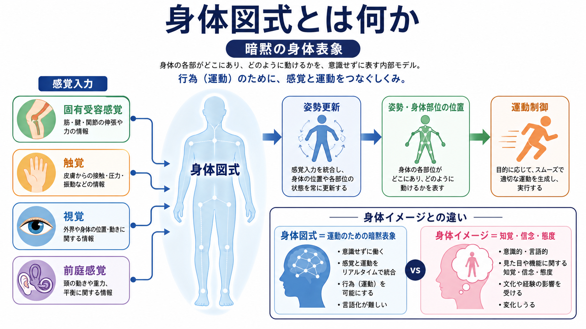
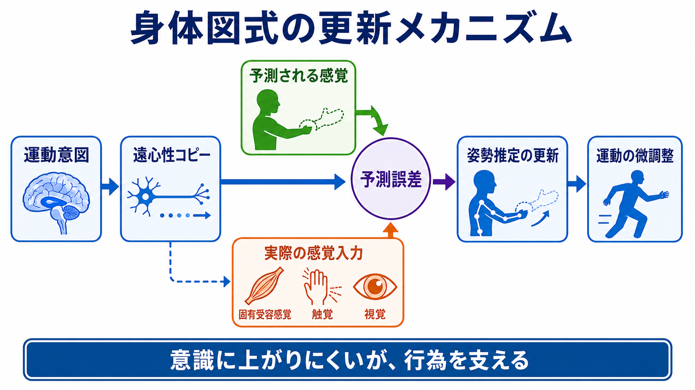
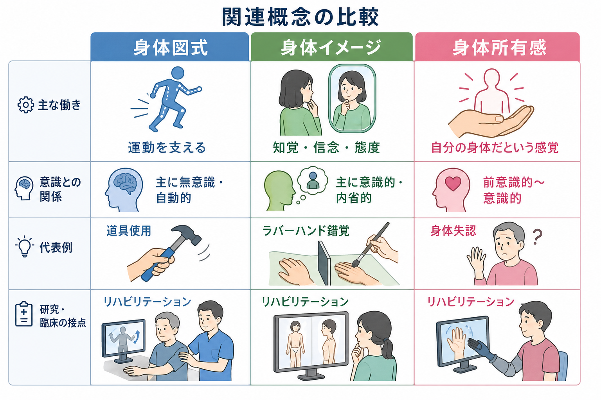

# 身体図式とは何か

## 要点

- 身体図式とは、身体部位の位置、姿勢、到達可能範囲、運動の結果を、行為のために素早く更新する暗黙的な身体表象である。
- 身体図式は、[[体性感覚ネットワークは身体情報をどう表現するのか|体性感覚]]、固有受容感覚、視覚、触覚、前庭感覚、運動指令の遠心性コピーを統合し、[[運動ネットワークは随意運動をどう生み出すのか|運動制御]]を支える[1][2]。
- 身体イメージが「自分の身体について意識的に見たり、考えたり、評価したりする表象」に近いのに対し、身体図式は多くの場合、意識に上がらないまま姿勢や動作を調整する[3][4]。
- 道具使用、ラバーハンド錯覚、身体所有感、身体失認、義手・VR・リハビリテーション研究は、身体表象が固定的なものではなく、課題と感覚入力に応じて更新されることを示している[5][6][7]。
- 臨床的には、身体図式は診断名そのものではなく、身体感覚、運動、所有感、行為主体感のずれを理解するための研究概念として扱うのが安全である。

## この記事で答える問い

1. 身体図式とは何か。
2. 身体図式は、身体イメージや[[身体所有感とは何か|身体所有感]]とどう違うのか。
3. 身体図式は、どのような感覚入力と運動制御で更新されるのか。
4. 身体図式の考え方は、研究や臨床、リハビリテーションとどう接続するのか。

## まず結論

身体図式は、「自分の身体について考えるための地図」ではなく、「いま身体をどう動かせるか」を制御するための作業用モデルである。人は歩くとき、腕を伸ばすとき、椅子に座るとき、通常は足首や肘の角度を意識的に計算していない。それでも動けるのは、固有受容感覚、触覚、視覚、前庭感覚、運動指令が統合され、身体の現在状態と次に起こる感覚結果が暗黙的に推定されているからである[1][2][4]。

この意味で、身体図式は[[予測処理とは何か|予測処理]]に近い発想と相性がよい。運動するとき、脳は運動指令の結果を予測し、実際の感覚入力との差を使って姿勢推定を更新する。身体図式は、その更新された姿勢推定を、行為のために使える形で保つ仕組みと考えられる[2][8]。

## 背景

身体図式という考え方は、神経心理学と現象学の双方から発展してきた。古典的には Head と Holmes が、脳損傷後の感覚障害を検討する中で、姿勢や身体部位の位置を支える身体の内部モデルに近い考え方を示した[1]。その後、Gallagher は身体図式と身体イメージを区別し、身体図式を「意識的な監視を必要とせずに姿勢と運動を支える感覚運動能力の体系」として整理した[3]。

現代の認知神経科学では、身体図式は単一の脳部位に保存された静的な地図ではなく、頭頂葉、運動関連領域、体性感覚皮質、前運動野、小脳などが作る動的なセンサリモータ表象として扱われる。とくに、道具使用や身体錯覚の研究は、身体図式が身体の生物学的境界だけで決まるのではなく、行為可能性と多感覚統合によって変化することを示している[5][6][7]。

## 基本概念

### 身体図式

身体図式とは、姿勢、身体部位の位置、身体の可動範囲、対象へ到達するための運動可能性を、行為のために統合する暗黙的な身体表象である。ここでいう表象は、頭の中にある絵のようなものではない。むしろ、手を伸ばす、避ける、歩く、道具を使うといった行為を、その場で可能にする制御状態である[3][4]。

身体図式は、固有受容感覚に強く依存する。固有受容感覚とは、筋、腱、関節などから来る、身体部位の位置や動きの感覚である。ただし、身体図式は固有受容感覚だけでは成り立たない。視覚、触覚、前庭感覚、運動指令の遠心性コピーも統合される[2][4]。

### 身体イメージ

身体イメージは、自分の身体についての知覚、信念、感情、評価、社会的意味づけを含む概念である。鏡に映る自分の姿をどう感じるか、体型をどう評価するか、自分の身体能力をどう考えるかは、身体イメージに近い。身体図式が「動くための暗黙的モデル」だとすれば、身体イメージは「身体について意識的に捉えられる内容」に近い[3][4]。

両者は分けて考える必要があるが、完全に独立しているわけではない。たとえば、身体イメージの変化は姿勢や運動の選び方に影響しうるし、運動障害や感覚障害は身体イメージにも影響しうる。

### 身体所有感

[[身体所有感とは何か|身体所有感]]は、「この身体、またはこの身体部位は自分のものだ」という感覚である。ラバーハンド錯覚では、見えているゴムの手と隠された自分の手が同期して触られると、ゴムの手を自分の手のように感じることがある[6]。これは、身体所有感が視覚、触覚、固有受容感覚の統合に依存することを示す。

身体図式、身体イメージ、身体所有感は重なるが、同じではない。身体図式は運動制御、身体イメージは意識的な身体理解、身体所有感は自己への帰属感に重点がある。

## 仕組み

### 1. 感覚入力を統合して身体状態を推定する

身体図式は、身体から来る情報を単に足し合わせるのではなく、課題に応じて重みづける。暗い場所では固有受容感覚や触覚の重みが上がり、対象を見ながら手を伸ばす場面では視覚の重みが上がる。前庭感覚は、頭部の加速度や重力方向を知らせ、姿勢制御に関わる。

重要なのは、身体図式が「身体の解剖学的地図」ではなく、「いま行為するために有用な地図」だという点である。手指や口唇のように細かい制御が必要な部位は、体性感覚皮質や運動野で高い解像度を持ちやすい。一方、身体全体の姿勢や到達範囲は、頭頂葉や前運動野を含む広いネットワークで統合される[2][7]。

### 2. 運動指令から感覚結果を予測する

身体図式は、実際に感覚入力が届くのを待つだけでは遅すぎる。速い運動では、視覚や固有受容感覚のフィードバックに遅れがあるため、脳は運動指令の遠心性コピーを用いて、次にどのような感覚が生じるかを予測する[8]。

この予測と実際の感覚入力がずれると、予測誤差が生じる。予測誤差は、姿勢推定の更新、運動の微調整、次回の運動学習に使われる。この枠組みは、小脳の内部モデル、運動学習、[[予測処理とは何か|予測処理]]の議論と接続できる[8]。

### 3. 道具使用で到達可能範囲が変わる

道具を使うと、身体図式は身体の外側へ拡張するように見える。たとえば、棒で遠くの物に触れる練習をすると、手の届く範囲や空間注意の扱いが変化する。Maravita と Iriki は、道具使用研究を総説し、道具が身体図式に組み込まれる可能性を論じた[5]。

ここで注意すべきなのは、「道具が本当に身体の一部になる」という比喩を、そのまま実体化しないことである。より正確には、道具の先端までを行為可能な空間として扱うように、感覚運動表象の重みづけが変わる、という意味である。

### 4. 多感覚統合が身体所有感と身体図式をつなぐ

ラバーハンド錯覚は、身体所有感の研究として有名だが、身体図式にも関係する。Botvinick と Cohen の実験では、視覚的に見えるゴムの手への触刺激と、隠された実際の手への触刺激が同期すると、参加者はゴムの手を自分の手のように感じやすくなった[6]。さらに、手の位置判断がゴムの手の方向へずれる「固有受容ドリフト」も報告されている。

これは、身体図式と身体所有感が同一であるという意味ではない。むしろ、身体位置の暗黙的推定と、「これは自分の身体だ」という自己帰属感が、同じ多感覚統合に影響されつつ、部分的に分かれうることを示している。

## 図解

| 図 | 主題 | 読み方 |
|---|---|---|
| 図1 | 身体図式の概念地図 | 感覚入力、姿勢更新、身体部位の位置、運動制御、身体イメージとの違いを一枚で見る。 |
| 図2 | 更新メカニズム | 運動意図、遠心性コピー、予測される感覚、実際の感覚入力、予測誤差の循環として読む。 |
| 図3 | 関連概念の比較 | 身体図式、身体イメージ、身体所有感を混同しないための整理として読む。 |

## 臨床・研究との接続

身体図式の考え方は、身体失認、半側空間無視、幻肢、道具使用、義手操作、VR、リハビリテーション研究と接続する。たとえば、脳損傷後に身体部位の位置や自己身体への気づきが変化する場合、単なる筋力や感覚閾値だけではなく、身体表象の統合や更新の問題として理解する必要がある[1][4][7]。

リハビリテーションでは、身体図式を「再学習されるセンサリモータ表象」として見ることができる。視覚フィードバック、触覚刺激、運動イメージ、道具操作、ロボット支援、VR などは、身体の現在状態と行為可能性を再推定する手がかりになりうる。ただし、これは研究上の枠組みであり、個別の症状に対する診断や治療指示として単純化してはいけない。

精神医学・心理学との接点もある。身体症状、離人感、摂食障害、慢性痛、身体不満では、身体についての意識的評価、内受容感覚、身体所有感、運動制御が複雑に絡む。身体図式は、その中でも特に「行為を支える暗黙的な身体推定」に焦点を当てる概念である。関連して、[[身体症状症は脳の予測処理で説明できるのか]]では、身体感覚と予測のずれを別の角度から扱う。

## よくある誤解

### 誤解1: 身体図式は身体イメージの別名である

身体図式と身体イメージは近いが、同じではない。身体図式は、主に姿勢や運動制御を支える暗黙的な表象である。身体イメージは、自分の身体についての意識的知覚、信念、評価、感情を含む[3][4]。

### 誤解2: 身体図式は脳内に固定された身体地図である

身体図式は固定的な地図ではない。姿勢、道具使用、視覚入力、触覚入力、学習、損傷後の可塑性によって更新される。したがって、身体図式は「解剖学的な身体の写し」ではなく、「行為可能性を支える動的モデル」と考える方がよい[5][7]。

### 誤解3: 意識されないものは研究できない

身体図式は主観的に直接報告しにくいが、研究できないわけではない。位置判断、到達運動、道具使用後の空間処理、錯覚実験、神経心理学的症例、神経活動測定を組み合わせることで、暗黙的な身体表象の変化を推定できる[4][5][6]。

### 誤解4: 身体図式の異常だけで臨床症状を説明できる

身体図式は有用な説明概念だが、万能ではない。身体症状、痛み、離人感、摂食障害、運動障害には、注意、感情、内受容感覚、社会的経験、神経疾患、生活文脈が関わる。身体図式はその一部を説明する枠組みであり、個別診断や治療方針を単独で決めるものではない。

## 関連ノート

### 既存ノート

- [[身体所有感とは何か]]
- [[体性感覚ネットワークは身体情報をどう表現するのか]]
- [[運動ネットワークは随意運動をどう生み出すのか]]
- [[予測処理とは何か]]
- [[意識とは何か]]
- [[身体症状症は脳の予測処理で説明できるのか]]

### 関連ノート候補

- 身体イメージとは何か
- 行為主体感とは何か
- 身体失認とは何か
- 道具使用と身体図式はどう関係するのか
- ラバーハンド錯覚とは何か
- 幻肢とは何か
- 内部モデルとは何か

### MOC更新候補

- `content/00_MOC/` 配下の認知科学・心理学系 MOC に、「意識・自己・身体性」の項目として本記事を追加する候補。
- 並列ジョブとの衝突を避けるため、この作業では MOC 本体は更新しない。

## 理解チェック

1. 身体図式と身体イメージの違いを、「階段を降りる場面」と「鏡を見る場面」で説明できるか。
2. 身体図式が固有受容感覚だけでなく、視覚や触覚にも依存する理由を説明できるか。
3. 道具使用が身体図式を変えるとは、どのような意味か。
4. ラバーハンド錯覚は、身体所有感と身体図式の関係について何を示しているか。
5. 身体図式を臨床症状の説明に使うとき、なぜ診断や治療指示として短絡してはいけないのか。

## 未解決問題

- 身体図式、身体イメージ、身体所有感、行為主体感を、実験的にどこまで分離できるのかは議論が続いている。
- 身体図式の更新において、頭頂葉、前運動野、小脳、体性感覚皮質がどの時間スケールで役割分担するのかは、まだ完全には分かっていない。
- 義手、ロボット支援、VR、ブレイン・マシン・インターフェースで形成される身体図式が、日常の身体図式とどの程度同じ仕組みに基づくのかは重要な研究課題である。
- 痛み、離人感、摂食障害、身体症状における身体図式の役割を、身体イメージや内受容感覚からどこまで切り分けられるかは未解決である。

## 参考文献

[1] Head, H., & Holmes, G. (1911). Sensory disturbances from cerebral lesions. *Brain*, 34(2-3), 102-254. https://doi.org/10.1093/brain/34.2-3.102

[2] Longo, M. R., Azañón, E., & Haggard, P. (2010). More than skin deep: Body representation beyond primary somatosensory cortex. *Neuropsychologia*, 48(3), 655-668. https://doi.org/10.1016/j.neuropsychologia.2009.08.022

[3] Gallagher, S. (1986). Body image and body schema: A conceptual clarification. *Journal of Mind and Behavior*, 7(4), 541-554. https://umaine.edu/jmb/back-issues/1986-2/volume-7-number-4-autumn-1986/

[4] de Vignemont, F. (2010). Body schema and body image: Pros and cons. *Neuropsychologia*, 48(3), 669-680. https://doi.org/10.1016/j.neuropsychologia.2009.09.022

[5] Maravita, A., & Iriki, A. (2004). Tools for the body schema. *Trends in Cognitive Sciences*, 8(2), 79-86. https://doi.org/10.1016/j.tics.2003.12.008

[6] Botvinick, M., & Cohen, J. (1998). Rubber hands 'feel' touch that eyes see. *Nature*, 391, 756. https://doi.org/10.1038/35784

[7] Graziano, M. S. A., Cooke, D. F., & Taylor, C. S. R. (2000). Coding the location of the arm by sight. *Science*, 290(5497), 1782-1786. https://doi.org/10.1126/science.290.5497.1782

[8] Wolpert, D. M., Miall, R. C., & Kawato, M. (1998). Internal models in the cerebellum. *Trends in Cognitive Sciences*, 2(9), 338-347. https://doi.org/10.1016/S1364-6613(98)01221-2
