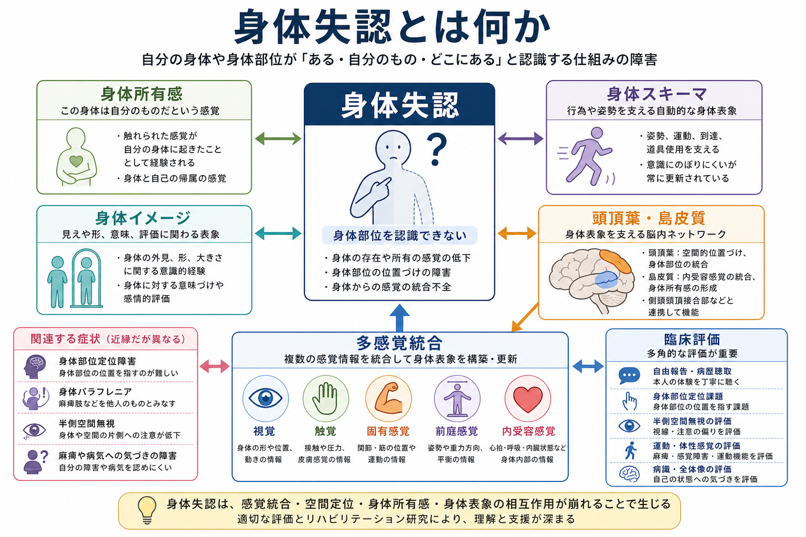
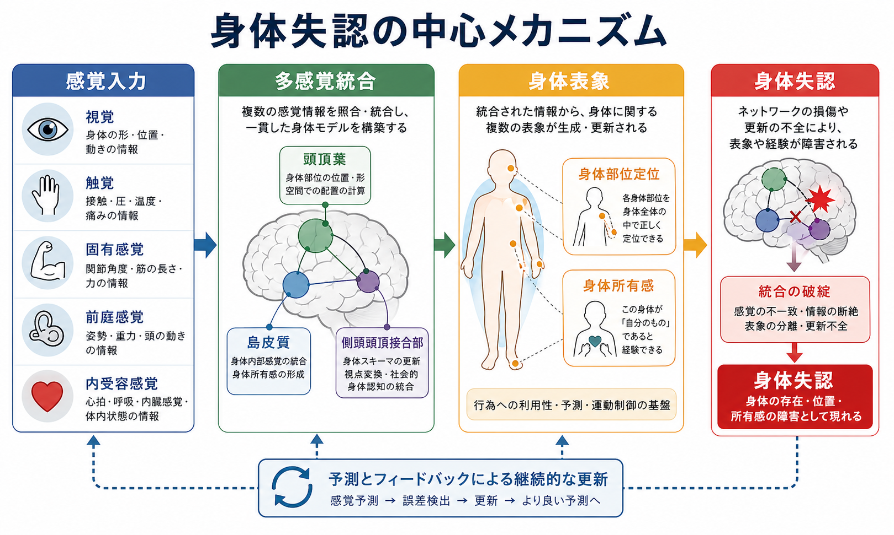
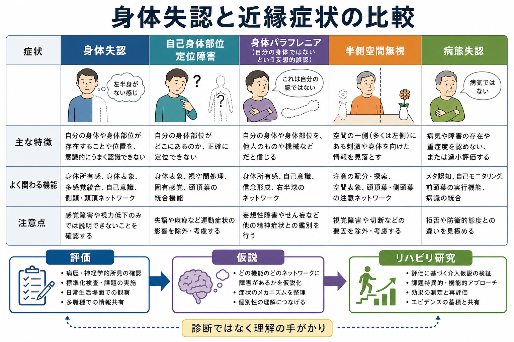

# 身体失認とは何か

## 要点

- 身体失認は、自分の身体や身体部位が「ある」「自分のものだ」「どこにある」と認識する仕組みが障害される神経心理症状の総称として使われることがある。
- 厳密には、asomatognosia は身体や半身が意識から消えたように感じられる体験を指すことが多い。一方、身体部位を指せない自己身体部位定位障害、自分の麻痺肢を他人のものとみなす身体パラフレニア、半側空間無視、病態失認は近縁だが同一ではない [1][2]。
- 背景には、視覚、触覚、固有感覚、前庭感覚、[[内受容感覚とは何か|内受容感覚]]を統合し、身体所有感、身体部位の配置、行為可能性を保つ仕組みがある [3][4]。
- 身体失認は、[[身体所有感とは何か|身体所有感]]や[[自己とは何か|自己]]を「当たり前の感覚」ではなく、複数の表象と神経ネットワークが支える構成物として理解する入口になる。

## この記事で答える問い

1. 身体失認とは、何が分からなくなる症状なのか。
2. 身体スキーマ、身体イメージ、身体所有感はどう違うのか。
3. なぜ頭頂葉や島皮質の損傷で、自分の身体が自分のものとして経験されにくくなるのか。
4. 臨床評価やリハビリテーション研究では、身体失認をどのように慎重に扱うべきか。

## まず結論

身体失認は、単に「身体の名前を忘れる」症状ではない。問題になるのは、身体部位を身体全体の中に位置づけること、身体から来る感覚を統合すること、その身体を「自分の身体」として帰属すること、そして行為に使える身体として更新することである。

そのため、身体失認を理解するには、単一の「身体地図」が壊れるというより、複数の身体表象が部分的に分離しうると考える方がよい。自分の手を見て名前は言えるのに位置を指せない、麻痺を認めない、左半身が存在しないように感じる、自分の腕を他人のものだと語る、といった症状は、重なりながらも異なる認知過程を示している [1][5][6]。

## 背景

日常では、自分の身体はほとんど問題にならない。目を閉じても手の位置が分かり、足を見なくても歩ける。痛みやかゆみは「どこか」に定位され、触られた感覚は「自分の身体に起きたこと」として経験される。

しかし、脳損傷後の神経心理症状では、この自明性が崩れることがある。右半球損傷後に左半身への気づきが弱くなる、左腕を自分のものではないと語る、身体部位を身体全体の中で定位できない、といった現象が報告されてきた [1][6]。これらは、[[意識とは何か|意識]]や[[最小自己とは何か|最小自己]]の研究にとっても重要である。なぜなら「私はこの身体でここにいる」という感覚が、感覚入力と脳内表象の統合によって維持されていることを示すからである。

## 基本概念

### 身体失認

身体失認という日本語は広く使われるため、文脈によって指す範囲が揺れる。狭い意味では、asomatognosia、つまり身体や身体の一部が存在しない、消えた、意識から抜け落ちたように感じられる現象を指す [1]。多くの場合、半身に偏って生じるため、半側身体失認と呼ばれることもある。

ただし、臨床的には身体部位の認識障害、身体所有感の障害、麻痺への気づきの障害、半側空間無視が併存しやすい。このため、本文では「身体を自分の身体として、身体全体の中に位置づけて認識する機能の障害」という広い入口から整理し、症状ごとの違いを区別する。

### 自己身体部位定位障害

自己身体部位定位障害、または autotopagnosia は、指示された身体部位を自分の身体上で定位することが難しくなる症状である。古典的症例では、身体部位の名前や機能を理解していて、物体や動物の部分を指すことはできても、自分の身体部位を身体全体の中で指すことが難しい例が報告されている [5]。

Sirigu らの症例研究は、身体知識が単一ではなく、感覚運動的、視空間的、意味的な複数表象から成ることを示した [6]。これは、[[知覚とは何か|知覚]]や[[空間認知とは何か|空間認知]]だけでなく、身体に固有の構造的表象を考える必要があることを示している。

### 身体スキーマと身体イメージ

身体スキーマは、姿勢、運動、到達、道具使用などを支える比較的自動的な身体表象として説明されることが多い。身体イメージは、身体の見え、形、意味、評価、意識的経験に関わる表象として説明されることが多い [2][3]。

ただし、この区別は便利だが単純ではない。de Vignemont は、身体スキーマと身体イメージという語が多様な意味で使われてきたため、どの課題、どの表象、どの障害を説明しているのかを明確にする必要があると論じている [2]。したがって、身体失認を読むときは「身体スキーマが壊れた」と一語で済ませず、どの種類の身体表象が障害されているかを見る必要がある。

## 仕組み

### 多感覚統合としての身体表象

身体は、単一の感覚だけから作られるわけではない。視覚は身体の形や位置を与え、触覚は接触を伝え、固有感覚は関節や筋の状態を知らせ、前庭感覚は姿勢と重力方向を支え、内受容感覚は心拍、呼吸、内臓状態を含む身体内部の変化を伝える [3]。

これらの信号は、頭頂葉、側頭頭頂接合部、島皮質、運動関連領域などを含む分散ネットワークで統合される。Berlucchi と Aglioti は、身体意識を単一の身体地図ではなく、複数の脳内身体表象の時空間的活動として捉える必要があると整理している [3]。

### 身体所有感と身体部位定位

身体所有感は「この身体は自分のものだ」という経験である。これは身体失認と密接に関係するが、同じではない。身体部位の位置を知っていても所有感が弱まる場合があり、逆に所有感はあるが部位定位が不正確な場合もありうる。

Longo と Haggard は、手の位置感覚の背後に、意識にのぼりにくい身体表象があることを示し、身体表象が実際の身体形状をそのまま写すものではなく、系統的な歪みを含みうると論じた [7]。この点は、身体失認を「感覚がゼロになる」症状ではなく、身体表象の更新や統合が偏る症状として理解する助けになる。

### 右半球、頭頂葉、島皮質

身体パラフレニアは、反対側の身体部位、とくに麻痺した左上肢などを自分のものではないと語る妄想的誤認として記述される。Vallar と Ronchi のレビューでは、身体パラフレニアは多くの場合、右半球損傷、運動・体性感覚障害、半側空間無視と関連して報告されている [8]。

Feinberg らは、身体失認と身体パラフレニアを神経解剖学的に検討し、所有感の気づきの障害と妄想的誤認を区別する必要を示した [4]。一方で、症状は症例ごとに複雑であり、病変部位だけから体験内容を機械的に予測することはできない。

## 図解

図1は、身体失認を「身体部位の認識」「身体所有感」「身体スキーマ」「身体イメージ」「多感覚統合」の接点として整理した概念地図である。図2は、感覚入力が統合され、身体所有感と身体部位定位が成立し、その統合が崩れると身体失認や近縁症状が生じるという流れを示している。

図3は、身体失認と近縁症状を比較するための補助図である。実際の臨床評価では、これらを一つの症状名に押し込めず、自由報告、身体部位定位課題、無視の評価、運動・体性感覚評価、病識評価を組み合わせる必要がある [1]。

## 臨床・研究との接続

身体失認は、脳卒中、腫瘍、外傷、神経変性疾患、てんかん関連体験など、さまざまな文脈で観察されうる。ただし、この記事は教育・研究目的の整理であり、個別の症状を診断したり治療方針を示したりするものではない。身体の違和感、麻痺、感覚低下、空間無視、意識変容がある場合は、神経学的・精神医学的評価が必要である。

研究上は、身体失認は[[身体所有感とは何か|身体所有感]]、[[身体化認知とは何か|身体化認知]]、VR 身体錯覚、義手・義足の受容、慢性痛、リハビリテーションと接続する。重要なのは、症状を奇妙な逸話として扱うのではなく、身体表象のどの層が保たれ、どの層が崩れているかを課題と観察で分けていくことである。

## よくある誤解

### 誤解1: 身体失認は身体部位の名前を忘れることである

身体部位名の想起障害や失語とは区別する必要がある。古典的な自己身体部位定位障害では、身体部位の名前や機能の知識が保たれていても、身体上で位置づけられないことがある [5][6]。

### 誤解2: 身体失認は半側空間無視と同じである

半側空間無視は、身体外空間や身体空間の片側への注意が低下する症状であり、身体失認と併存しやすい。しかし、身体の存在感、所有感、部位定位の障害は、無視だけでは説明しきれない場合がある [1][8]。

### 誤解3: 身体スキーマと身体イメージを分ければすべて説明できる

この区別は有用だが、実際の身体表象はさらに細かく分かれる。感覚運動表象、視空間表象、意味知識、所有感、情動評価、内受容感覚は、課題や症例によって異なる形で障害されうる [2][6]。

### 誤解4: 症状が奇妙なので心理的な思い込みにすぎない

身体失認や身体パラフレニアは、脳損傷後の神経心理症状として記述されてきた。本人の発言が奇妙に見えても、背景には体性感覚、空間注意、運動、身体所有感の統合不全がある可能性がある。説明は尊重的に行い、本人の苦痛や安全、機能障害を含めて評価する必要がある。

## 関連ノート

- [[身体所有感とは何か]]
- [[自己とは何か]]
- [[最小自己とは何か]]
- [[内受容感覚とは何か]]
- [[身体化認知とは何か]]
- [[意識とは何か]]
- [[知覚とは何か]]
- [[空間認知とは何か]]

## 理解チェック

1. asomatognosia と身体パラフレニアは、どの点で区別できるか。
2. 自己身体部位定位障害では、身体部位名の知識と身体上の定位がどのように分離しうるか。
3. 身体スキーマと身体イメージという区別の利点と限界は何か。
4. 身体失認を半側空間無視だけで説明しきれない理由は何か。
5. 身体失認を臨床診断や治療指示として単純化してはいけない理由は何か。

## 関連ノート候補

- 身体スキーマとは何か
- 身体イメージとは何か
- 身体パラフレニアとは何か
- 半側空間無視とは何か
- 病態失認とは何か
- 幻肢とは何か

## MOC更新候補

- `content/00_MOC/MOC｜認知科学・心理学.md` の「自己感・身体所有感」付近に `[[身体失認とは何か]]` を追加する。
- `content/00_MOC/MOC｜脳・神経科学.md` に高次脳機能・神経心理症状の入口がある場合、関連ノートとして追加する。

## 未解決問題

- 身体失認、身体パラフレニア、病態失認、半側空間無視を分ける最小の評価バッテリーは何か。
- 身体所有感の変化は、体性感覚障害、空間注意障害、情動・動機づけ、内受容感覚のどれに最も依存するのか。
- VR、錯覚課題、運動イメージ課題は、脳損傷後の身体表象障害の評価やリハビリテーションにどこまで応用できるのか。
- 右半球損傷に多い身体所有感の障害と、左頭頂葉損傷に多い身体部位定位障害を、共通モデルでどこまで説明できるのか。

## 参考文献

[1] Saetta, G., Zindel-Geisseler, O., Stauffacher, F., Serra, C., Vannuscorps, G., & Brugger, P. (2021). Asomatognosia: Structured Interview and Assessment of Visuomotor Imagery. *Frontiers in Psychology, 11*, 544544. https://doi.org/10.3389/fpsyg.2020.544544

[2] de Vignemont, F. (2010). Body schema and body image: Pros and cons. *Neuropsychologia, 48*(3), 669-680. https://doi.org/10.1016/j.neuropsychologia.2009.09.022

[3] Berlucchi, G., & Aglioti, S. M. (2010). The body in the brain revisited. *Experimental Brain Research, 200*(1), 25-35. https://doi.org/10.1007/s00221-009-1970-7

[4] Feinberg, T. E., Venneri, A., Simone, A. M., Fan, Y., & Northoff, G. (2010). The neuroanatomy of asomatognosia and somatoparaphrenia. *Journal of Neurology, Neurosurgery & Psychiatry, 81*(3), 276-281. https://doi.org/10.1136/jnnp.2009.188946

[5] Ogden, J. A. (1985). Autotopagnosia: Occurrence in a patient without nominal aphasia and with an intact ability to point to parts of animals and objects. *Brain, 108*(4), 1009-1022. https://doi.org/10.1093/brain/108.4.1009

[6] Sirigu, A., Grafman, J., Bressler, K., & Sunderland, T. (1991). Multiple representations contribute to body knowledge processing: Evidence from a case of autotopagnosia. *Brain, 114*(1), 629-642. https://doi.org/10.1093/brain/114.1.629

[7] Longo, M. R., & Haggard, P. (2010). An implicit body representation underlying human position sense. *Proceedings of the National Academy of Sciences, 107*(26), 11727-11732. https://doi.org/10.1073/pnas.1003483107

[8] Vallar, G., & Ronchi, R. (2009). Somatoparaphrenia: A body delusion. A review of the neuropsychological literature. *Experimental Brain Research, 192*(3), 533-551. https://doi.org/10.1007/s00221-008-1562-y
