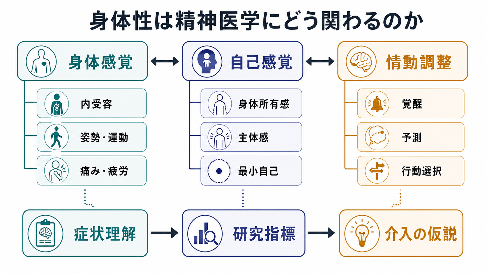
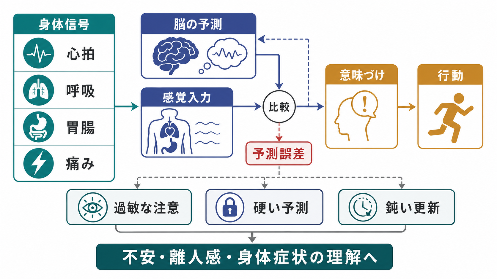
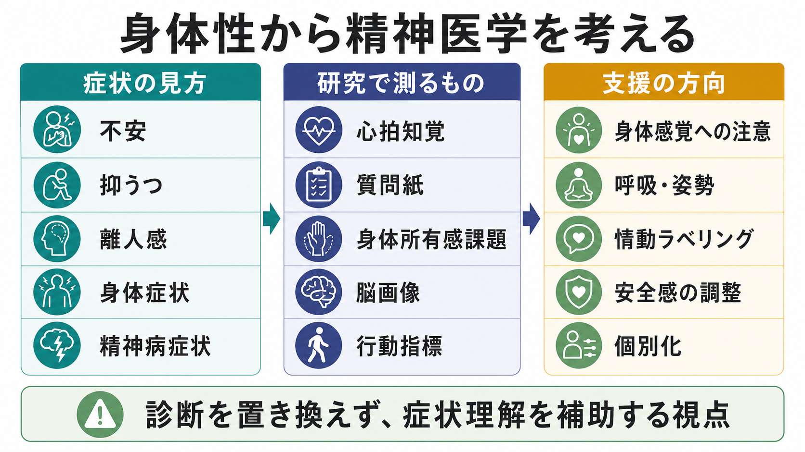

# 身体性は精神医学にどう関わるのか

## 要点

- 身体性とは、心や自己を「脳内の表象」だけでなく、内受容感覚、姿勢、運動、身体所有感、主体感、他者との相互作用を含む身体を通して理解する視点である。
- 精神症状は、思考内容や感情だけでなく、「身体がどう感じられるか」「身体信号にどの程度注意が向くか」「その信号がどのように意味づけられるか」の変化として現れることがある[1][2]。
- 不安、パニック、うつ、摂食症、身体症状、離人感、統合失調症スペクトラムの自己障害では、内受容感覚、身体所有感、最小自己、情動調整の観点が研究上重要になる[1][3][4][5]。
- ただし、身体性の視点は診断名や治療方針を単独で決めるものではない。症状、生活史、身体疾患、薬物、社会環境、文化的意味づけを合わせて理解する補助線である。

## この記事で答える問い

1. 精神医学でいう身体性とは何を指すのか。
2. 身体感覚や自己感覚の変化は、どのように精神症状と関係するのか。
3. 内受容感覚、予測処理、身体所有感、最小自己は、精神医学研究でどのように使われるのか。
4. 身体性に注目する支援や研究には、どのような可能性と限界があるのか。

## まず結論

身体性は、精神症状を「頭の中だけの問題」としてではなく、身体信号、行為、自己感覚、情動調整、環境との相互作用の変化として読むための視点である。たとえば不安では、心拍や呼吸の変化が危険のサインとして解釈され、注意が身体に固定されることで症状が増幅することがある。うつでは、身体の重さ、疲労、運動の遅さ、自己評価の低下が一体となって経験されることがある。離人感では、身体や感情が自分から遠いもののように感じられることがある。

この視点の利点は、症状を「思考」「感情」「身体」に切り分けすぎず、経験のまとまりとして扱える点にある。一方で、身体性を強調しすぎると、身体疾患の見落とし、心理主義、個人責任化につながる危険もある。したがって精神医学で身体性を使うときは、教育・研究上の説明枠組みとして慎重に扱い、個別診断や治療指示として断定しないことが重要である。

## 背景

精神医学では、症状がしばしば言葉、感情、行動、対人関係として記述される。しかし実際の経験では、症状は身体を通して現れることが多い。胸が詰まる、息がしにくい、胃が重い、身体が鉛のように重い、身体が自分のものではない、現実感が薄い、動こうとしても動けない。これらは単なる「身体症状」ではなく、自己や世界の感じられ方そのものを変える。

現象学的精神病理学では、身体は外から観察される物体であるだけでなく、世界に関わるための「生きられた身体」として捉えられる。Fuchs と Schlimme は、統合失調症やうつを、身体が背景として自然に働く状態の乱れ、あるいは身体が過剰に目立つ状態として整理した[3]。この考え方は、[[身体化認知とは何か]] や [[エナクティブ認知とは何か]] とも接続する。

近年は、身体性の議論が神経科学や計算論的精神医学とも結びついている。特に [[内受容感覚とは何か|内受容感覚]] は、心拍、呼吸、胃腸、痛み、疲労、温度など、身体内部から来る信号の感知・解釈・統合を指す。Khalsa らのロードマップは、内受容感覚が不安、うつ、摂食症、身体症状、依存、慢性疼痛などを横断する研究対象になりうると整理している[1]。

## 基本概念

### 身体性

身体性とは、認知や感情や自己を、身体をもつ存在としての経験から理解する立場である。ここでいう身体は、解剖学的な身体だけではない。姿勢、運動、内受容感覚、感覚運動予測、身体所有感、主体感、他者との距離、文化的な身体観まで含む。

このため身体性は、[[身体図式とは何か]]、[[身体所有感とは何か]]、[[主体感とは何か]]、[[自己とは何か]]、[[最小自己とは何か]] と重なる。精神医学では、これらの層が乱れると、感情の制御、現実感、他者との関係、行為の開始、症状への意味づけが変わると考えられる。

### 内受容感覚

内受容感覚は、身体内部の状態を神経系が感知し、解釈し、統合する過程である[1]。心拍を正確に数える能力だけを指すわけではない。身体信号にどれほど注意を向けるか、その信号を信頼するか、脅威として解釈するか、行動調整に使えるかも含む。

たとえば同じ心拍上昇でも、運動中なら「身体が動いている」、発表前なら「緊張している」、パニック発作を恐れている人なら「危険な発作が来る」と意味づけられるかもしれない。[[内受容感覚は感情にどう関わるのか]] で扱うように、感情は身体信号そのものではなく、身体信号、予測、文脈、注意、行動可能性が結びついた経験である[2]。

### 身体所有感・主体感・最小自己

身体所有感は「この身体は自分のものだ」と感じられること、主体感は「この行為を自分が起こしている」と感じられることを指す。ラバーハンド錯覚の研究は、身体所有感が視覚、触覚、固有感覚の統合によって変化しうることを示した。統合失調症研究では、身体所有感や自己感覚の変化が、自己障害や異常な自己経験と関係する可能性が調べられてきた[5]。

最小自己とは、物語的な自己理解以前にある「この経験は私にとって起きている」という基礎的な自己性である。統合失調症スペクトラムでは、この最小自己の乱れが、思考や身体や行為の自然なまとまりの変化として議論される[4]。ただし、これらは診断名を自動的に決める指標ではなく、経験を精密に記述するための概念である。

## 仕組み

### 身体信号はそのまま症状になるわけではない

身体信号は、心拍、呼吸、胃腸、筋緊張、痛み、疲労などとして生じる。しかしそれが「不安」「危険」「虚しさ」「現実感のなさ」として経験されるには、注意、記憶、予測、文脈、言語化、他者反応が関わる。

たとえば心拍が速いという身体入力だけでは、パニック、不安、期待、怒り、運動後の回復を区別できない。脳は身体状態を予測し、実際の入力との差を処理し、その差を減らすために意味づけや行動を更新する。Seth は、情動や身体化された自己を、内受容信号に対する予測と推論として理解する枠組みを提示した[2]。

### 予測処理としての内受容

予測処理の観点では、脳は身体から上がってくる信号を受動的に読むだけではない。むしろ「この状況では身体はこうなるはずだ」という予測を作り、実際の信号との差を予測誤差として扱う。差が小さければ現在の予測が保たれ、差が大きければ予測、注意、行動、身体調整が変わる。

この仕組みが精神症状に関わる場合、少なくとも三つのパターンが考えられる。第一に、身体信号への注意が過敏になり、小さな変化が強い意味をもつ。第二に、危険や無力感に関する予測が硬くなり、別の解釈に更新されにくい。第三に、身体信号の精度づけが低下し、身体が自分から遠く感じられる。離人症状を内受容信号のダウンレギュレーションとして説明する計算論モデルも、この第三の方向を示している[6]。

### 情動調整との関係

情動調整は、感情を抑え込むことだけではない。身体の覚醒を読み、適切に名づけ、行動を選び、他者や環境を使って調整する過程である。呼吸を整える、姿勢を変える、身体を動かす、安全な場所に移る、信頼できる人と話す、感情に名前をつけるといった行為は、身体信号と意味づけを同時に変える。

この意味で、身体性は心理療法やリハビリテーションとも接続する。ただし、身体へ注意を向ける介入が常に有益とは限らない。身体感覚への注意が不安や過覚醒を強める人もいるため、介入は症状、身体疾患、トラウマ歴、本人の耐性に応じて調整される必要がある。

## 図解

図1は、身体性を「身体感覚」「自己感覚」「情動調整」の三領域から見た概念地図である。重要なのは、これらが独立した箱ではなく、相互に影響する点である。身体感覚の変化は自己感覚を変え、自己感覚の変化は情動調整を変え、情動調整の失敗はさらに身体感覚への注意を強める。

図2は、内受容予測処理の流れである。身体信号は脳の予測と照合され、予測誤差として扱われる。その誤差にどれほど重みが置かれるかによって、意味づけや行動が変わる。精神医学で重要なのは、予測誤差が大きいか小さいかだけでなく、その信号がどの文脈で、どのような自己理解に組み込まれるかである。

図3は、身体性を症状理解、研究指標、支援の方向に接続した図である。身体性は診断を置き換えるものではないが、症状の成り立ちを細かく見るための補助線になる。

## 臨床・研究との接続

### 不安・パニック

不安やパニックでは、心拍、息苦しさ、めまい、胸部違和感などが脅威として解釈されることがある。身体信号そのものよりも、「この感覚は危険だ」「制御できない」という意味づけが症状を維持する場合がある。パニック障害の認知行動療法では、身体感覚を安全な場面で体験し直す内受容曝露が用いられることがあり、身体感覚への恐怖を弱める手続きとして研究されてきた[7]。

### うつ・疲労・身体の重さ

うつでは、気分の低下だけでなく、身体の重さ、疲労、睡眠、食欲、動作の遅さ、痛み、姿勢の変化が経験の中心になることがある。身体性の視点は、うつを「悲しい考え」だけでなく、行動可能性が狭まり、世界への働きかけが重くなる状態として理解する助けになる。これは、[[身体化認知とは何か]] や [[自己概念とは何か]] ともつながる。

### 離人感・現実感のなさ

離人感では、自分の身体、感情、思考が自分から遠いもののように感じられる。Saini らのアクティブインファレンスモデルは、強い身体覚醒があるのに外界に明確な脅威がない状況で、内受容信号を弱めるような処理が起こると、身体化された自己が外受容情報に過度に依存し、離人様の経験が生じうると説明した[6]。これは仮説モデルであり、個別症状を直接診断するものではないが、離人感を「身体感覚の欠如」だけでなく「身体信号の精度づけの変化」として考える入口になる。

### 統合失調症スペクトラムと自己障害

統合失調症スペクトラムでは、思考、知覚、行為、身体が自分のものとして自然にまとまる感覚が変化することがある。Nelson、Parnas、Sass は、最小自己の障害を統合失調症理解の中心概念の一つとして整理した[4]。身体所有感の研究でも、ラバーハンド錯覚などを通じて、身体自己の統合がどのように変わるかが検討されている[5]。

ただし、自己障害や身体所有感の変化は、診断カテゴリーと一対一対応しない。疲労、睡眠不足、薬物、トラウマ、不安、神経疾患、文化的背景でも自己感覚は変化しうる。研究では、症状評価、面接、行動課題、神経画像、生活機能を合わせて慎重に扱う必要がある。

### 介入研究

身体性に基づく介入には、内受容曝露、マインドフルネス、身体意識への注意、呼吸・姿勢・運動、ヨガ、Basic Body Awareness Therapy などが含まれる。Heim らのランダム化比較試験レビューでは、内受容に基づく心理的介入は、多くの研究で内受容関連指標を改善する傾向があった一方、症状改善については疾患や介入により結果が一貫しないとされた[8]。したがって、身体性への介入は有望だが、「身体に注意すれば症状が良くなる」と単純化してはいけない。

## よくある誤解

### 誤解1: 身体性とは、精神症状を身体疾患に還元する考え方である

身体性は、精神症状を身体疾患だけで説明する立場ではない。むしろ、身体信号、意味づけ、行為、環境、他者関係をつなげて見る視点である。身体疾患の鑑別が必要な症状は医学的に評価されるべきであり、身体性の説明で置き換えてはいけない。

### 誤解2: 身体感覚に敏感なほどよい

身体感覚への敏感さには複数の側面がある。正確に感じ取ること、過剰に注意すること、強く怖がること、身体信号を信頼できることは同じではない。内受容感覚の研究では、正確性、感受性、気づき、信頼、解釈を分けて考える必要がある[1]。

### 誤解3: 身体性の視点は薬物療法や診断分類と対立する

身体性の視点は、薬物療法、心理療法、診断分類、神経科学と対立する必要はない。薬物は身体状態や神経伝達を変え、心理療法は注意や意味づけや行動を変え、環境調整は安全感や身体覚醒を変える。身体性は、それらが経験の中でどのように結びつくかを見る枠組みである。

### 誤解4: 身体性に注目すれば、診断や治療が個別に決められる

現時点では、身体性に関する指標だけで個別診断や治療選択を決めることはできない。心拍知覚、質問紙、身体所有感課題、脳画像、行動指標は研究上有用だが、いずれも単独では特異性が不十分である。臨床判断には、専門家による総合的評価が必要である。

## 関連ノート

### 既存ノート

- [[内受容感覚とは何か]]
- [[内受容感覚は感情にどう関わるのか]]
- [[最小自己とは何か]]
- [[身体所有感とは何か]]
- [[主体感とは何か]]
- [[身体図式とは何か]]
- [[身体化認知とは何か]]
- [[ラバーハンド錯覚は何を示しているのか]]
- [[エナクティブ認知とは何か]]
- [[意識とは何か]]

### 今後の作成候補

- 精神医学における内受容感覚とは何か
- 離人感は身体性からどう理解できるのか
- 身体所有感の変化は統合失調症研究でどう扱われるのか
- 内受容曝露とは何か
- 身体志向心理療法とは何か

### MOC更新候補

- `content/00_MOC/MOC｜認知科学・心理学.md`
- `content/00_MOC/MOC｜精神医学.md`
- `content/00_MOC/MOC｜計算論的精神医学.md`

この並列ジョブでは MOC 本文は更新せず、候補の記載に留める。

## 理解チェック

1. 身体性の視点は、精神症状を「身体だけ」または「心だけ」に還元しない。では何をつなげて見る視点か。
2. 内受容感覚の正確性、感受性、身体信号への注意は、なぜ区別する必要があるか。
3. 不安やパニックで、身体信号の予測処理が症状を増幅する例を説明できるか。
4. 離人感を「内受容信号の低下」だけでなく、「内受容と外受容の重みづけの変化」として見ると何が見えるか。
5. 身体性に基づく介入研究で、症状改善の証拠を慎重に読むべき理由は何か。

## 未解決問題

- 内受容感覚、身体所有感、主体感、最小自己を、同じ参加者で統合的に測る研究デザインはまだ十分に確立していない。
- 身体性の変化が、症状の原因、結果、維持要因、防衛反応のどれに当たるのかは、縦断研究や介入研究で検証する必要がある。
- 身体に注意を向ける介入が有益な人と、過覚醒や不安を強める人を、どのように事前に見分けるかは重要な課題である。
- 文化、ジェンダー、トラウマ歴、身体疾患、薬物治療が身体性に与える影響を、精神医学モデルへどう組み込むかは未解決である。

## 参考文献

[1] Khalsa, S. S., Adolphs, R., Cameron, O. G., Critchley, H. D., Davenport, P. W., Feinstein, J. S., et al. (2018). Interoception and mental health: A roadmap. *Biological Psychiatry: Cognitive Neuroscience and Neuroimaging*, 3(6), 501-513. https://doi.org/10.1016/j.bpsc.2017.12.004

[2] Seth, A. K. (2013). Interoceptive inference, emotion, and the embodied self. *Trends in Cognitive Sciences*, 17(11), 565-573. https://doi.org/10.1016/j.tics.2013.09.007

[3] Fuchs, T., & Schlimme, J. E. (2009). Embodiment and psychopathology: A phenomenological perspective. *Current Opinion in Psychiatry*, 22(6), 570-575. https://doi.org/10.1097/YCO.0b013e3283318e5c

[4] Nelson, B., Parnas, J., & Sass, L. A. (2014). Disturbance of minimal self (ipseity) in schizophrenia: Clarification and current status. *Schizophrenia Bulletin*, 40(3), 479-482. https://doi.org/10.1093/schbul/sbu034

[5] Thakkar, K. N., Nichols, H. S., McIntosh, L. G., & Park, S. (2011). Disturbances in body ownership in schizophrenia: Evidence from the rubber hand illusion and case study of a spontaneous out-of-body experience. *PLOS ONE*, 6(10), e27089. https://doi.org/10.1371/journal.pone.0027089

[6] Saini, F., Ponzo, S., Silvestrin, F., Fotopoulou, A., & David, A. S. (2022). Depersonalization disorder as a systematic downregulation of interoceptive signals. *Scientific Reports*, 12, 22123. https://doi.org/10.1038/s41598-022-22277-y

[7] Lee, K., Noda, Y., Nakano, Y., Ogawa, S., Kinoshita, Y., Funayama, T., & Furukawa, T. A. (2006). Interoceptive hypersensitivity and interoceptive exposure in patients with panic disorder: Specificity and effectiveness. *BMC Psychiatry*, 6, 32. https://doi.org/10.1186/1471-244X-6-32

[8] Heim, N., Bobou, M., Tanzer, M., Jenkinson, P. M., Steinert, C., & Fotopoulou, A. (2023). Psychological interventions for interoception in mental health disorders: A systematic review of randomized-controlled trials. *Psychiatry and Clinical Neurosciences*, 77(10), 530-540. https://doi.org/10.1111/pcn.13576
