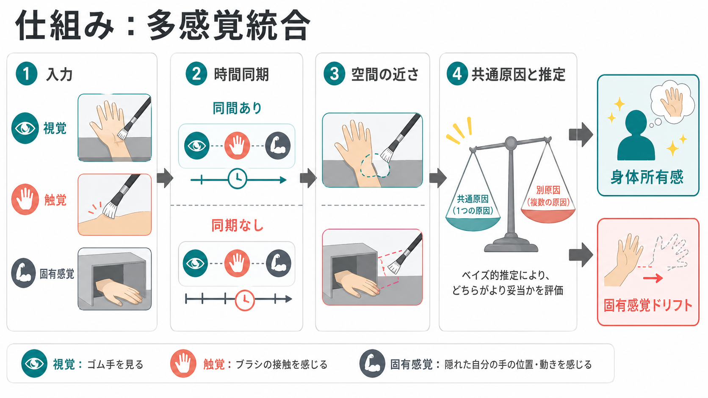
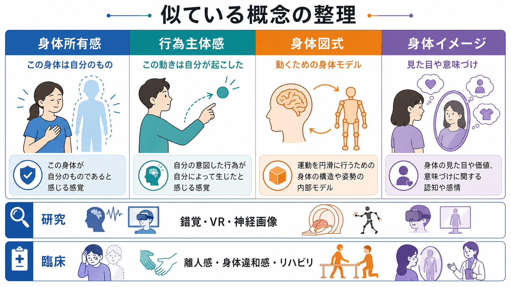

# 身体所有感とは何か

## 要点

- 身体所有感とは、「この身体、またはこの身体部位が自分のものだ」と感じる経験である。
- この感覚は固定された内的ラベルではなく、視覚、触覚、固有受容感覚、内受容感覚、身体の形についての知識が統合されて生じる。
- 代表的な実験であるラバーハンド錯覚では、見えているゴムの手と隠された自分の手が同期して触れられると、ゴムの手を自分の手のように感じることがある[1]。
- 身体所有感は、行為を自分が起こしたと感じる行為主体感とは区別できる。ただし、日常の身体経験では両者は重なりやすい[8]。
- 臨床・応用研究では、離人感、身体違和感、幻肢、痛み、リハビリテーション、VR、義手インターフェースなどと接続する。ただし、個別の診断や治療指示として単純化してはいけない。

## この記事で答える問い

1. 身体所有感とは、どのような主観的経験なのか。
2. なぜ視覚、触覚、固有受容感覚のずれによって「自分の身体」の感じが変わるのか。
3. ラバーハンド錯覚は、身体所有感について何を示しているのか。
4. 身体所有感、行為主体感、身体図式、身体イメージはどう違うのか。
5. 研究・臨床・VR・リハビリテーションでは、どのような点に注意して使われるのか。

## まず結論

身体所有感は、「身体についての一人称的な所有ラベル」ではなく、脳が身体から来る複数の信号を、その時点で最も整合的な身体モデルへまとめる過程として理解できる。目で見える手の位置、皮膚に触れられた時刻、筋肉や関節から来る位置感覚、心拍や呼吸などの内受容信号が、空間的・時間的にうまく合うと、その対象は「自分の身体」として扱われやすくなる[4][5]。

ただし、身体所有感は単なる錯覚研究の話ではない。普段はあまり意識されないが、道具を使う、義手を操作する、VR アバターに入る、身体違和感を訴える、痛みや幻肢を経験するといった場面で前景化する。したがって身体所有感は、[[意識とは何か|意識]]、[[主観的経験は科学的に扱えるのか|主観的経験]]、[[知覚とは何か|知覚]]、[[注意とは何か|注意]]を結ぶ重要な概念である。

## 背景

私たちは通常、身体を「所有している」といちいち判断していない。手を伸ばす、椅子に座る、頬を触る、歩くといった行為の背景には、身体が自分のものであり、自分の行為の媒体であるという暗黙の前提がある。この前提がうまく働くからこそ、世界の中の物体と、自分の身体の境界を安定して扱える。

しかし、身体所有感は完全に固定されたものではない。ラバーハンド錯覚、全身錯覚、VR アバター錯覚、幻肢、身体失認、離人感などは、身体の「自分らしさ」が条件によって変化しうることを示す。Botvinick と Cohen は、ラバーハンド錯覚を通じて、身体自己同定が視覚、触覚、固有受容感覚の相互作用に依存することを示した[1]。

この発見は、身体所有感を「心の奥にある確信」ではなく、実験的に変化させ、測定し、神経機構を探れる現象として扱う道を開いた。Ehrsson らは fMRI を用いて、ラバーハンドを自分の手のように感じる強さが前運動皮質の活動と関係することを示し、多感覚統合と自己帰属の神経基盤を結びつけた[3]。

## 基本概念

### 身体所有感

身体所有感とは、身体または身体部位が「自分のもの」として経験される感覚である。たとえば、目を閉じていても自分の手の位置を感じ、机に触れたときに「机が手に触れている」と感じる。そこでは、触覚の内容だけでなく、その触覚が「自分の身体上で起きている」という帰属が含まれる。

この所有感には、少なくとも三つの側面がある。第一に、身体部位が自分に属するという主観的報告である。第二に、手の位置判断がゴムの手側へずれるような行動指標である。第三に、脅威反応や皮膚電気反応のように、対象を自分の身体として扱っていることを示す生理指標である[1][5]。

### 身体図式

身体図式は、姿勢や運動を支えるための実用的な身体モデルである。歩く、手を伸ばす、姿勢を保つときには、関節角度、筋緊張、視覚、前庭感覚が継続的に統合される。身体図式は必ずしも意識に上がらないが、行為を滑らかにする。

### 身体イメージ

身体イメージは、自分の身体についての見た目、評価、信念、感情、社会的意味づけを含む。鏡に映る自分、体型への満足・不満、年齢や性別に関する身体的自己理解は、身体イメージに近い。身体所有感とは重なるが、身体イメージはより認知的・情動的・社会的である[6]。

### 行為主体感

行為主体感とは、「この行為を自分が起こした」と感じる経験である。身体所有感が「この手は自分の手だ」に近いのに対し、行為主体感は「この手の動きは自分が起こした」に近い。Kalckert と Ehrsson は、動くラバーハンド錯覚を用いて、所有感と主体感が関連しながらも分離しうることを示した[8]。

## 仕組み

### 1. 視覚、触覚、固有受容感覚を合わせる

ラバーハンド錯覚では、参加者の本物の手を隠し、見える位置にゴムの手を置く。実験者が本物の手とゴムの手を同時に同じように撫でると、参加者はゴムの手を自分の手のように感じやすくなる[1]。ここで重要なのは、見える接触と感じる接触が時間的に同期していることである。

同時に、固有受容感覚も関わる。固有受容感覚とは、筋肉、腱、関節から来る身体部位の位置や動きの感覚である。見えているゴムの手と、感じている本物の手の位置があまりに離れていると錯覚は弱くなる。つまり、脳は「同じ原因から来た信号」と見なせる範囲で、視覚、触覚、固有受容感覚をまとめている[2][5]。

### 2. 時間同期と空間的一致が重みになる

身体所有感は、単に視覚が触覚に勝つ現象ではない。視覚と触覚が同じタイミングで起こること、見えている手が身体としてもっともらしい形や向きを持つこと、自分の手の近くにあることが重要である[2][5]。これらは、複数の感覚信号が同じ身体部位から来たのか、それとも別々の原因から来たのかを推定する手がかりになる。

この考え方は、ベイズ的な多感覚統合や因果推論と相性がよい。脳は、感覚信号を機械的に足し合わせるのではなく、「どの信号を同じ身体の出来事としてまとめるべきか」を推定していると考えられる[4][5]。そのため、同期、距離、形、身体らしさ、注意、期待が変わると、所有感も変わりうる。

### 3. 身体知識が境界条件を作る

身体所有感は、感覚入力だけでは決まらない。ゴムの手が解剖学的に不自然な向きに置かれる、身体部位らしくない物体が置かれる、触れられる場所が身体としてありえない位置にある、といった条件では錯覚が弱くなる[2]。つまり、脳は「これは身体としてありうるか」という事前知識も使っている。

この点は、身体所有感を身体図式や身体イメージと切り離しすぎない理由でもある。身体図式は運動制御に、身体イメージは見た目や意味づけに関わるが、身体所有感もそれらの制約を受ける。身体は、単なる感覚の束ではなく、形、機能、行為可能性、社会的意味を持つ対象として経験される。

### 4. 内受容感覚も身体自己を支える

身体所有感の研究は、視覚・触覚・固有受容感覚から始まったが、近年は内受容感覚も重視されている。内受容感覚とは、心拍、呼吸、胃腸、体温、痛み、疲労など、身体内部状態に関する感覚である。Tsakiris と Critchley は、内受容感覚が情動、認知、メンタルヘルスと結びつき、身体化された自己理解の基盤になると整理している[7]。

外から見える身体と、内側から感じる身体が大きくずれると、「自分の身体」という感覚も変化しうる。ただし、内受容感覚の役割は単純ではない。心拍を正確に感じる能力が高ければ常に身体所有感が強い、というような一方向の関係ではなく、課題、注意、情動、個人差によって変わる。

## 図解

| 図 | 読み方 | 対応する本文 |
|---|---|---|
| 身体所有感の多感覚統合 | 視覚、触覚、固有受容感覚、予測誤差が身体モデルを更新する流れとして読む | 仕組み |
| ラバーハンド錯覚 | 同期、空間的一致、因果推論が所有感と位置ずれを生む例として読む | 仕組み |
| 関連概念の比較 | 身体所有感、行為主体感、身体図式、身体イメージを混同しないために読む | 基本概念・誤解 |

## 臨床・研究との接続

身体所有感は、健康な成人の実験だけでなく、臨床・応用研究とも関係する。幻肢では、失われた身体部位がなお自分の身体として感じられることがある。身体失認や身体違和感では、自分の身体部位への帰属が変化することがある。離人感では、身体や経験が自分のものとして感じられにくいと報告されることがある。これらは身体所有感の研究と接続しうるが、単一メカニズムに還元して診断することはできない[6][7]。

VR やアバター研究では、身体所有感を意図的に操作できる。参加者がアバター身体を一人称視点で見て、視触覚または視運動情報が同期すると、仮想身体を自分の身体のように感じることがある[5]。この性質は、身体錯覚、社会認知、リハビリテーション、義手操作、痛み研究に応用される。

リハビリテーションでは、身体所有感や行為主体感は、運動学習、義手受容、身体機能への注意、痛みの再評価と関係しうる。ただし、研究で示されるのは特定条件での関連であり、個別の症状に対する治療指示ではない。医療・臨床の場では、本人の苦痛、機能障害、併存症、生活文脈を含めて評価する必要がある。

## よくある誤解

### 誤解1: 身体所有感は常に安定している

身体所有感は日常では安定しているが、錯覚、VR、道具使用、身体状態、痛み、情動、注意によって変わりうる。安定して見えるのは、身体からの信号がふだんはかなり一貫しているからである。

### 誤解2: ラバーハンド錯覚は「視覚が勝つ」だけの現象である

視覚は強い手がかりだが、錯覚には触覚との同期、固有受容感覚との距離、身体らしい形、手の向きなどが関わる[1][2]。したがって、単なる視覚優位ではなく、多感覚統合と因果推論の問題として読む方がよい。

### 誤解3: 所有感と主体感は同じである

所有感は「この身体は自分のもの」、主体感は「この行為を自分が起こした」に近い。自分の手が受動的に動かされる場合、所有感はあっても主体感は弱い。逆に、遠隔操作や道具使用では、主体感があっても身体所有感は限定的なことがある[8]。

### 誤解4: 身体所有感の異常はすぐ診断名に直結する

身体所有感の変化は、離人感、身体違和感、痛み、神経疾患、精神疾患と関係しうる。しかし、身体所有感だけで診断はできない。研究知見は、症状理解の枠組みや仮説を与えるものであり、個別診断や治療判断には専門的評価が必要である。

## 関連ノート

### 既存ノート

- [[意識とは何か]]
- [[主観的経験は科学的に扱えるのか]]
- [[知覚とは何か]]
- [[注意とは何か]]
- [[トップダウン注意とボトムアップ注意は何が違うのか]]
- [[メタ認知とは何か]]

### 今後の作成候補

- 行為主体感とは何か
- 身体図式とは何か
- 身体イメージとは何か
- ラバーハンド錯覚とは何か
- 内受容感覚とは何か
- VR は身体所有感をどう変えるのか
- 幻肢と身体所有感はどう関係するのか

### MOC 更新候補

- `content/00_MOC/MOC｜認知科学・心理学.md` の「自己感・身体所有感」付近に `[[身体所有感とは何か]]` を追加する。
- 並列ジョブとの競合を避けるため、この作業では MOC 本文は更新しない。

## 理解チェック

1. 身体所有感を、身体図式や身体イメージと区別して説明できるか。
2. ラバーハンド錯覚で、視覚、触覚、固有受容感覚がそれぞれ何を担うか説明できるか。
3. 同期していない刺激や、解剖学的に不自然な手の向きで錯覚が弱くなる理由を説明できるか。
4. 所有感と行為主体感が分離しうる例を挙げられるか。
5. 身体所有感の研究知見を、臨床診断や治療指示として直接使ってはいけない理由を説明できるか。

## 参考文献

[1] Botvinick, M., & Cohen, J. (1998). Rubber hands 'feel' touch that eyes see. *Nature*, 391, 756. https://doi.org/10.1038/35784

[2] Tsakiris, M., & Haggard, P. (2005). The rubber hand illusion revisited: Visuotactile integration and self-attribution. *Journal of Experimental Psychology: Human Perception and Performance*, 31(1), 80-91. https://doi.org/10.1037/0096-1523.31.1.80

[3] Ehrsson, H. H., Spence, C., & Passingham, R. E. (2004). That's my hand! Activity in premotor cortex reflects feeling of ownership of a limb. *Science*, 305(5685), 875-877. https://doi.org/10.1126/science.1097011

[4] Blanke, O., Slater, M., & Serino, A. (2015). Behavioral, neural, and computational principles of bodily self-consciousness. *Neuron*, 88(1), 145-166. https://doi.org/10.1016/j.neuron.2015.09.029

[5] Kilteni, K., Maselli, A., Kording, K. P., & Slater, M. (2015). Over my fake body: Body ownership illusions for studying the multisensory basis of own-body perception. *Frontiers in Human Neuroscience*, 9, 141. https://doi.org/10.3389/fnhum.2015.00141

[6] Tsakiris, M. (2017). The multisensory basis of the self: From body to identity to others. *Quarterly Journal of Experimental Psychology*, 70(4), 597-609. https://doi.org/10.1080/17470218.2016.1181768

[7] Tsakiris, M., & Critchley, H. (2016). Interoception beyond homeostasis: Affect, cognition and mental health. *Philosophical Transactions of the Royal Society B*, 371(1708), 20160002. https://doi.org/10.1098/rstb.2016.0002

[8] Kalckert, A., & Ehrsson, H. H. (2012). Moving a rubber hand that feels like your own: A dissociation of ownership and agency. *Frontiers in Human Neuroscience*, 6, 40. https://doi.org/10.3389/fnhum.2012.00040

## 未解決問題

- 身体所有感の主観報告、位置ずれ、生理反応は、どこまで同じ構成概念を測っているのか。
- 内受容感覚、情動、身体所有感の因果関係は、課題や個人差によってどのように変わるのか。
- VR や義手操作で誘導される所有感は、日常の身体所有感とどの程度同じ機構なのか。
- 身体所有感の変化を、離人感、痛み、身体違和感、リハビリテーション支援にどう慎重に接続できるのか。

## 更新ログ

- 2026-04-27: 初稿作成。多感覚統合、ラバーハンド錯覚、関連概念、研究・臨床接続を中心に整理し、生成インフォグラフィック3枚を追加。
