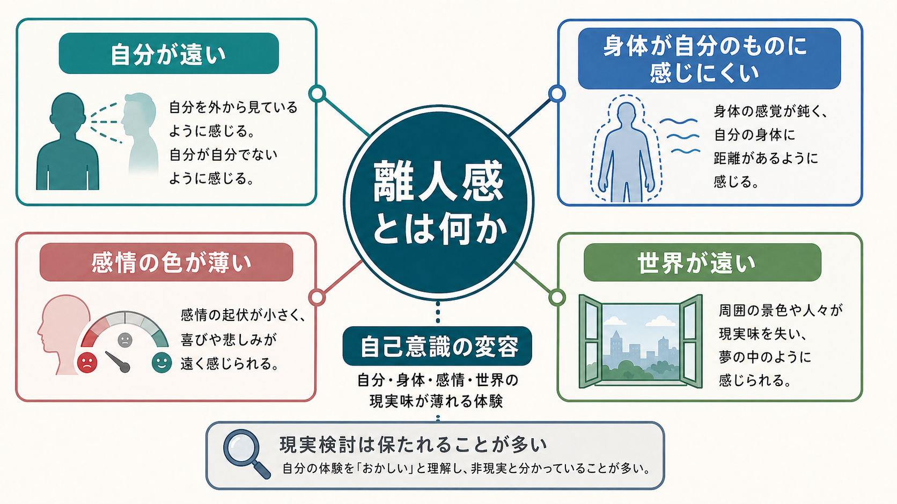
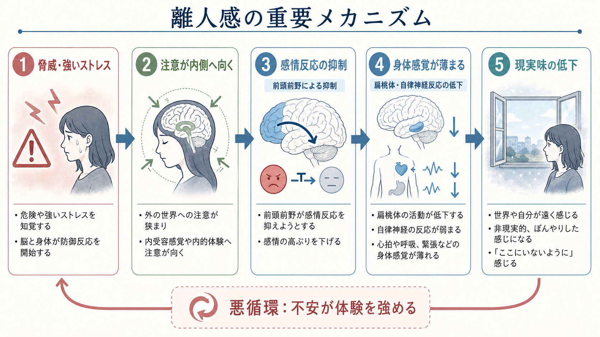
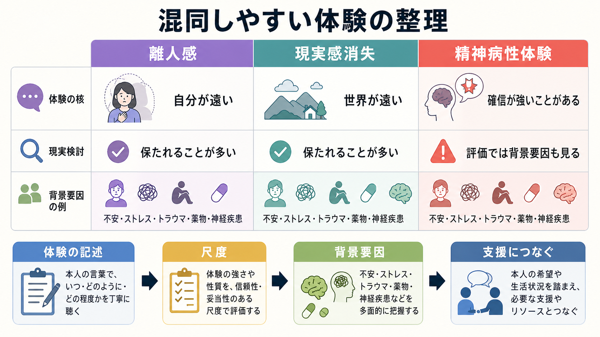

# 離人感とは何か

## 要点

- 離人感とは、「自分が自分から離れている」「身体や感情が自分のものとして実感しにくい」と感じる体験である。世界が遠い、夢の中のようだと感じる現実感消失を伴うことも多い [1][2]。
- 重要なのは、体験が奇妙でも、多くの場合は「これは本当に世界が消えたのではなく、自分の感じ方が変わっている」と分かっている点である。これは精神病性の確信とは区別される [1]。
- 認知科学的には、離人感は [[意識とは何か|意識]] の内容そのものが消えるというより、[[最小自己とは何か|最小自己]]、身体所有感、感情の色づき、世界への没入感が弱まる自己意識の変容として理解できる。
- 臨床的には、短い一過性の体験は比較的よくみられる。一方で、持続・反復し、苦痛や生活障害を伴う場合は、離人感・現実感消失症として評価されることがある [1][3]。

## この記事で答える問い

1. 離人感と現実感消失は何が違うのか。
2. なぜ「自分が遠い」「世界が薄い」という感覚が起こるのか。
3. 離人感は、意識・自己・身体性の研究とどうつながるのか。
4. よくある誤解として、精神病、感情がないこと、単なる気のせいとはどう違うのか。

## まず結論

離人感は、「自分という対象について考えすぎている状態」ではなく、体験が最初から「私の体験」として立ち上がる仕方が変わる現象である。典型的には、自分を外から見ている感じ、身体が自分のものではない感じ、感情が遠い感じ、記憶が自分の記憶として生々しくない感じが含まれる [1][4]。

ただし、離人感の人が現実を失っているわけではない。むしろ多くの人は、「この感覚は変だ」「本当は現実なのに現実味がない」と気づいている。この現実検討の保持が、妄想的確信や幻覚体験との大きな違いである [1]。

## 背景

離人感は、精神医学では解離症状の一部として扱われることが多い。解離とは、記憶、意識、自己感、身体感覚、環境知覚など、通常はまとまって働く機能の統合がゆるむ現象である。したがって離人感は、[[解離症状は脳ネットワークでどう説明できるのか|解離症状]] のうち、とくに「自分が自分である感じ」と「世界が現実である感じ」に関わる体験だといえる。

疫学的には、一過性の離人感・現実感消失は珍しくない。MSD Manual は、一般人口の 25-75% が少なくとも一度は一過性の体験を報告しうる一方、障害として基準を満たす人は約 1-2% と説明している [1]。2022 年のシステマティックレビューも、有病率推定には調査法の差が大きいが、離人感・現実感消失症は過小認識されやすいことを示している [3]。

## 基本概念

### 離人感

離人感 depersonalization は、自分の身体、感情、思考、行為、記憶から離れているように感じる体験である [1][2]。たとえば次のように表現される。

- 自分を外から眺めているように感じる。
- 身体がロボットのように動いている。
- 感情があるはずなのに、色や温度がない。
- 記憶はあるが、自分の記憶として生々しくない。

ここで変化しているのは、「自分についての意見」だけではない。より基礎的には、感覚、感情、身体、行為が「私に属している」と感じられる自己帰属性が弱まっている。

### 現実感消失

現実感消失 derealization は、周囲の世界、人、物、音、時間の流れが遠く、平板で、夢のように感じられる体験である [1][2]。離人感が「自分の側の遠さ」だとすれば、現実感消失は「世界の側の遠さ」である。ただし実際には両者は重なりやすい。

### 障害名としての離人感・現実感消失症

離人感や現実感消失が持続・反復し、強い苦痛や生活上の支障を生み、薬物、神経疾患、他の精神疾患だけでは説明しにくい場合、離人感・現実感消失症として評価されることがある [1]。この記事は教育・研究目的の概説であり、個別の診断や治療指示ではない。

## 仕組み

### 1. 感情反応の抑制

古典的な神経生物学モデルでは、離人感は強い脅威や覚醒に対する防御的反応として理解される。Sierra と Berrios は、前頭前野の注意・制御系が高まり、扁桃体など辺縁系の感情反応を抑えることで、感情の色づきや自律神経反応が鈍くなる可能性を提案した [4]。

この見方では、離人感は「何も感じない人」になることではない。むしろ、強い不安や脅威に対して、情動反応が過度に抑え込まれ、世界や身体に通常ついてくる現実味が薄くなる状態として理解できる。

### 2. 身体感覚と内受容の薄まり

「私はここにいる」という感覚は、視覚だけでなく、心拍、呼吸、筋緊張、姿勢、温度、疲労感などの身体内部信号にも支えられている。こうした身体信号の統合が弱まると、身体が自分のものとして感じにくくなり、自己が身体から浮いたように感じられる。

これは [[身体症状症は脳の予測処理で説明できるのか|身体感覚の予測処理]] とも接続できる。脳は身体からの信号を受け取るだけでなく、「今の身体はこうであるはずだ」と予測しながら感覚を解釈する。予測と感覚入力の結びつきが弱い、あるいは過度に監視されると、身体感覚は「自分のもの」として自然にまとまらず、観察対象のように感じられやすくなる。

### 3. 注意の内向き化と悪循環

離人感は、気づけば気づくほど強まることがある。奇妙な体験に注意が向くと、「自分はおかしくなったのではないか」「この感覚は戻らないのではないか」という不安が増える。その不安がさらに身体感覚や現実感への監視を強め、体験を固定化する [2]。

この点で、離人感は [[予測処理とは何か|予測処理]] の観点からも読める。通常なら背景に沈む自己感や現実感が、エラー検出の対象になりすぎると、世界への自然な没入がほどけ、自己を外側から点検するような体験が続く。

### 4. 感情・自律神経反応の実証研究

離人感の研究では、感情反応の鈍さが本人の主観だけでなく、心理生理指標にも表れる可能性が検討されてきた。Sierra らの自律神経研究では、離人感障害の参加者で情動刺激への皮膚コンダクタンス反応が弱いことが報告され、情動反応の抑制モデルを支持する所見とされた [6]。ただし、単一研究で機序が確定したわけではなく、個人差、併存症、薬物、課題条件を含めた慎重な解釈が必要である。

## 図解

| 図 | 読み方 | 対応する本文 |
|---|---|---|
| 概念地図 | 離人感を「自分・身体・感情・世界の現実味が薄れる体験」として整理する | 要点、基本概念 |
| 重要メカニズム | 脅威、注意、感情反応の抑制、身体感覚の薄まり、現実味低下の流れを見る | 仕組み |
| 比較・応用図 | 離人感、現実感消失、精神病性体験を混同せず、評価では背景要因も見る | 臨床・研究との接続、よくある誤解 |

## 臨床・研究との接続

臨床では、離人感を単独で切り出すだけでなく、発症状況、持続時間、苦痛、生活障害、併存する不安・抑うつ、トラウマ歴、睡眠、薬物使用、片頭痛やてんかんなどの神経学的要因を確認する [1][2]。症状が突然始まった、40 歳以降に新たに出た、意識障害や神経症状を伴う、薬物や身体疾患の可能性がある、といった場合には医学的評価が重要になる [1]。

研究では、Cambridge Depersonalisation Scale などの尺度により、離人感を単一の印象ではなく、身体の異常感、感情の麻痺、主観的想起の異常、周囲からの疎隔といった複数因子として扱う試みがある [5]。この多次元性は、[[主観的経験は科学的に扱えるのか|主観的経験を科学的に扱う]] ときに重要である。本人の言葉、尺度、行動、神経・生理指標を対応づけることで、「現実味がない」という一人称的体験を、研究可能な構成概念へ分解できる。

自己意識研究との接続では、離人感は [[最小自己とは何か|最小自己]] の臨床的変容として読める。Gallagher の最小自己論は、経験が言語化や物語化の前に「私にとっての経験」として現れる側面を強調する [7]。Blanke と Metzinger の身体的自己意識モデルも、自己位置づけ、一人称視点、身体との同一化が自己感の基礎を作ることを示している [8]。離人感は、これらの要素が壊れるというより、弱まり、遠のき、自然さを失う体験として位置づけられる。

## よくある誤解

### 誤解1: 離人感は精神病と同じである

同じではない。離人感では、体験が奇妙でも「これは自分の感じ方の変化だ」と分かっていることが多い [1]。もちろん、現実検討がどの程度保たれているかは臨床評価で確認されるべきだが、離人感そのものを直ちに妄想や幻覚と同一視するのは不正確である。

### 誤解2: 感情がない人の症状である

離人感では、感情が完全になくなるというより、感情へのアクセスや身体的響きが薄くなる。本人は「悲しいはずなのに悲しみが遠い」「怖いのに身体が反応しない」と感じることがある [4][6]。これは感情の欠如ではなく、感情経験の質の変化である。

### 誤解3: 気にしすぎだから放っておけばよい

一過性の離人感は疲労、睡眠不足、ストレス、強い不安で起こりうる。しかし、長く続く、反復する、生活に支障が出る、薬物や神経症状と関連する可能性がある場合は、背景要因を丁寧に評価する必要がある [1][2]。この区別を曖昧にすると、必要な支援につながりにくくなる。

## 関連ノート

- [[意識とは何か]]
- [[最小自己とは何か]]
- [[主観的経験は科学的に扱えるのか]]
- [[予測処理とは何か]]
- [[解離症状は脳ネットワークでどう説明できるのか]]
- [[扁桃体過活動は不安症やPTSDにどう関わるのか]]
- [[身体症状症は脳の予測処理で説明できるのか]]
- [[精神疾患は脳の病気なのか]]

## MOC更新候補

- `content/00_MOC/MOC｜精神医学.md`
- `content/00_MOC/MOC｜計算論的精神医学.md`
- 意識・自己・身体性領域の MOC が統合ジョブで用意される場合は、`[[離人感とは何か]]` を追加候補にする。

## 理解チェック

1. 離人感と現実感消失は、それぞれ「自分」と「世界」のどちらの現実味に関わるか。
2. 離人感が精神病性体験と区別されるとき、現実検討はどのような役割をもつか。
3. 感情反応の抑制モデルは、「感情がない」という説明とどこが違うか。
4. 離人感を自己意識研究の観点から見ると、最小自己、身体所有感、一人称視点はどう関わるか。

## 未解決問題

- 離人感の神経機序は、前頭前野、扁桃体、自律神経、内受容、注意ネットワークのどの組み合わせで最もよく説明できるのか。
- 一過性の離人感と慢性化する離人感・現実感消失症を分ける要因は何か。
- 主観的な「現実味」を、尺度、行動、神経生理指標でどの程度まで対応づけられるのか。

## 参考文献

[1] Spiegel, D. (2026). Depersonalization/Derealization Disorder. *MSD Manual Professional Edition*. Reviewed/Revised Jun 2025, Modified Jan 2026. https://www.msdmanuals.com/professional/psychiatric-disorders/dissociative-disorders/depersonalization-derealization-disorder

[2] Hunter, E. C. M., Charlton, J., & David, A. S. (2017). Depersonalisation and derealisation: assessment and management. *BMJ*, 356, j745. https://doi.org/10.1136/bmj.j745

[3] Yang, J., Millman, L. S. M., David, A. S., & Hunter, E. C. M. (2023). The Prevalence of Depersonalization-Derealization Disorder: A Systematic Review. *Journal of Trauma & Dissociation*, 24(1), 8-41. https://doi.org/10.1080/15299732.2022.2079796

[4] Sierra, M., & Berrios, G. E. (1998). Depersonalization: neurobiological perspectives. *Biological Psychiatry*, 44(9), 898-908. https://doi.org/10.1016/S0006-3223(98)00015-8

[5] Sierra, M., Baker, D., Medford, N., & David, A. S. (2005). Unpacking the depersonalization syndrome: an exploratory factor analysis on the Cambridge Depersonalization Scale. *Psychological Medicine*, 35(10), 1523-1532. https://doi.org/10.1017/S0033291705005325

[6] Sierra, M., Senior, C., Dalton, J., McDonough, M., Bond, A., Phillips, M. L., O'Dwyer, A. M., & David, A. S. (2002). Autonomic response in depersonalization disorder. *Archives of General Psychiatry*, 59(9), 833-838. https://doi.org/10.1001/archpsyc.59.9.833

[7] Gallagher, S. (2000). Philosophical conceptions of the self: implications for cognitive science. *Trends in Cognitive Sciences*, 4(1), 14-21. https://doi.org/10.1016/S1364-6613(99)01417-5

[8] Blanke, O., & Metzinger, T. (2009). Full-body illusions and minimal phenomenal selfhood. *Trends in Cognitive Sciences*, 13(1), 7-13. https://doi.org/10.1016/j.tics.2008.10.003
