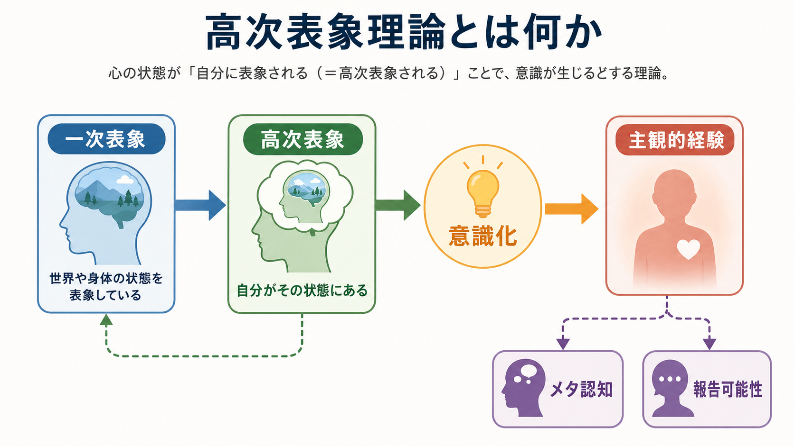
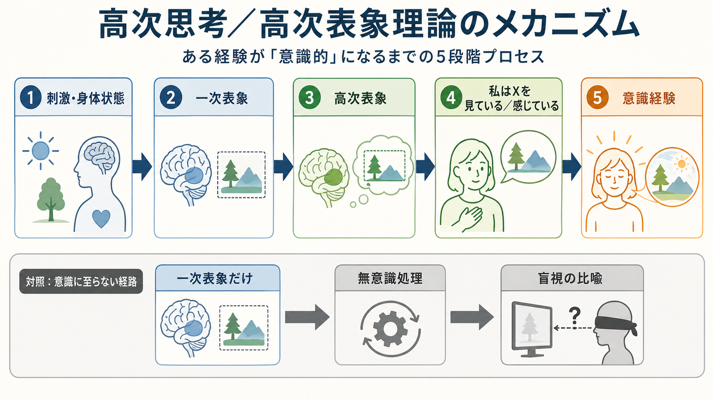

# 高次表象理論とは何か

## 要点

- 高次表象理論は、ある心的状態が意識的になる条件を、その状態そのものの強さだけでなく、「自分がその状態にある」という別の表象によって説明する立場である[1][2]。
- 典型的には、一次表象が世界や身体の状態を表し、高次表象がその一次状態を「自分の心的状態」として表す。この高次表象が成立すると、状態は[[主観的経験は科学的に扱えるのか|主観的経験]]として現れる[3][4]。
- この理論は「意識とは、心の中にもう一人の観察者がいること」ではない。高次表象は小さな自己ではなく、脳内の表象・判断・自己関連処理の一部として理解される[1][5]。
- 研究上は、主観的報告、確信度、[[メタ認知とは何か|メタ認知]]、前頭前野の関与、盲視のような「できるが見えていない」現象と接続して論じられる[4][7]。
- ただし、前頭前野が意識に必須かどうかは現在も論争的であり、後部皮質を重視する立場やグローバルワークスペース理論、統合情報理論などと比較しながら読む必要がある[6][8]。

## この記事で答える問い

1. 高次表象理論は、意識をどのように説明するのか。
2. 一次表象と高次表象は何が違うのか。
3. なぜ「見えている」「痛い」「不安だ」といった経験に自己表象が関わると考えるのか。
4. この理論は、メタ認知、注意、前頭前野、臨床的な意識評価とどのようにつながるのか。

## まず結論

高次表象理論の中心的な考えは、**意識的な心的状態とは、その状態が自分の状態として表象されている心的状態である**、というものである。たとえば、視覚系が赤い点を処理しているだけなら、それは一次表象である。そこに「私は赤い点を見ている」という高次の表象が加わると、その視覚状態は意識経験として現れる、という説明になる[1][2]。

この考え方では、意識は単に入力の鮮明さや神経活動量の問題ではない。重要なのは、心的状態が認知システムの中でどのような位置を取り、自己に帰属されるかである。したがって、高次表象理論は[[メタ認知とは何か|メタ認知]]、確信度判断、報告可能性、[[注意とは何か|注意]]と密接に関係するが、それらと完全に同一ではない[4][5]。

## 背景

意識研究では、「生き物が覚醒しているか」という問題と、「ある心的状態が意識にのぼっているか」という問題を分ける必要がある。高次表象理論が主に扱うのは後者、つまり心的状態の意識性である[1]。

この区別は、日常的にも重要である。私たちは多くの情報を処理しているが、そのすべてを経験しているわけではない。視覚刺激の一部は行動に影響しても、本人は「見えた」と報告しないことがある。高次表象理論は、この差を「一次処理があるかどうか」ではなく、「その一次処理が自己の状態として高次に表象されているかどうか」で説明しようとする[4]。

哲学的には、Rosenthal の高次思考理論が代表的である。この立場では、ある心的状態 M が意識的であるためには、自分が M にあるという高次の思考が、推論ではなく適切な仕方で M に向けられている必要がある[2][3]。近年の認知神経科学では、この考えは前頭前野、メタ認知、信号検出理論、報告課題などと結びつけて再解釈されている[4][5]。

## 基本概念

### 一次表象

一次表象とは、世界、身体、記憶、感情などの対象を直接的に表す心的状態である。視覚であれば「赤い点がある」、身体感覚であれば「胸が締めつけられる」、情動であれば「脅威がある」といった表象がこれにあたる。

一次表象だけでも、行動を導くことはある。たとえば、刺激の位置を当てる、視線を向ける、身体を避けるといった処理は、必ずしも明確な主観的経験を伴わないことがある。このため、高次表象理論では、一次表象の存在だけでは意識経験を十分に説明できないと考える[4]。

### 高次表象

高次表象とは、一次表象そのものを対象にする表象である。より直感的には、「世界がこうである」ではなく、「自分は世界をこう経験している」という形の表象である。

高次表象は、必ずしも言語化された内言や明示的な自己反省である必要はない。Brown, Lau, LeDoux は、高次表象を過度に知的な推論として理解するのは誤解だと整理している。高次状態は認知的に組み立てられるが、毎回「私はいま視覚経験をしている」と文章で考える必要はない[5]。

### 意識化

意識化とは、一次表象が高次表象の対象となり、その状態が「自分にとってどう現れているか」として利用可能になることである。このとき、経験は単なる情報処理ではなく、「見えている」「感じている」「思っている」という主観的様相をもつ。

この説明は、[[トップダウン注意とボトムアップ注意は何が違うのか|トップダウン注意]]と重なる部分がある。注意はどの情報を優先するかに関わり、高次表象はその情報処理が自分の心的状態としてどう表されるかに関わる。両者は相互作用するが、概念としては区別しておく方がよい。

## 仕組み

高次表象理論を最小の流れとして書くと、次のようになる。

1. 刺激や身体状態が生じる。
2. 感覚・情動・記憶などの一次表象が形成される。
3. その一次表象について、「自分がその状態にある」という高次表象が形成される。
4. 高次表象によって、一次状態が主観的経験として意識化される。
5. 必要に応じて、報告、確信度判断、行動選択、記憶への固定化が起こる。

このモデルの強みは、客観的成績と主観的経験のずれを扱いやすい点にある。ある人が刺激の位置を偶然以上に当てられても、「見えた」という経験がなければ、一次表象は行動に使われたが高次表象が十分でなかった、と説明できる[4][7]。

ただし、この説明は「高次表象があれば常に正しい自己理解が生じる」という意味ではない。高次表象は誤りうる。実際には痛みがないのに痛いと感じる、十分見えていないのに見えたと確信する、逆に処理できているのに経験がないと感じる、といったずれが理論上は可能である。この誤表象可能性は、高次表象理論の重要な特徴である[1][5]。

## 図解

図1は、一次表象、高次表象、意識化、主観的経験の関係を概念地図として示している。中心は「心的状態が自分の状態として表象される」という点であり、メタ認知や報告可能性はその周辺に位置づく。

図2は、刺激から意識経験に至る過程を段階的に示している。下段の「一次表象だけ」の経路は、無意識処理や盲視を説明するときの比喩である。これは盲視そのものを単純化した図であり、実際の神経機構を一枚で確定的に示すものではない。

## 臨床・研究との接続

### 意識研究との接続

高次表象理論は、グローバルワークスペース理論や統合情報理論と並ぶ、現代の意識理論の主要候補の一つとして扱われる[6]。とくに、意識的知覚に前頭前野が必要か、あるいは後部皮質の内容表象だけで十分かという論争に関係する。

Odegaard, Knight, Lau は、前頭前野の損傷や活動をめぐる否定的知見だけで前頭前野理論を退けるのは早いと論じ、主観的知覚、メタ認知、報告を分けて検討する必要を強調した[7]。一方で Boly らは、前頭前野活動が報告、課題遂行、注意などの過程を反映している可能性を重視し、意識内容そのものの神経相関は後部皮質により強く関わるかもしれないと論じている[8]。

この論争から分かるのは、高次表象理論を「前頭前野だけが意識を作る理論」と短絡してはいけないということである。むしろ重要なのは、意識経験、報告、自己評価、課題制御をどのように分離して測定するかである。

### メタ認知との接続

高次表象理論は、メタ認知と自然に接続する。自分が見たか、どの程度確信しているか、判断が正しそうかを評価するには、一次判断を対象化する必要がある。この構造は[[メタ認知とは何か|メタ認知]]そのものである。

ただし、両者は同一ではない。高次表象理論は「状態が意識的である条件」を説明しようとする理論であり、メタ認知は「自分の認知状態を評価・制御する機能」を指す。意識経験が成立する最小条件と、正確な確信度判断が成立する条件は分けて考える必要がある[4][5]。

### 臨床・精神医学との接続

臨床的には、高次表象理論は個別の診断や治療方針を直接決める理論ではない。教育・研究上の意義は、患者が「症状をもつ」ことと「その症状をどう経験し、どう自分の状態として理解しているか」を分けて考えやすくする点にある。

たとえば、不安、痛み、離人感、幻覚様体験、病識の問題では、一次的な身体・知覚・情動処理と、それを自分の状態としてどう表象するかがずれることがある。ここで高次表象理論は、主観的経験の構造を考える補助線になる。ただし、臨床判断では問診、行動観察、神経学的評価、文化的背景、生活史を含む多面的評価が必要であり、この理論だけから診断や介入を導くことはできない。

## よくある誤解

### 誤解1: 高次表象理論は「頭の中の小人」を仮定している

高次表象は、内側にもう一人の観察者がいるという意味ではない。表象の対象が世界から心的状態へ一段上がる、という機能的な説明である[1][5]。

### 誤解2: 意識には必ず言語が必要だという理論である

高次思考理論という名称から、言語的な文章を頭の中で唱える必要があるように見えるが、標準的な理解ではそうではない。高次表象は明示的な内言でなくてもよく、非言語的・前言語的な自己状態表象として考えられる[5]。

### 誤解3: 高次表象理論はメタ認知と同じである

近いが同じではない。メタ認知は認知状態の評価や制御を含む広い機能であり、高次表象理論は意識的状態の成立条件を説明する理論である。確信度判断が正確でなくても、何らかの意識経験は成立している場合がありうる。

### 誤解4: 前頭前野が活動すれば意識があると分かる

前頭前野活動は報告、課題ルール、作業記憶、意思決定を反映しうる。したがって、前頭前野の活動を意識そのものと同一視するのは危険である。現在の論点は、意識内容、報告、注意、メタ認知をどう分離するかにある[7][8]。

## 関連ノート

- [[主観的経験は科学的に扱えるのか]]
- [[メタ認知とは何か]]
- [[注意とは何か]]
- [[トップダウン注意とボトムアップ注意は何が違うのか]]

### 関連ノート候補

- グローバルワークスペース理論とは何か
- 統合情報理論とは何か
- 盲視とは何か
- 意識の神経相関とは何か
- 前頭前野と意識はどう関係するのか

## 理解チェック

1. 一次表象と高次表象の違いを、自分の言葉で説明できるか。
2. 「見分けられるが、見えている経験はない」という例が、高次表象理論ではどう説明されるか。
3. 高次表象理論とメタ認知はどこが重なり、どこが異なるか。
4. 前頭前野と意識の関係を考えるとき、なぜ報告や課題遂行との区別が重要なのか。

## 参考文献

[1] Carruthers, P., & Gennaro, R. (2026). Higher-Order Theories of Consciousness. *The Stanford Encyclopedia of Philosophy*. https://plato.stanford.edu/entries/consciousness-higher/

[2] Rosenthal, D. M. (1986). Two concepts of consciousness. *Philosophical Studies, 49*, 329-359. https://doi.org/10.1007/BF00355521

[3] Rosenthal, D. M. (2005). *Consciousness and Mind*. Oxford University Press. https://doi.org/10.1093/oso/9780198236979.001.0001

[4] Lau, H., & Rosenthal, D. (2011). Empirical support for higher-order theories of conscious awareness. *Trends in Cognitive Sciences, 15*(8), 365-373. https://doi.org/10.1016/j.tics.2011.05.009

[5] Brown, R., Lau, H., & LeDoux, J. E. (2019). Understanding the higher-order approach to consciousness. *Trends in Cognitive Sciences, 23*(9), 754-768. https://doi.org/10.1016/j.tics.2019.06.009

[6] Seth, A. K., & Bayne, T. (2022). Theories of consciousness. *Nature Reviews Neuroscience, 23*, 439-452. https://doi.org/10.1038/s41583-022-00587-4

[7] Odegaard, B., Knight, R. T., & Lau, H. (2017). Should a few null findings falsify prefrontal theories of conscious perception? *Journal of Neuroscience, 37*(40), 9593-9602. https://doi.org/10.1523/JNEUROSCI.3217-16.2017

[8] Boly, M., Massimini, M., Tsuchiya, N., Postle, B. R., Koch, C., & Tononi, G. (2017). Are the neural correlates of consciousness in the front or in the back of the cerebral cortex? Clinical and neuroimaging evidence. *Journal of Neuroscience, 37*(40), 9603-9613. https://doi.org/10.1523/JNEUROSCI.3218-16.2017

## 未解決問題

- 高次表象はどの神経回路で実装されるのか。
- 高次表象は意識経験の成立条件なのか、それとも報告や自己評価の条件なのか。
- 乳幼児、動物、言語をもたない状態に高次表象理論をどこまで適用できるのか。
- 意識経験、注意、メタ認知、報告可能性を実験的にどこまで分離できるのか。
