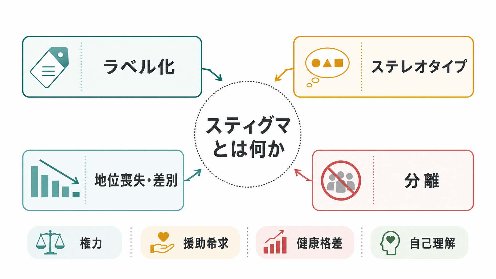
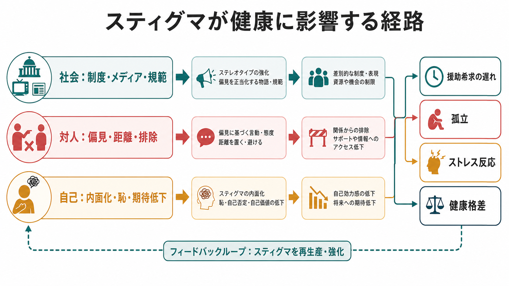

# スティグマとは何か

## 要点

- スティグマとは、ある属性が社会的に「望ましくないもの」として意味づけられ、その人の評価、関係、機会を狭める過程である。
- 重要なのは、スティグマが個人の内面だけでなく、ラベル化、ステレオタイプ、分離、地位喪失、差別、そしてそれを支える権力の組み合わせとして働く点である[1][2]。
- スティグマは、自己理解を傷つけ、援助希求を遅らせ、孤立、慢性的ストレス、医療アクセスの低下を通じて健康格差に関わる[3][4]。
- 精神疾患、障害、感染症、肥満、性的少数者、貧困、前科、依存症など、対象となる属性は多様だが、仕組みには共通する部分がある。
- 臨床・教育・研究で重要なのは、本人の「気にしすぎ」として片づけず、対人関係、制度、文化、メディア表象まで含めて扱うことである。

## この記事で答える問い

1. スティグマは、単なる偏見や悪口と何が違うのか。
2. スティグマは、どのように自己理解や[[自己概念とは何か|自己概念]]へ入り込むのか。
3. なぜスティグマは、相談や受診などの援助希求を遅らせるのか。
4. スティグマを減らすには、個人の意識変化だけで十分なのか。

## まず結論

スティグマは「ある属性をもつ人に対する悪い印象」だけではない。社会がある違いに名前をつけ、その違いを否定的な意味と結びつけ、「私たち」と「あの人たち」を分け、機会や尊厳を奪う一連の過程である[2]。

たとえば、精神疾患に対して「危険」「弱い」「自己責任」といったステレオタイプが共有されると、本人は周囲から距離を置かれやすくなる。同時に、本人自身も「自分は価値が低い」「助けを求めるとさらに評価される」と感じ、相談や受診を先延ばしにすることがある[5][6]。このとき問題は、本人の心の弱さではなく、社会的意味づけが自己理解と行動選択を変えてしまう点にある。

## 背景

スティグマ研究の古典的出発点として、Goffman は、社会的に望ましいとされる基準から外れる属性が、その人の社会的アイデンティティを傷つける状況を分析した[1]。ここでいう属性は、身体的特徴、精神疾患、障害、社会的経歴、集団所属などを含む。重要なのは、属性そのものが自然に「烙印」になるのではなく、社会的文脈の中でその属性に否定的意味が与えられる点である。

その後、Link と Phelan は、スティグマをより社会学的に定義した。彼らによれば、スティグマは、ラベル化、ステレオタイプ化、分離、地位喪失、差別が同時に起こり、それを可能にする権力関係があるときに成立する[2]。この定義は、スティグマを「偏見をもつ個人の問題」だけに縮めず、学校、職場、医療、法律、メディア、地域社会の構造まで見るために有用である。

## 基本概念

### ラベル化

ラベル化とは、連続的で多様な人間の違いに、社会的に目立つ名前を与えることである。診断名、障害名、国籍、性別、職業、学歴、家族背景などは、文脈によって本人理解を助けることもあれば、単純化した分類として働くこともある。

ラベルはそれ自体が悪いわけではない。医療や福祉では、適切なラベルが支援や合理的配慮につながることがある。問題は、ラベルがその人全体を説明するかのように扱われるときである。

### ステレオタイプと偏見

ステレオタイプは、ある集団について共有された単純化された信念である。偏見は、それに感情的評価が結びついた態度である。[[社会的認知とは何か|社会的認知]]の観点では、人は限られた情報から他者を素早く理解しようとするため、カテゴリー化そのものは日常的に起こる。しかし、カテゴリーが硬直し、個人差や文脈を消してしまうと、スティグマを支える認知的土台になる[3]。

### 分離

分離とは、「私たち」と「彼ら」の境界が作られることである。これは物理的距離だけでなく、言葉、冗談、制度、報道、職場慣行にも現れる。「普通の人」と「問題をもつ人」を強く分けるほど、当事者は共同体の一員としてではなく、管理・警戒・同情の対象として扱われやすくなる。

### 地位喪失と差別

地位喪失とは、信頼、雇用機会、教育機会、親密な関係、発言権などが低く見積もられることである。差別は、その低く見積もられた評価が行動や制度として実行されることである。差別は露骨な排除だけでなく、過剰な監視、説明機会の欠如、医療での訴えの軽視、職場での昇進機会の減少など、見えにくい形でも起こる。

## 仕組み

スティグマは、少なくとも三つの水準で働く。

| 水準 | 主な内容 | 影響 |
|---|---|---|
| 社会・制度 | 法制度、医療制度、雇用慣行、メディア表象、学校文化 | 資源、機会、サービスへのアクセスを左右する |
| 対人関係 | からかい、距離、排除、過剰な同情、低い期待 | 孤立、警戒、自己開示の困難を生む |
| 自己理解 | 内面化されたスティグマ、恥、自己効力感の低下 | 援助希求の遅れ、目標低下、回避行動につながる |

Corrigan と Watson は、精神疾患に関するスティグマを、公的スティグマと自己スティグマに分けて整理した[5]。公的スティグマは、社会一般が当事者に向けるステレオタイプ、偏見、差別である。自己スティグマは、本人がそれらの否定的信念を自分に向けてしまう過程である。

自己スティグマは、単に「自信がない」状態とは異なる。周囲の否定的評価を繰り返し経験し、それを予測するようになると、本人は挑戦や相談の前に「どうせ拒否される」「自分には無理だ」と考えやすくなる。これは[[自己効力感とは何か|自己効力感]]や[[自己評価はどのように形成されるのか|自己評価]]にも影響する。

## 図解

上の2枚の図は、スティグマを二つの角度から整理している。

1枚目は、スティグマの概念地図である。ラベル化、ステレオタイプ、分離、地位喪失・差別は、単独ではなく相互に強め合う。そこに権力が加わると、単なる誤解ではなく、機会や資源の不平等として固定されやすくなる[2]。

2枚目は、健康への経路である。スティグマは、制度レベルでは資源や医療アクセスを狭め、対人レベルでは孤立や排除を生み、自己レベルでは恥や期待低下を生む。これらが相談の遅れ、慢性的ストレス、健康格差に接続する[4]。

## 臨床・研究との接続

### 援助希求

精神健康領域では、スティグマは相談や受診を遅らせる要因として研究されている。Clement らの系統的レビューは、精神健康に関するスティグマが援助希求の障壁となりうることを、量的研究と質的研究の両方から整理している[6]。特に、恥、周囲に知られる不安、自己開示への恐れ、支援を受けることへの否定的信念が重要である。

このため、支援場面では「なぜ早く相談しなかったのか」と問うだけでは不十分である。相談しにくくしている社会的意味、家族や職場の反応、医療機関への不信、過去の否定的経験を一緒に見る必要がある。

### 健康格差

Hatzenbuehler らは、スティグマを人口健康格差の根本原因の一つとして捉える枠組みを提案した[4]。スティグマは、心理的ストレスだけでなく、住居、雇用、教育、医療アクセス、社会関係、対処行動など複数の生活領域を通じて健康に影響する。

この視点では、スティグマは「態度の問題」で終わらない。制度がどの属性を不利に扱うか、どの集団が安全なサービスにアクセスしにくいか、どの表象が社会的距離を広げるかが研究対象になる。

### 内面化されたスティグマ

Livingston と Boyd の系統的レビュー・メタ分析は、内面化されたスティグマが心理社会的変数や精神健康上の困難と関連することを整理した[7]。ただし、個別の因果方向は研究デザインに依存するため、「内面化されたスティグマがすべての困難の原因である」と単純化してはいけない。むしろ、症状、社会的排除、低い支援、失敗経験、自己評価が相互に影響する循環として見る必要がある。

### 介入

スティグマ低減介入には、教育、当事者との接触、抗議、制度改革、メディア表象の改善などがある。Mehta らの系統的レビューは、精神健康関連スティグマの中長期的低減について、介入効果の証拠を検討している[8]。一般に、知識提供だけで完結する介入よりも、実際の接触や制度的な行動変化を含む介入の重要性が示唆される。

ただし、接触介入は「当事者に経験を語らせればよい」というものではない。語る側の負担、語られる内容の消費、代表性の問題、組織側の変化の有無を慎重に設計する必要がある。

## よくある誤解

### 誤解1: スティグマは無知だけから生まれる

知識不足は重要な要因だが、スティグマは無知だけでは説明できない。既得権、制度設計、恐怖、道徳的判断、集団境界の維持、メディア表象も関わる。したがって、情報提供だけで十分とは限らない。

### 誤解2: 本人が気にしなければよい

スティグマは、本人の感じ方だけの問題ではない。雇用、医療、教育、家族関係、地域参加に実際の不利益をもたらすことがある。本人が強くあろうとしても、制度や対人関係が変わらなければ負担は残る。

### 誤解3: 診断名やラベルはすべて悪い

ラベルは支援につながることもある。問題は、ラベルが本人全体を決めつける道具になることである。臨床や教育では、ラベルを支援資源への入口として使いながら、その人の生活史、価値観、強み、文脈を消さないことが重要である。

### 誤解4: スティグマ低減はやさしい言葉づかいだけで足りる

言葉づかいは重要だが、それだけでは不十分である。採用、評価、医療アクセス、相談窓口の匿名性、学校や職場での合理的配慮、メディア表象など、行動と制度の変化が必要である。

## 関連ノート

- [[社会的認知とは何か]]
- [[自己概念とは何か]]
- [[自己評価はどのように形成されるのか]]
- [[自己効力感とは何か]]
- [[認知バイアスとは何か]]
- [[心の理論とは何か]]
- [[共感は認知機能としてどう理解できるのか]]
- [[レジリエンスは発達過程でどう育つのか]]

関連ノート候補:

- 偏見とは何か
- 差別とは何か
- 援助希求とは何か
- 自己スティグマとは何か
- 構造的スティグマとは何か
- 社会的排除とは何か

MOC更新候補:

- `content/00_MOC/MOC｜認知科学・心理学.md`
- `content/00_MOC/MOC｜精神医学.md`
- `content/00_MOC/MOC｜倫理・哲学・社会.md`

## 理解チェック

1. スティグマを、単なる偏見ではなく「ラベル化、ステレオタイプ、分離、地位喪失・差別、権力」の組み合わせとして説明できるか。
2. 公的スティグマと自己スティグマの違いを、具体例で説明できるか。
3. スティグマが援助希求を遅らせる経路を、恥、自己開示への不安、医療アクセス、対人関係の観点から説明できるか。
4. スティグマ低減に、知識提供だけでなく接触や制度改革が必要な理由を説明できるか。

## 未解決問題

- どの種類のスティグマ低減介入が、どの集団・文化・制度環境で長期的に有効なのか。
- 内面化されたスティグマ、症状、社会的排除、貧困、孤立の因果方向をどのように分けて測定できるのか。
- 当事者の語りを活用する介入で、語る側の負担と社会的効果をどのように両立させるのか。
- AIやデジタルヘルスの相談窓口は、匿名性によって援助希求を促すのか、それとも新しい形の監視や差別を生むのか。

## 参考文献

[1] Goffman, E. (1963). *Stigma: Notes on the Management of Spoiled Identity*. Prentice-Hall. https://books.google.com/books/about/Stigma.html?id=cfBGAAAAMAAJ

[2] Link, B. G., & Phelan, J. C. (2001). Conceptualizing stigma. *Annual Review of Sociology, 27*, 363-385. https://doi.org/10.1146/annurev.soc.27.1.363

[3] Major, B., & O'Brien, L. T. (2005). The social psychology of stigma. *Annual Review of Psychology, 56*, 393-421. https://doi.org/10.1146/annurev.psych.56.091103.070137

[4] Hatzenbuehler, M. L., Phelan, J. C., & Link, B. G. (2013). Stigma as a fundamental cause of population health inequalities. *American Journal of Public Health, 103*(5), 813-821. https://doi.org/10.2105/AJPH.2012.301069

[5] Corrigan, P. W., & Watson, A. C. (2002). Understanding the impact of stigma on people with mental illness. *World Psychiatry, 1*(1), 16-20. https://pmc.ncbi.nlm.nih.gov/articles/PMC1489832/

[6] Clement, S., Schauman, O., Graham, T., Maggioni, F., Evans-Lacko, S., Bezborodovs, N., Morgan, C., Rüsch, N., Brown, J. S. L., & Thornicroft, G. (2015). What is the impact of mental health-related stigma on help-seeking? A systematic review of quantitative and qualitative studies. *Psychological Medicine, 45*(1), 11-27. https://doi.org/10.1017/S0033291714000129

[7] Livingston, J. D., & Boyd, J. E. (2010). Correlates and consequences of internalized stigma for people living with mental illness: A systematic review and meta-analysis. *Social Science & Medicine, 71*(12), 2150-2161. https://doi.org/10.1016/j.socscimed.2010.09.030

[8] Mehta, N., Clement, S., Marcus, E., Stona, A.-C., Bezborodovs, N., Evans-Lacko, S., Palacios, J., Docherty, M., Barley, E., Rose, D., Koschorke, M., Shidhaye, R., Henderson, C., & Thornicroft, G. (2015). Evidence for effective interventions to reduce mental health-related stigma and discrimination in the medium and long term: Systematic review. *The British Journal of Psychiatry, 207*(5), 377-384. https://doi.org/10.1192/bjp.bp.114.151944
