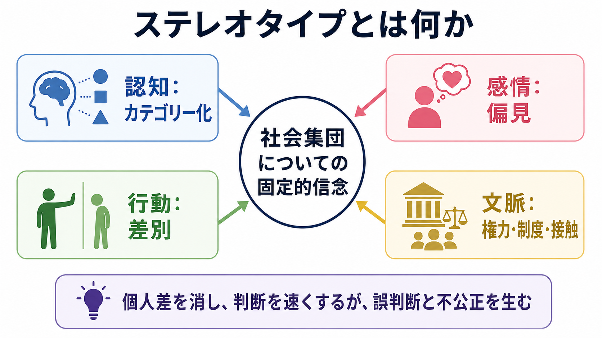
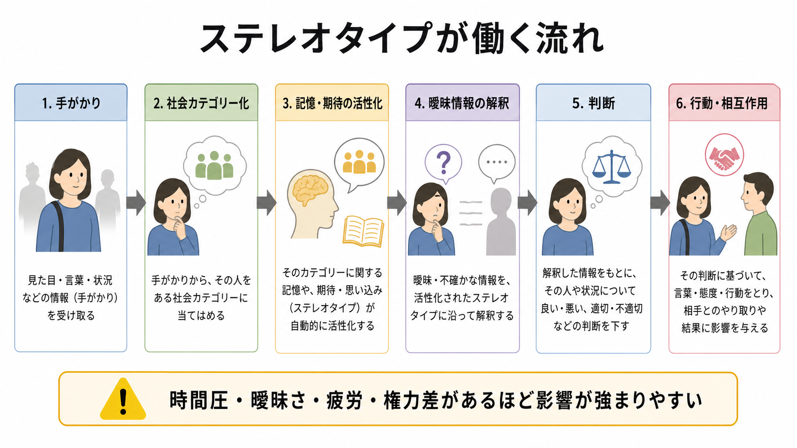

# ステレオタイプとは何か

## 要点

- ステレオタイプとは、性別、年齢、職業、民族、障害、疾患、地域、所属組織などの「社会集団」について、人がもつ一般化された信念や期待である。
- それは必ずしも露骨な敵意とは限らず、好意的・中立的に見える内容でも、個人差を見えにくくし、判断や機会配分をゆがめることがある。
- ステレオタイプは[[認知バイアスとは何か|認知バイアス]]、[[社会的認知とは何か|社会的認知]]、[[自動化された認知処理とは何か|自動化された認知処理]]と深く関わる。
- 重要なのは「誰が悪い信念をもっているか」だけでなく、どの場面でカテゴリー化が起こり、どの制度や相互作用がそれを強めるかを見ることである。

## この記事で答える問い

- ステレオタイプ、偏見、差別は何が違うのか。
- ステレオタイプは、なぜ素早く働き、なぜ修正されにくいのか。
- ステレオタイプは、判断、行動、学習、臨床・研究場面にどう影響するのか。
- ステレオタイプを扱うとき、どのような誤解を避けるべきか。

## まず結論

ステレオタイプは「社会集団についての固定的信念」であり、複雑な対人情報を素早く処理するためのカテゴリー化として働く。しかし、その速さは、個人差の見落とし、曖昧な情報の偏った解釈、記憶の選択、評価や資源配分の不公平につながりうる。したがって、ステレオタイプは単なる「間違った思い込み」ではなく、認知処理、感情、行動、社会構造が接続する地点として理解する必要がある[1][2]。

## 背景

「ステレオタイプ」という語は、もともと印刷技術で使われた「型」を意味する言葉だった。社会心理学では、Walter Lippmann が『Public Opinion』で、人々が直接経験できない広い世界を、報道、伝聞、想像、既存の心的イメージを通して理解する過程を論じたことが重要な出発点になった[1]。ここでのポイントは、人は世界をそのまま見ているのではなく、すでにもっているカテゴリーや期待を通して世界を切り取る、という点である。

その後の社会心理学では、ステレオタイプは偏見や差別と区別して扱われるようになった。大まかには、ステレオタイプは「認知的成分」、偏見は「感情的・評価的成分」、差別は「行動的成分」と整理できる[8]。ただし現実には、これらは分離して存在するのではなく、互いに強め合う。

## 基本概念

### ステレオタイプ

ステレオタイプは、ある集団の成員に共通するとみなされる特徴、能力、性格、役割、危険性、適性などについての信念である。たとえば「高齢者は新しい技術が苦手」「女性は共感的」「特定の職業の人は冷たい」といった一般化が含まれる。内容が好意的に見えても、個人を集団カテゴリーに閉じ込めるなら、機会や評価をゆがめる。

### 偏見

偏見は、集団に対する好悪、恐れ、嫌悪、同情、軽視などの評価的・感情的反応である。ステレオタイプが「何を信じているか」に近いのに対し、偏見は「どう感じ、どう評価するか」に近い。神経科学的研究では、偏見やステレオタイプは単一の脳部位ではなく、評価、情動、自己制御、社会的推論に関わる複数の機能ネットワークとして理解される[7]。

### 差別

差別は、集団カテゴリーにもとづく異なる扱いである。採用、教育、医療、司法、対人関係、研究参加者への接し方など、行動と制度のレベルで現れる。個人が明示的な悪意をもたなくても、手続き、慣行、評価基準、環境の手がかりが偏った結果を生むことがある[6][8]。

## 仕組み

### 1. カテゴリー化が情報処理を節約する

人は対人場面で、顔、言葉、服装、所属、肩書き、状況などの手がかりから相手を理解しようとする。カテゴリー化は、情報量を減らし、予測を速くするための[[ヒューリスティックとは何か|ヒューリスティック]]として働く。Macrae と Bodenhausen のレビューは、社会カテゴリーがいつ活性化され、どのような結果をもち、どの程度制御できるかを、社会的認知の中心問題として整理している[3]。

### 2. 活性化された信念が曖昧な情報を解釈する

ステレオタイプは、特に情報が曖昧なときに影響しやすい。たとえば同じ発言が、ある相手には「自信」、別の相手には「攻撃的」と解釈されることがある。これは[[帰属理論とは何か|帰属]]や記憶とも関係し、ステレオタイプに合う情報は目立ち、思い出されやすく、反例は「例外」として処理されやすい[2][3]。

### 3. 自動処理と制御処理がずれる

Devine の古典的研究は、文化的ステレオタイプの知識が自動的に活性化される可能性と、それに従うかどうかを制御する過程を区別した[4]。これは「偏見のある人だけがステレオタイプをもつ」という単純な見方を修正する。重要なのは、活性化そのものと、発言・判断・行動として表出させるかどうかを分けて考えることである。

### 4. 内容は「温かさ」と「有能さ」に整理されやすい

ステレオタイプ内容モデルは、多くの集団イメージが「温かさ」と「有能さ」という2軸で整理されることを示した[5]。たとえば、ある集団は「有能だが冷たい」、別の集団は「温かいが無能」といった混合的ステレオタイプを受けることがある。この枠組みは、好意的に聞こえるステレオタイプも、保護、排除、軽視、監視などの行動と結びつく点を理解する助けになる。

### 5. ステレオタイプ脅威が当事者の遂行を変える

ステレオタイプは、見る側の判断だけでなく、見られる側の遂行にも影響する。Steele と Aronson は、否定的ステレオタイプを確認してしまうかもしれないという状況的脅威が、テスト成績に影響しうることを示した[6]。これは能力そのものの欠如ではなく、評価場面の意味づけ、緊張、注意資源、[[ワーキングメモリとは何か|ワーキングメモリ]]負荷などを通じた影響として理解できる。

## 図解

| 観点 | 典型的な問い | ステレオタイプの働き |
|---|---|---|
| 認知 | どのカテゴリーとして相手を見るか | 情報を節約するが、個人差を圧縮する |
| 感情 | その集団をどう評価するか | 好意、恐れ、嫌悪、同情、軽視と結びつく |
| 行動 | どのように扱うか | 発言、距離、評価、採用、配分、支援の差につながる |
| 制度 | どの手続きが影響を増幅するか | 評価基準、慣行、環境の手がかりが不平等を再生産する |
| 当事者 | どう見られていると感じるか | ステレオタイプ脅威、自己監視、疲労、回避に関わる |

## 臨床・研究との接続

臨床場面では、診断名、年齢、性別、社会経済的背景、発達特性、精神疾患、身体疾患、服薬歴などが、本人の語りの解釈に影響する可能性がある。これは「臨床家が偏っている」と責めるための概念ではなく、限られた時間で判断する専門的場面ほど、カテゴリー化の利点と危険が同時に増すという問題である。教育・研究目的の記述として、個別の診断や治療方針は、本人の状況、標準化された評価、複数情報源、文化的文脈を踏まえて慎重に扱う必要がある。

研究場面では、ステレオタイプは測定と解釈の両方に関わる。質問紙、IAT などの潜在指標、行動観察、実験課題、制度的アウトカムを組み合わせることで、個人の態度だけでなく、状況や集団レベルの偏りを検討できる[7]。ただし、潜在指標を「個人の本心を完全に読む道具」とみなすのは過剰解釈であり、信頼性、予測妥当性、文脈依存性を区別する必要がある。

## よくある誤解

### 誤解1: ステレオタイプはすべて明示的な悪意である

ステレオタイプは、本人が意識的に支持していなくても、文化的知識や環境の手がかりとして活性化されることがある[4]。そのため、対策は「悪意のある人を探す」だけでは不十分で、判断手続き、フィードバック、評価基準、集団間接触の質を設計する必要がある。

### 誤解2: ポジティブなステレオタイプなら問題ない

「勤勉」「優しい」「数学が得意」などの好意的に見える一般化も、個人への過剰期待、役割の固定、失敗の許されにくさ、例外者への排除を生むことがある。ポジティブかネガティブかだけでなく、本人の選択肢を狭めていないかを見る必要がある。

### 誤解3: 事実に少し合っていれば使ってよい

集団平均に関する統計的情報があったとしても、目の前の個人については不確実性が大きい。さらに、既存の不平等が測定値を作っている場合、平均差をそのまま本質的差異として扱うと、制度的な偏りを再生産する。

### 誤解4: ステレオタイプをなくすには、カテゴリーを一切見なければよい

カテゴリーを完全に見ないことは現実的でないうえ、差別や格差の検出を難しくする場合がある。より実践的なのは、カテゴリー化が起こる場面を自覚し、判断を遅らせ、基準を明示し、反証情報を探し、複数の視点で検討することである。

## 関連ノート

- [[認知バイアスとは何か]]
- [[社会的認知とは何か]]
- [[自動化された認知処理とは何か]]
- [[ヒューリスティックとは何か]]
- [[帰属理論とは何か]]
- [[意思決定とは何か]]
- [[ワーキングメモリとは何か]]
- [[抑制制御とは何か]]

### 今後の作成候補

- 偏見とは何か
- 差別とは何か
- ステレオタイプ脅威とは何か
- 潜在連合テストとは何か
- 内集団バイアスとは何か
- 社会的アイデンティティ理論とは何か

### MOC更新候補

- `content/00_MOC/` 配下の認知科学・心理学系 MOC
- 社会心理学・発達心理学に関する MOC がある場合、本記事を追加候補にする

## 理解チェック

1. ステレオタイプ、偏見、差別を、それぞれ「認知」「感情」「行動」の観点から説明できるか。
2. ステレオタイプが曖昧な情報の解釈に影響する例を、自分の専門領域から1つ挙げられるか。
3. 「ポジティブなステレオタイプ」でも問題になりうる理由を説明できるか。
4. ステレオタイプ脅威が、能力そのものではなく遂行場面を変える仕組みを説明できるか。
5. 臨床・教育・研究の場面で、判断手続きをどう設計すればステレオタイプの影響を減らせるか。

## 参考文献

[1] Lippmann, W. (1922). *Public Opinion*. Harcourt, Brace and Company. Project Gutenberg. https://www.gutenberg.org/ebooks/6456

[2] Hilton, J. L., & von Hippel, W. (1996). Stereotypes. *Annual Review of Psychology, 47*, 237-271. https://doi.org/10.1146/annurev.psych.47.1.237

[3] Macrae, C. N., & Bodenhausen, G. V. (2000). Social cognition: Thinking categorically about others. *Annual Review of Psychology, 51*, 93-120. https://doi.org/10.1146/annurev.psych.51.1.93

[4] Devine, P. G. (1989). Stereotypes and prejudice: Their automatic and controlled components. *Journal of Personality and Social Psychology, 56*(1), 5-18. https://doi.org/10.1037/0022-3514.56.1.5

[5] Fiske, S. T., Cuddy, A. J. C., Glick, P., & Xu, J. (2002). A model of (often mixed) stereotype content: Competence and warmth respectively follow from perceived status and competition. *Journal of Personality and Social Psychology, 82*(6), 878-902. https://doi.org/10.1037/0022-3514.82.6.878

[6] Steele, C. M., & Aronson, J. (1995). Stereotype threat and the intellectual test performance of African Americans. *Journal of Personality and Social Psychology, 69*(5), 797-811. https://doi.org/10.1037/0022-3514.69.5.797

[7] Amodio, D. M. (2014). The neuroscience of prejudice and stereotyping. *Nature Reviews Neuroscience, 15*, 670-682. https://doi.org/10.1038/nrn3800

[8] Dovidio, J. F., Hewstone, M., Glick, P., & Esses, V. M. (Eds.). (2010). *The SAGE Handbook of Prejudice, Stereotyping and Discrimination*. SAGE. https://doi.org/10.4135/9781446200919
