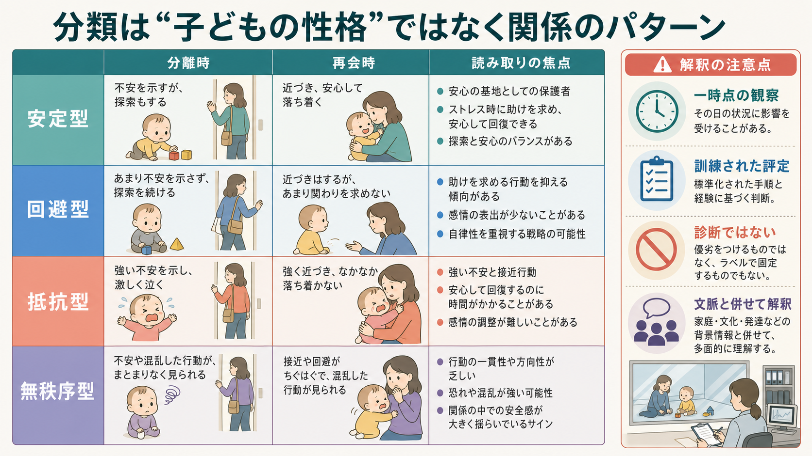
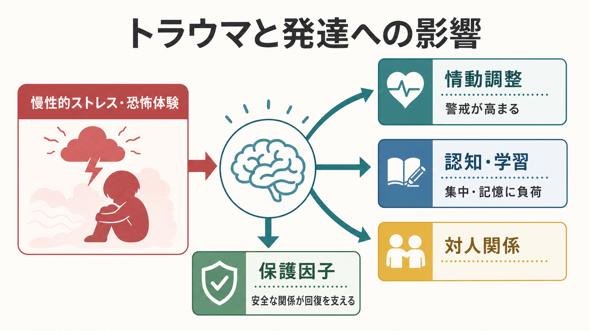
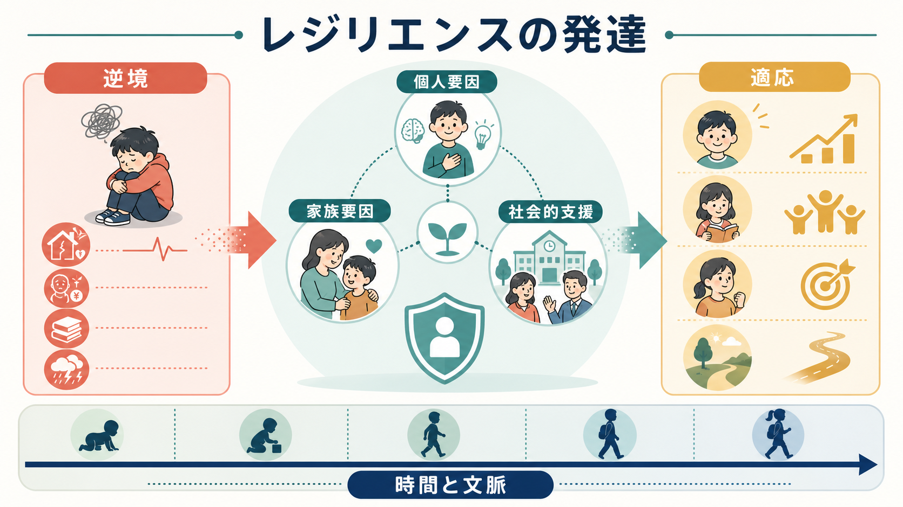

# ストレンジシチュエーション法とは何か

## 要点

- ストレンジシチュエーション法は、12〜20か月頃の乳幼児と養育者の関係を、短い分離と再会の場面で観察する代表的な愛着研究手法である[1][6]。
- 重要なのは「泣くかどうか」だけではなく、養育者を安全基地として使えるか、再会時に接近・接触・回避・抵抗がどう組み合わさるかである[1][2]。
- 分類は、安定型、回避型、抵抗型、のちに追加された無秩序型を中心に扱われる[1][3]。
- これは子どもの性格診断ではなく、特定の養育者との関係が標準化場面でどう表れるかを、訓練された評定者が読む研究手続きである[3][7]。

## この記事で答える問い

- ストレンジシチュエーション法は何を測ろうとしているのか。
- どのような手続きで、どの行動を観察するのか。
- 愛着分類は、研究や臨床でどこまで使えるのか。
- よくある誤解をどう避ければよいのか。

## まず結論

ストレンジシチュエーション法は、乳幼児に適度な不安を生じさせる短い実験室手続きによって、養育者への接近、探索、慰められやすさ、回避、抵抗、行動のまとまりを観察する方法である。Ainsworth らのボルチモア縦断研究に基づき、乳幼児の愛着関係を体系的に分類する道具として発展した[1]。

ただし、この方法が示すのは「この子はこういう性格である」という固定的なラベルではない。観察されるのは、特定の養育者との関係のなかで、愛着システムがストレス場面にどう組織化されるかである[2][7]。そのため、個別の診断、虐待の断定、将来の病理予測として単独で使うことは避ける必要がある[7]。

## 背景

愛着理論では、乳幼児は危険や不安が高まると養育者への接近を求め、安心が回復すると環境を探索しやすくなると考える。Bowlby の理論では、この仕組みは単なる依存ではなく、保護者への近接を調整する行動システムとして位置づけられた[8]。

Ainsworth らは、自然観察と実験室観察を組み合わせ、乳幼児が養育者を「安全基地」として使う様子に注目した。ストレンジシチュエーション法は、その安全基地機能を短時間で観察できるように設計された手続きである[1]。ここで重要なのは、分離そのものではなく、分離によって愛着システムが活性化されたあと、再会時にどのように調整されるかである。

## 基本概念

### 安全基地

安全基地とは、養育者がいることで乳幼児が環境を探索しやすくなり、不安や疲労が高まったときには戻って安心を得られる関係上の機能である[1][8]。ストレンジシチュエーション法では、見知らぬ部屋、見知らぬ人、養育者の退室によって探索と接近のバランスが揺さぶられる。

### 愛着システム

愛着システムは、不安、疲労、痛み、見知らぬ状況などで活性化し、養育者への接近や接触を促す。安心が回復すれば、探索や遊びに戻る余地が生まれる。したがって、観察の焦点は「泣いたか」ではなく、「不安が上がったあと、養育者を使って調整できるか」にある[1][2]。

### 分類は関係パターンである

分類は乳幼児の内面を直接読むものではない。安定型、回避型、抵抗型、無秩序型は、特定の手続きにおける行動パターンであり、養育者との関係、手続きの文脈、子どもの発達状態を踏まえて解釈する必要がある[3][7]。

## 仕組み

標準的な手続きは、約20分のなかで8つの短いエピソードを進める。典型的には、乳幼児と養育者が実験室に入り、乳幼児が玩具を探索し、見知らぬ人が入室し、養育者が短時間退室し、再会し、さらにもう一度分離と再会が行われる[1][6]。

| 場面 | 何が起こるか | 観察の焦点 |
|---|---|---|
| 導入 | 養育者と乳幼児が部屋に入る | 新奇場面で探索を始められるか |
| 養育者同席 | 養育者がいる状態で遊ぶ | 安全基地としての利用 |
| 見知らぬ人 | 見知らぬ人が入室する | 警戒、探索、養育者参照 |
| 第1分離 | 養育者が退室する | 不安、探索低下、泣き |
| 第1再会 | 養育者が戻る | 接近、接触維持、慰められやすさ |
| 第2分離 | 養育者が再び退室する | ストレスの増加 |
| 見知らぬ人再入室 | 見知らぬ人が戻る | 養育者でない相手への反応 |
| 第2再会 | 養育者が戻る | 愛着分類の中心的手がかり |

最も重視されるのは再会場面である。安定型では、乳幼児は不安を示しても養育者に接近し、慰められると探索へ戻りやすい。回避型では、養育者への接近や接触を抑え、表面的には平静に見えることがある。抵抗型では、接近を求めながら怒りや抵抗が強く、慰められにくい。無秩序型では、接近と回避の矛盾、凍りつき、動作の中断、養育者への恐れを示す行動などが観察されることがある[1][3][4]。

## 図解

ストレンジシチュエーション法の核心は、次の流れとして理解するとよい。

1. 見知らぬ部屋と見知らぬ人によって、軽い不確実性が生まれる。
2. 養育者がいるとき、乳幼児は探索と養育者参照を行う。
3. 養育者の退室によって、愛着システムが活性化する。
4. 養育者の再入室によって、乳幼児がどのように接近し、慰められ、探索へ戻るかが見える。
5. この行動のまとまりから、関係パターンとして分類する。

## 臨床・研究との接続

研究では、ストレンジシチュエーション法は愛着の個人差を標準化して扱うための基準点になってきた。文化間メタ分析では、安定型が多くのサンプルで見られる一方、回避型や抵抗型の割合には文化差やサンプル差があることが示され、分類を単純な普遍的序列として読まない重要性が示された[5]。

縦断研究では、乳幼児期の愛着はその後の社会的能力や情動調整と関連するが、発達は非線形であり、家族環境、ストレス、支援、後の経験によって変化しうる[2]。メタ分析でも、早期愛着は社会的適応や外在化問題などと関連する一方、その効果は決定論的ではなく、測定モデルや媒介・調整要因を検討する必要があるとされる[6]。

臨床や福祉実践との接続では、より慎重さが必要である。無秩序型はリスク理解に役立つことがあるが、単独で虐待、精神疾患、親子関係の失敗を示すものではない[7]。教育・研究目的で使う場合も、[[観察学習とは何か]]や[[自己制御とは何か]]のような行動観察・調整過程の概念と接続しつつ、個別判断に飛びつかないことが重要である。

## よくある誤解

### 誤解1: 泣く子は不安定型である

泣きは重要な手がかりだが、分類を決める唯一の指標ではない。安定型の乳幼児も分離で泣くことがある。むしろ再会時に養育者へ接近し、慰められ、探索へ戻れるかが重要である[1]。

### 誤解2: 回避型は不安が少ない

回避型は外見上落ち着いて見えることがあるが、それは不安がないことを意味しない。接近や接触を抑制する行動方略として理解される[1][2]。

### 誤解3: 無秩序型は虐待の証拠である

無秩序型は虐待リスクと関連しうるが、虐待を単独で証明するものではない。養育者の未解決の喪失やトラウマ、社会経済的リスク、子どもの状態、手続き上の要因など、複数の経路が関与しうる[7]。

### 誤解4: 分類は一生変わらない

愛着分類は発達上の重要な情報を含むが、固定的な運命ではない。縦断研究は連続性と変化の両方を示しており、発達は関係、環境、支援のなかで組織化され直す[2][6]。

### 誤解5: 臨床場面でそのまま診断に使える

ストレンジシチュエーション法は、訓練された評定者が標準化手続きで用いる研究法である。通常の面接や短時間観察で「この子は無秩序型」と断定する使い方は不適切である[7]。

## 関連ノート

- [[観察学習とは何か]]: 行動観察と学習の接点を考えるための関連ノート。
- [[自己制御とは何か]]: 再会後の情動調整を広い制御過程として理解するための関連ノート。
- [[自己と他者はどのように区別されるのか]]: 乳幼児の対人発達と自己他者区別を接続するための関連ノート。
- [[恐怖条件づけとは何か]]: 不安・恐怖反応の学習と、愛着場面のストレス反応を区別して考えるための関連ノート。

今後の作成候補: 「愛着理論とは何か」「安全基地とは何か」「無秩序型愛着とは何か」「乳幼児の情動調整とは何か」「Bowlby の愛着理論とは何か」。

MOC更新候補: `content/00_MOC/MOC｜認知科学・心理学.md`、および発達・愛着領域の MOC を後続の統合ジョブで更新する。

## 理解チェック

1. ストレンジシチュエーション法で、分離場面より再会場面が重視されるのはなぜか。
2. 安定型、回避型、抵抗型、無秩序型は、それぞれ何を直接表しているのか。
3. 「無秩序型=虐待の証拠」と言えない理由は何か。
4. この手続きを臨床診断として単独使用してはいけない理由は何か。

## 参考文献

[1] Ainsworth, M. D. S., Blehar, M. C., Waters, E., & Wall, S. (1978/2015). *Patterns of Attachment: A Psychological Study of the Strange Situation*. Psychology Press. https://doi.org/10.4324/9781315802428

[2] Sroufe, L. A. (2005). Attachment and development: A prospective, longitudinal study from birth to adulthood. *Attachment & Human Development, 7*(4), 349-367. https://doi.org/10.1080/14616730500365928

[3] Main, M., & Solomon, J. (1990). Procedures for identifying infants as disorganized/disoriented during the Ainsworth Strange Situation. In M. T. Greenberg, D. Cicchetti, & E. M. Cummings (Eds.), *Attachment in the Preschool Years: Theory, Research, and Intervention* (pp. 121-160). University of Chicago Press.

[4] Duschinsky, R. (2015). The emergence of the disorganized/disoriented attachment classification, 1979-1982. *History of Psychology, 18*(1), 32-46. https://doi.org/10.1037/a0038524

[5] van IJzendoorn, M. H., & Kroonenberg, P. M. (1988). Cross-cultural patterns of attachment: A meta-analysis of the Strange Situation. *Child Development, 59*(1), 147-156. https://doi.org/10.2307/1130396

[6] Groh, A. M., Fearon, R. M. P., van IJzendoorn, M. H., Bakermans-Kranenburg, M. J., & Roisman, G. I. (2017). Attachment in the early life course: Meta-analytic evidence for its role in socioemotional development. *Child Development Perspectives, 11*(1), 70-76. https://doi.org/10.1111/cdep.12213

[7] Granqvist, P., Sroufe, L. A., Dozier, M., Hesse, E., Steele, M., van IJzendoorn, M., Solomon, J., Schuengel, C., et al. (2017). Disorganized attachment in infancy: A review of the phenomenon and its implications for clinicians and policy-makers. *Attachment & Human Development, 19*(6), 534-558. https://doi.org/10.1080/14616734.2017.1354040

[8] Bowlby, J. (1969/1982). *Attachment and Loss, Vol. 1: Attachment* (2nd ed.). Basic Books. https://books.google.com/books/about/Attachment_and_Loss_Attachment.html?id=aU3uAAAAMAAJ

## 未解決問題

- 日本語圏の家庭・保育文脈で、ストレンジシチュエーション法の分類をどう文化的に解釈するか。
- 愛着分類と気質、神経発達特性、養育環境をどのように分離して評価するか。
- 研究用分類を、家族支援や予防的介入にどのように誤用なく橋渡しするか。
