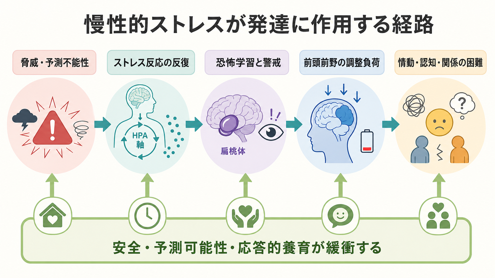

# トラウマは発達にどう影響するのか

## 要点

- 発達期のトラウマは、単発の出来事だけでなく、慢性的な恐怖、予測不能性、虐待、ネグレクト、家庭内暴力、喪失、差別、避難生活などが重なる経験として理解する必要がある。
- 影響は「脳が壊れる」という単純な話ではない。危険を早く察知し、生き延びるための適応が、学校・家庭・友人関係など別の文脈では過剰警戒、集中困難、感情爆発、回避、対人不信として現れることがある [1][2]。
- 重要な経路は、ストレス反応、恐怖学習、情動調整、[[実行機能とは何か|実行機能]]、[[ワーキングメモリとは何か|ワーキングメモリ]]、[[愛着とは何か|愛着]]、[[社会的認知とは何か|社会的認知]]の相互作用である [3][4][5]。
- トラウマ経験があるから必ず病気になるわけではない。安全で予測可能な関係、応答的な養育、学校・地域の支援、本人の意味づけ直しは、発達経路を変えうる保護因子である [1][6]。
- 本記事は教育・研究目的の整理であり、個別の診断や治療方針を決めるものではない。

## この記事で答える問い

1. 発達期のトラウマは、なぜ情動調整・認知・対人関係にまたがって影響するのか。
2. 慢性的ストレスや恐怖体験は、ストレス反応、恐怖学習、前頭前野の調整機能にどのように関わるのか。
3. 「トラウマの影響」と「本人の性格」「努力不足」「単なる反抗」はどう区別して考えるべきか。
4. 臨床・教育・研究では、どのような見方が役に立つのか。

## まず結論

トラウマは、発達中の子どもが「世界は安全か」「自分は助けを求められるか」「他者は予測可能か」「感情は調整できるか」を学ぶ条件を変える。危険が反復され、支えてくれる大人が不足すると、身体はすばやく警戒し、脳は脅威の手がかりを優先し、関係性は防衛的になりやすい。これは怠けやわがままではなく、危険な環境への学習された適応として理解できる [1][3]。

ただし、影響は一方向ではない。年齢、時期、経験の種類、持続期間、遺伝的・身体的条件、養育者や教師との関係、文化的背景、介入の有無によって経路は変わる。発達とは固定された結果ではなく、[[発達とは何か|発達]]の各時点で環境と相互作用しながら再編成される過程である。

## 背景

「発達期のトラウマ」は、成人の外傷体験を小さくしたものではない。子どもは、身体、脳、言語、感情、自己理解、対人関係を同時に形成している。したがって、恐怖や慢性的ストレスは、出来事の記憶だけでなく、注意の向け方、眠り、身体感覚、学習への集中、助けを求める行動、他者への期待に入り込む。

公衆衛生研究では、虐待、ネグレクト、家庭内の機能不全などの小児期逆境体験が、成人期の身体疾患、精神的困難、健康リスク行動と段階的に関連することが示された [2]。ただし、ACE 研究は集団レベルの関連を示すものであり、個人の未来を決める検査ではない。高い逆境負荷があっても、その後の支援や関係性によって経過は大きく異なる。

発達神経科学では、逆境を一枚岩に扱うよりも、「脅威」と「剥奪」を区別する見方が有用である。脅威は暴力や恐怖のように身体的・心理的安全を脅かす経験であり、恐怖学習や脅威検出に強く関わる。剥奪は言語、応答、認知的刺激、安定した関係など、発達に期待される入力が不足する経験であり、言語・認知・社会的学習の機会に影響しやすい [3][4]。

## 基本概念

### トラウマ

トラウマとは、本人の対処能力を超える脅威や喪失が、身体反応、記憶、感情、自己感、対人関係に持続的な影響を残す経験である。発達期では、出来事そのものに加えて「その後に安心を回復できたか」が重要になる。怖い出来事があっても、信頼できる大人が気づき、説明し、守り、生活の予測可能性を回復できれば、影響は緩衝されやすい [1]。

### 毒性ストレス

毒性ストレスとは、強いストレス反応が長く続き、それを緩衝する大人の支えが乏しい状態を指す。短期的なストレスは学習や適応に必要なこともあるが、反復する恐怖や不安定さが続くと、覚醒、睡眠、注意、情動調整、身体症状に負荷がかかる [1]。

### 発達性トラウマ

発達性トラウマは、養育者や身近な環境との関係のなかで反復する脅威・恐怖・無視・予測不能性が、子どもの情動調整、自己感、関係性、学習に広く影響する状態を説明するための臨床的概念である [7]。これは単一の診断名として固定的に使うより、発達課題と環境条件を同時に見るためのレンズとして使うと有用である。

## 仕組み

### 1. ストレス反応が反復される

危険を感じると、身体は交感神経系や HPA 軸を通じて覚醒し、逃げる・固まる・助けを求める準備をする。これは本来、命を守る反応である。しかし、危険が家庭や学校など日常環境に埋め込まれていると、反応は一時的ではなくなる。安全な場面でも身体が警戒を解けず、些細な音、表情、沈黙、叱責の気配に過敏に反応することがある [1][5]。

この状態では、[[内受容感覚とは何か|内受容感覚]]も重要になる。心拍、胃の違和感、筋緊張、息苦しさが「何か危ない」という予測と結びつくと、本人にも理由が分からない不安、怒り、回避として現れる。

### 2. 恐怖学習が強まり、脅威の手がかりが目立つ

トラウマ経験は、[[恐怖条件づけとは何か|恐怖条件づけ]]を通じて、特定の声色、場所、匂い、時間帯、表情を危険の手がかりとして学習させる。こうした学習は危険な環境では合理的だが、安全な環境に移っても自動的に消えるとは限らない [3][4]。

その結果、注意は学習課題よりも脅威検出に向きやすくなる。授業中に集中しにくい、教師の中立的な表情を怒りとして読む、友人の冗談を攻撃として受け取る、といった形で現れることがある。これは「認知の弱さ」だけでなく、脅威を優先する学習の結果として理解できる。

### 3. 前頭前野の調整負荷が増える

情動が高まったときに行動を止め、別の解釈を探し、言葉で説明し、先の結果を考えるには、前頭前野を含む調整ネットワークが関わる。慢性的な警戒状態では、この調整資源が常に消費されやすい。結果として、[[抑制制御とは何か|抑制制御]]、計画、待つこと、切り替え、課題への持続的注意が難しくなる [4][5]。

ここで重要なのは、実行機能の困難を「能力がない」と短絡しないことである。同じ子どもでも、安全で予測可能な場面では落ち着いて考えられる一方、評価、叱責、対人葛藤、身体疲労が重なると急に調整が難しくなることがある。

### 4. 愛着と対人予測が変わる

子どもは、苦痛のときに誰が来てくれるか、助けを求めると何が起こるかを、日々の相互作用から学ぶ。応答的な養育は、子どもに「困ったときに近づいてよい」「感情は調整できる」「他者は完全ではないが頼れることがある」という予測を与える。逆に、脅威や無視が身近な大人から来る場合、近づきたい相手が同時に怖い相手にもなり、関係性の学習が複雑になる [6][7]。

そのため、発達期のトラウマは対人関係に二重の影響を与える。人を避ける、過度に合わせる、相手の機嫌を読みすぎる、親密さに強い不安を感じる、助けを求める前に諦める、といった行動は、関係性のなかで学習された防衛として理解できる。

## 図解

| 図 | 何を示すか | 本文での使い方 |
|---|---|---|
| 概念地図 | 慢性的ストレス・恐怖体験が情動調整、認知・学習、対人関係、保護因子に分かれて影響する全体像 | 「まず結論」の後に配置し、記事全体の見取り図として読む |
| メカニズム図 | 脅威・予測不能性からストレス反応、恐怖学習、前頭前野の調整負荷、情動・認知・関係の困難へ至る経路 | 「仕組み」の後半に配置し、因果を断定せず作用経路として読む |

## 臨床・研究との接続

臨床では、トラウマの影響を「症状のリスト」だけでなく、発達課題との関係で見る必要がある。幼児期なら分離不安、睡眠、癇癪、身体症状として現れやすい。学童期なら集中困難、学習のつまずき、友人関係の衝突、身体化として見えることがある。思春期では、自己評価、衝動性、解離、リスク行動、親密な関係の難しさとして表面化することがある [5][7]。

研究では、単に「トラウマあり・なし」で比べるだけでは不十分である。経験の種類、時期、頻度、持続期間、加害者との関係、剥奪と脅威の区別、社会経済的条件、文化、保護因子を測定する必要がある [3][4]。また、脳画像や生理指標の差を見つけても、それを個人の診断や将来予測にそのまま使えるわけではない。

支援では、まず安全と予測可能性を回復することが中心になる。NICE の PTSD ガイドラインは、子ども・若者の PTSD や臨床的に重要な症状に対して、年齢や時期に応じたトラウマ焦点化 CBT を推奨している [8]。ただし、実際の支援では、生活環境、家族支援、学校調整、身体症状、睡眠、併存する困難を含めて多面的に見る必要がある。

## よくある誤解

### 誤解1: トラウマがある人は一生変われない

これは誤りである。発達期の逆境はリスクを高めるが、発達はその後も続く。安全な関係、安定した生活リズム、心理社会的支援、教育環境の調整、本人が経験を語れる場は、経路を変える可能性がある [1][6]。[[レジリエンスは学習されるのか|レジリエンス]]は、個人の根性ではなく、関係と環境に支えられる過程として考える方がよい。

### 誤解2: 問題行動は本人の性格で説明できる

反抗、回避、怒り、無表情、嘘、過度な従順さは、単に性格として片づけると背景を見落とす。もちろん、すべての困難がトラウマに由来するわけではない。しかし、行動を「何のための防衛か」「どの場面で強まるか」「安全が増えると変わるか」と見ることで、支援の手がかりが増える。

### 誤解3: 思い出させなければ自然に治る

時間が経てば苦痛が軽くなる場合もあるが、回避だけでは恐怖学習や対人予測が固定されることがある。支援では、本人のペース、安全、安定化を重視しながら、必要に応じて専門的介入につなげる。無理に詳細を語らせることも、逆に何も触れないことも、どちらも慎重であるべきだ。

### 誤解4: 脳の変化が見つかれば原因が確定する

脳研究は重要だが、集団平均の差を個人診断に直結させることはできない。脳は環境に応じて変化する可塑的なシステムであり、差異はリスク、適応、保護、回復の複合的な結果として読む必要がある [4]。

## 関連ノート

- [[発達とは何か]]
- [[愛着とは何か]]
- [[情動と認知は分けられるのか]]
- [[恐怖条件づけとは何か]]
- [[実行機能とは何か]]
- [[ワーキングメモリとは何か]]
- [[社会的認知とは何か]]
- [[内受容感覚とは何か]]
- [[学習性無力感とは何か]]
- [[レジリエンスは学習されるのか]]

MOC 更新候補: `content/00_MOC/MOC｜認知科学・心理学.md`、`content/00_MOC/MOC｜精神医学.md`。並列実行時の衝突を避けるため、本ジョブでは MOC 本体は更新しない。

## 理解チェック

1. 発達期のトラウマを、単発の出来事ではなく「環境への適応」として見ると、どのような支援方針が見えやすくなるか。
2. 脅威と剥奪を区別すると、情動調整・認知・対人関係の理解はどう変わるか。
3. 過剰警戒、集中困難、対人不信を「症状」だけでなく「学習された予測」として読む利点は何か。
4. 保護因子を、本人の性格ではなく関係と環境の条件として考えると、教育・臨床で何を変えられるか。

## 参考文献

[1] National Scientific Council on the Developing Child. (2005/2014). *Excessive Stress Disrupts the Architecture of the Developing Brain: Working Paper No. 3*. Center on the Developing Child at Harvard University. https://developingchild.harvard.edu/resources/working-paper/wp3/

[2] Felitti, V. J., Anda, R. F., Nordenberg, D., Williamson, D. F., Spitz, A. M., Edwards, V., Koss, M. P., & Marks, J. S. (1998). Relationship of childhood abuse and household dysfunction to many of the leading causes of death in adults: The Adverse Childhood Experiences Study. *American Journal of Preventive Medicine, 14*(4), 245-258. https://doi.org/10.1016/S0749-3797(98)00017-8

[3] McLaughlin, K. A., Sheridan, M. A., & Lambert, H. K. (2014). Childhood adversity and neural development: Deprivation and threat as distinct dimensions of early experience. *Neuroscience & Biobehavioral Reviews, 47*, 578-591. https://doi.org/10.1016/j.neubiorev.2014.10.012

[4] Teicher, M. H., Samson, J. A., Anderson, C. M., & Ohashi, K. (2016). The effects of childhood maltreatment on brain structure, function and connectivity. *Nature Reviews Neuroscience, 17*, 652-666. https://doi.org/10.1038/nrn.2016.111

[5] Dvir, Y., Ford, J. D., Hill, M., & Frazier, J. A. (2014). Childhood maltreatment, emotional dysregulation, and psychiatric comorbidities. *Harvard Review of Psychiatry, 22*(3), 149-161. https://doi.org/10.1097/HRP.0000000000000014

[6] Cicchetti, D., & Toth, S. L. (2005). Child maltreatment. *Annual Review of Clinical Psychology, 1*, 409-438. https://doi.org/10.1146/annurev.clinpsy.1.102803.144029

[7] van der Kolk, B. A. (2005). Developmental trauma disorder: Toward a rational diagnosis for children with complex trauma histories. *Psychiatric Annals, 35*(5), 401-408. https://doi.org/10.3928/00485713-20050501-06

[8] National Institute for Health and Care Excellence. (2018). *Post-traumatic stress disorder: NICE guideline NG116*. https://www.nice.org.uk/guidance/ng116

## 未解決問題

- 脅威、剥奪、喪失、差別、貧困、家庭外の暴力を、どの粒度で測定すれば発達経路をよりよく説明できるか。
- 脳画像・生理指標・行動指標を、個人に害を与えず支援設計に役立てるにはどのような倫理的枠組みが必要か。
- 学校、児童福祉、精神医療、地域支援が、本人と家族を断片化せずに連携する実装モデルは何か。
