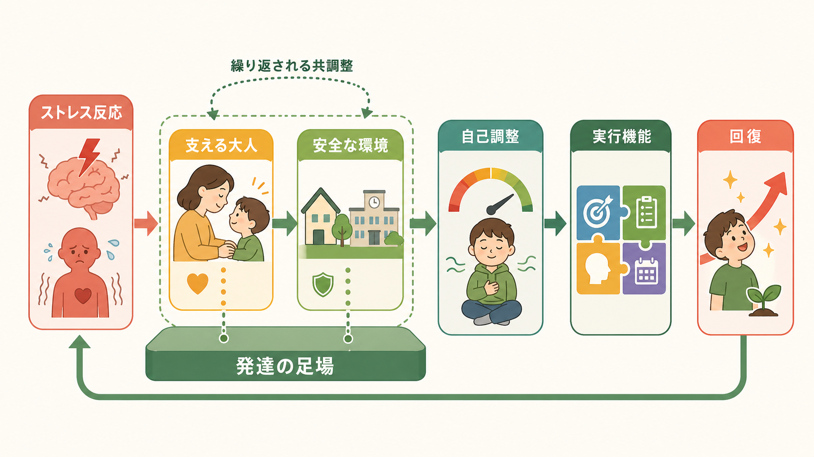

# レジリエンスは発達過程でどう育つのか

## 要点

- レジリエンスは「逆境を受けても平気でいられる性格」ではなく、重大な困難のなかで適応を保つ、または回復する発達的プロセスである [1][2]。
- 子どものレジリエンスは、個人の気質・認知・自己調整だけでなく、[[愛着とは何か|安定した愛着関係]]、家族の機能、学校・地域・制度的支援の組み合わせで育つ [3][4]。
- 最も再現性の高い保護要因は、少なくとも一人の安定した応答的な大人との関係である。これはストレス反応を緩衝し、実行機能や自己調整の発達を支える [5][6]。
- レジリエンスは固定的な能力ではない。発達段階、逆境の種類、文化的文脈、利用できる支援資源によって表れ方が変わる [2][7]。

## この記事で答える問い

1. レジリエンスは、発達心理学ではどのように定義されるのか。
2. 逆境下で適応を支える個人要因・家族要因・社会的支援は何か。
3. 支援や臨床では、レジリエンスをどのように扱うと過度な自己責任論を避けられるのか。

## まず結論

レジリエンスは、子どもの内側に単独で存在する「折れない心」ではない。発達科学では、逆境、適応、保護要因、時間経過を同時に見る概念として扱う。つまり「どのようなリスクにさらされ、どの領域で、どの時点で、どのような支えによって適応しているのか」を問う概念である [1][2]。

発達過程では、子ども自身の問題解決力、感情調整、希望、自己効力感が重要になる。しかし、それらは孤立して育つのではなく、保護者・教師・友人・地域資源との反復的な相互作用のなかで形成される。したがって、支援の焦点は「子どもを強くする」だけではなく、「子どもが強さを発揮できる関係と環境を整える」ことに置かれる [3][5][6]。

## 背景

レジリエンス研究は、深刻な貧困、虐待、戦争、災害、親の精神疾患、慢性的ストレスなどを経験しても、すべての子どもが同じように不適応へ向かうわけではない、という観察から発展した。Masten は、レジリエンスを特別な英雄的能力ではなく、通常の発達システムが比較的よく働いたときに生じる「ordinary magic」と表現した [1]。

この見方は、[[発達とは何か]]の理解と相性がよい。発達とは、遺伝・身体・認知・情動・社会関係・文化が相互作用しながら変化する過程である。レジリエンスも同じく、個人内の特徴だけでなく、家族、学校、地域、政策といった複数水準のシステムがかかわる [4][7]。

## 基本概念

### 逆境

逆境とは、発達の機会や健康を脅かす経験である。虐待、ネグレクト、家庭内暴力、貧困、差別、慢性疾患、災害、いじめ、親の精神的不調などが含まれる。ただし、逆境の意味は強度、持続時間、予測可能性、逃げ場の有無、支援の有無によって変わる [2][6]。

### 適応

適応は、症状がまったくないことではない。学校参加、対人関係、情動調整、身体健康、将来への見通しなど、発達段階に応じた複数領域で評価する必要がある。ある領域でよく適応していても、別の領域では困難が残ることがあるため、レジリエンスを単一スコアで断定しない [2][3]。

### 保護要因

保護要因は、リスクを消す魔法ではなく、リスクが発達へ与える影響を弱めたり、回復の経路を増やしたりする条件である。代表的には次のように整理できる [1][4][7]。

| 水準 | 例 | 発達上の働き |
|---|---|---|
| 個人 | 気質、知的能力、実行機能、自己調整、希望、問題解決 | ストレス状況で選択肢を見つけ、衝動や感情を調整する |
| 家族 | 応答的養育、安定した住環境、家族内の予測可能性 | 安全基地を提供し、子どもの情動調整を共同調整する |
| 学校 | 信頼できる教師、学習支援、仲間関係、居場所 | 家庭外の大人と成功経験を増やす |
| 地域・制度 | 医療、福祉、経済支援、差別の低減、安全な地域 | 家族の負荷を下げ、保護的関係が続く条件を整える |

## 仕組み

### 1. 応答的関係がストレス反応を緩衝する

強いストレス反応は、それ自体が常に有害なわけではない。短期的で、支える大人がいて、回復の時間がある場合、ストレスへの対処は学習になる。しかし、深刻で長期化し、保護的な大人の支えが乏しい場合、ストレス反応系の過剰な活性化が脳・身体・行動の発達に負荷をかける [5][6]。

乳幼児期から児童期にかけて、養育者は子どもの情動を一緒に調整する。泣く、怒る、怖がる、近づく、離れるといった子どものシグナルに大人が一貫して応答すると、子どもは「危険があっても助けを求められる」「感情は調整できる」という経験を積む。この経験は[[愛着とは何か|愛着]]、自己調整、対人信頼の基礎になる [5][6]。

### 2. 自己調整と実行機能が「次の行動」を増やす

レジリエンスを支える個人要因の中心には、注意を向け直す、待つ、計画する、衝動を抑える、他者の視点を考えるといった自己調整・実行機能がある。これらは[[心の理論はどのように発達するのか|他者理解]]や[[言語発達はどのように進むのか|言語発達]]とも結びつき、助けを求める、状況を言語化する、代替行動を選ぶ力を広げる [1][4]。

ただし、自己調整を「本人の努力不足」と解釈してはいけない。慢性的な危険や不安定な環境では、短期的な警戒・回避・攻撃が適応的に見えることもある。支援では、行動だけを罰するより、行動がどの環境に適応しようとしているのかを読む必要がある [2][6]。

### 3. 家族と社会的支援が発達の足場をつくる

子どもを支える大人自身が、貧困、孤立、健康問題、差別、過重労働にさらされていると、応答的な養育を続ける余力は下がる。したがって、子どものレジリエンスを高める支援は、保護者への心理教育だけでなく、経済的支援、保育、学校との連携、地域資源への接続を含む必要がある [6][8]。

## 図解

この記事の図解は、レジリエンスを三つの視点から読むための補助である。

1. 1枚目は、逆境から適応へ向かう発達過程に、個人要因・家族要因・社会的支援が同時に関わることを示す。
2. 2枚目は、支える大人と安全な環境がストレス反応を緩衝し、自己調整と実行機能の発達を支える流れを示す。
3. 3枚目は、個人・家族・学校・地域・政策という支援の層を、予防・早期支援・回復支援に分けて整理する。

## 臨床・研究との接続

臨床や教育でレジリエンス概念を使う利点は、リスクだけでなく保護要因を評価できる点である。たとえば、子どもに不安、怒り、学習困難、対人トラブルがある場合でも、信頼できる大人、得意な活動、安心できる場所、助けを求める言葉、学校内の理解者があれば、支援計画の出発点になる。

研究では、レジリエンスを「逆境あり」と「良好な適応あり」の組み合わせとして操作化することが多い。しかし、逆境の測定、適応領域の選び方、文化差、時間経過による変化をどう扱うかで結果は変わる。そのため、Luthar らは、レジリエンス研究では定義、リスク水準、適応指標を明確にする必要があると論じた [3]。

実践上は、個人スキルトレーニングだけでなく、関係の安定化と環境調整を同時に進めることが重要である。WHO の INSPIRE も、暴力予防と子どもの発達支援には、養育支援、学校での安全、社会規範の変化、経済的支援、サービス接続など、複数水準の戦略が必要だと整理している [8]。

## よくある誤解

### 誤解1: レジリエンスが高い子は傷つかない

レジリエンスは傷つかないことではない。苦痛、症状、混乱があっても、時間をかけて回復したり、生活機能を取り戻したりする過程を含む。外から「元気そう」に見えることだけで判断してはいけない [2][7]。

### 誤解2: 逆境は人を強くする

逆境が自動的に成長を生むわけではない。むしろ、強く慢性的な逆境は発達を損なう可能性がある。保護的関係、意味づけ、休息、具体的資源があるときに、困難な経験が学習や再編成につながる場合がある [2][6]。

### 誤解3: レジリエンスは本人の心がけで決まる

本人の認知や行動は重要だが、それらを可能にする環境条件がある。子どものレジリエンスを語るときほど、家族、学校、地域、政策の責任を見落とさないことが大切である [4][8]。

## 関連ノート

- [[発達とは何か]]
- [[愛着とは何か]]
- [[心の理論はどのように発達するのか]]
- [[言語発達はどのように進むのか]]

## 理解チェック

1. レジリエンスを「個人の性格」だけで説明すると、何が見落とされるか。
2. 逆境の影響を評価するとき、強度だけでなく持続時間や支援の有無を見る理由は何か。
3. 支援計画を立てるとき、個人要因・家族要因・社会的支援をどう分けて観察できるか。
4. 「逆境は人を強くする」という言い方には、どのような危険があるか。

## 関連ノート候補

- レジリエンスとは何か
- ACEとは何か
- 毒性ストレスとは何か
- 実行機能とは何か
- 社会的支援とは何か
- トラウマインフォームドケアとは何か

## MOC更新候補

- `content/00_MOC/` 配下の発達心理学・認知科学・臨床心理学系 MOC に追加候補。
- 並列ジョブとの衝突回避のため、本記事では MOC 本体は更新しない。

## 未解決問題

- 文化や制度が異なる地域で、同じ「適応」指標を使ってよいのか。
- レジリエンス尺度は、子ども本人の能力と環境資源をどこまで分けて測定できるのか。
- 支援者が「レジリエンス」を強調することで、構造的な貧困や差別への介入が弱まる危険をどう避けるか。

## 参考文献

[1] Masten, A. S. (2001). Ordinary magic: Resilience processes in development. *American Psychologist, 56*(3), 227-238. https://doi.org/10.1037/0003-066X.56.3.227

[2] Rutter, M. (2012). Resilience as a dynamic concept. *Development and Psychopathology, 24*(2), 335-344. https://doi.org/10.1017/S0954579412000028

[3] Luthar, S. S., Cicchetti, D., & Becker, B. (2000). The construct of resilience: A critical evaluation and guidelines for future work. *Child Development, 71*(3), 543-562. https://doi.org/10.1111/1467-8624.00164

[4] Masten, A. S. (2007). Resilience in developing systems: Progress and promise as the fourth wave rises. *Development and Psychopathology, 19*(3), 921-930. https://doi.org/10.1017/S0954579407000442

[5] National Scientific Council on the Developing Child. (2015). *Supportive Relationships and Active Skill-Building Strengthen the Foundations of Resilience: Working Paper No. 13*. Center on the Developing Child at Harvard University. https://developingchild.harvard.edu/resources/working-paper/supportive-relationships-and-active-skill-building-strengthen-the-foundations-of-resilience/

[6] National Scientific Council on the Developing Child. (2005/2014). *Excessive Stress Disrupts the Architecture of the Developing Brain: Working Paper No. 3*. Center on the Developing Child at Harvard University. https://developingchild.harvard.edu/resources/working-paper/wp3/

[7] Southwick, S. M., Bonanno, G. A., Masten, A. S., Panter-Brick, C., & Yehuda, R. (2014). Resilience definitions, theory, and challenges: Interdisciplinary perspectives. *European Journal of Psychotraumatology, 5*, 25338. https://doi.org/10.3402/ejpt.v5.25338

[8] World Health Organization. (2016). *INSPIRE: Seven strategies for ending violence against children*. https://www.who.int/publications/i/item/9789241565356
