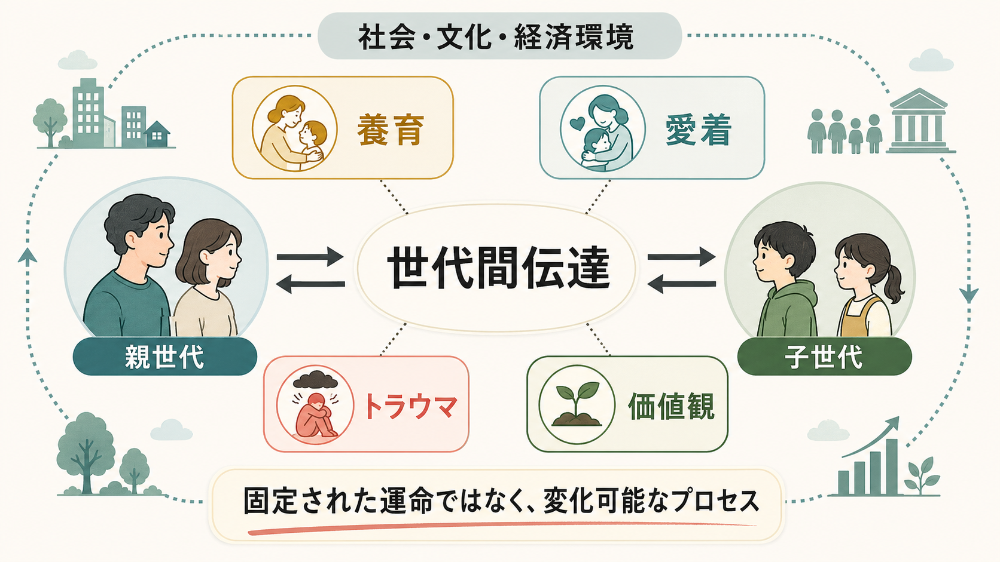
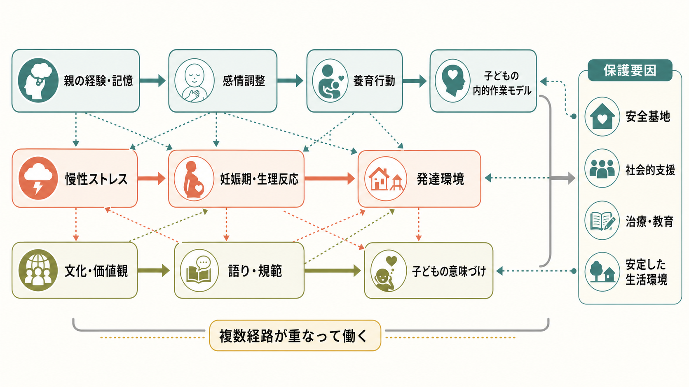
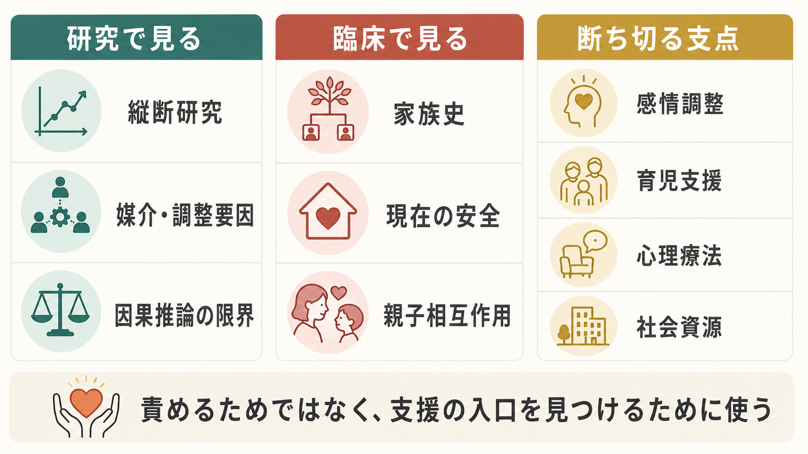

# 世代間伝達とは何か

## 要点

- 世代間伝達とは、親世代の経験、養育行動、愛着の表象、トラウマ反応、価値観、社会的条件が、子どもの発達環境や意味づけに影響する過程である。
- 伝達されるのは「血筋」や「運命」ではなく、日常の相互作用、ストレス調整、家族内の語り、制度や文化を含む複数の経路である[1][2]。
- 愛着研究では、親の愛着表象と子どもの愛着の関連が繰り返し示されているが、養育感受性だけでは説明しきれない「伝達ギャップ」が残る[2][3]。
- 虐待やトラウマの連鎖はリスクとして重要だが、多くの家族では断絶・回復・保護要因も同時に働くため、単純な決定論として読んではならない[4][5]。
- 臨床・教育・福祉では、世代間伝達を「親を責める枠組み」ではなく、支援の入口、保護要因、介入可能な支点を見つける枠組みとして使う。

## この記事で答える問い

1. 世代間伝達とは何が、どのように受け継がれることなのか。
2. [[養育環境は発達にどう影響するのか|養育]]、[[愛着とは何か|愛着]]、[[トラウマは発達にどう影響するのか|トラウマ]]、価値観はどの経路で子どもに影響するのか。
3. どこまでが研究で示され、どこからが慎重に扱うべき仮説なのか。
4. 臨床・教育・福祉では、この概念をどう使えばよいのか。

## まず結論

世代間伝達は、「親がそうだったから子も必ずそうなる」という話ではない。より正確には、親世代がもつ経験の記憶、感情調整の癖、対人予測、価値づけ、生活上の資源や制約が、子どもとの相互作用や生活環境を通じて、子どもの[[内的作業モデルとは何か|内的作業モデル]]、ストレス反応、対人関係、自己理解に影響する過程である。

重要なのは、世代間伝達には「継続」と同じくらい「変化」も含まれることである。安全な関係、社会的支援、心理教育、治療、経済的・制度的資源、本人の意味づけの変化は、同じリスク経験をもつ家族でも異なる発達経路を生み出す[4][6]。

## 背景

世代間伝達という言葉は、発達心理学、家族心理学、社会心理学、精神医学、公衆衛生、文化研究で少しずつ異なる意味で使われる。発達心理学では、親の養育史や愛着表象が子どもの愛着とどう関連するかが中心になる[2][3]。トラウマ研究では、戦争、虐待、災害、差別、慢性ストレスの影響が、親子関係、妊娠期の生理反応、家族内の沈黙や語りを通じて次世代に及ぶかが問われる[5]。社会心理学では、規範、信念、道徳、職業観、文化的価値が、子どもの内在化や選択にどう関わるかが扱われる[7][8]。

この概念が有用なのは、個人の症状や行動を、その人だけの性格や努力不足として閉じない点にある。たとえば、過度の警戒、対人不信、怒りの爆発、感情の麻痺、過剰な責任感は、個人の問題としてだけでなく、家族の歴史、危険への適応、社会的孤立、支援不足のなかで形成された反応として理解できることがある。

## 基本概念

### 何が伝達されるのか

世代間伝達で受け継がれるものは、単一の「内容」ではない。少なくとも次の層を分けて考える必要がある。

| 層 | 例 | 注意点 |
|---|---|---|
| 行動 | 叱り方、慰め方、距離の取り方、助けを求める習慣 | 親の意図より、子どもが何を経験するかが重要になる |
| 表象 | 自分は助けられる存在か、他者は信頼できるか | [[安全基地とは何か|安全基地]]や愛着経験と結びつく |
| 感情調整 | 怒り、不安、恐怖、恥への対処 | 慢性ストレス下では調整資源が乏しくなりやすい |
| 価値観 | 何を大切にするか、何を恥とするか、どんな人生をよいとみなすか | 子どもは受け身にコピーするだけでなく、受容・拒否・再解釈する |
| 社会的条件 | 貧困、差別、教育機会、地域資源、医療アクセス | 家族内だけで説明すると構造的要因が見えなくなる |

Belsky の養育過程モデルは、養育を親の性格や意志だけでなく、親自身の発達史、子どもの特徴、夫婦・家族関係、仕事、社会的支援の組み合わせとして捉えた[1]。この視点に立つと、世代間伝達は「親が子に渡すもの」ではなく、「親子を取り巻く条件のなかで繰り返される相互作用」として見える。

### 愛着の世代間伝達

愛着研究では、成人愛着面接で評価される親の愛着表象と、子どもの愛着分類との関連が古くから検討されてきた。van IJzendoorn のメタ分析は、親の愛着表象が乳幼児の愛着と関連し、親の応答性もその一部を媒介することを示した[2]。しかし、その後の研究でも、親の感受性だけでは親子間の関連を完全には説明できないことが示され、「伝達ギャップ」と呼ばれている[3]。

このギャップは、愛着の世代間伝達が単純な模倣ではないことを示す。未解決の喪失やトラウマ、恐怖を伴う養育、家庭外の支援、子どもの気質、文化的期待、生活上のストレスなどが、親の表象と子どもの経験の間に入り込む。

## 仕組み

### 1. 養育行動と応答性

最も見えやすい経路は、日常の養育行動である。泣いたときに近づくか、怒りをどう扱うか、失敗を罰だけで処理するか、説明と修復の機会をつくるか。こうした反復が、子どもの「困ったときに助けを求めてよい」「感情は調整できる」「他者は予測可能である」という学習を支える。

ただし、養育行動は親の知識だけで決まらない。睡眠不足、貧困、孤立、パートナー関係の不安定さ、職場ストレス、精神的困難が重なると、同じ親でも応答性を保ちにくくなる[1]。そのため、世代間伝達を弱める支援は、親への助言だけでなく、生活と関係の安全を整えることを含む。

### 2. 愛着表象と内的作業モデル

親が自分の幼少期をどう語り、助けられた経験や傷ついた経験をどう意味づけているかは、子どもへの応答に影響しうる[2][3]。たとえば、「弱さを見せると見捨てられる」という予測をもつ親は、子どもの依存や泣きを過度に脅威として受け取るかもしれない。一方で、過去の困難を振り返り、現在の関係のなかで整理できている場合、同じ経験をもっていても子どもへの応答は異なる。

ここで大切なのは、[[内的作業モデルとは何か|内的作業モデル]]は固定された性格ではないという点である。安定した関係、心理療法、支援者との協働、パートナーや友人との経験により、自己と他者についての予測は更新されうる。

### 3. トラウマとストレス反応

トラウマの世代間伝達では、親の PTSD 症状、回避、過覚醒、感情麻痺、家族内の沈黙、危険への過敏な注意が、子どもの環境理解に影響することがある[5]。子どもは親の言葉だけでなく、声色、緊張、避けられる話題、突然の怒り、過剰な心配から「世界は危険である」「感情は扱えない」と学ぶことがある。

エピジェネティクスはこの領域で注目されるが、慎重さが必要である。Yehuda と Lehrner は、妊娠期のストレス、生後の養育環境、親の生理的ストレス反応など、複数の経路が関与しうると論じる一方、人間での証拠を「遺伝子に傷が刻まれて運命が決まる」と読むことは過剰であると整理している[5]。

### 4. 価値観・規範・語り

価値観は、説教だけでなく、日常の優先順位、家族内の語り、罰と承認、沈黙、行事、金銭や仕事への態度を通じて伝わる。Grusec と Goodnow は、価値の内在化には、子どもが親のメッセージを正確に理解すること、そのメッセージを受け入れる動機づけをもつこと、価値が自分で選んだものとして経験されることが重要だと整理した[7]。

したがって、価値観の伝達はコピーではない。子どもは親の価値を受け入れるだけでなく、友人、学校、メディア、地域文化、世代固有の経験を通じて、受け継いだ価値を変形する。近年の価値伝達研究も、親子の類似性だけでなく、子どもの自律的な受容・拒否・連続性を区別する必要を指摘している[8]。

## 図解

| 図 | 読み方 |
|---|---|
| 図1 | 世代間伝達を、親世代から子世代への一方向のコピーではなく、養育・愛着・トラウマ・価値観と社会環境の相互作用として読む |
| 図2 | 親の経験、感情調整、養育行動、子どもの内的作業モデル、妊娠期・生理反応、文化的語りが複数経路で重なることを見る |
| 図3 | 研究・臨床・支援の場面では、因果を急がず、評価と支援資源を結びつける枠組みとして使う |

## 臨床・研究との接続

研究では、世代間伝達を検討するには縦断研究、親子双方の測定、媒介・調整要因の検討が必要になる。横断研究だけでは、親の経験が子どもの結果を生んだのか、現在の家族ストレスが両方に影響しているのか、社会的条件が共通原因になっているのかを区別しにくい。

虐待の「連鎖」についても、単純な物語は避ける必要がある。メタ分析では、親の被虐待経験は子どもの虐待リスクと関連するが、連鎖を維持する家族だけでなく、断ち切る家族も多いことが示される[4]。この点は、[[逆境的小児期体験ACEとは何か|ACE]] を扱うときにも重要である。ACE は個人の未来を決める診断名ではなく、支援と予防の必要性を見つけるための公衆衛生上の概念である[6]。

臨床では、世代間伝達の視点は、家族史、現在の安全、親子相互作用、支援資源をつなげて理解する助けになる。ただし、個別の診断や治療方針は専門家の評価に基づくべきであり、この記事は教育・研究目的の整理に留まる。

## よくある誤解

### 誤解1: 世代間伝達は親を責める概念である

世代間伝達は、親の責任を個人に押しつけるための概念ではない。むしろ、親自身もまた発達史、トラウマ、貧困、孤立、制度的支援の不足のなかで養育していることを見えるようにする概念である。責めるよりも、どこに支援を置けば連鎖が弱まるかを考えるために使う。

### 誤解2: トラウマは生物学的にそのまま子へ遺伝する

人間のトラウマ研究では、生物学的経路だけでなく、妊娠期環境、生後の養育、家族内の語り、社会的排除、生活ストレスが重なっている[5]。エピジェネティクスだけで説明すると、環境や支援の役割を見落としやすい。

### 誤解3: 子どもは親の価値観をそのままコピーする

価値観の伝達には、理解、受容、自律性、関係の質が関わる[7][8]。子どもは親の価値を受け継ぐだけでなく、拒否し、変形し、別の文脈に置き直す。親子の不一致は、必ずしも伝達の失敗ではなく、発達と文化変化の一部でもある。

### 誤解4: 連鎖があるなら変えられない

リスクが伝わることと、運命が決まることは違う。[[レジリエンスは発達過程でどう育つのか|レジリエンス]]、安全な関係、早期支援、治療、教育、安定した住環境、社会資源は、伝達経路を変える保護要因になりうる[4][6]。

## 関連ノート

- [[愛着とは何か]]: 親子関係の安全感と探索の基盤。
- [[内的作業モデルとは何か]]: 自己・他者・世界についての予測モデル。
- [[安全基地とは何か]]: 子どもが探索と避難を往復する関係上の拠点。
- [[トラウマは発達にどう影響するのか]]: トラウマ経験と発達過程の接続。
- [[逆境的小児期体験ACEとは何か]]: 公衆衛生としての逆境経験と保護要因。
- [[養育環境は発達にどう影響するのか]]: 家庭・地域・制度を含む発達環境。
- [[レジリエンスは発達過程でどう育つのか]]: リスク下での回復と適応。

## MOC更新候補

- `content/00_MOC/` 配下の発達心理学・社会心理学・トラウマ関連 MOC に、`[[世代間伝達とは何か]]` を追加する候補。
- 並列生成ジョブとの競合を避けるため、このタスクでは MOC ファイル本体は更新しない。

## 理解チェック

1. 世代間伝達を「親から子へのコピー」と説明すると、何が見落とされるか。
2. 愛着研究における「伝達ギャップ」とは何か。
3. トラウマの世代間伝達を、エピジェネティクスだけで説明してはいけない理由は何か。
4. 価値観の伝達で、子どもの自律的な受容・拒否が重要になるのはなぜか。
5. 臨床・教育・福祉で、世代間伝達を「責めるため」ではなく「支援の入口」として使うには何に注意すべきか。

## 未解決問題

- 親の愛着表象と子どもの愛着の関連を、養育行動以外のどの媒介過程が説明するのか。
- 妊娠期ストレス、生後の養育、社会的逆境、生物学的指標をどのように分離して測定できるのか。
- 文化や移民経験、経済的不平等は、価値観やトラウマの伝達をどのように変えるのか。
- 支援介入の効果を、親の行動変化だけでなく、子どもの安全感、学校適応、生活安定まで含めてどう評価するのか。

## 参考文献

[1] Belsky, J. (1984). The determinants of parenting: A process model. *Child Development, 55*(1), 83-96. https://doi.org/10.2307/1129836

[2] van IJzendoorn, M. H. (1995). Adult attachment representations, parental responsiveness, and infant attachment: A meta-analysis on the predictive validity of the Adult Attachment Interview. *Psychological Bulletin, 117*(3), 387-403. https://doi.org/10.1037/0033-2909.117.3.387

[3] Verhage, M. L., Schuengel, C., Madigan, S., Fearon, R. M. P., Oosterman, M., Cassibba, R., Bakermans-Kranenburg, M. J., & van IJzendoorn, M. H. (2016). Narrowing the transmission gap: A synthesis of three decades of research on intergenerational transmission of attachment. *Psychological Bulletin, 142*(4), 337-366. https://doi.org/10.1037/bul0000038

[4] Madigan, S., Cyr, C., Eirich, R., Fearon, R. M. P., Ly, A., Rash, C., Poole, J. C., & Alink, L. R. A. (2019). Testing the cycle of maltreatment hypothesis: Meta-analytic evidence of the intergenerational transmission of child maltreatment. *Development and Psychopathology, 31*(1), 23-51. https://doi.org/10.1017/S0954579418001700

[5] Yehuda, R., & Lehrner, A. (2018). Intergenerational transmission of trauma effects: Putative role of epigenetic mechanisms. *World Psychiatry, 17*(3), 243-257. https://doi.org/10.1002/wps.20568

[6] Centers for Disease Control and Prevention. (2025). *About Adverse Childhood Experiences*. https://www.cdc.gov/violenceprevention/aces/index.html

[7] Grusec, J. E., & Goodnow, J. J. (1994). Impact of parental discipline methods on the child's internalization of values: A reconceptualization of current points of view. *Developmental Psychology, 30*(1), 4-19. https://doi.org/10.1037/0012-1649.30.1.4

[8] Barni, D., Zagrean, I., Russo, C., & Danioni, F. (2024). Intergenerational transmission of values: From parent-child value similarity to parent-child value continuity. *Journal of Family Issues, 45*(4), 1071-1094. https://doi.org/10.1177/0192513X231163939
