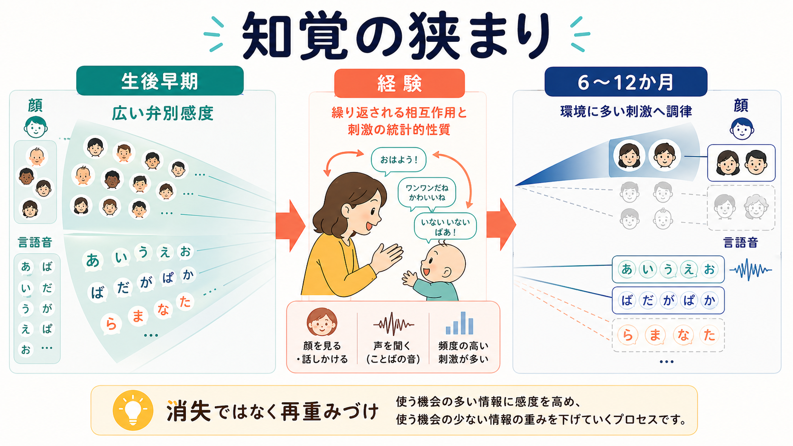
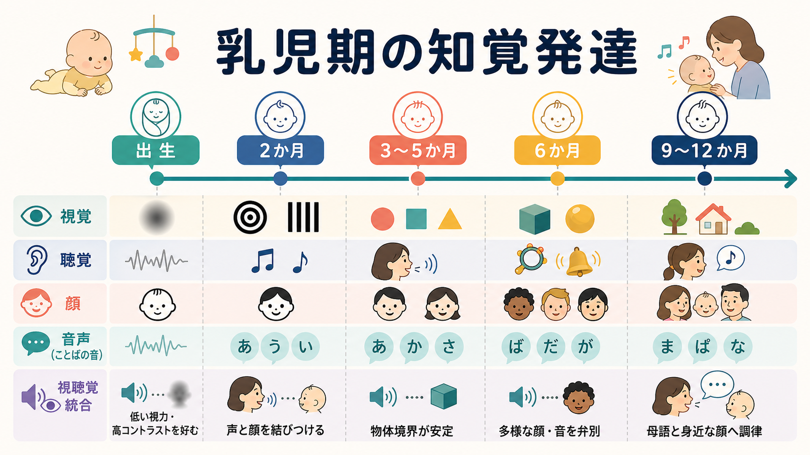

# 乳児は世界をどのように認識しているのか

## 要点

- 乳児の世界は「大人の縮小版」ではない。視力、コントラスト感度、眼球運動、注意制御が発達途上なので、見えるもの・見続けられるもの・結びつけられるものが月齢とともに変わる。
- 一方で、乳児は受動的な存在ではない。出生直後から音声、顔らしい配置、リズム、動き、視聴覚の同期に反応し、環境から統計的規則性を拾い上げる。
- 生後半年から1年にかけて、顔や言語音では「広い弁別感度」から「よく経験する刺激への調律」へ移る。これは単純な能力低下ではなく、環境に適応する再重みづけとして理解できる。

## この記事で答える問い

1. 乳児は視覚的にどの程度世界を見ているのか。
2. 声や音、顔、言語音にはどのように反応するのか。
3. 「知覚の狭まり」は何を意味し、なぜ重要なのか。
4. 研究・臨床では乳児の知覚発達をどう扱うべきか。

## まず結論

乳児の認識は、最初から完成した対象認識ではなく、感覚系・注意・身体運動・養育者との相互作用が同時に成熟していく過程である。出生直後の乳児は視力が低く、細部よりも高コントラスト、動き、声、顔らしい配置に反応しやすい。成長とともに、[[視覚認知はどのように対象を認識するのか]]、[[聴覚ネットワークは音情報をどう処理するのか]]、[[顔認知はなぜ特別なのか]]、[[言語理解はどのように行われるのか]]に関わる処理が、経験に合わせて調律される。

重要なのは、乳児が「何も分からない」わけでも「最初から大人のように分かる」わけでもないという点である。乳児は、粗いが意味のある手がかりを使って、世界を段階的に安定させていく。

## 背景

乳児研究では、言語報告の代わりに、注視時間、選好注視、馴化・脱馴化、吸啜反応、脳波、近赤外分光法などを使う。たとえば、同じ刺激を繰り返し見せて注視が短くなり、新しい刺激で再び注視が伸びるなら、乳児が二つの刺激を区別している可能性がある。これは[[注意とは何か]]や[[事象関連電位ERPとは何か]]とも関係する。

ただし、乳児の注視時間は「好き」「理解した」「驚いた」のどれか一つに単純対応しない。覚醒度、眠気、姿勢、刺激の新奇性、親の声、実験環境などにも左右される。そのため、乳児の知覚発達は、単一課題ではなく、複数の方法と発達時期を組み合わせて読む必要がある。

## 基本概念

### 視覚は粗いが急速に伸びる

出生直後の視覚は、大人に比べて空間解像度とコントラスト感度が低い。乳児は細かな輪郭よりも、大きく、近く、高コントラストで、ゆっくり動く刺激を捉えやすい。視力、コントラスト感度、両眼視、運動視などは生後数か月から1年にかけて急速に発達する[1]。このため、乳児が「見ていない」ように見える場合でも、対象の細部を見分けにくい、視線を保ちにくい、注意を切り替えにくい、という複数の要因が重なっていることがある。

### 注意は知覚の入口を作る

乳児の認識は、感覚器だけで決まらない。どこを見るか、どれくらい見続けるか、どの刺激から離れられるかという[[選択的注意はどのように働くのか]]の発達が、世界の取り込み方を大きく変える。出生時にも覚醒、定位、特徴への注意の原型はあるが、内発的に注意を制御する力は発達途上であり、乳児期を通じて変化する[2]。

### 聴覚は出生前から経験を持つ

聴覚は出生後に突然始まるわけではない。胎内でも母声、リズム、韻律にさらされるため、新生児は母親の声を他の女性の声より選好することが報告されている[3]。声は単なる音ではなく、覚醒調整、情動、養育者との相互作用、のちの言語学習に接続する社会的信号である。

### 顔は早期から特別な手がかりになる

新生児は顔らしい配置を追視しやすいことが知られており、顔に対する早期バイアスが示唆されている[4]。ただし、これは「出生時から大人と同じ顔認識システムが完成している」という意味ではない。顔への初期バイアスは、その後の経験学習を導く入口であり、個人識別、表情、視線、社会的注意は段階的に洗練される。

## 仕組み

### 1. 粗い感覚から、安定した対象へ

乳児は最初、細部よりも強いコントラスト、輪郭、動き、音との同期などを頼りにする。物体が一部隠れても一つのものとして続いているか、動きと音が同じ出来事に属するか、といった判断は、月齢と課題条件によって変わる。部分的に隠れた物体の一体性や形の補完は、生後4か月から7か月ごろにかけて手がかりの使い方が変化することが示されている[8]。

この段階では、世界は静止した写真の集まりではなく、動くもの、鳴るもの、触れられるもの、養育者が反応してくれるものとして整理される。したがって、[[身体化認知とは何か]]や[[エナクティブ認知とは何か]]の観点から見ると、乳児の知覚は身体と相互作用から切り離せない。

### 2. 顔と声は社会的世界を作る

顔と声は、乳児にとって最も強い社会的手がかりである。母声への選好、顔らしい配置への反応、視線や口の動きへの注意は、世界を「物」だけでなく「人がいる場」として構成する。養育者が声をかけ、顔を近づけ、乳児の反応に合わせて速度や抑揚を変えることは、乳児の注意を安定させ、刺激の境界を分かりやすくする。

この社会的調整は、言語音にも関わる。乳児は音声の統計的分布、韻律、音節の遷移確率を使って、母語の音韻カテゴリーや語の境界を学び始める[6]。つまり、言語は単に「言葉を教えられる」ことで始まるのではなく、音の規則性を知覚系が抽出することから始まる。

### 3. 知覚の狭まり

生後早期の乳児は、大人よりも広い範囲の顔や言語音を弁別できる場合がある。たとえば、6か月児はヒト顔だけでなくサル顔の個体差も弁別しやすいが、9か月児や成人では自分の種の顔への弁別が相対的に優位になることが示された[5]。言語音でも、乳児は初期には多様な音韻差に敏感だが、やがて母語で使われる対立への感度が高まり、使われにくい対立への感度は低下する[6]。

この過程を「知覚の狭まり」という。誤解しやすいが、これは単なる喪失ではない。よく経験する刺激に処理資源を合わせ、使う機会の少ない区別の重みを下げることで、日常環境に適応していく過程である。顔、音声、視聴覚統合など複数領域にまたがる現象として捉えられており、マルチモーダルな発達の一部と考えられる[7]。

## 図解

上の1枚目は、知覚の狭まりを「広い弁別感度」「経験」「環境に多い刺激への調律」として整理した図である。顔と言語音は別々の機能に見えるが、どちらも経験頻度に応じて識別の重みが変わる。

2枚目は、出生から9〜12か月ごろまでの視覚・聴覚・顔・音声・視聴覚統合の変化を並べたタイムラインである。月齢は厳密な到達期限ではなく、研究で観察される傾向を読むための目安である。

## 臨床・研究との接続

乳児の知覚発達は、発達評価や早期支援に関係する。ただし、単一の反応だけで診断的に断定することは避けるべきである。乳児は眠気、空腹、姿勢、養育者との関係、感覚環境に強く影響される。研究知見は、個別診断や治療指示ではなく、発達を理解する枠組みとして使う必要がある。

臨床・研究上は、次の点が重要である。

- 反応の有無だけでなく、視線、覚醒、身体運動、声への反応、養育者との相互調整を合わせて見る。
- 乳児の「できなさ」を能力欠如だけで説明せず、感覚入力、注意制御、経験量、運動発達の制約として分解する。
- [[神経発達の異常は精神疾患にどう関わるのか]]や[[感覚過敏は神経回路でどう説明できるのか]]と接続する場合も、乳児期の個人差をそのまま将来の精神疾患へ直線的に結びつけない。

## よくある誤解

### 乳児はぼんやりしていて何も分かっていない

乳児の視覚は粗いが、声、顔、動き、リズム、同期などには早期から反応する。大人のような概念的理解とは異なるが、環境の規則性を拾う知覚システムはすでに働いている。

### 乳児は最初から大人と同じように世界を見ている

乳児の視力、注意制御、対象補完、顔処理、言語音処理は発達途上である。大人と同じ刺激を見せても、乳児が利用している手がかりは異なることがある。

### 知覚の狭まりは能力の劣化である

知覚の狭まりは、使わない区別を完全に失うことではなく、日常環境に合わせて処理の重みを変える過程である。母語や身近な顔を効率よく処理するための適応と考えられる。

## 関連ノート

- [[視覚認知はどのように対象を認識するのか]]
- [[聴覚ネットワークは音情報をどう処理するのか]]
- [[顔認知はなぜ特別なのか]]
- [[言語理解はどのように行われるのか]]
- [[注意とは何か]]
- [[選択的注意はどのように働くのか]]
- [[予測処理とは何か]]
- [[神経発達の異常は精神疾患にどう関わるのか]]
- [[感覚過敏は神経回路でどう説明できるのか]]

## MOC更新候補

- `content/00_MOC/MOC｜認知科学・心理学.md`
- 発達・愛着・社会心理領域のMOCが統合ジョブで整備される場合、本記事を「発達心理学」「乳児知覚」「社会的認知」の節に追加する。

## 理解チェック

1. 乳児の視覚が大人と異なる点を、視力・コントラスト・注意の3つに分けて説明できるか。
2. 母声や顔らしい配置への早期反応は、なぜ「社会的世界」の入口と考えられるか。
3. 知覚の狭まりを「能力低下」ではなく「経験による再重みづけ」として説明できるか。
4. 乳児研究で注視時間だけを過剰解釈してはいけない理由を説明できるか。

## 未解決問題

- 知覚の狭まりが、どの程度まで領域一般の学習機構で説明でき、どの程度まで顔・言語音・視聴覚統合に固有の制約を持つのか。
- 乳児期の知覚個人差が、後の言語、社会性、注意制御にどのように連続するのか。
- 家庭内の多言語環境、文化差、養育者の応答性、デジタルメディア接触が、知覚調律にどのような影響を持つのか。

## 参考文献

[1] Braddick, O., & Atkinson, J. (2011). Development of human visual function. *Vision Research*, 51(13), 1588-1609. https://doi.org/10.1016/j.visres.2011.02.018

[2] Colombo, J. (2001). The development of visual attention in infancy. *Annual Review of Psychology*, 52, 337-367. https://doi.org/10.1146/annurev.psych.52.1.337

[3] DeCasper, A. J., & Fifer, W. P. (1980). Of human bonding: Newborns prefer their mothers' voices. *Science*, 208(4448), 1174-1176. https://doi.org/10.1126/science.7375928

[4] Johnson, M. H., Dziurawiec, S., Ellis, H., & Morton, J. (1991). Newborns' preferential tracking of face-like stimuli and its subsequent decline. *Cognition*, 40(1-2), 1-19. https://doi.org/10.1016/0010-0277(91)90045-6

[5] Pascalis, O., de Haan, M., & Nelson, C. A. (2002). Is face processing species-specific during the first year of life? *Science*, 296(5571), 1321-1323. https://doi.org/10.1126/science.1070223

[6] Kuhl, P. K. (2004). Early language acquisition: Cracking the speech code. *Nature Reviews Neuroscience*, 5, 831-843. https://doi.org/10.1038/nrn1533

[7] Lewkowicz, D. J., & Ghazanfar, A. A. (2009). The emergence of multisensory systems through perceptual narrowing. *Trends in Cognitive Sciences*, 13(11), 470-478. https://doi.org/10.1016/j.tics.2009.08.004

[8] Johnson, S. P., & Aslin, R. N. (2002). Young infants' perception of unity and form in occlusion displays. *Journal of Experimental Child Psychology*, 81(3), 358-374. https://doi.org/10.1006/jecp.2002.2657
