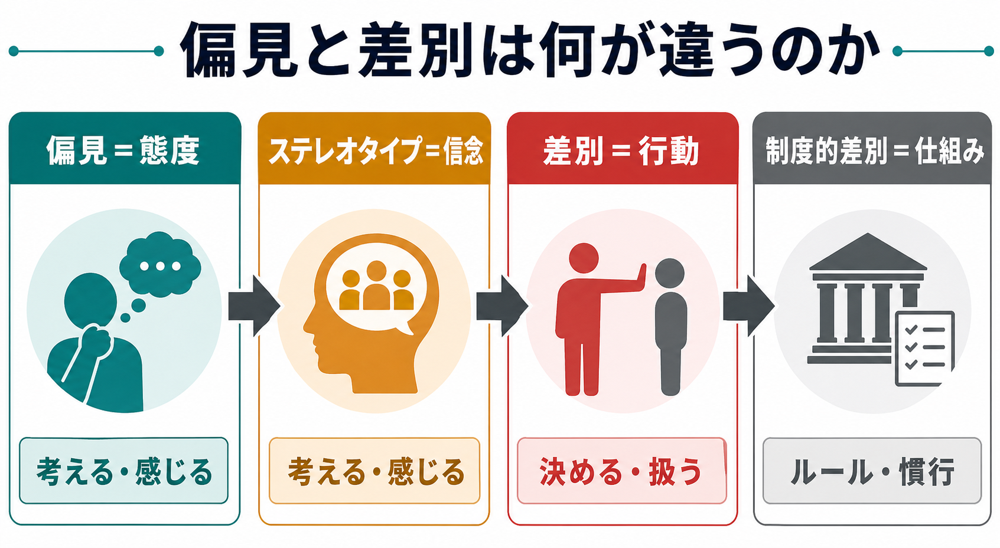
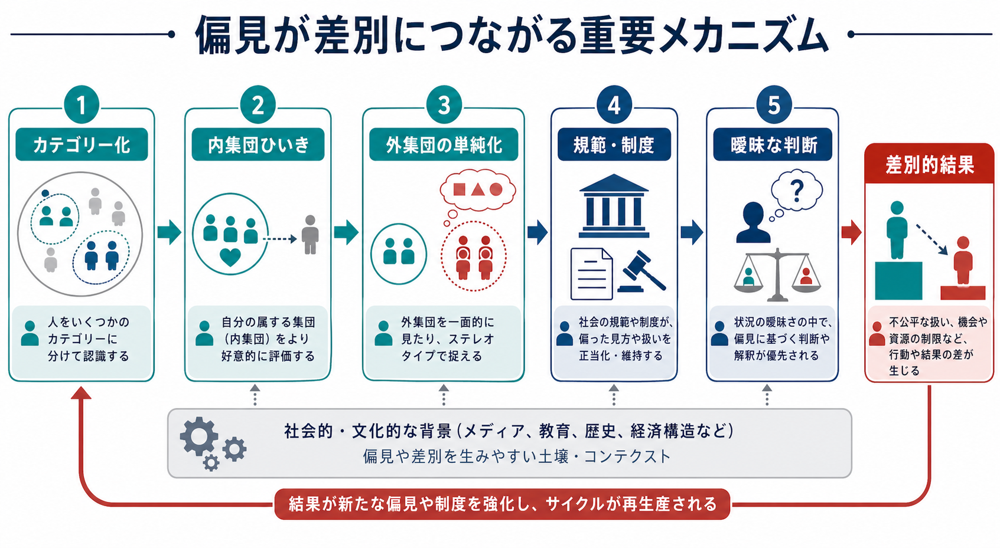
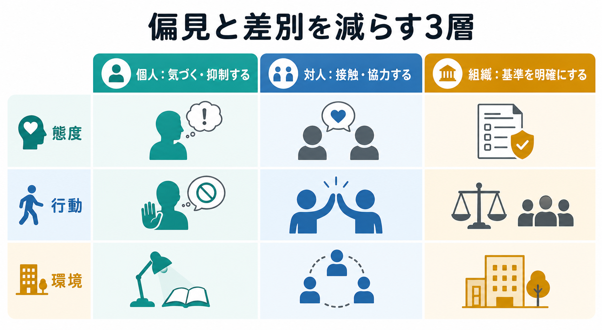

# 偏見と差別は何が違うのか

## 要点

- **偏見**は、ある集団やその成員に向けられる否定的・不当な**態度**である。
- **ステレオタイプ**は、「その集団の人はこうだ」という過度に一般化された**信念**である。
- **差別**は、集団所属を理由に不利益・排除・過小評価・不公平な扱いをする**行動**である。
- 偏見がなくても、制度・慣行・曖昧な判断基準によって差別的結果が生じることがある。
- 介入では「心の中の偏見をなくす」だけでなく、判断手続き、組織ルール、接触条件、説明責任を変える必要がある。

## この記事で答える問い

この記事では、日常語では混同されやすい「偏見」と「差別」を、社会心理学の基本概念として分けて考える。中心になる問いは次の3つである。

1. 偏見・ステレオタイプ・差別は、それぞれ何を指すのか。
2. なぜ「悪意がない」場面でも差別的結果が生じるのか。
3. 偏見や差別を減らすには、個人の意識以外に何を変える必要があるのか。

## まず結論

最も短く言えば、**偏見は態度、差別は行動**である。偏見は「ある集団に対して嫌悪・恐れ・軽視・不信を抱く」という評価や感情を含む。一方、差別は「採用しない」「低く評価する」「避ける」「不利益なルールを適用する」「同じ条件なのに扱いを変える」といった行動や制度的結果を含む[1]。

ただし、両者は単純な一直線ではない。偏見が差別を促すことは多いが、偏見を自覚していない人でも、文化的ステレオタイプが自動的に活性化し、曖昧な判断場面で行動差が出ることがある[4][5]。また、組織の基準や慣行が特定集団に不利に働く場合、個人の明示的な偏見が小さくても、差別的結果は維持されうる[7][8]。

## 背景

偏見と差別の区別が重要なのは、対策の焦点が変わるからである。偏見を「心の問題」とだけ捉えると、教育や啓発だけに介入が偏る。しかし差別は行動・制度・資源配分の問題でもあるため、評価基準、選抜手続き、相談経路、権限関係、説明責任を設計し直す必要がある。

社会心理学では、集団間バイアスを「感情・認知・行動」の3側面で整理することが多い。すなわち、偏見は感情的・評価的側面、ステレオタイプは認知的側面、差別は行動的側面である[1]。この整理は、[[心の理論はどのように発達するのか]]や[[青年期のアイデンティティ形成とは何か]]のような「他者理解」と「自己・集団同一性」の発達を考えるうえでも役立つ。

## 基本概念

### 偏見

偏見とは、十分な個別情報に基づかず、集団所属を手がかりに人を否定的に評価する態度である。態度なので、感情、評価、行動傾向を含みうるが、実際に差別行動へ移るとは限らない。

たとえば、「ある属性の人は信用できない」と感じることは偏見である。しかし、その人を実際に採用候補から外す、発言機会を減らす、住居や医療へのアクセスを妨げるなら、それは差別に近づく。

### ステレオタイプ

ステレオタイプは、集団に関する一般化された信念である。「高齢者は新しい技術が苦手」「若者は忍耐力がない」のように、肯定的に見える内容を含む場合もある。しかし肯定的ステレオタイプであっても、個人差を消し、役割を固定し、期待から外れた人を罰する方向に働くことがある。

ステレオタイプは、複雑な社会情報を素早く処理するためのカテゴリー化と関係する。カテゴリー化そのものは[[発達とは何か]]で扱うような基本的な認知機能と連続しているが、社会的権力や資源配分と結びつくと、不公平な扱いを正当化する材料になる[1][3]。

### 差別

差別は、集団所属を理由にした不公平な行動や扱いである。個人による侮辱や排除だけでなく、採用、昇進、教育、住居、医療、司法、福祉などの制度に埋め込まれた不利益も含む。

ここで重要なのは、差別は「意図」だけで決まらないという点である。本人が差別するつもりはなかったとしても、同じ能力の候補者を属性によって異なる基準で評価したり、特定の生活条件を持つ人に不利な制度を維持したりすれば、差別的結果が生じる。

## 仕組み

### 1. 社会的カテゴリー化

人は他者を個人としてだけでなく、「同じ学校」「同じ職場」「同じ国籍」「同じ世代」のようなカテゴリーで把握する。カテゴリーは認知を効率化する一方で、内集団と外集団を作る。社会的同一性理論では、人は自分が属する集団から自尊感情や意味を得るため、内集団を相対的に高く評価しやすいと考える[3]。

この内集団ひいきは、明確な敵意がなくても生じうる。たとえば「自分たちの文化」「自分たちの専門性」「自分たちの学校」を標準とみなすだけで、外集団の行動は欠陥や例外として解釈されやすくなる。

### 2. 自動過程と制御過程

偏見は、常に意識的な信念として現れるわけではない。Devine の古典的研究は、文化的ステレオタイプが自動的に活性化しうること、そして低偏見の反応には、その活性化を抑制し、別の判断を選ぶ制御過程が必要になることを示した[4]。

このため、「自分は偏見を持っていない」と感じることと、「偏見の影響を受けない」ことは同じではない。重要なのは、偏見の有無を人格評価として裁くことだけではなく、判断が偏りやすい状況を特定し、修正可能な手続きを作ることである。

### 3. 曖昧な判断場面

差別は、基準が曖昧な場面で現れやすい。Dovidio と Gaertner の研究では、露骨な偏見が低下しても、候補者の適格性が曖昧な場合に、選抜判断のバイアスが残ることが示された[5]。これは、本人が平等を重視していても、曖昧さがあると「説明できる理由」を使って差別的判断が正当化される可能性を示している。

たとえば、「コミュニケーション力」「カルチャーフィット」「リーダーらしさ」のような基準は便利だが、定義が曖昧だと、既存の多数派に似た人を高く評価する方向へ働きやすい。

### 4. 規範・制度・資源配分

差別は、個人の態度だけでなく、制度によっても維持される。ある制度が「全員に同じルール」を適用しているように見えても、そのルールが特定集団の生活条件、身体条件、歴史的不利益、情報アクセスを無視していれば、不公平な結果を生みうる。

スティグマ研究では、偏見や差別は「支配する」「規範から外れた人を押し戻す」「危険とみなして遠ざける」といった社会的機能を持ちうると整理される[7]。この視点を取ると、差別は個人の悪意だけでなく、集団秩序や資源配分を維持する仕組みとしても分析できる。

## 図解

| 概念 | 主な側面 | 例 | 介入の焦点 |
|---|---|---|---|
| ステレオタイプ | 信念・認知 | 「この集団はこういう性質だ」 | 個人差を見える化する、反例に触れる |
| 偏見 | 態度・感情 | 嫌悪、恐れ、軽視、不信 | 気づき、感情調整、価値との不一致への省察 |
| 差別 | 行動・制度 | 排除、過小評価、不利益な扱い | 基準の明確化、手続きの監査、説明責任 |
| 制度的差別 | 構造・慣行 | 一見中立なルールが特定集団に不利 | データ点検、設計変更、救済経路 |

## 臨床・研究との接続

臨床や教育の場では、偏見と差別の区別は実践的な意味を持つ。たとえば、精神疾患、発達特性、障害、トラウマ経験、貧困、移民経験などに関するステレオタイプは、援助希求、診断、治療同盟、就労支援、学校適応に影響する。これは[[トラウマは発達にどう影響するのか]]や[[養育環境は発達にどう影響するのか]]とも接続する。

健康研究では、差別経験はストレス経路を通じて心身の健康格差と関連することが報告されている[8]。ここで扱うべきなのは、単に「差別されたと感じる主観」だけではない。差別が起こる頻度、深刻さ、持続性、制度的文脈、対処資源、社会的支援を含めて測定する必要がある。

研究上は、偏見を質問紙で測るだけでは不十分である。明示的態度、潜在的連合、行動実験、実地データ、組織内の評価結果、相談記録、アウトカム格差を組み合わせることで、態度と行動のずれを検出しやすくなる。

## よくある誤解

### 誤解1: 偏見がなければ差別は起きない

偏見が差別を促すことはある。しかし、差別は曖昧な基準、慣行、制度、権力差によっても生じる。したがって、差別対策は「人の心を変える」だけでは足りない。

### 誤解2: ステレオタイプは事実なら問題ない

集団平均に関する記述が一部正確に見える場合でも、それを個人判断へ直接当てはめると誤りになりやすい。また、ステレオタイプは「誰に機会を与えるか」「誰の失敗を個人の欠陥とみなすか」に影響する。

### 誤解3: 差別は悪意ある人だけがする

悪意のある差別はもちろん問題だが、現代の差別は露骨な敵意よりも、曖昧な判断、沈黙、回避、説明責任の弱さとして現れることが多い[5]。

### 誤解4: 接触すれば自動的に偏見は減る

集団間接触は偏見低減に有効であるというメタ分析的証拠がある[6]。ただし、接触の質が重要であり、対等な地位、共通目標、協力、制度的支援があるほど効果が期待しやすい。単に同じ空間に置くだけでは、既存の権力差を再生産することもある。

## 関連ノート

- [[発達とは何か]]
- [[心の理論はどのように発達するのか]]
- [[青年期のアイデンティティ形成とは何か]]
- [[養育環境は発達にどう影響するのか]]
- [[トラウマは発達にどう影響するのか]]

MOC更新候補:

- `content/00_MOC/MOC｜認知科学・心理学.md`
- 社会心理学・集団間関係を扱うMOCを作る場合の候補記事

今後の作成候補:

- ステレオタイプとは何か
- 内集団ひいきとは何か
- 社会的同一性理論とは何か
- スティグマとは何か
- 接触仮説とは何か
- 制度的差別とは何か

## 理解チェック

1. 「偏見は態度、差別は行動」と言える理由を、自分の言葉で説明できるか。
2. ステレオタイプと偏見はどこが違うか。
3. 悪意がない場面で差別的結果が生じる例を1つ挙げられるか。
4. 偏見低減だけでなく、制度設計が必要になる理由を説明できるか。
5. 接触仮説が有効になりやすい条件を挙げられるか。

## 参考文献

[1] Fiske, S. T. (n.d.). *Prejudice, Discrimination, and Stereotyping*. Noba / LibreTexts. https://socialsci.libretexts.org/Bookshelves/Psychology/Social_Psychology_and_Personality/Together_-_The_Science_of_Social_Psychology_%28Noba%29/06%3A_CONFLICT/6.01%3A_Prejudice_Discrimination_and_Stereotyping

[2] Allport, G. W. (1954). *The Nature of Prejudice*. Addison-Wesley. Open Library record: https://openlibrary.org/books/OL6152749M/The_nature_of_prejudice.

[3] Tajfel, H., & Turner, J. C. (1979). An integrative theory of intergroup conflict. In W. G. Austin & S. Worchel (Eds.), *The Social Psychology of Intergroup Relations* (pp. 33-47). Brooks/Cole. https://cir.nii.ac.jp/crid/1360017985839130752

[4] Devine, P. G. (1989). Stereotypes and prejudice: Their automatic and controlled components. *Journal of Personality and Social Psychology, 56*(1), 5-18. https://doi.org/10.1037/0022-3514.56.1.5

[5] Dovidio, J. F., & Gaertner, S. L. (2000). Aversive racism and selection decisions: 1989 and 1999. *Psychological Science, 11*(4), 315-319. https://doi.org/10.1111/1467-9280.00262

[6] Pettigrew, T. F., & Tropp, L. R. (2006). A meta-analytic test of intergroup contact theory. *Journal of Personality and Social Psychology, 90*(5), 751-783. https://doi.org/10.1037/0022-3514.90.5.751

[7] Phelan, J. C., Link, B. G., & Dovidio, J. F. (2008). Stigma and prejudice: One animal or two? *Social Science & Medicine, 67*(3), 358-367. https://doi.org/10.1016/j.socscimed.2008.03.022

[8] Williams, D. R., & Mohammed, S. A. (2009). Discrimination and racial disparities in health: Evidence and needed research. *Journal of Behavioral Medicine, 32*(1), 20-47. https://doi.org/10.1007/s10865-008-9185-0

## 未解決問題

- 偏見の明示的測定、潜在的測定、実際の行動データはどの程度一致するのか。
- どの介入が、短期的な態度変化ではなく長期的な行動変化につながるのか。
- 組織の「中立な」評価基準が、どの集団にどの程度の不利益を生んでいるかをどう監査するか。
- 差別経験の研究で、主観的経験、客観的制度、健康アウトカムをどのように統合して測定するか。
