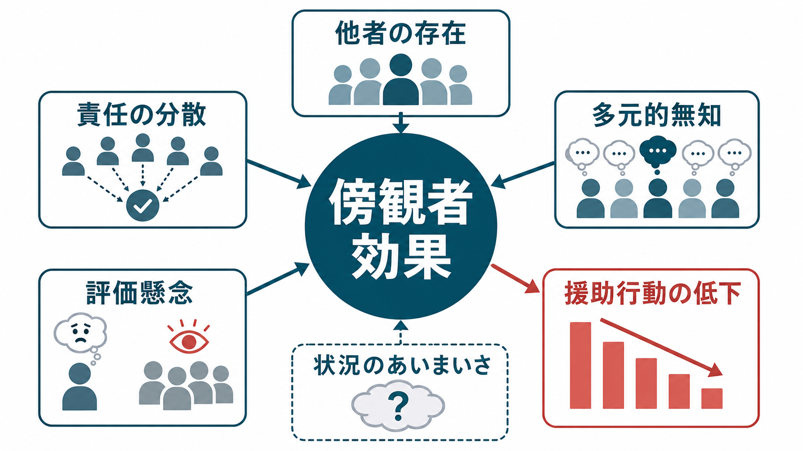
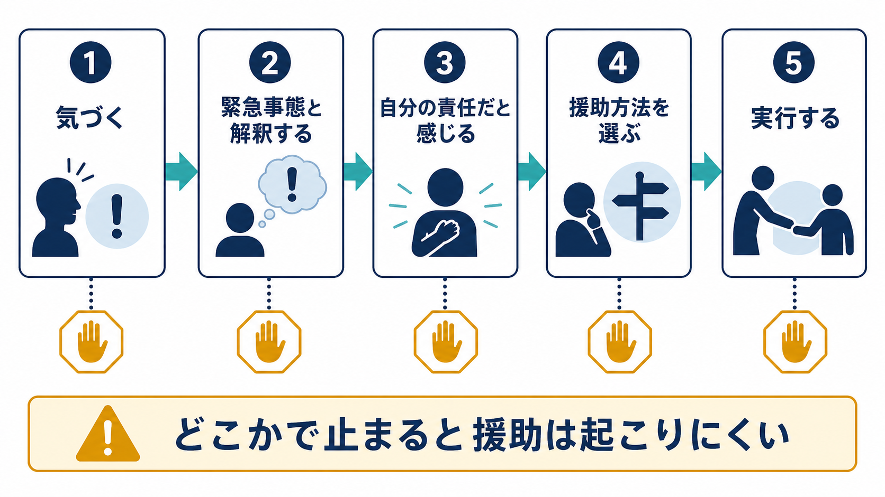
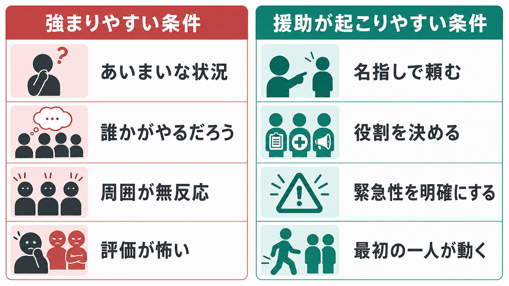

# 傍観者効果とは何か

## 要点

- 傍観者効果とは、援助が必要な場面で、周囲に他の傍観者がいるほど個人の援助行動が起こりにくくなる現象である[1]。
- 中心的な仕組みは、責任の分散、状況解釈のあいまいさ、多元的無知、評価懸念、援助方法の不確実性である[2][3]。
- 傍観者効果は「人は冷たい」という性格診断ではない。多くの場合、他者の存在が状況の読み方と責任感を変える[[社会心理学とは何か|社会心理学]]的現象である[1][2]。
- メタ分析では、全体として傍観者効果は確認される一方、危険性が明確な場面や、援助できる人が有能だと感じられる場面では弱まることも示されている[6]。
- 教育、臨床、組織、安全管理では、「誰か助けて」ではなく「あなたは119番」「あなたは周囲を確保」のように責任と行動を具体化することが重要になる。

## この記事で答える問い

1. 傍観者効果とは何か。
2. なぜ人は、他者がいると援助しにくくなるのか。
3. 傍観者効果は、どのような条件で強まり、どのような条件で弱まるのか。
4. 研究・臨床・教育の場面では、どのように理解すればよいのか。

## まず結論

傍観者効果は、援助行動が「本人の善意」だけで決まらないことを示す代表的な知見である。人は困っている人を見ても、状況が本当に緊急なのか、誰が責任を負うべきなのか、自分の行動が周囲からどう評価されるのか、何をすればよいのかを短時間で判断しなければならない。周囲に他者がいると、この判断過程に「他の人も見ている」「誰も動いていない」「自分が出ると大げさかもしれない」という情報が入り、援助が遅れやすくなる[1][2][3]。

## 背景

傍観者効果の研究は、Kitty Genovese 事件をめぐる社会的関心を背景に発展した。ただし、よく知られた「38人の目撃者が誰も助けなかった」という物語は、後年の検証では実際の証拠と単純には一致しないことが指摘されている[5]。重要なのは、その逸話をそのまま信じることではなく、「なぜ複数の人がいる場面で援助が止まるのか」という問いが実験的に検討されるようになったことである。

Darley と Latané の古典実験では、参加者が発作らしき緊急事態を音声越しに聞く状況が作られた。参加者が「自分だけが聞いている」と思った場合に比べ、「他にも聞いている人がいる」と思った場合には、援助を申し出る速さや割合が低下した[1]。これは、責任が「自分一人」から「その場にいる全員」へ薄まることを示す代表的な証拠である。

別の煙実験では、部屋に煙が入ってきても、周囲の人が無反応でいると参加者は緊急性を低く見積もりやすくなった[2]。これは、他者の沈黙が「危険ではないのかもしれない」という状況解釈を生むことを示している。ここには、[[同調とは何か|同調]]や[[集団規範とは何か|集団規範]]と近い力が働いている。

## 基本概念

### 傍観者

傍観者とは、困っている人や問題状況を直接・間接に見ているが、まだ援助や介入をしていない人である。身体的な緊急事態だけでなく、いじめ、ハラスメント、差別的発言、オンライン上の攻撃、医療・福祉現場の安全上の異変などでも、傍観者の行動は結果を左右する。

### 援助行動

援助行動は、直接助けることだけではない。声をかける、通報する、周囲に協力を求める、危険を避ける、記録する、専門家につなぐ、被害者のそばにいるなど、場面に応じた複数の形をとる。したがって、傍観者効果を減らすとは、全員が英雄的に飛び込むことではなく、状況に合った安全な行動選択肢を増やすことである。

### 責任の分散

責任の分散とは、他者がいることで「自分がやらなくても、誰かがやるだろう」と感じやすくなる過程である[1]。これは怠惰というより、責任の所在があいまいになる認知的な現象である。人数が増えるほど一人あたりの責任感が薄くなりやすい。

### 多元的無知

多元的無知とは、各人が内心では不安や疑問を持っていても、周囲が落ち着いて見えるため、「自分だけが大げさに受け取っているのだ」と解釈してしまう現象である。煙実験は、この仕組みをよく示している[2]。これは[[社会的比較とは何か|社会的比較]]や[[帰属理論とは何か|原因帰属]]とも関係する。

### 評価懸念

評価懸念とは、援助しようとして失敗したり、状況を誤解したり、周囲から目立ちすぎると見られたりすることへの不安である。特に、緊急性があいまいで、周囲が無反応な場面では、「動いた自分が恥をかくかもしれない」という懸念が援助を止める。

## 仕組み

Latané と Darley は、援助が起こるまでの過程を段階的に整理した。人は、まず出来事に気づき、それを緊急事態と解釈し、自分の責任だと感じ、援助方法を選び、実行する必要がある[3]。どこか一つの段階で止まると、援助は起こりにくくなる。

| 段階 | 何が必要か | 止まりやすい理由 |
|---|---|---|
| 気づく | 異変を知覚する | 注意が分散している、状況が見えにくい |
| 緊急事態と解釈する | これは助けが必要だと判断する | 周囲が無反応で、危険性を低く見積もる |
| 責任を感じる | 自分にも動く責任があると考える | 他の誰かがやるだろうと感じる |
| 援助方法を選ぶ | 具体的な行動を決める | 何をすれば安全で有効か分からない |
| 実行する | 実際に声を出す・動く | 失敗、恥、安全リスクを恐れる |

現実場面では、これらの段階はゆっくり順番に進むとは限らない。数秒のうちに、注意、解釈、感情、責任感、身体的安全、社会的評価が同時に働く。だからこそ、傍観者効果への対策では「勇気を出そう」と呼びかけるだけでなく、行動の手順をあらかじめ明確にする必要がある。

## 図解

傍観者効果が強まりやすい場面では、状況があいまいで、周囲が無反応で、責任の所在がぼやけている。逆に、援助が起こりやすい場面では、緊急性が明確で、役割が割り振られ、誰か一人が最初に動く。

## 臨床・研究との接続

臨床や教育の場で傍観者効果を扱うときは、個人の人格を決めつける説明を避ける必要がある。いじめ、ハラスメント、虐待疑い、自傷他害リスク、急変対応などの場面では、「見ていた人が悪い」と単純化するより、なぜ行動選択肢が見えにくかったのか、誰に責任があると理解されていたのか、相談・通報の経路が明確だったのかを検討する方が有用である。

フィールド研究では、地下鉄内での援助行動を観察した Piliavin らの研究が重要である。そこでは、援助は単純に人数だけで決まらず、被援助者の状態、援助のコスト、周囲のモデル行動などにも影響されることが示された[4]。つまり、傍観者効果は「人が多いほど必ず助けない」という機械的法則ではなく、場面の危険性、規範、役割、コストの評価と相互作用する。

また、メタ分析では、傍観者効果は多くの研究で確認される一方、危険性が高い場面、加害者の存在が明確な場面、援助者の能力や責任が明確な場面では、他者の存在が逆に介入を支える場合もある[6]。Levine と Crowther の研究も、同じ集団の成員や友人がいる場合には、集団サイズが援助を促すことがあると示している[7]。この点は、[[ステレオタイプとは何か|ステレオタイプ]]や集団間関係の視点ともつながる。

近年は、暴力場面への傍観者介入を仮想現実で研究する試みもある。VR は現実の危険を避けつつ、介入行動を比較的リアルな社会状況で観察できるため、教育・訓練や研究方法として注目されている[8]。ただし、VR や実験室での行動が日常場面にどこまで一般化できるかは慎重に読む必要がある。

## よくある誤解

### 誤解1: 傍観者効果は「都会の人は冷たい」という話である

傍観者効果は、都市性や道徳性だけで説明できない。古典実験では、見えない他者がいると思うだけでも援助が遅れた[1]。問題は、個人の冷淡さだけでなく、責任と状況解釈がどのように分配されるかである。

### 誤解2: 人数が多いほど必ず援助は減る

人数が多いと援助が抑制されやすい条件はあるが、常にそうなるわけではない。危険性が明確な場面、仲間がいる場面、最初の一人が動いた場面では、他者の存在が安全確保や役割分担を助けることもある[6][7]。

### 誤解3: 傍観者効果を知れば、必ず行動できる

知識は重要だが、それだけでは十分ではない。実際の場面では、不安、危険、評価懸念、情報不足が同時に生じる。効果的なのは、知識に加えて、名指し、役割分担、通報手順、相談先、訓練を組み合わせることである。

### 誤解4: 傍観者は何もしない人だけを指す

傍観者は、何もしない人に限らない。直接介入、間接介入、記録、通報、被害者への事後支援など、複数の行動を選びうる立場である。オンライン上でも、攻撃的投稿に同調しない、被害者を支える、管理者へ報告するなどの行動がありうる。

## 関連ノート

- [[社会心理学とは何か]]
- [[同調とは何か]]
- [[集団規範とは何か]]
- [[帰属理論とは何か]]
- [[社会的比較とは何か]]
- [[ステレオタイプとは何か]]
- [[服従とは何か]]

### MOC更新候補

- `content/00_MOC/MOC・認知科学・心理学.md`
- `content/00_MOC/MOC・社会心理学.md`

並列ジョブとの競合を避けるため、本記事では MOC 本体の更新は行わない。

## 理解チェック

1. 傍観者効果における「責任の分散」とは何か。
2. 周囲が無反応であることは、なぜ援助行動を抑制しうるのか。
3. Latané と Darley の五段階モデルでは、援助が起こるまでにどのような判断が必要か。
4. 傍観者効果を減らすために、「誰か助けて」よりも「あなたは救急通報をしてください」が有効になりやすいのはなぜか。
5. 傍観者効果を個人の性格だけで説明すると、どのような問題があるか。

## 参考文献

[1] Darley, J. M., & Latané, B. (1968). Bystander intervention in emergencies: Diffusion of responsibility. *Journal of Personality and Social Psychology, 8*(4), 377-383. https://doi.org/10.1037/h0025589

[2] Latané, B., & Darley, J. M. (1968). Group inhibition of bystander intervention in emergencies. *Journal of Personality and Social Psychology, 10*(3), 215-221. https://doi.org/10.1037/h0026570

[3] Latané, B., & Darley, J. M. (1970). *The unresponsive bystander: Why doesn’t he help?* Appleton-Century-Crofts. https://cir.nii.ac.jp/crid/1130000797504916736

[4] Piliavin, I. M., Rodin, J., & Piliavin, J. A. (1969). Good Samaritanism: An underground phenomenon? *Journal of Personality and Social Psychology, 13*(4), 289-299. https://doi.org/10.1037/h0028433

[5] Manning, R., Levine, M., & Collins, A. (2007). The Kitty Genovese murder and the social psychology of helping: The parable of the 38 witnesses. *American Psychologist, 62*(6), 555-562. https://doi.org/10.1037/0003-066X.62.6.555

[6] Fischer, P., Krueger, J. I., Greitemeyer, T., Vogrincic, C., Kastenmüller, A., Frey, D., Heene, M., Wicher, M., & Kainbacher, M. (2011). The bystander-effect: A meta-analytic review on bystander intervention in dangerous and non-dangerous emergencies. *Psychological Bulletin, 137*(4), 517-537. https://doi.org/10.1037/a0023304

[7] Levine, M., & Crowther, S. (2008). The responsive bystander: How social group membership and group size can encourage as well as inhibit bystander intervention. *Journal of Personality and Social Psychology, 95*(6), 1429-1439. https://doi.org/10.1037/a0012634

[8] Rovira, A., & Slater, M. (2022). Encouraging bystander helping behaviour in a violent incident: A virtual reality study using reinforcement learning. *Scientific Reports, 12*, 3843. https://doi.org/10.1038/s41598-022-07872-3

## 未解決問題

- 実験室・VR・オンライン環境で観察される傍観者行動が、日常の複雑な人間関係にどこまで一般化できるか。
- 文化、ジェンダー、年齢、権力関係、集団同一性が、援助行動と沈黙にどのように相互作用するか。
- いじめ・ハラスメント・医療安全・災害対応で、傍観者介入訓練をどのように設計すれば、効果が持続するか。
