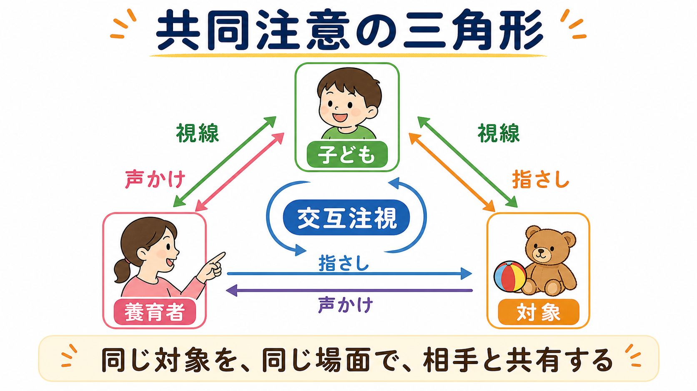
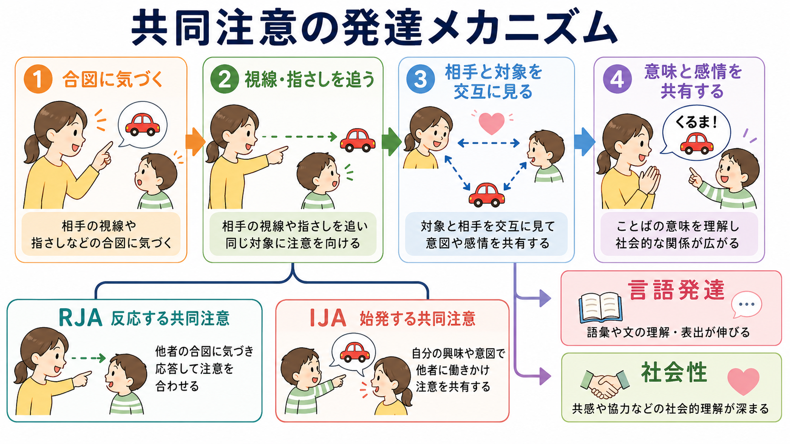
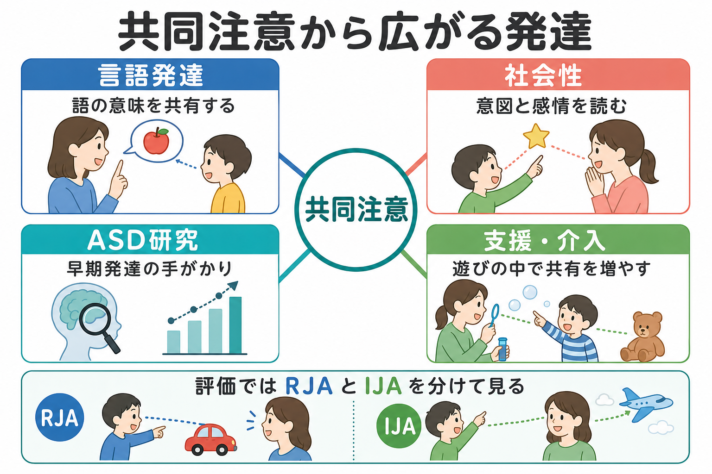

# 共同注意とは何か

## 要点

- 共同注意とは、子ども・他者・対象のあいだで注意を調整し、同じものを「一緒に見ている」状態を作る能力である[1][2]。
- 乳児は大人の視線や指さしを追うだけでなく、自分から対象を示して相手の注意を引き、経験を共有するようになる[2][3]。
- 共同注意は、語の意味を相手と同じ場面で確かめる足場になるため、[[言語発達はどのように進むのか|言語発達]]や[[社会的認知とは何か|社会的認知]]と深く関係する[4][5]。
- ASD研究では、共同注意の困難が社会コミュニケーションや言語発達の理解に重要な手がかりを与えてきた。ただし、共同注意だけで個人を診断したり、発達全体を説明したりすることはできない[5][6]。
- 支援では、単に「目を見る」ことを増やすより、遊び・会話・情動共有の中で、相手と対象を往復する経験を増やすことが重要である[7][8]。

## この記事で答える問い

1. 共同注意とは、普通の[[注意とは何か|注意]]や視線追従と何が違うのか。
2. なぜ共同注意は、言語や社会性の発達に関係するのか。
3. RJA と IJA は何を分けているのか。
4. ASD研究や発達支援では、共同注意をどのように扱うべきか。

## まず結論

共同注意は、「同じものを見る」だけではなく、「相手がそれを見ていることを踏まえながら、自分もその対象に注意を向ける」能力である。たとえば養育者が犬を指さして「わんわんだね」と言い、子どもが犬を見るだけでなく、養育者の顔を見返して笑う。このとき、子どもは対象、相手、相手の反応を一つの出来事として結びつけている。

この三角形ができると、言葉は単なる音ではなく、「いま一緒に見ているものを指す記号」として学ばれやすくなる。さらに、相手が何に驚き、何を喜び、何を意図しているかを読む足場にもなる。共同注意は、[[心の理論はどのように発達するのか|心の理論]]や[[共感は認知機能としてどう理解できるのか|共感]]に先行する、初期の社会的足場として理解できる[2][4]。

## 背景

共同注意研究の古典的出発点の一つは、乳児が大人の視線方向を追えるかを調べた Scaife と Bruner の研究である。彼らは、生後1年目の乳児が成人の視線変化に反応し、周囲の対象へ注意を向ける能力を持つことを報告した[1]。この研究は、乳児の注意が個体内の処理に閉じているのではなく、他者の行為によって組織化されることを示す重要な端緒になった。

その後、Carpenter らは9か月から15か月の乳児を縦断的に調べ、共同注意、模倣、身振り、初期語彙が互いに関連して発達することを示した[2]。つまり、共同注意は「言語が出る前の前段階」にとどまらず、身振り・発声・語彙・社会的理解をつなぐ発達的な交差点である。

## 基本概念

### 共同注意の三角形

共同注意は、少なくとも三つの要素から成る。

| 要素 | 役割 | 例 |
|---|---|---|
| 子ども | 注意を向け、相手の注意も読む主体 | 相手の顔と対象を交互に見る |
| 他者 | 視線、指さし、声かけで対象を示す相手 | 「見て、電車だよ」と言う |
| 対象 | 共有される物・出来事・行為 | 犬、車、音、絵本の絵 |

単なる視線追従では、子どもが相手の見ている方向へ目を向けるだけでも成立する。共同注意では、それに加えて「相手と対象を共有している」という相互的な調整が入る。したがって、子どもが対象を見たあとに相手の顔を見返す、笑いを共有する、指さして知らせる、といった行動が重要になる[2][3]。

### RJA と IJA

共同注意はしばしば、RJA と IJA に分けて測定される。

| 区分 | 日本語での意味 | 典型例 | 発達上の意味 |
|---|---|---|---|
| RJA | 反応する共同注意 | 大人の指さしや視線を追って対象を見る | 相手の注意方向を利用する |
| IJA | 始発する共同注意 | 子どもが指さしや視線で相手に対象を知らせる | 自分の経験を相手と共有する |

RJA は「他者の合図に気づく力」、IJA は「自分から共有を始める力」と言える。どちらも重要だが、研究では測定方法や年齢によって言語との関連の強さが変わる。系統的レビューとメタ回帰では、ASD群では共同注意と言語の関連が定型発達群より強く、RJA が言語指標と特に強く関連する傾向が報告されている[5]。

## 仕組み

共同注意の仕組みは、次のような流れで考えると理解しやすい。

1. 相手の合図に気づく  
   視線、顔の向き、指さし、声の調子などが、子どもの[[選択的注意はどのように働くのか|選択的注意]]を対象へ向ける。

2. 相手と同じ対象を見る  
   子どもは、他者の注意方向を使って、環境の中から重要な対象を選び出す[1][3]。

3. 対象と相手を交互に見る  
   対象そのものだけでなく、相手がそれをどう感じ、どう扱っているかを読む。ここで情動共有や意図理解が関わる[3][4]。

4. 共有された意味が生まれる  
   「りんご」という音声、赤い丸い物体、相手の指さし、食べる行為が同じ出来事の中で結びつく。これが語彙学習や[[言語理解はどのように行われるのか|言語理解]]の足場になる[4][5]。

Mundy と Newell は、共同注意を自己の注意と他者の注意を同時に処理する分散的な注意システムとして整理した[3]。この見方では、共同注意は単一の「社会性スキル」ではなく、前方・後方の注意システム、視線処理、情動調整、動機づけ、実行制御が組み合わさった発達的システムである。Mundy らのモデルでは、このシステムの反復的な使用が、のちの社会的認知や象徴機能の発達に関わるとされる[4]。

## 図解

図1は、共同注意を「子ども・養育者・対象」の三角形として表している。重要なのは、対象に向かう矢印だけではなく、子どもと養育者のあいだを往復する視線や声かけである。

図2は、共同注意が発達に作用する流れを示している。相手の合図に気づき、同じ対象に注意を向け、対象と相手を交互に見て、意味や感情を共有する。この連鎖が、語彙、文理解、協同的な遊び、社会的理解へ広がる。

図3は、共同注意が研究・臨床・日常の実践へ接続する様子をまとめている。共同注意は評価指標としても、支援目標としても有用だが、行動を一つ取り出して「できる／できない」と判定するより、場面、相手、遊びの文脈、子どもの興味を含めて見る必要がある。

## 臨床・研究との接続

### 言語発達との関係

共同注意は、言葉の「参照先」を相手と共有する仕組みである。子どもが新しい語を聞いたとき、どの対象にその語が対応するかは曖昧である。共同注意が成立していると、相手の視線や指さし、声のタイミングが、語の意味を推測する手がかりになる[2][4]。

Adamson らの研究では、定型発達、ASD、発達遅延の幼児を24か月と31か月で調べ、共同注意スキルだけでなく、親子が一緒に遊びへ関わる joint engagement が後の表出語彙を予測することが示された[6]。これは、共同注意を個別行動として測るだけでなく、相互作用の持続的な質として見る必要があることを示している。

### ASD研究との関係

ASD研究では、共同注意の困難は早期社会コミュニケーションの重要な指標として扱われてきた。特に、自分から相手に面白い対象を知らせる IJA の少なさや、相手の指さし・視線への反応の弱さは、早期発達評価で注目される[5][8]。

ただし、共同注意の困難は「ASDの人は他者に関心がない」という単純な説明ではない。感覚処理、注意の切り替え、予測、運動計画、言語理解、相互作用経験などが複合的に関わる。共同注意評価は行動観察、親子相互作用、発達検査、視線計測などに広がっているが、測定方法、対象集団、妥当性の違いに注意が必要である[5][8]。

### 支援・介入との関係

共同注意への支援は、子どもに「目を合わせなさい」と求めることではない。むしろ、子どもが興味を持つ対象を起点に、相手と見る、渡す、見せる、待つ、声を合わせる、遊びを広げる、といった相互作用を増やすことが中心になる。

Kasari らのランダム化比較試験では、ASDの幼児を対象に共同注意や象徴遊びを標的にした介入を行い、介入後だけでなく12か月後の言語アウトカムも評価した[7]。また、JASPERに関する系統的レビューは、自然主義的発達行動介入としての有望性を整理しつつ、研究間のばらつきやさらなる検証の必要性も指摘している[8]。したがって、臨床的には「共同注意を増やせば必ず言語が伸びる」と断定するのではなく、子どもの発達水準、興味、家族・保育環境、他の支援目標と合わせて考える必要がある。

## よくある誤解

### 誤解1: 共同注意は「目を合わせること」である

目を合わせることは共同注意の一部になりうるが、それだけではない。共同注意の中心は、相手と対象の関係を調整することである。目を合わせなくても、指さし、声、身体の向き、対象操作を通じて共有が成立することがある。

### 誤解2: 指さしがあれば共同注意は十分である

指さしには、欲しいものを要求する指さしと、面白いものを共有する指さしがある。共同注意で特に重要なのは、相手に何かを「知らせる」「一緒に感じる」ための指さしである。

### 誤解3: 共同注意が弱いと社会性がない

共同注意の困難は、社会的動機づけだけでなく、注意の切り替え、感覚過敏、運動、言語、場面理解とも関係する。個人の社会性を一つの行動だけで評価するのは避けるべきである。

### 誤解4: 共同注意は乳幼児期だけの問題である

共同注意は乳幼児期に目立って発達するが、成人の日常会話、授業、共同作業、医療面接、オンライン会議にも関わる。人は会話の中で、相手がどの画面、資料、出来事を見ているかを常に推測している。

## 関連ノート

- [[注意とは何か]]
- [[選択的注意はどのように働くのか]]
- [[社会的認知とは何か]]
- [[心の理論はどのように発達するのか]]
- [[言語発達はどのように進むのか]]
- [[言語理解はどのように行われるのか]]
- [[言語産出はどのように行われるのか]]
- [[共感は認知機能としてどう理解できるのか]]
- [[ASDは脳ネットワークの違いとして理解できるのか]]
- [[発達とは何か]]

## MOC更新候補

- `content/00_MOC/MOC｜認知科学・心理学.md` がある場合は、発達・社会的認知・言語発達の項目に本記事へのリンクを追加する。
- `content/00_MOC/MOC｜脳・神経科学.md` では、ASDや社会脳ネットワーク関連の補助リンクとして追加候補になる。

## 理解チェック

1. 共同注意が、単なる視線追従と異なる点は何か。
2. RJA と IJA は、それぞれどのような行動を指すか。
3. 共同注意が語彙学習を助けるのはなぜか。
4. ASD研究で共同注意を見るとき、どのような単純化を避けるべきか。
5. 支援場面で「目を見る」だけを目標にすると、何を見落としやすいか。

## 未解決問題

- 共同注意の行動指標が、文化差や家庭内相互作用の違いをどの程度受けるのか。
- RJA、IJA、joint engagement のどれが、どの年齢・どの発達特性で最も強く言語や社会性を予測するのか。
- AIや視線計測を用いた評価が、実生活の相互作用の質をどこまで反映できるのか。
- 共同注意支援の効果が、どの媒介過程を通じて言語、遊び、情動調整へ波及するのか。

## 参考文献

[1] Scaife, M., & Bruner, J. S. (1975). The capacity for joint visual attention in the infant. *Nature, 253*(5489), 265-266. https://doi.org/10.1038/253265a0

[2] Carpenter, M., Nagell, K., Tomasello, M., Butterworth, G., & Moore, C. (1998). Social cognition, joint attention, and communicative competence from 9 to 15 months of age. *Monographs of the Society for Research in Child Development, 63*(4), i-vi, 1-174. https://doi.org/10.2307/1166214

[3] Mundy, P., & Newell, L. (2007). Attention, joint attention, and social cognition. *Current Directions in Psychological Science, 16*(5), 269-274. https://doi.org/10.1111/j.1467-8721.2007.00518.x

[4] Mundy, P., Sullivan, L., & Mastergeorge, A. M. (2009). A parallel and distributed-processing model of joint attention, social cognition and autism. *Autism Research, 2*(1), 2-21. https://doi.org/10.1002/aur.61

[5] Bottema-Beutel, K. (2016). Associations between joint attention and language in autism spectrum disorder and typical development: A systematic review and meta-regression analysis. *Autism Research, 9*(10), 1021-1035. https://doi.org/10.1002/aur.1624

[6] Adamson, L. B., Bakeman, R., Suma, K., & Robins, D. L. (2019). An expanded view of joint attention: Skill, engagement, and language in typical development and autism. *Child Development, 90*(1), e1-e18. https://doi.org/10.1111/cdev.12973

[7] Kasari, C., Paparella, T., Freeman, S., & Jahromi, L. B. (2008). Language outcome in autism: Randomized comparison of joint attention and play interventions. *Journal of Consulting and Clinical Psychology, 76*(1), 125-137. https://doi.org/10.1037/0022-006X.76.1.125

[8] Waddington, H., Reynolds, J. E., Macaskill, E., Curtis, S., Taylor, L. J., & Whitehouse, A. J. O. (2021). The effects of JASPER intervention for children with autism spectrum disorder: A systematic review. *Autism, 25*(8), 2370-2385. https://doi.org/10.1177/13623613211019162
