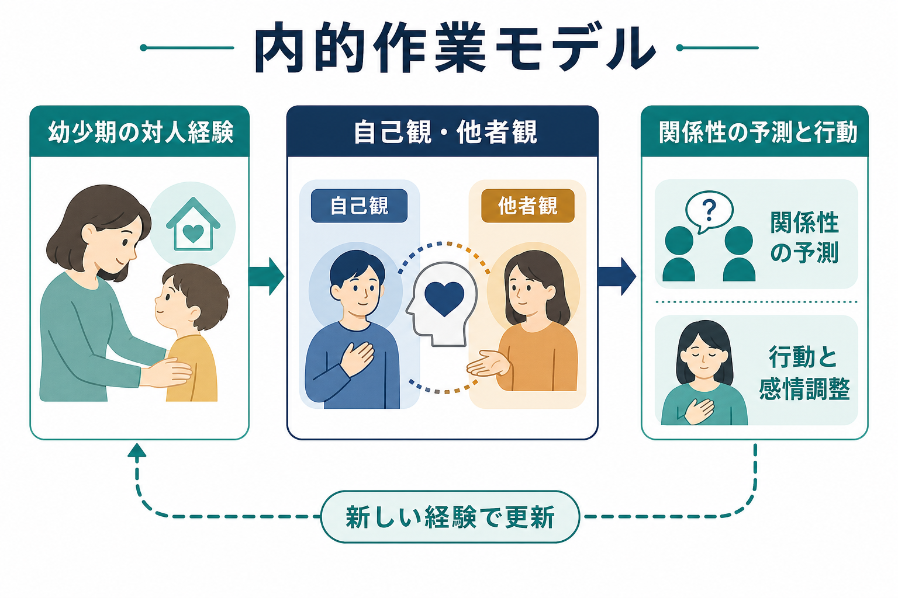
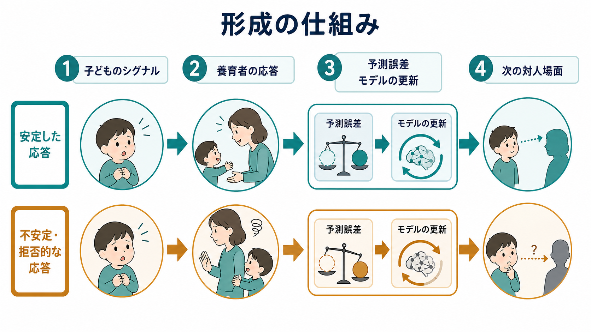
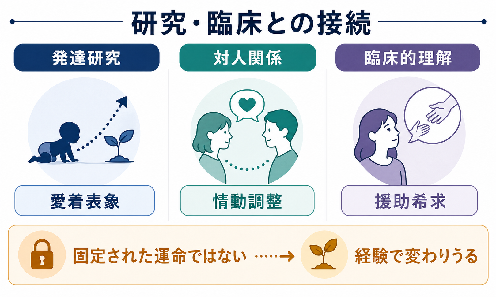

# 内的作業モデルとは何か

## 要点

- 内的作業モデルとは、愛着関係の経験から作られる「自分は助けを求めてもよい存在か」「他者は応答してくれる存在か」「関係はどのように進むか」についての予測モデルである。
- これは単なる記憶ではなく、注意、感情調整、援助希求、親密さへの接近・回避を方向づける実用的なモデルとして働く。
- 幼少期の経験は重要だが、内的作業モデルは固定された運命ではない。新しい関係経験、発達、心理療法、社会的支援によって更新されうる。
- 愛着分類を個人の性格ラベルや診断名として扱うと誤解が生じる。研究上の分類は、特定の文脈で観察された関係性のパターンを記述するための道具である。

## この記事で答える問い

1. 内的作業モデルは、何を「モデル化」しているのか。
2. 幼少期の養育経験は、どのように自己観・他者観・関係性の予測に変換されるのか。
3. 内的作業モデルは、成人期の対人関係や臨床理解とどう接続するのか。
4. 「愛着は一生変わらない」という理解は、どこが不正確なのか。

## まず結論

内的作業モデルは、[[愛着とは何か|愛着]]関係の経験から形成される、自己・他者・関係性についての予測的な表象である。Bowlby は、子どもが養育者との相互作用を通じて、愛着対象が利用可能か、自分のシグナルが受け取られるか、困ったときに近づいてよいかを学ぶと考えた[1]。この学習は、言葉で明示された信念だけでなく、身体反応、感情の立ち上がり、注意の向き、対人場面での自動的な予測として働く。

したがって内的作業モデルは、「私は価値がある」「人は信頼できる」といった静的な自己イメージだけではない。むしろ、対人場面で「何が起こりそうか」を先回りして見積もり、行動を準備する[[予測処理とは何か|予測モデル]]に近い。たとえば、困ったときに相手へ近づく、逆に頼る前から距離を取る、拒絶される可能性を強く読む、といった反応の背後には、過去の関係経験から作られた予測がある。

## 背景

愛着理論は、乳幼児が養育者に近づこうとする行動を、単なる依存や食物報酬の結果ではなく、安全を確保するための行動システムとして捉えた[1]。子どもは不安、疲労、痛み、見知らぬ状況に直面すると、愛着対象への接近を強める。一方で、安心できると探索行動が広がる。この「安全基地」と「探索」のバランスが、愛着理論の中心にある。

Ainsworth らのストレンジ・シチュエーション研究は、分離と再会の場面における乳幼児の行動から、安定型、回避型、抵抗・アンビバレント型などの愛着パターンを記述した[2]。ここで重要なのは、愛着パターンが子ども単体の性格ではなく、子どもと養育環境の相互作用として観察される点である。感受性の高い応答は、安全基地としての養育者表象を支えやすいが、応答の一貫性、家族のストレス、文化的実践、子どもの気質なども関与する。

Bretherton は、Bowlby と Ainsworth の理論史を整理し、内的作業モデルを愛着理論の中核概念として位置づけた[3]。さらに Bretherton と Munholland は、内的作業モデルが自己と愛着対象についての表象だけでなく、語り、記憶、感情、行動方略をまとめる構成概念であることを論じている[4]。

## 基本概念

### 何をモデル化しているのか

内的作業モデルは、少なくとも三つの問いへの予測を含む。

| 問い | モデル化される内容 | 対人場面での現れ |
|---|---|---|
| 自分はどう扱われる存在か | 自己の価値、助けを求める正当性、感情を出してよいか | 援助希求、自己開示、恥や罪悪感 |
| 他者はどう応答する存在か | 利用可能性、信頼性、拒絶や侵入の予測 | 接近、回避、過警戒、試し行動 |
| 関係はどう進むか | 距離の取り方、葛藤後の修復可能性、別離への予期 | 親密さ、依存、境界設定、葛藤処理 |

この意味で内的作業モデルは、[[社会の中の自己はどのように形成されるのか|社会的自己]]の一部である。自己は孤立した内面として作られるのではなく、他者からの応答を通じて「自分はどのような存在として扱われるか」を学習していく。

### 「内的」だが、個人の中だけに閉じない

「内的」という語は、モデルが心的表象として保持されることを指す。しかし、その内容は対人関係の中で形成され、関係の中で再活性化される。たとえば、ある人が普段は落ち着いていても、親密な相手から返信が遅れたときだけ強い不安を感じる場合、その場面が過去の関係予測を呼び起こしている可能性がある。

したがって、内的作業モデルを理解するときは、「その人の中にある性格特性」と「その人が置かれた関係文脈」を分けすぎない方がよい。モデルは個人内に保持されるが、活性化されるかどうかは相手、状況、ストレス、身体状態によって変わる。

## 仕組み

### 経験から予測へ

子どもは、泣く、しがみつく、視線を向ける、近づくといったシグナルを出す。それに対して養育者がどのように応答するかが、次の対人予測の材料になる。応答が比較的一貫しており、子どもの情動を調整する助けになる場合、子どもは「困ったときには近づける」「感情は調整可能である」という予測を形成しやすい[2][4]。

反対に、応答が読みにくい、拒否的、過度に侵入的、または子どもが恐怖を感じるようなものだと、子どもは別の方略を学ぶことがある。たとえば、感情を出すと拒絶されると予測すれば、助けを求める前に距離を取るかもしれない。応答が得られるかどうかが不確実なら、相手の反応を強く監視し、接近と怒りが混じった行動を示すかもしれない。

### 予測誤差と更新

内的作業モデルは、新しい経験を受け取るフィルターとして働く。過去に拒絶を多く経験した人は、曖昧な沈黙を「拒絶の兆候」と読みやすい。逆に、関係修復の経験が多い人は、一時的なすれ違いを関係の終わりとは解釈しにくい。

ここで重要なのは、モデルが現実を歪めるだけではなく、実際の行動を通じて環境を変えてしまうことである。拒絶を予測して早めに距離を取ると、相手は近づきにくくなり、「やはり人は応答しない」という経験が増えるかもしれない。これは予測が行動を生み、その行動が予測を強化する循環である。

ただし、予測と異なる経験が十分に安全な文脈で繰り返されると、モデルは更新されうる。Fraley のメタ分析と動的モデル研究は、愛着の安定性が乳幼児期から青年期・成人期にかけて中程度に見られる一方で、完全な固定ではないことを示している[6]。つまり、早期経験は強い初期条件になるが、後の経験が無意味になるわけではない。

### 明示的信念と暗黙的方略

内的作業モデルには、言葉で説明できる信念と、説明しにくい身体的・情動的な方略がある。本人が「人は信頼できる」と考えていても、親密な場面で急に不安が高まることがある。逆に「自分は人に頼らない」と語っていても、実際には拒絶への恐れを避けるために自立を強調している場合もある。

この点で、内的作業モデルは[[メタ認知とは何か|メタ認知]]の対象にもなる。自分の対人反応を「性格だから仕方ない」と見るだけでなく、「いま、どの予測が働いているのか」と観察できるようになると、反応と行動の間に選択の余地が生まれる。

## 図解

内的作業モデルは、発達研究、成人の対人関係研究、臨床的理解をつなぐ概念である。乳幼児期の愛着研究では、分離・再会場面や養育者の感受性が焦点になる。成人期の研究では、親密な関係、情動調整、援助希求、自己開示、葛藤処理が焦点になる。臨床的には、症状名を説明する単純な原因ではなく、対人場面で反復される予測と方略を理解する補助線として役立つ。

## 臨床・研究との接続

### 発達研究

Waters らの 20 年縦断研究では、乳児期のストレンジ・シチュエーションで評価された愛着安全性と、成人期の Adult Attachment Interview による愛着表象との関連が検討された[5]。このような研究は、早期の愛着経験が後の表象と関連しうることを示す一方、サンプルの特徴や生活上の変化を考慮する必要もある。

Fraley の研究は、愛着の安定性を「早期モデルが残り続けるプロトタイプ的過程」と「新しい経験によって改訂される過程」の両方から検討した[6]。この視点は、内的作業モデルを固定か可変かの二択で捉えるよりも、初期条件と更新過程の組み合わせとして見ることを促す。

### 成人の対人関係

成人愛着研究では、内的作業モデルは恋愛関係、友人関係、援助希求、感情調整、自己開示と結びつけて研究されてきた。Mikulincer と Shaver は、成人の愛着システムが、脅威を感じたときの接近、情動調整、親密さへの期待、自己・他者表象を組織すると整理している[7]。

これは「幼少期の親子関係が成人の恋愛を一対一で決める」という意味ではない。成人期には、友人、パートナー、教師、支援者、心理療法家など、複数の関係がモデルの更新に関わる。[[レジリエンスは学習されるのか|レジリエンス]]の観点からも、安定した関係経験や支援資源は、予測モデルの柔軟性を支える要因になりうる。

### 臨床的理解

臨床場面で内的作業モデルを使うときは、個別診断や治療指示としてではなく、対人場面で反復される予測と方略を理解するための枠組みとして扱う必要がある。たとえば、援助を求めにくい人を「抵抗的」とだけ見るのではなく、「頼ると拒絶される」「弱さを見せると支配される」といった予測が働いている可能性を考える。

ただし、不安定な愛着が精神疾患を直接決定するわけではない。メタ分析では、不安定・無秩序な愛着と子どもの内在化症状との関連は小さいが有意であり、外在化問題との関連の方が相対的に強い傾向も報告されている[8]。したがって、愛着はリスクや保護要因の一部として扱うべきで、単独の原因として過大評価してはいけない。

## よくある誤解

### 誤解1: 内的作業モデルは「性格」の別名である

内的作業モデルは、性格特性よりも関係文脈に結びついた予測である。ある関係では安心して頼れる人が、別の関係では強く警戒することがある。したがって、「この人は回避型だ」と固定的にラベルづけするより、「どの文脈で、どの予測が、どの行動方略を生んでいるか」を見る方が有用である。

### 誤解2: 幼少期で一生が決まる

幼少期の経験は重要な初期条件だが、内的作業モデルは後の経験で更新されうる。縦断研究は一定の連続性を示す一方、生活上の安定・不安定、関係経験、社会的支援による変化も無視できない[5][6]。

### 誤解3: 養育者のせいだけで説明できる

愛着は養育者の応答性と深く関わるが、単純な責任追及の道具ではない。家族の経済的・社会的ストレス、文化、子どもの気質、支援資源、世代間の経験が複雑に関与する。研究概念を使うときは、個人を責める説明ではなく、関係と環境を改善するための理解に向ける必要がある。

### 誤解4: 安定型だけが健康で、他は異常である

愛着分類は診断名ではない。不安定な方略も、ある環境では子どもが関係を維持し、情動を調整するための適応的な工夫だった可能性がある。問題は、その方略が別の環境でも自動的に使われ続け、現在の関係や生活を狭める場合である。

## 関連ノート

- [[社会の中の自己はどのように形成されるのか]]
- [[予測処理とは何か]]
- [[メタ認知とは何か]]
- [[レジリエンスは学習されるのか]]

## 理解チェック

1. 内的作業モデルは、自己観・他者観・関係性のどのような予測を含むか。
2. 「愛着分類は性格ラベルではない」と言える理由を説明できるか。
3. 早期経験が重要でありながら、内的作業モデルが固定された運命ではない理由を説明できるか。
4. 臨床場面で内的作業モデルを使うとき、個人を責める説明を避けるには何に注意すべきか。

## 関連ノート候補

- 愛着とは何か
- ストレンジ・シチュエーションとは何か
- 成人愛着とは何か
- 援助希求とは何か
- 情動調整とは何か
- 対人関係における予測誤差とは何か

## MOC更新候補

- `content/00_MOC/MOC｜認知科学・心理学.md`
- 発達・愛着・社会心理カテゴリの MOC が統合ジョブで更新される場合、本記事を「愛着・発達」「社会的自己」「対人予測」の入口として追加する。

## 未解決問題

- 内的作業モデルを、自己報告、面接、行動観察、神経・生理指標の間でどのように対応づけるべきか。
- 文化差や家族形態の多様性を考慮したとき、「安全基地」や「応答性」はどのように操作的に定義されるべきか。
- 心理療法や安定した対人経験が、どの条件で内的作業モデルの更新につながるのか。
- 予測処理や強化学習の枠組みで、愛着表象の安定性と変化をどこまで形式化できるか。

## 参考文献

[1] Bowlby, J. (1982). *Attachment and Loss: Vol. 1. Attachment* (2nd ed.). Basic Books. Original work published 1969. https://archive.org/details/attachmentloss0001bowl

[2] Ainsworth, M. D. S., Blehar, M. C., Waters, E., & Wall, S. (1978). *Patterns of Attachment: A Psychological Study of the Strange Situation*. Lawrence Erlbaum Associates. https://search.worldcat.org/title/Patterns-of-attachment-%3A-a-psychological-study-of-the-strange-situation/oclc/4194069

[3] Bretherton, I. (1992). The origins of attachment theory: John Bowlby and Mary Ainsworth. *Developmental Psychology, 28*(5), 759-775. https://doi.org/10.1037/0012-1649.28.5.759

[4] Bretherton, I., & Munholland, K. A. (2008). Internal working models in attachment relationships: Elaborating a central construct in attachment theory. In J. Cassidy & P. R. Shaver (Eds.), *Handbook of Attachment: Theory, Research, and Clinical Applications* (2nd ed., pp. 102-127). Guilford Press. https://www.scirp.org/reference/referencespapers?referenceid=3088023

[5] Waters, E., Merrick, S., Treboux, D., Crowell, J., & Albersheim, L. (2000). Attachment security in infancy and early adulthood: A twenty-year longitudinal study. *Child Development, 71*(3), 684-689. https://doi.org/10.1111/1467-8624.00176

[6] Fraley, R. C. (2002). Attachment stability from infancy to adulthood: Meta-analysis and dynamic modeling of developmental mechanisms. *Personality and Social Psychology Review, 6*(2), 123-151. https://doi.org/10.1207/S15327957PSPR0602_03

[7] Mikulincer, M., & Shaver, P. R. (2016). *Attachment in Adulthood: Structure, Dynamics, and Change* (2nd ed.). Guilford Press. https://www.guilford.com/books/Attachment-in-Adulthood/Mikulincer-Shaver/9781462533817

[8] Groh, A. M., Roisman, G. I., van IJzendoorn, M. H., Bakermans-Kranenburg, M. J., & Fearon, R. P. (2012). The significance of insecure and disorganized attachment for children's internalizing symptoms: A meta-analytic study. *Child Development, 83*(2), 591-610. https://doi.org/10.1111/j.1467-8624.2011.01711.x
