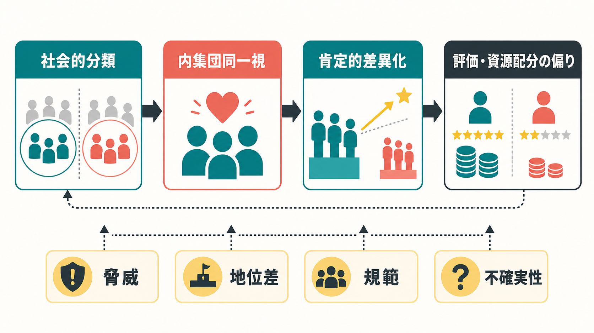
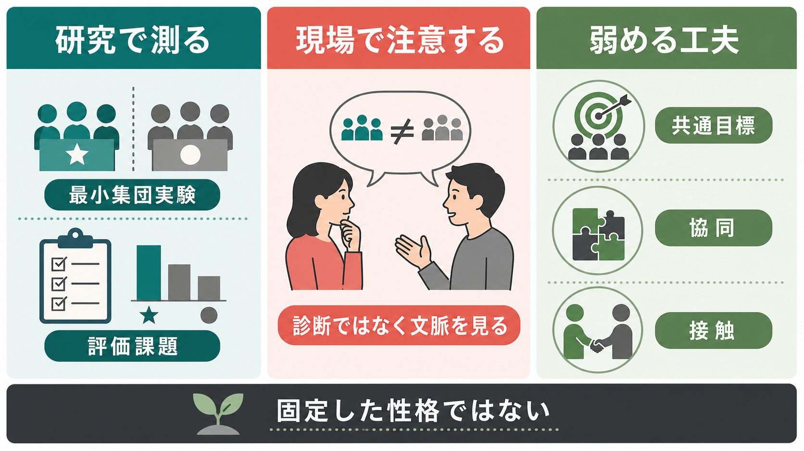

# 内集団バイアスとは何か

## 要点

- 内集団バイアスとは、自分が「私たち」と感じる集団を好意的に評価し、外集団を相対的に低く見る傾向である。
- 重要なのは、明確な敵意や過去の対立がなくても、単なる分類だけで内集団ひいきが生じうる点である [1][2]。
- 内集団バイアスは、[[認知バイアスとは何か]]の一種として理解できるが、個人内の判断の癖だけでなく、[[アイデンティティとは何か]]、[[集団規範とは何か]]、地位差、制度、脅威認知によって強まる。
- 内集団ひいきと外集団攻撃は同じではない。多くの場合、まず見られるのは「自分たちを少し高く評価する」形であり、それが常に露骨な差別行動に直結するわけではない [3]。
- 教育・臨床・組織支援では、個人の性格として断定せず、どの分類、場面、規範、権力差の中で偏りが生じているかを見る必要がある。

## この記事で答える問い

1. 内集団バイアスとは何か。
2. なぜ、ささいな分類だけで「自分たち」をひいきしやすくなるのか。
3. 内集団バイアスは、偏見、[[ステレオタイプとは何か]]、[[スティグマとは何か]]、差別とどう違うのか。
4. 研究や臨床・教育の現場では、どのような注意が必要か。

## まず結論

内集団バイアスは、「自分の集団はよい」「相手の集団は劣る」と最初から強く信じている人だけに起こる現象ではない。むしろ、人が状況を理解するために他者を分類し、その分類に自分の所属感や自尊感情、集団規範、利害、脅威認知が結びつくときに生じやすい、かなり一般的な社会的認知の偏りである [1][3]。

最小集団実験では、参加者は過去の対立も実質的な利害もない分類に置かれただけで、自分の集団側に報酬を多く配分しやすかった [1]。この発見は、集団間の偏りを「無知」「悪意」「個人の性格」だけで説明することの限界を示している。

## 背景

人は膨大な社会情報を処理するために、相手を何らかのカテゴリーで理解する。所属学校、職業、国籍、地域、専門職、診断名、世代、趣味、政治的立場などは、現実の社会生活でよく使われる分類である。分類そのものは必ずしも悪いものではない。分類があるからこそ、複雑な状況をすばやく把握し、協力相手を見つけ、役割を調整できる。

しかし、分類が「私たち」と「あの人たち」という境界を作ると、評価、記憶、注意、解釈、資源配分が偏ることがある。社会心理学では、このような集団間の偏りを、最小集団パラダイム、社会的アイデンティティ理論、自己カテゴリー化、接触仮説、社会神経科学などの枠組みから研究してきた [1][3][6][7]。

## 基本概念

### 内集団と外集団

内集団とは、本人が「自分はその一員である」と感じる集団である。外集団とは、その境界の外側に置かれる集団である。ここで重要なのは、内集団が固定されていないことである。同じ人でも、家庭では家族、職場では職種、研究場面では専門領域、地域場面では出身地が内集団として働くことがある。

### 内集団ひいきと外集団蔑視

内集団バイアスには、少なくとも二つの形がある。一つは、自分の集団をより好意的に見る内集団ひいきである。もう一つは、外集団を低く見る外集団蔑視である。レビュー研究では、この二つを区別することが重要だとされる。内集団を高く評価することが、常に外集団への敵意を意味するわけではない [3]。

### 偏見・ステレオタイプ・差別との違い

偏見は、ある集団に向けられた感情的・評価的な態度である。[[ステレオタイプとは何か]]は、集団に関する一般化された信念である。差別は、不公平な扱いとして現れる行動や制度である。内集団バイアスはこれらと重なるが、同義ではない。内集団バイアスは、評価や配分の小さな偏りとして現れることもあれば、ステレオタイプや制度的差別を支える一部になることもある。

## 仕組み

### 1. 社会的分類

最初の段階は、他者を何らかのカテゴリーに分けることである。Tajfel らの古典的研究では、実質的な意味の乏しい分類でも、内集団と外集団の境界が作られると報酬配分に差が出た [1]。これは、偏りが必ずしも長い対立史や個人的な恨みから始まるわけではないことを示す。

### 2. 内集団同一視

分類された集団が「自分の一部」と感じられると、その集団の評価は自己評価と結びつく。自分の集団がよく見えることは、自分の立場や価値が保たれる感覚につながる。内集団バイアスと自尊感情の関連を扱ったメタ分析では、自己評価の高さや測定方法、バイアスの表現形式によって関連の強さが変わることが示されている [5]。

### 3. 肯定的差異化

人は、自分の集団を他集団と比較し、よい意味で異なるものとして見たい。社会的アイデンティティの観点では、集団間比較は自己概念の一部を支える。したがって、内集団を高く評価することは、単なる情報処理ではなく、所属と価値を守る動機づけを含む [3]。

### 4. 地位差・脅威・規範

内集団バイアスは、どの集団でも同じ強さで出るわけではない。地位差、地位の安定性、地位の正当性、集団境界の越えやすさは、内集団バイアスを調整する。メタ分析では、高地位集団と低地位集団のバイアスは、地位が安定しているか、正当と見なされているか、集団間移動が可能かによって変わることが示されている [4]。

### 5. 脳・身体反応との接続

社会神経科学では、内集団・外集団の区別が、注意、価値づけ、共感、脅威処理、行動選択に関わる複数の神経システムと結びつくことが検討されている。ただし、特定の脳領域だけで「偏見がある」と診断できるわけではない。近年のレビューは、集団表象が文脈依存的に更新される点を重視している [6]。

## 図解

内集団バイアスを図式化すると、単純な「好き嫌い」ではなく、分類、同一視、比較、規範、制度、曖昧な判断が連鎖する過程として見える。実験では評価課題や資源配分課題として測られ、現場では会話、役割期待、機会配分、支援の届き方として現れる。したがって、個人の態度だけでなく、どの場面でどの分類が目立つようになっているかを確認する必要がある。

## 臨床・研究との接続

臨床や支援の場では、内集団バイアスを「この人は差別的である」と即断する道具として使うべきではない。むしろ、支援者側の専門職集団、患者・利用者側の属性、診断名、家族背景、文化、経済状況などが、評価や説明の仕方にどのような影響を与えているかを点検するための概念として使うのがよい。

たとえば、ある行動を「本人の性格」「家族の問題」「文化の問題」とすぐに説明してしまうと、状況要因や制度要因を見落とすことがある。これは、[[自己奉仕バイアスとは何か]]や帰属の偏りとも関係する。研究・教育目的で内集団バイアスを扱う場合も、個別の診断や治療指示としてではなく、判断がどの文脈で偏りやすいかを検討する枠組みとして用いる。

また、偏りを弱める方法としては、単に「仲良くする」だけでは不十分である。接触仮説のメタ分析では、集団間接触は全体として偏見低減と関連するが、接触の質、協同、制度的支持、共通目標などの条件が重要である [7]。つまり、外集団の人に会えば自動的に偏りが消えるのではなく、対等で協同的な接触を設計する必要がある。

## よくある誤解

### 誤解1: 内集団バイアスは悪意のある人だけに起こる

最小集団研究が示したのは、敵意や強い信念がなくても、分類だけで内集団ひいきが生じうるという点である [1]。したがって、内集団バイアスを理解するには、個人の道徳性だけでなく、分類が目立つ状況そのものを見る必要がある。

### 誤解2: 内集団を大切にすることは必ず悪い

内集団への愛着や協力は、社会生活に不可欠である。問題は、内集団を大切にすることそのものではなく、外集団を不当に低く見たり、機会や資源の配分を歪めたりする場合である。

### 誤解3: 偏りは知識を入れれば消える

知識は重要だが、十分条件ではない。内集団バイアスは、所属感、地位、脅威、規範、制度と結びつくため、情報提供だけでは変わりにくいことがある [3][4]。接触や協同の設計、評価基準の透明化、複数視点からの検討が必要になる。

### 誤解4: 脳反応を測れば本当の偏見がわかる

脳画像研究は、集団間関係の理解を深めるが、個人の偏見や差別性を単独で判定する検査ではない。集団表象は文脈依存的であり、課題、対象、関係性、社会的意味によって変わる [6]。

## 関連ノート

### 既存ノート

- [[認知バイアスとは何か]]
- [[アイデンティティとは何か]]
- [[ステレオタイプとは何か]]
- [[スティグマとは何か]]
- [[集団規範とは何か]]
- [[自己奉仕バイアスとは何か]]

### 関連ノート候補

- 社会的アイデンティティ理論とは何か
- 最小集団パラダイムとは何か
- 外集団同質性効果とは何か
- 接触仮説とは何か
- 偏見と差別は何が違うのか

### MOC更新候補

- `content/00_MOC/` 配下の認知科学・心理学系 MOC に追加候補。
- 並列実行時の衝突を避けるため、このジョブでは MOC 本体は更新しない。

## 理解チェック

1. 内集団バイアスと外集団攻撃は、どの点で同じではないか。
2. 最小集団実験は、集団間バイアスについて何を示したか。
3. 内集団バイアスを弱めるために、単なる接触だけではなく何が必要か。
4. 臨床・支援場面で、内集団バイアスを個人診断のように使うべきでないのはなぜか。

## 未解決問題

- 内集団ひいきが、どの条件で外集団への敵意や制度的差別に移行するのかは、文脈ごとに検討が必要である。
- オンライン空間では、集団境界が可視化されやすく、同時に匿名性やアルゴリズムによって偏りが増幅される可能性がある。
- 脳・身体反応を用いた研究は有用だが、社会的意味と制度的文脈を切り離すと過度に単純化される危険がある。

## 参考文献

[1] Tajfel, H., Billig, M. G., Bundy, R. P., & Flament, C. (1971). Social categorization and intergroup behaviour. *European Journal of Social Psychology, 1*(2), 149-178. https://doi.org/10.1002/ejsp.2420010202

[2] Brewer, M. B. (1979). In-group bias in the minimal intergroup situation: A cognitive-motivational analysis. *Psychological Bulletin, 86*(2), 307-324. https://doi.org/10.1037/0033-2909.86.2.307

[3] Hewstone, M., Rubin, M., & Willis, H. (2002). Intergroup bias. *Annual Review of Psychology, 53*, 575-604. https://doi.org/10.1146/annurev.psych.53.100901.135109

[4] Bettencourt, B. A., Dorr, N., Charlton, K., & Hume, D. L. (2001). Status differences and in-group bias: A meta-analytic examination of the effects of status stability, status legitimacy, and group permeability. *Psychological Bulletin, 127*(4), 520-542. https://doi.org/10.1037/0033-2909.127.4.520

[5] Aberson, C. L., Healy, M., & Romero, V. (2000). Ingroup bias and self-esteem: A meta-analysis. *Personality and Social Psychology Review, 4*(2), 157-173. https://doi.org/10.1207/S15327957PSPR0402_04

[6] Cikara, M., & Van Bavel, J. J. (2014). The neuroscience of intergroup relations: An integrative review. *Perspectives on Psychological Science, 9*(3), 245-274. https://doi.org/10.1177/1745691614527464

[7] Pettigrew, T. F., & Tropp, L. R. (2006). A meta-analytic test of intergroup contact theory. *Journal of Personality and Social Psychology, 90*(5), 751-783. https://doi.org/10.1037/0022-3514.90.5.751
