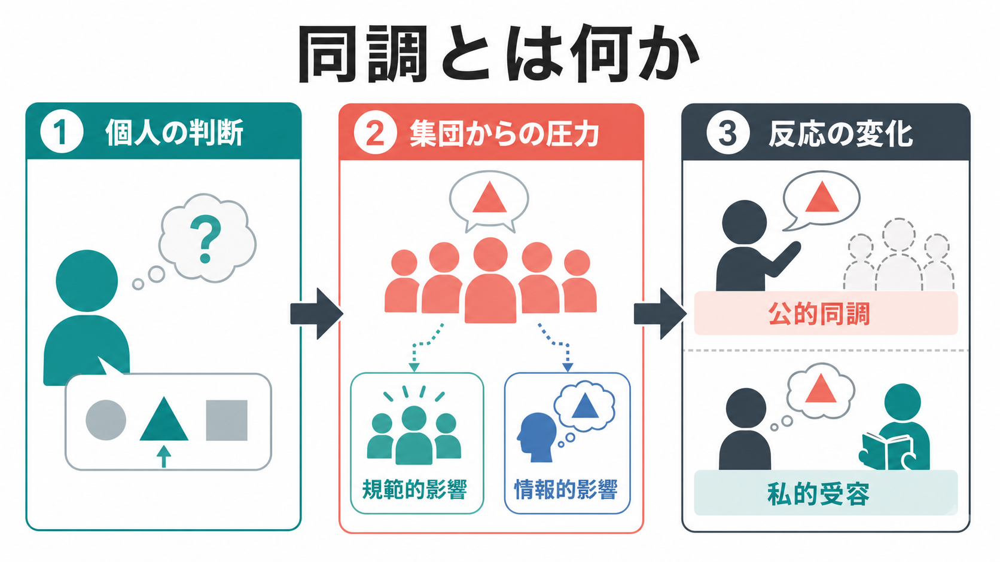
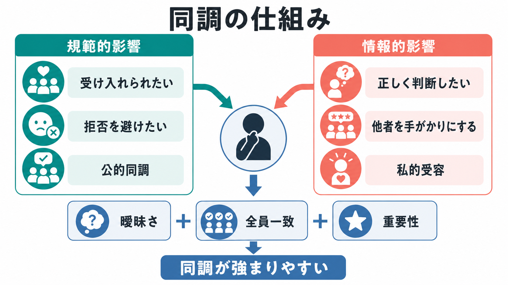
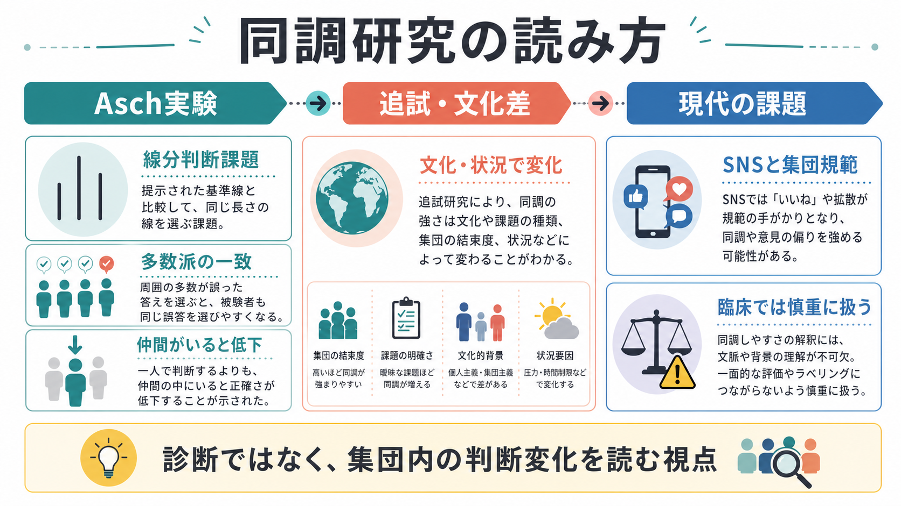

# 同調とは何か

## 要点

- 同調とは、個人の判断・発言・行動が、集団の多数派、規範、周囲の行動に近づく現象である。
- 代表的な仕組みは、受け入れられたい・拒否されたくないという「規範的影響」と、他者を正しさの手がかりにする「情報的影響」である [1][3]。
- Asch の線分判断実験は、明らかな知覚課題でも多数派の誤答が個人の反応を変えうることを示した [2]。
- 同調は「弱さ」や「盲従」だけではない。多くの場合、社会関係を保ち、曖昧な状況で判断コストを下げる適応的な働きも持つ [1]。
- ただし、集団の一致、反対者の不在、曖昧さ、権威、孤立感が重なると、誤った判断や自己検閲が強まりやすい [2][4][8]。

## この記事で答える問い

1. 同調は、服従・模倣・協調・社会的学習と何が違うのか。
2. なぜ人は、内心では違うと思っていても多数派に合わせるのか。
3. Asch 実験は何を示し、何を示していないのか。
4. 研究や臨床で同調を読むとき、どのような注意が必要か。

## まず結論

同調は、集団からの圧力や手がかりによって、個人の判断や行動が集団側へずれる過程である。ここで重要なのは、外から観察される「合わせる行動」と、本人の内的な信念変化を分けることである。発言だけを合わせる場合は公的同調に近く、本人の判断そのものが変わる場合は私的受容に近い [3][6]。

## 背景

社会の中で生きる人間は、単独で判断しているように見えても、他者の反応、所属集団の規範、場の空気、評判、罰や承認の予測に常に影響される。これは [[社会の中の自己はどのように形成されるのか]]、[[自己概念とは何か]]、[[アイデンティティとは何か]] と深く関わる。

社会的影響研究の中で、同調は「他者の存在や反応が、個人の判断や行動をどのように変えるか」を調べる中心テーマだった。Cialdini と Goldstein は、社会的影響を、正確に判断したい、他者と良い関係を保ちたい、望ましい自己像を保ちたいという複数の目標から整理している [1]。つまり同調は、単に「自分の意見がない」状態ではなく、正確性、所属、自己評価を同時に調整する過程として理解できる。

## 基本概念

### 同調

同調は、集団の意見・行動・規範に沿うように、個人の反応が変化することを指す。対象は、意見、知覚判断、購買、服装、発話スタイル、医療受診行動、SNS上の反応など幅広い。個人が意識して合わせることもあれば、ほとんど自覚せずに周囲の基準を取り込むこともある。

### 公的同調と私的受容

公的同調は、内心では違うと思っていても、発言や行動を周囲に合わせる場合である。私的受容は、他者の反応を手がかりにして、自分の判断や信念そのものが集団側へ変わる場合である [3][6]。この区別は、同じ「賛成」に見える反応でも、本人の内的理解が異なることを示す。

### 規範的影響と情報的影響

Deutsch と Gerard は、同調の主要な源泉として、規範的社会的影響と情報的社会的影響を区別した [3]。規範的影響は、受け入れられたい、孤立したくない、罰や嘲笑を避けたいという社会関係上の圧力である。情報的影響は、状況が曖昧なときに「他者の判断は正しいかもしれない」と考え、他者を情報源として使う過程である。

### 近い概念との違い

| 概念 | 中心にあるもの | 同調との違い |
|---|---|---|
| 模倣 | 他者の行動を写すこと | 意見や規範への圧力を含まない場合がある。[[観察学習とは何か]] と接続する。 |
| 服従 | 権威からの命令に従うこと | 多数派ではなく、命令者・制度・権威が主な源泉になる。 |
| 協調 | 共同目標のために行動を調整すること | 自律的な合意や役割分担を含み、圧力による反応変化とは限らない。 |
| ナッジ | 選択環境を通じた行動誘導 | 明示的な集団圧力がなくても起こる。[[ナッジとは何か]] と関連する。 |
| 集団思考 | 凝集性の高い集団で批判的検討が弱まること | 同調が集団意思決定の失敗へ広がった特殊な形として読める [8]。 |

## 仕組み

同調が強まる典型的な条件は、曖昧さ、多数派の一致、反対者の不在、反応が公開されること、所属集団の重要性、権威や評価の存在である。Asch 実験では、線分の長さという比較的明確な知覚課題でも、多数派が一致して誤答すると、参加者の反応が多数派側へずれた [2]。これは、明らかな課題でさえ、社会的場面では「正しい答え」だけでなく「この場でどう答えるべきか」が判断に入ることを示す。

ただし、Asch 実験は「人は常に多数派に屈する」と示したわけではない。重要なのは、反対者や仲間の存在で同調が下がりうる点である。文化差のメタ分析でも、同調の強さは課題、時代、文化、集団構成によって変わる [4]。日本の大学生を対象に、共謀者を使わずに Asch 型課題を再現した Mori と Arai の研究も、同調が実験手続きや集団構成に依存することを示している [5]。

心理過程としては、少なくとも三つの層がある。第一に、他者の反応を知覚する層である。第二に、その反応を「規範」「情報」「評価」「脅威」として解釈する層である。第三に、発言、沈黙、同意、反対、保留といった行動を選ぶ層である。この選択には [[自己制御とは何か]]、[[自己効力感とは何か]]、[[行動変容はどのように起こるのか]] も関わる。

## 図解

次の図は、古典実験から現代的応用までの読み方を整理したものである。ポイントは、同調を「個人の性格」だけに還元せず、課題の曖昧さ、集団の一致、文化、状況、反対意見の出しやすさを同時に見ることである。

## 臨床・研究との接続

臨床や教育の場では、同調を「本人の本当の意思がない」と決めつけるのは危険である。本人が沈黙したり同意したりしていても、それが理解、納得、諦め、恐怖、関係維持、場への配慮のどれに近いかは分けて考える必要がある。特に家族、学校、職場、治療関係のように関係性の力が非対称な場面では、公的同調が起こりやすい。

研究面では、同調は、社会規範、意思決定、[[認知バイアスとは何か]]、[[行動変容はどのように起こるのか]]、SNS上の意見形成と接続する。規範が焦点化されると行動が規範に沿いやすくなるという規範焦点理論は、同調が「周囲が何をしているか」だけでなく、「いま何が規範として目立っているか」に依存することを示す [7]。

臨床的に扱う場合は、同調しやすさを性格ラベルにしないことが重要である。たとえば不安、孤立、権威差、過去の対人経験、認知負荷、発達段階、文化的背景によって、同じ人でも同調の出方は変わる。したがって、同調は診断名ではなく、関係と状況の中で判断や行動がどう変化したかを読む視点として扱う。

## よくある誤解

### 誤解1: 同調は悪いことである

同調には、危険な判断停止や自己検閲につながる面がある。一方で、交通ルール、衛生行動、学習共同体、協力場面では、他者に合わせることが秩序や安全を支える。問題は同調そのものではなく、何に、どの程度、どのようなコストで合わせているかである。

### 誤解2: 同調する人は意思が弱い

同調は個人特性だけでは説明できない。課題が曖昧で、全員一致の多数派がいて、反対者が見えず、発言が公開される場面では、多くの人が同調しやすくなる [2][4]。これは [[自己効力感とは何か]] や [[自己制御とは何か]] の問題とも関わるが、状況要因を無視して個人の弱さに還元すると誤る。

### 誤解3: 多数派に合わせたら、必ず信念も変わっている

外から見える同意は、公的同調かもしれない。本人は内心で反対しているが、関係維持や安全確保のために合わせている場合がある。逆に、曖昧な状況で他者の判断を有効な情報として使い、私的受容が起こる場合もある [3]。

### 誤解4: 集団の一致は正しさの証拠である

集団の一致は重要な情報だが、常に正しさを保証しない。反対意見が出にくい集団では、沈黙が同意に見え、同意がさらに同意を生む。集団思考の研究は、凝集性の高い集団で批判的検討が弱まる危険を指摘してきた [8]。

## 関連ノート

- [[社会の中の自己はどのように形成されるのか]]
- [[自己概念とは何か]]
- [[アイデンティティとは何か]]
- [[観察学習とは何か]]
- [[ナッジとは何か]]
- [[自己効力感とは何か]]
- [[自己制御とは何か]]
- [[行動変容はどのように起こるのか]]
- [[心の理論はどのように発達するのか]]

MOC 更新候補: `content/00_MOC/MOC｜認知科学・心理学.md`、または社会心理学系 MOC が統合時に作成される場合はそこへ追加する。

## 理解チェック

1. 規範的影響と情報的影響は、それぞれどのような動機に基づくか。
2. 公的同調と私的受容は、外から見た「同意」だけで区別できるか。
3. Asch 実験が示したことと、示していないことは何か。
4. 臨床・教育場面で、同調を個人の性格だけで説明すると何が見落とされるか。
5. 集団の一致が、判断の質を下げる条件には何があるか。

## 参考文献

[1] Cialdini, R. B., & Goldstein, N. J. (2004). Social influence: Compliance and conformity. *Annual Review of Psychology*, 55, 591-621. https://doi.org/10.1146/annurev.psych.55.090902.142015

[2] Asch, S. E. (1955). Opinions and social pressure. *Scientific American*, 193(5), 31-35. https://doi.org/10.1038/scientificamerican1155-31

[3] Deutsch, M., & Gerard, H. B. (1955). A study of normative and informational social influences upon individual judgment. *The Journal of Abnormal and Social Psychology*, 51(3), 629-636. https://doi.org/10.1037/h0046408

[4] Bond, R., & Smith, P. B. (1996). Culture and conformity: A meta-analysis of studies using Asch's line judgment task. *Psychological Bulletin*, 119(1), 111-137. https://doi.org/10.1037/0033-2909.119.1.111

[5] Mori, K., & Arai, M. (2010). No need to fake it: Reproduction of the Asch experiment without confederates. *International Journal of Psychology*, 45(5), 390-397. https://doi.org/10.1080/00207591003774485

[6] Nail, P. R., MacDonald, G., & Levy, D. A. (2000). Proposal of a four-dimensional model of social response. *Psychological Bulletin*, 126(3), 454-470. https://doi.org/10.1037/0033-2909.126.3.454

[7] Cialdini, R. B., Reno, R. R., & Kallgren, C. A. (1990). A focus theory of normative conduct: Recycling the concept of norms to reduce littering in public places. *Journal of Personality and Social Psychology*, 58(6), 1015-1026. https://doi.org/10.1037/0022-3514.58.6.1015

[8] Janis, I. L. (1972). *Victims of Groupthink: A Psychological Study of Foreign-Policy Decisions and Fiascoes*. Houghton Mifflin. https://openlibrary.org/works/OL1282016W/Victims_of_groupthink

## 未解決問題

- オンライン環境で、可視化された「いいね」や拡散数が同調と意見分極に与える影響を、古典的な対面実験とどこまで同じ枠組みで扱えるか。
- 文化差や発達差を、個人主義・集団主義の単純な対比に還元せず、課題、関係性、制度、権力差と統合して説明する方法。
- 臨床・教育・組織場面で、必要な協調を保ちながら、反対意見を安全に表明できる条件をどう設計するか。
