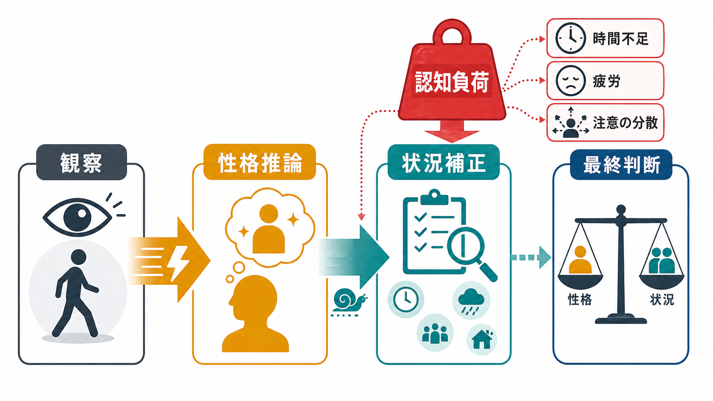
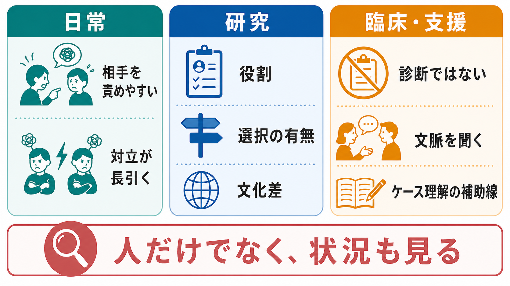

# 基本的帰属錯誤とは何か

## 要点

- 基本的帰属錯誤とは、他者の行動を説明するとき、状況・役割・制約よりも、その人の性格、態度、意図のせいだと考えやすい傾向である[1][3]。
- 古典的な態度帰属実験では、書き手が立場を選べなかった場合でも、観察者は文章内容から書き手の本当の態度を推測しやすかった[1]。
- クイズゲーム研究では、質問者と回答者という役割差があるだけでも、観察者は質問者をより知的だと評価しやすかった[2]。
- 仕組みとしては、行動から性格をすばやく推論し、その後で状況情報に基づいて補正するが、時間不足、疲労、注意分散などがあると補正が不十分になりやすい[5]。
- この傾向は人間関係、教育、医療・心理支援、組織判断に影響するが、個人診断や治療方針を直接決める概念ではない。

## この記事で答える問い

1. 基本的帰属錯誤とは何か。
2. なぜ人は、状況より性格で他者の行動を説明しやすいのか。
3. 代表的な実験は何を示したのか。
4. 研究・臨床・支援場面では、どのように役立ち、どこに注意が必要なのか。

## まず結論

基本的帰属錯誤は、「人の行動を見たとき、まずその人らしさの表れとして読んでしまう」社会的認知の偏りである。たとえば、相手が遅刻したときに「だらしない人だ」と考える一方で、交通遅延、睡眠不足、家庭の事情、職場の役割、直前の依頼といった状況要因を十分に見ない場合がある。

この偏りは、単なる性格の悪さではない。観察できるのは行動であり、状況制約は見えにくい。さらに、行動から人物特性を読む処理は速く、状況を調べて補正する処理は遅く、努力を要する。そのため、[[注意とは何か|注意]]や[[中央実行系とは何か|実行制御]]に余裕がない場面では、初期の性格説明が残りやすい[5]。

## 背景

帰属とは、出来事や行動の原因を説明することである。社会生活では、他者の行動を見て「なぜそうしたのか」を素早く推測しなければならない。相手が黙っているのは怒っているからなのか、疲れているからなのか。上司が厳しいのは性格なのか、制度上の責任なのか。こうした原因推論は、[[心の理論はどのように発達するのか|心の理論]]や社会的予測と深く関係する。

Heider 以降の帰属理論では、行動の原因を大きく内的要因と外的要因に分けて考える。内的要因とは、性格、態度、能力、意図など、行為者の内部にあると見なされる原因である。外的要因とは、役割、規範、偶然、報酬、罰、時間制約、他者からの圧力など、行為者の外側にある原因である[3]。

基本的帰属錯誤が問題にするのは、内的要因がいつも間違いだということではない。実際に性格や態度が行動に影響する場合はある。問題は、状況情報が十分にある場合でさえ、内的原因を過大評価し、外的原因を過小評価しやすい点にある[3][4]。

## 基本概念

### 基本的帰属錯誤

基本的帰属錯誤という語は、Ross が、直感的な人間理解に含まれる体系的な歪みを整理する中で広めた[3]。ここでの「錯誤」は、毎回の判断が必ず誤りであるという意味ではない。むしろ、複数の場面で繰り返し現れやすい方向性をもつ偏りを指す。

### 対応バイアス

関連語に対応バイアスがある。これは、観察された行動が、その人の内的な態度や性格に対応していると推論しやすい傾向である[4]。基本的帰属錯誤は、状況要因を過小評価する広い現象名として使われることが多く、対応バイアスは、行動から態度・性格への推論に焦点を当てる語として使われることが多い。

### 行為者・観察者の非対称性

自分の行動については、「忙しかった」「相手が急かした」「環境が悪かった」と状況を説明に入れやすい。一方、他者の行動については、その人の性格や態度として読んでしまいやすい。これは、行為者は自分を取り巻く状況を直接経験しているのに対し、観察者には行動そのものが目立つためである。

## 代表的な研究

Jones と Harris の態度帰属実験では、参加者はキューバのカストロ政権に賛成または反対する文章を読んだ。重要なのは、書き手が立場を自由に選んだ条件だけでなく、指定された立場で書いた条件でも、読み手が文章内容から書き手本人の態度を推測しやすかった点である[1]。つまり、選択の自由が制限されていても、行動内容が内的態度の証拠として読まれやすかった。

Ross, Amabile, Steinmetz のクイズゲーム研究では、質問者、回答者、観察者という役割が割り当てられた。質問者は自分が知っている問題を作れるため有利である。それでも観察者は、質問者を回答者より知的だと評価しやすかった[2]。これは、役割が作った差を個人能力の差として読み替える例である。

Gilbert らの研究は、帰属が二段階的に進む可能性を示した。人はまず行動から性格を自動的に推論し、その後で状況要因を考慮して補正する。しかし、認知的に忙しい条件では補正が弱まり、対応バイアスが残りやすい[5]。この考え方は、[[ヒューリスティックとは何か|ヒューリスティック]]や[[メタ認知とは何か|メタ認知]]の観点からも理解しやすい。

文化差研究も重要である。Morris と Peng は、魚の動きなどの説明で、アメリカ人参加者が対象の内的性質に、中国人参加者が文脈や関係に相対的に注目しやすいことを報告した[6]。Choi, Nisbett, Norenzayan はレビューで、帰属の偏りは普遍的に同じ強さで出るのではなく、文化、課題、文脈、利用可能な情報によって変わると整理している[7]。

## 仕組み

基本的帰属錯誤は、少なくとも三つの要因で起こりやすくなる。

第一に、行動は目立つが、状況は見えにくい。遅刻した人は目の前にいるが、電車遅延、家庭内の緊急事態、前の会議の長引きは観察者に見えない。観察可能性の差が、原因推論の差になる。

第二に、性格推論は速い。人は、表情、声、姿勢、行動の一部から、相手の態度や性格をすばやく読む。この処理は日常生活では有用だが、十分な検証なしに確信されると、誤った人物評価につながる。

第三に、状況補正は遅い。状況を調べるには、追加情報を集め、別の可能性を考え、初期印象を修正する必要がある。これは[[ワーキングメモリ容量はなぜ限られているのか|ワーキングメモリ]]や実行制御を使う処理であり、疲労や時間圧があると弱くなる[5]。

## 図解

| 図 | 主題 | 読み方 |
|---|---|---|
| 図1 | 性格推論と状況補正 | 観察された行動から性格推論が速く生じ、状況補正は認知負荷で弱まりうる。 |
| 図2 | 日常・研究・支援への接続 | 責めやすさ、役割差、選択の有無、文化差、臨床での慎重な使い方を整理する。 |

## 臨床・研究との接続

臨床・支援場面では、基本的帰属錯誤は、本人や家族、支援者、組織が「問題行動」をどう理解するかに関係する。たとえば、遅刻、無断欠席、怒り、沈黙、課題の未提出を、すぐに「怠け」「反抗」「性格」と見ると、睡眠、抑うつ、不安、発達特性、家庭状況、職場の負荷、制度的制約を見落としやすい。

ただし、この概念を逆向きに単純化して「すべて状況のせい」と考えるのも誤りである。臨床的には、行動、症状、生活史、環境、本人の意味づけ、支援資源を合わせてケース理解を行う必要がある。この記事は教育・研究目的の整理であり、個別の診断や治療指示を行うものではない。

研究では、帰属判断を測るとき、観察者がどの状況情報を知っていたのか、行為者の選択自由がどの程度あったのか、役割や制度がどのように行動を形づくったのかを明確にする必要がある。文化差研究が示すように、帰属の仕方は個人の認知能力だけでなく、社会的文脈や説明習慣にも左右される[6][7]。

## よくある誤解

### 誤解1: 性格で説明してはいけない

性格や態度が行動に関係することはある。基本的帰属錯誤が警告するのは、性格説明を禁止することではなく、状況説明を十分に検討しないまま性格説明に飛びつくことである。

### 誤解2: 知識があれば錯誤は消える

概念を知ることは役に立つが、時間不足、疲労、対立感情、組織内の役割差がある場面では、初期印象は残りやすい。判断を改善するには、「別の状況説明を一つ挙げる」「選択の自由があったか確認する」「役割が行動を作っていないか見る」といった手続きが必要になる。

### 誤解3: 文化差は単純な優劣を意味する

文化差研究は、ある文化が正しく別の文化が誤っているという話ではない。どの情報に注意を向けやすいか、どの説明様式が会話や教育で強調されるかが異なる、という問題として読む方がよい[7]。

## 関連ノート

- [[ヒューリスティックとは何か]]
- [[メタ認知とは何か]]
- [[注意とは何か]]
- [[中央実行系とは何か]]
- [[心の理論はどのように発達するのか]]
- [[予測処理とは何か]]

MOC更新候補: `content/00_MOC/` 配下の認知科学・心理学、社会心理、認知バイアス関連MOC。並列生成ジョブとの競合を避けるため、本記事ではMOC本体は更新しない。

今後の作成候補: 「帰属理論とは何か」「対応バイアスとは何か」「行為者観察者バイアスとは何か」「自己奉仕バイアスとは何か」「認知バイアスとは何か」。

## 理解チェック

1. 基本的帰属錯誤は、内的要因と外的要因のどちらを過大評価しやすい傾向か。
2. Jones と Harris の態度帰属実験では、なぜ「選択の自由」が重要な操作だったのか。
3. クイズゲーム研究は、役割と能力評価の関係について何を示したのか。
4. 認知負荷が高いと、なぜ状況補正が弱まりやすいのか。
5. 臨床・支援場面で、この概念を個別診断として使ってはいけない理由は何か。

## 未解決問題

- 状況補正を促す介入は、どの程度まで日常の対人判断に転移するのか。
- 文化差、組織階層、オンラインコミュニケーションは、帰属の偏りをどのように変えるのか。
- AI支援のケース記録や教育評価で、人物特性への過剰帰属をどのように検出・抑制できるのか。

## 参考文献

[1] Jones, E. E., & Harris, V. A. (1967). The attribution of attitudes. *Journal of Experimental Social Psychology, 3*(1), 1-24. https://doi.org/10.1016/0022-1031(67)90034-0

[2] Ross, L., Amabile, T. M., & Steinmetz, J. L. (1977). Social roles, social control, and biases in social-perception processes. *Journal of Personality and Social Psychology, 35*(7), 485-494. https://doi.org/10.1037/0022-3514.35.7.485

[3] Ross, L. (1977). The intuitive psychologist and his shortcomings: Distortions in the attribution process. In L. Berkowitz (Ed.), *Advances in Experimental Social Psychology* (Vol. 10, pp. 173-220). Academic Press. https://doi.org/10.1016/S0065-2601(08)60357-3

[4] Gilbert, D. T., & Malone, P. S. (1995). The correspondence bias. *Psychological Bulletin, 117*(1), 21-38. https://doi.org/10.1037/0033-2909.117.1.21

[5] Gilbert, D. T., Pelham, B. W., & Krull, D. S. (1988). On cognitive busyness: When person perceivers meet persons perceived. *Journal of Personality and Social Psychology, 54*(5), 733-740. https://doi.org/10.1037/0022-3514.54.5.733

[6] Morris, M. W., & Peng, K. (1994). Culture and cause: American and Chinese attributions for social and physical events. *Journal of Personality and Social Psychology, 67*(6), 949-971. https://doi.org/10.1037/0022-3514.67.6.949

[7] Choi, I., Nisbett, R. E., & Norenzayan, A. (1999). Causal attribution across cultures: Variation and universality. *Psychological Bulletin, 125*(1), 47-63. https://doi.org/10.1037/0033-2909.125.1.47

## 更新ログ

- 2026-04-28: 初稿作成。基本概念、古典研究、二段階的な仕組み、文化差、臨床・支援上の注意を整理し、生成インフォグラフィック2枚を追加。
