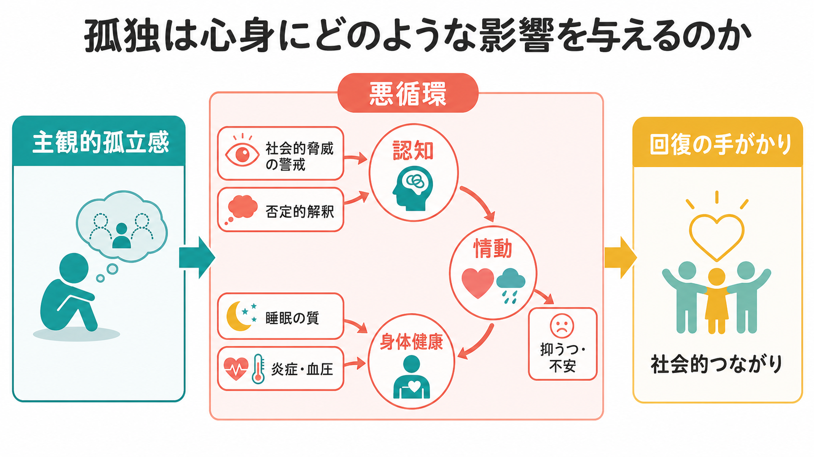
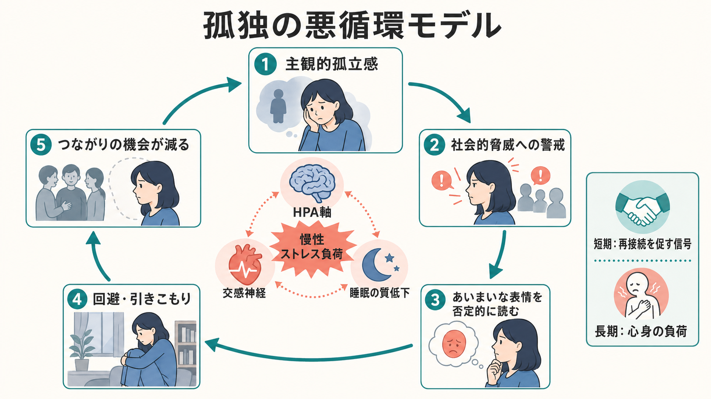
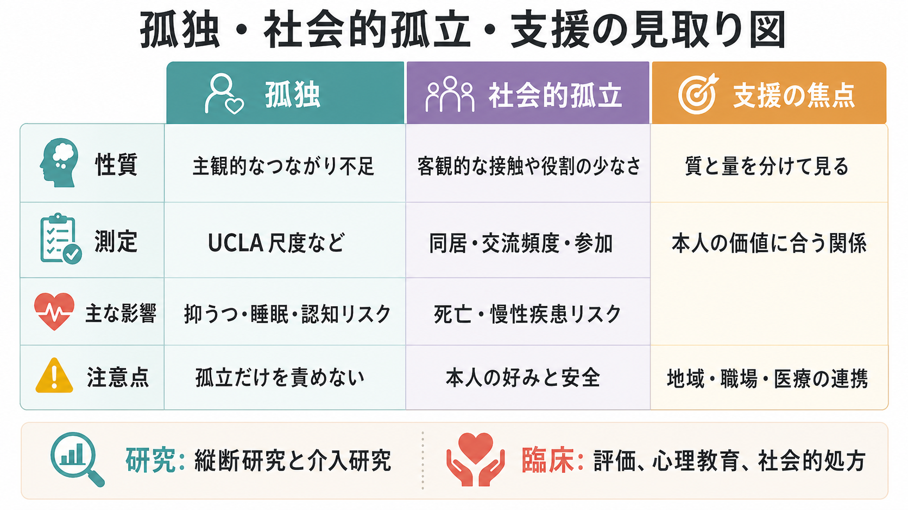

# 孤独は心身にどのような影響を与えるのか

## 要点

- 孤独は「人が少ない状態」そのものではなく、望むつながりと実際のつながりのずれとして経験される主観的孤立感である。
- 短期の孤独は再接続を促す信号になりうるが、長期化すると社会的脅威への警戒、否定的解釈、回避、睡眠の質低下、慢性ストレス負荷を通じて心身に影響する。
- 孤独と社会的孤立は重なるが同じではない。支援では、関係の「量」だけでなく、本人にとって意味のある関係の「質」を見る必要がある。

## この記事で答える問い

この記事では、[[社会心理学とは何か]]の視点から、孤独がなぜ単なる気分ではなく、認知、情動、行動、身体健康にまたがるリスク因子として扱われるのかを整理する。特に、孤独がどのように[[情動と認知は分けられるのか|情動と認知]]を変え、[[睡眠障害は脳機能にどのような影響を与えるのか|睡眠]]や慢性疾患リスクと接続するのかを扱う。

## まず結論

孤独の中心は「自分は必要なときに支えられないかもしれない」という主観的な安全感の低下である。これは不快な感情であるだけでなく、社会的手がかりを脅威寄りに読む認知スタイルを強め、対人場面での警戒や回避を増やす。結果として、孤独を減らすはずの接触機会がむしろ減り、孤独が維持されやすくなる[1][2]。

健康面では、孤独と社会的孤立はいずれも死亡リスクの上昇と関連する。2015年のメタ分析では、孤独、社会的孤立、独居はいずれも早期死亡リスクの上昇と関連し[4]、2023年の90コホート研究メタ分析でも、孤独と社会的孤立は全死亡リスクと関連した[5]。ただし、これらは多くが観察研究であり、孤独が単独で病気を「直接起こす」と断定するより、心理・行動・生理・社会環境が絡むリスク経路として理解するのが適切である。

## 背景

人間は、養育、学習、労働、病気への対処を、他者との関係の中で行う。孤独は、この関係網から「切り離されている」と感じる状態であり、客観的に一人でいる時間とは一致しない。人と頻繁に会っていても孤独を感じることはあるし、一人の時間が多くても本人が満足していれば孤独とは限らない。

この区別は臨床・研究の両方で重要である。社会的孤立は交流頻度、同居、参加、役割などから測れる客観的な状態であり、孤独は UCLA Loneliness Scale などで測られる主観的経験である。[[社会的支援は健康にどう影響するのか]]を考えるときも、支援者の人数だけでなく、必要なときに頼れる感覚、理解されている感覚、関係の相互性を分けて見る必要がある。

## 基本概念

孤独は、進化的には「社会的再接続を促す警告信号」と考えられる。空腹が食物探索を促すように、孤独は他者との安全なつながりを回復する方向へ注意を向ける。しかし、警告信号が長く続くと、周囲を安全な相手としてではなく、拒絶や軽視の可能性をもつ相手として読みやすくなる[3]。

ここで重要なのは、孤独が「弱さ」や「性格の問題」ではないという点である。転居、失業、病気、死別、介護、発達期の経験、差別や[[スティグマとは何か|スティグマ]]、職場・地域の構造など、孤独を生みやすい条件は個人の内側だけにない。したがって、孤独への対応も「もっと外に出るべきだ」という単純な助言では不十分である。

## 仕組み

### 1. 社会的脅威への警戒

孤独が高い状態では、他者の表情や発言を否定的に解釈しやすくなる。これは「傷つかないための予防的な読み」だが、相手の中立的な反応を拒絶として受け取ると、会話や参加の機会を避けやすくなる。Cacioppo と Hawkley は、孤独が注意、確認バイアス、抑うつ的認知、実行機能に影響し、自己防衛的だが自己敗北的な対人循環を作ると整理している[2]。

### 2. 情動と行動の閉じたループ

孤独は寂しさだけでなく、不安、苛立ち、恥、無力感とも結びつく。これらの情動は、他者に近づく行動を妨げることがある。たとえば「迷惑かもしれない」「どうせ断られる」という予測が強いと、連絡や参加を控える。すると実際の交流機会が減り、「自分にはつながりがない」という感覚がさらに強まる。

### 3. 睡眠と慢性ストレス

孤独は睡眠時間そのものよりも、睡眠の質や睡眠障害感と関連しやすい。2020年の系統的レビュー・メタ分析では、孤独は自己報告の睡眠障害と中等度に関連したが、睡眠時間との関連は明確ではなかった[7]。社会的に安全でないと感じる状態では、夜間も警戒が緩みにくく、回復の質が落ちる可能性がある。

生理面では、孤独は HPA軸、交感神経活動、炎症関連指標、健康行動を通じて負荷を高める経路が想定される[1][3]。ただし、炎症や血圧の所見は研究デザインや調整因子によって差があり、「孤独なら必ず炎症が上がる」と単純化しない方がよい。

### 4. 認知機能と認知症リスク

孤独は、注意や記憶そのものだけでなく、社会的手がかりの読み方、実行機能、抑うつ的認知を通じて認知機能に影響しうる[2]。2024年の大規模メタ分析では、孤独は全認知症、アルツハイマー病、血管性認知症、認知障害リスクの上昇と関連し、この関連は抑うつや社会的孤立などを調整しても残ると報告された[6]。ただし、孤独が原因なのか、初期の認知変化が孤独を増やすのか、双方向性があるのかは慎重に見る必要がある。

## 図解

孤独を理解するときは、「孤独」「社会的孤立」「支援」を分けると見通しがよくなる。孤独は主観的なつながり不足、社会的孤立は客観的な接触や役割の少なさ、支援は本人の価値や安全感に合う関係の回復を焦点にする。

## 臨床・研究との接続

臨床では、孤独を症状名として扱うより、抑うつ、不安、睡眠、慢性疾患、認知機能、生活機能を評価するときの背景要因として見るのが現実的である。米国公衆衛生局長官の勧告は、社会的つながりを個人の努力だけでなく、学校、職場、地域、医療、デジタル環境を含む公衆衛生課題として位置づけている[8]。

介入では、単に交流頻度を増やすだけでなく、孤独を維持する認知、関係の質、参加しやすい環境、身体疾患や聴覚・移動能力などの制約を一緒に見る必要がある。心理教育、認知行動的アプローチ、グループ活動、地域資源への橋渡し、社会的処方は候補になるが、本人の好みや安全を無視した参加の強制は逆効果になりうる。

研究では、孤独の測定時点、慢性か一過性か、社会的孤立との重なり、抑うつや身体疾患による交絡、文化差を丁寧に扱う必要がある。特に縦断研究と介入研究を組み合わせることで、孤独が健康に影響する経路と、健康問題が孤独を強める経路を分けやすくなる。

## よくある誤解

**誤解1: 一人でいる人は孤独である。**  
一人の時間は休息、集中、創造性に役立つことがある。問題は一人でいる量ではなく、望むつながりと実際のつながりのずれである。

**誤解2: 友人を増やせば解決する。**  
関係の数は重要だが、質、相互性、安全感、役割の意味も重要である。浅い接触が増えても、理解されていない感覚が残れば孤独は続く。

**誤解3: 孤独は高齢者だけの問題である。**  
高齢期には死別、疾病、移動制限などのリスクが増えるが、青年期、若年成人、子育て期、移住者、失業者、慢性疾患をもつ人にも孤独は起こる。

**誤解4: 孤独は本人の努力不足である。**  
孤独は個人の認知や行動だけでなく、貧困、差別、地域構造、労働環境、デジタル環境、医療アクセスとも関わる。個人を責める説明は、支援への接近をむしろ妨げる。

## 関連ノート

- [[社会心理学とは何か]]
- [[社会的支援は健康にどう影響するのか]]
- [[情動と認知は分けられるのか]]
- [[睡眠障害は脳機能にどのような影響を与えるのか]]
- [[炎症仮説はうつ病をどう説明するのか]]
- [[セロトニン仮説はうつ病をどこまで説明できるのか]]
- 認知症はどのように分類されるのか（今後の作成候補）
- 社会的処方とは何か（今後の作成候補）

## MOC更新候補

- `content/00_MOC/` 配下の心理学・社会心理学系 MOC に、本記事へのリンクを追加する候補。
- 並列ジョブとの競合を避けるため、本タスクでは MOC 本体は編集しない。

## 理解チェック

1. 孤独と社会的孤立はどの点で異なるか。
2. 孤独が「自己防衛的だが自己敗北的」な対人循環を作るとはどういう意味か。
3. 孤独と健康リスクの関連を読むとき、なぜ交絡や双方向性に注意する必要があるか。
4. 孤独への支援で、関係の「量」だけでなく「質」を見るべき理由は何か。

## 未解決問題

- 孤独を減らす介入のうち、どの成分が、どの年齢層・文化・生活状況で最も有効か。
- 孤独、抑うつ、睡眠、炎症、認知機能の因果順序を、どこまで個人内の時系列データで分けられるか。
- デジタルなつながりは、どの条件で孤独を軽減し、どの条件で比較や疎外感を強めるのか。

## 参考文献

[1] Hawkley, L. C. (2022). Loneliness and health. *Nature Reviews Disease Primers*, 8, 22. https://doi.org/10.1038/s41572-022-00355-9

[2] Cacioppo, J. T., & Hawkley, L. C. (2009). Perceived social isolation and cognition. *Trends in Cognitive Sciences*, 13(10), 447-454. https://doi.org/10.1016/j.tics.2009.06.005

[3] Hawkley, L. C., & Cacioppo, J. T. (2010). Loneliness matters: A theoretical and empirical review of consequences and mechanisms. *Annals of Behavioral Medicine*, 40(2), 218-227. https://doi.org/10.1007/s12160-010-9210-8

[4] Holt-Lunstad, J., Smith, T. B., Baker, M., Harris, T., & Stephenson, D. (2015). Loneliness and social isolation as risk factors for mortality: A meta-analytic review. *Perspectives on Psychological Science*, 10(2), 227-237. https://doi.org/10.1177/1745691614568352

[5] Wang, F., Gao, Y., Han, Z., et al. (2023). A systematic review and meta-analysis of 90 cohort studies of social isolation, loneliness and mortality. *Nature Human Behaviour*, 7, 1307-1319. https://doi.org/10.1038/s41562-023-01617-6

[6] Luchetti, M., Aschwanden, D., Sesker, A. A., et al. (2024). A meta-analysis of loneliness and risk of dementia using longitudinal data from >600,000 individuals. *Nature Mental Health*. https://doi.org/10.1038/s44220-024-00328-9

[7] Griffin, S. C., Williams, A. B., Ravyts, S. G., Mladen, S. N., & Rybarczyk, B. D. (2020). Loneliness and sleep: A systematic review and meta-analysis. *Health Psychology Open*, 7(1). https://doi.org/10.1177/2055102920913235

[8] Office of the Surgeon General. (2023). *Our Epidemic of Loneliness and Isolation: The U.S. Surgeon General's Advisory on the Healing Effects of Social Connection and Community*. U.S. Department of Health and Human Services. https://www.ncbi.nlm.nih.gov/books/NBK595227/
