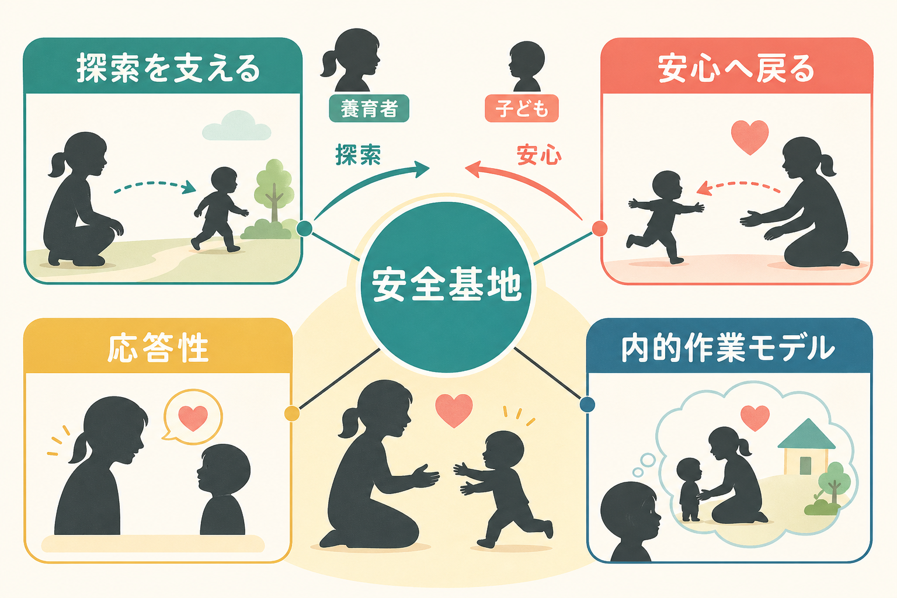
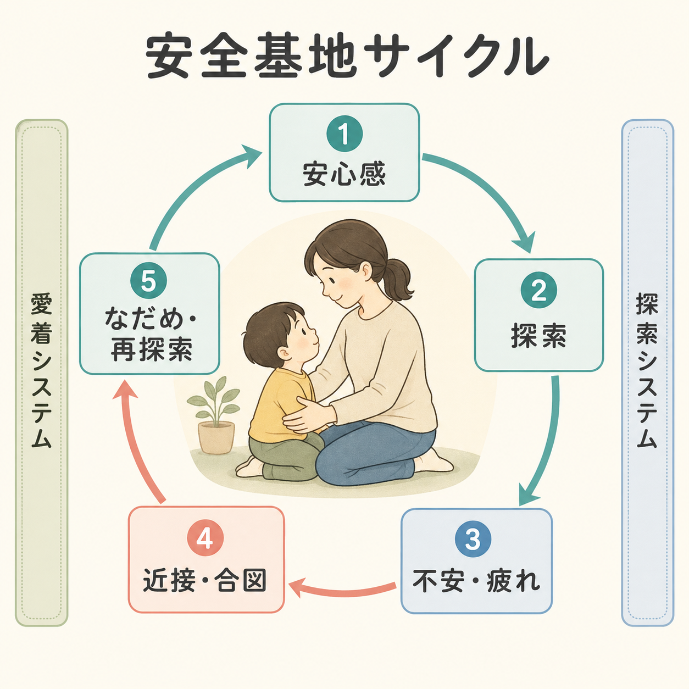
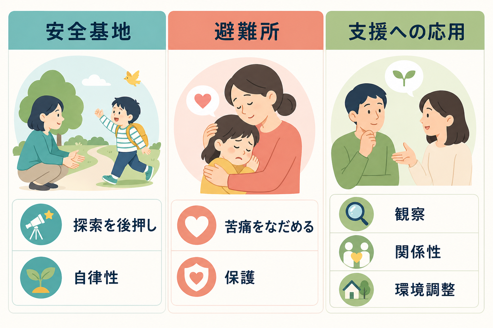

# 安全基地とは何か

## 要点

- 安全基地とは、子どもが不安なときに戻るだけでなく、安心して外界を探索するための関係的な拠点である。
- 愛着理論では、養育者の近接可能性、応答性、情動調整の支援が、探索行動と自律性を支えると考える[1][2]。
- 安全基地は「甘やかし」や「過保護」と同じではない。むしろ、戻れる場所があることで、子どもは環境へ出ていきやすくなる[3]。
- 安全基地の経験は、他者は助けてくれるか、自分は助けを求めてよい存在か、という内的作業モデルの形成と結びつく[4]。

## この記事で答える問い

1. 安全基地とは、愛着理論の中でどのような概念なのか。
2. なぜ安心できる関係が探索や自律性を促すのか。
3. 安全基地、避難所、過保護、依存はどう違うのか。
4. 発達研究や臨床的理解では、どのように使われる概念なのか。

## まず結論

安全基地とは、「困ったときに戻れる関係」があるからこそ、「離れて試せる」ようになるという愛着理論の中核概念である。子どもは、養育者が完全にそばにいるときだけ安心するのではない。養育者が必要なときに利用可能で、子どもの合図に応答し、過度に侵入せず見守るとき、子どもは周囲を探索し、失敗したら戻り、なだめられ、また探索へ向かう。この往復運動が安全基地の働きである[1][2]。

## 背景

愛着理論は、Bowlby が乳幼児と養育者の情緒的結びつきを、発達上の副産物ではなく、生存と発達に関わる行動システムとして位置づけたことから体系化された[1]。乳幼児は危険、疲労、痛み、見知らぬ人、分離などに直面すると、養育者への近接を求める。ここで重要なのは、愛着行動が「いつもくっついていること」ではなく、危険や不安に応じて活性化し、安心が回復すると探索へ戻る調整システムとして働く点である[2]。

Ainsworth と Bell のストレンジ・シチュエーション研究は、短い分離と再会の場面を通して、愛着行動と探索行動のバランスを観察した古典的研究である[2]。その後の分類研究では、安定した愛着を示す乳幼児は、養育者を安全基地として使い、分離で不安を示しても、再会後に接近・接触を通じて落ち着きを取り戻し、再び遊びや探索へ向かいやすいと整理された[3]。

## 基本概念

### 安全基地

安全基地は、探索を可能にする関係的な拠点である。子どもが養育者の存在を背景に環境へ注意を向け、玩具、人、場所、課題を試すとき、養育者は単なる保護者ではなく「探索を支える基盤」として機能している。安全基地の中心には、近接可能性、予測可能性、敏感な応答、過度に支配しない見守りがある[1][3]。

### 避難所

安全基地と近い概念に「避難所」がある。避難所は、苦痛、不安、疲労、痛みが高まったときに戻って落ち着く機能である。一方、安全基地は、落ち着いた後に外へ出ていく機能を含む。つまり、避難所は「戻る場所」、安全基地は「戻れるから出ていける場所」である[5]。

### 内的作業モデル

安全基地の経験は、子どもの記憶や期待の中に蓄積される。繰り返し「合図を出す、養育者が気づく、適切に応答する、落ち着く、活動を再開する」という経験があると、子どもは他者と自己についての予測モデルを作る。Waters らは、こうした経験が「安全基地スクリプト」として、困難に直面したときの時間的・因果的な物語構造をもつと論じた[4]。

## 仕組み

安全基地は、愛着システムと探索システムの切り替えとして理解できる。子どもが十分に安心しているとき、注意は環境へ向き、[[注意とは何か|注意]]、運動、好奇心が探索に使われる。ところが、疲労、見知らぬ状況、失敗、痛み、養育者との距離が大きくなると、愛着システムが活性化し、近接、視線、声、泣き、抱っこを求める行動が増える[2][3]。

養育者がその合図に気づき、子どもの状態に合った応答をすると、子どもの情動は調整される。このとき養育者は、子どもに代わってすべてを解決する必要はない。むしろ、安心を回復し、子どもが自分で再び試せる範囲を整えることが重要である。この点は、[[情動と認知は分けられるのか|情動と認知]]や[[共感は認知機能としてどう理解できるのか|共感]]の発達的基盤とも接続する。

この循環は、単発の行動ではなく、関係の履歴として積み上がる。安全基地スクリプトの観点では、典型的な流れは、活動している、困難に出会う、合図を出す、相手が認識し応答する、援助が受け入れられる、苦痛が下がる、活動へ戻る、という連鎖である[4]。この連鎖が安定しているほど、助けを求めることと自律することは対立しにくくなる。

## 図解

安全基地を理解するときは、次の三つを分けると見通しがよくなる。

| 観点 | 主な機能 | 行動の例 |
|---|---|---|
| 安全基地 | 探索を支える | 養育者を見ながら遊びに向かう、少し離れて試す |
| 避難所 | 苦痛をなだめる | 怖くなって戻る、抱っこや声かけで落ち着く |
| 内的作業モデル | 関係の予測を作る | 困ったら助けを求めてよい、自分は応答されると期待する |

## 臨床・研究との接続

研究では、安全基地は乳幼児の観察だけでなく、児童期、青年期、成人の対人関係にも拡張されている。成人の愛着研究では、パートナー、親友、治療者、支援者が、苦痛時の避難所や挑戦時の安全基地として機能することが検討されてきた[6]。ただし、乳幼児の分類をそのまま成人に当てはめるのではなく、発達段階、関係の種類、文化、測定方法を分けて読む必要がある[5][6]。

臨床的には、安全基地は診断名ではなく、関係性を理解するための概念である。たとえば、支援場面では、本人が安心して語れる予測可能な関係、失敗しても戻れる環境、探索を急がせすぎないペースが重要になることがある。これは個別の治療指示ではなく、研究と教育のための一般的な理解である。トラウマや慢性ストレスの文脈では、脅威探索が強まりやすいため、安心できる関係と環境調整が[[PTSDでは恐怖記憶ネットワークに何が起きているのか|恐怖記憶]]や[[レジリエンスは脳内でどう支えられているのか|レジリエンス]]の議論とも接続する。

## よくある誤解

### 安全基地は「いつも一緒にいること」ではない

安全基地は、物理的に離れないことではない。むしろ、子どもが離れて探索できるように、必要なときに戻れる関係があることを指す。安心と分離は反対ではなく、適切な安心が探索を支える。

### 自立の反対ではない

安全基地は依存を強めるだけだ、という理解は単純化しすぎである。安定した応答があると、子どもは不安を調整しやすくなり、環境へ向かう余裕を得る[3][4]。自立は、支援を拒む能力ではなく、必要な支援を利用しながら行動範囲を広げる能力として発達する。

### 養育者だけの性格で決まるものではない

安全基地の働きは、養育者の感受性だけでなく、子どもの気質、家族のストレス、文化的実践、社会的支援、環境の危険度にも影響される。愛着分類を、親や子どもの価値を判定するラベルとして使うべきではない[5]。

## 関連ノート

- [[アイデンティティとは何か]]: 探索とコミットメントの発達的理解に接続する。
- [[情動と認知は分けられるのか]]: 安心、脅威、探索の切り替えを情動認知相互作用として読める。
- [[共感は認知機能としてどう理解できるのか]]: 養育者の応答性と他者理解の基盤を考える手がかりになる。
- [[注意とは何か]]: 安心時の環境探索と、不安時の脅威・近接への注意配分を考えるための関連概念。
- [[PTSDでは恐怖記憶ネットワークに何が起きているのか]]: 安全感の回復と脅威記憶の理解に接続する。
- [[レジリエンスは脳内でどう支えられているのか]]: 安全な関係が探索や回復を支えるという観点と関係する。

MOC更新候補: `content/00_MOC/MOC｜認知科学・心理学.md` の「発達・愛着・社会心理」配下に本記事を追加。

## 理解チェック

1. 安全基地と避難所は、どの点で似ていて、どの点で違うか。
2. なぜ「戻れる場所」があると、子どもは探索しやすくなるのか。
3. 安全基地スクリプトでは、困難に出会ってから活動再開までにどのような流れが想定されるか。
4. 安全基地を、過保護や依存と同一視すると何を見落とすか。
5. 成人の対人関係や支援場面に安全基地概念を使うとき、どのような注意が必要か。

## 参考文献

[1] Bowlby, J. (1988). *A Secure Base: Parent-Child Attachment and Healthy Human Development*. Basic Books. https://openlibrary.org/books/OL2062704M/A_secure_base

[2] Ainsworth, M. D. S., & Bell, S. M. (1970). Attachment, exploration, and separation: Illustrated by the behavior of one-year-olds in a strange situation. *Child Development, 41*(1), 49-67. https://doi.org/10.2307/1127388 / https://pubmed.ncbi.nlm.nih.gov/5490680/

[3] Ainsworth, M. D. S., Blehar, M. C., Waters, E., & Wall, S. (1978). *Patterns of Attachment: A Psychological Study of the Strange Situation*. Lawrence Erlbaum. https://doi.org/10.4324/9781315802428

[4] Waters, H. S., Rodrigues, L. M., & Ridgeway, D. (1998). Cognitive underpinnings of narrative attachment assessment. *Journal of Experimental Child Psychology, 71*(3), 211-234. https://doi.org/10.1006/jecp.1998.2473 / https://pubmed.ncbi.nlm.nih.gov/9878106/

[5] Cassidy, J., & Shaver, P. R. (Eds.). (2016). *Handbook of Attachment: Theory, Research, and Clinical Applications* (3rd ed.). Guilford Press. https://books.google.com/books/about/Handbook_of_Attachment.html?id=m_NDDAAAQBAJ

[6] Mikulincer, M., & Shaver, P. R. (2016). *Attachment in Adulthood: Structure, Dynamics, and Change* (2nd ed.). Guilford Press. https://books.google.com/books/about/Attachment_in_Adulthood_Second_Edition.html?id=GMa_CwAAQBAJ

[7] Mikulincer, M., & Shaver, P. R. (2001). Attachment theory and intergroup bias: Evidence that priming the secure base schema attenuates negative reactions to out-groups. *Journal of Personality and Social Psychology, 81*(1), 97-115. https://pubmed.ncbi.nlm.nih.gov/11474729/

## 未解決問題

- 安全基地の経験が、文化ごとの養育慣行や共同養育の中でどのように異なる形を取るのか。
- 安全基地スクリプトを、観察、面接、物語課題、自己報告のどの水準で測るのが妥当なのか。
- デジタル環境や学校・職場など、家族以外の関係で安全基地機能をどう定義し測定するのか。
